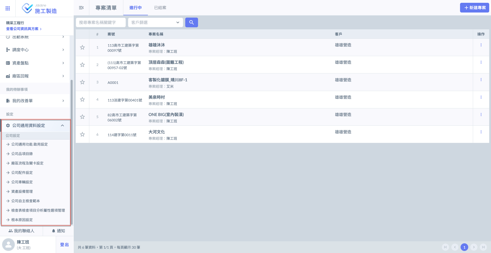

# 公司通用資料設定

---
description: Company-Wide Configuration Settings
---

# 公司通用資料設定

在建立專案之前，請先完整填寫<kbd>**公司通用資料設定**</kbd>，以利後續專案的順利建立與設定。\
公司通用資料設定涵蓋多項跨專案共用的基本資料，包括服務或產品品項、廠區製程、資產項目、車輛、配件等。這些資料將作為各功能模組中的基礎選項來源，唯有先完成設定，才能在使用相關功能時正確選取對應內容與類別。

!!! warning
    公司通用資料設定之資料僅能&#x7531;**「專案管理員」**&#x586B;寫，亦僅能&#x65BC;**「網頁版」**&#x64CD;作。
    
    有關專案管理員之設置，請參閱 ➙ [member](../company_level/member "mention")

