# 公司車輛設定

---
description: Company Vehicle Settings
---

# 公司車輛設定

**公司車輛設定**功能提供使用者建立並管理公司所擁有或常用的施工用車、運輸車與行政用車等資料。透過預先建檔車輛資訊，可供派車單、出貨單等功能快速指派與調用，確保車輛調度準確、可追蹤並符合法規與作業規範。為**建構派車與調度管理的基礎資料**。

!!! tip
    #### **功能目的**
    
    * 建立公司內部車輛資料庫，統一管理各類車輛資訊
    * 作為派車單作業時指定車號與車型的依據
    * 協助專案進行物料運送、人員接送、現場支援等任務的調派
    * 支援未來車輛使用記錄、維保排程與資產統計

進入施工製造主頁面後，點選「公司通用資料設定」下的<kbd>**公司車輛設定**</kbd> ，即可開始進行相關操作。

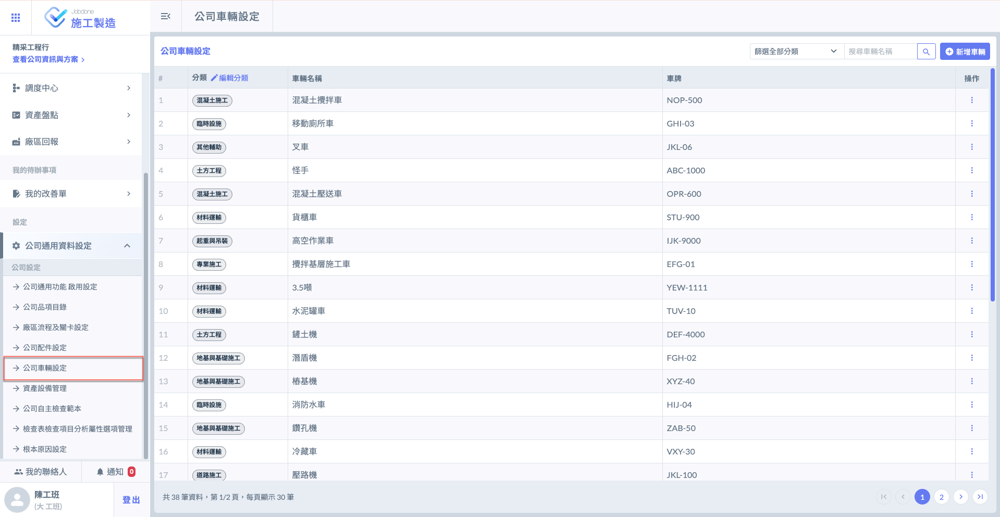

***

## 01｜操作流程說明



### 編輯分類

進入「公司車輛設定」功能後，點選**分類**欄位右方的<kbd><mark style="color:purple;">**編輯分類**<mark style="color:purple;"></kbd>，即可開始建立車輛分類。

進入編輯視窗後，點&#x9078;**「+新增一筆」**，即可新增欄位，供您填寫多個分類名稱並進行後續設定。

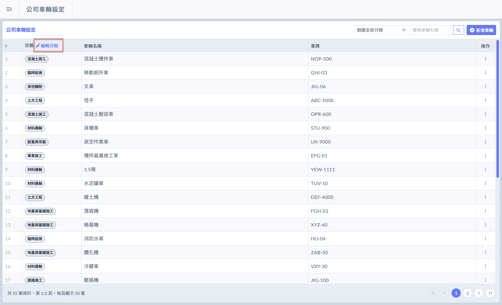 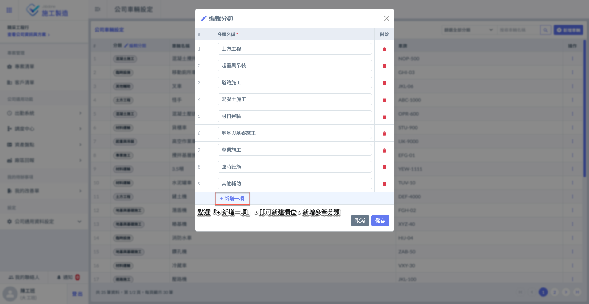

如圖三所示，將分類資料填寫完成並確認無誤後，請點&#x9078;**「儲存」**&#x4EE5;套用變更。

如圖四所示，儲存成功後，系統即會將該分類納入選項，您即可在新增車輛時選擇此分類使用。

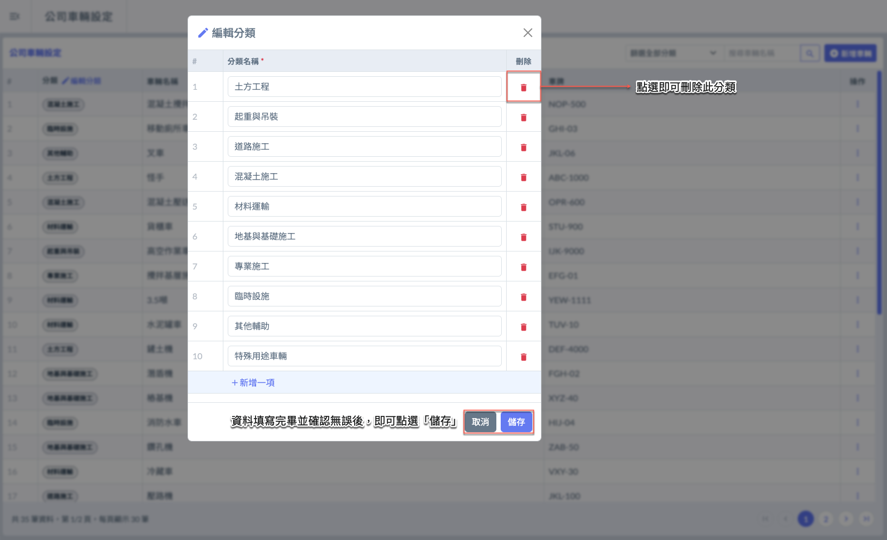 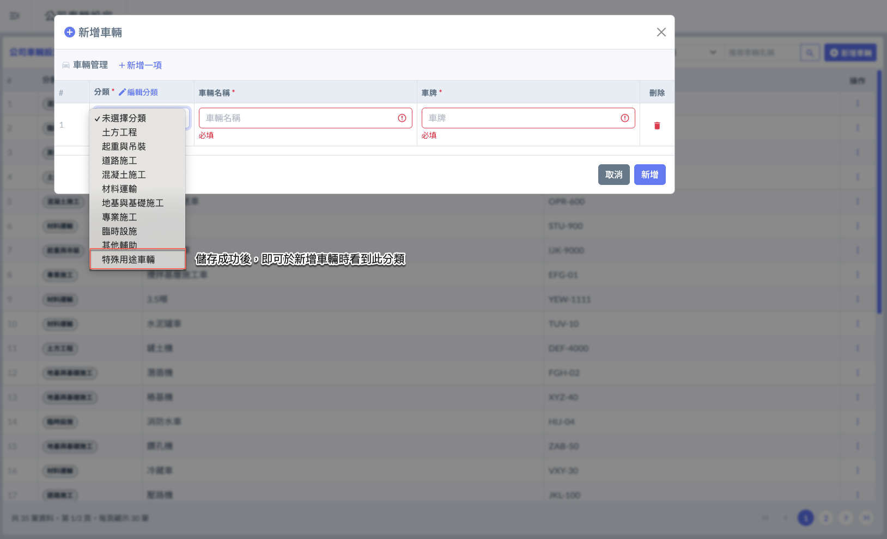




### 新增車輛

進入主頁面後，點選右上方的<kbd><mark style="color:purple;">+新增車輛<mark style="color:purple;"></kbd>，即可開啟新增視窗，開始建立車輛資料。

進入新增視窗後，點&#x9078;**「+新增一筆」**，即可新增欄位，供您填寫多個車輛資料並進行後續設定。

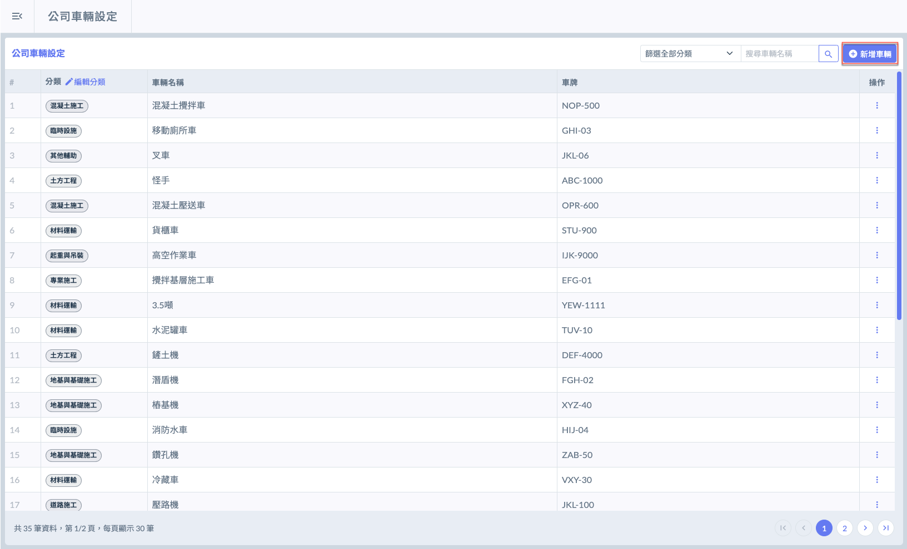 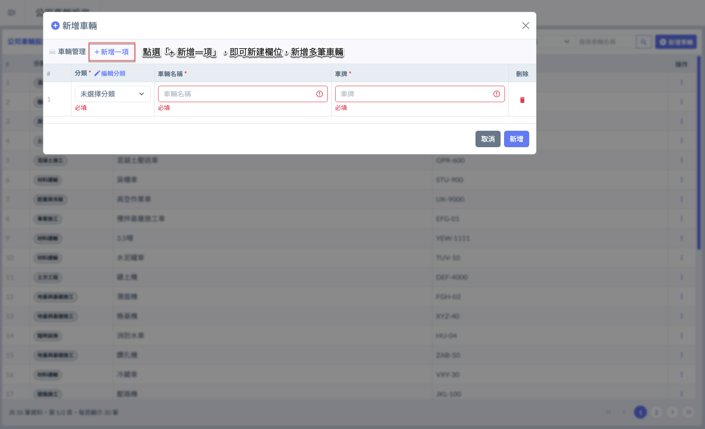

如圖七所示，將車輛資料填寫完畢並確認無誤後，請點&#x9078;**「新增」**&#x4EE5;儲存資料。

如圖八所示，新增成功後，所建立的車輛將立即顯示於車輛列表中，供後續查閱與使用。

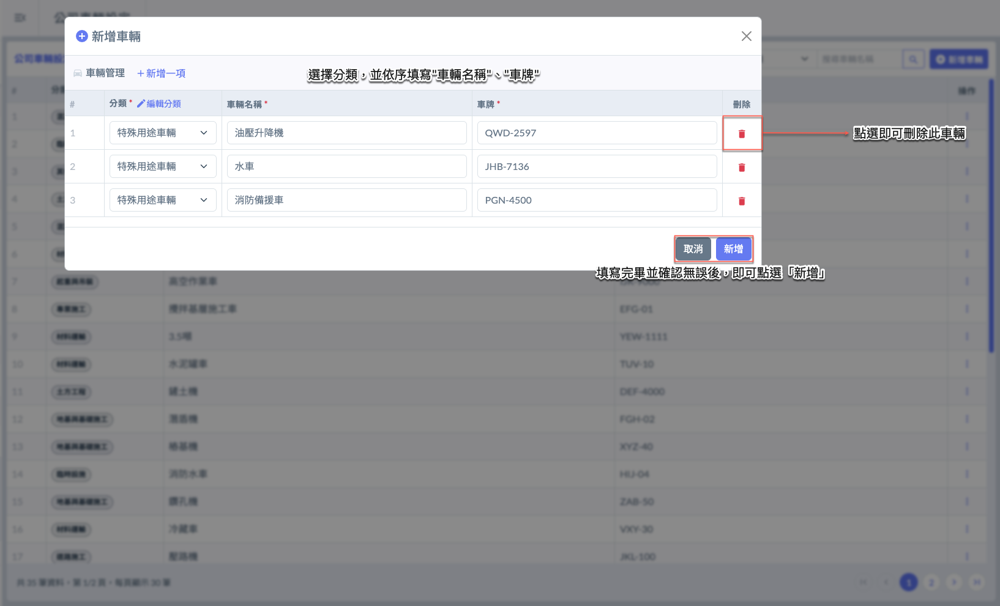 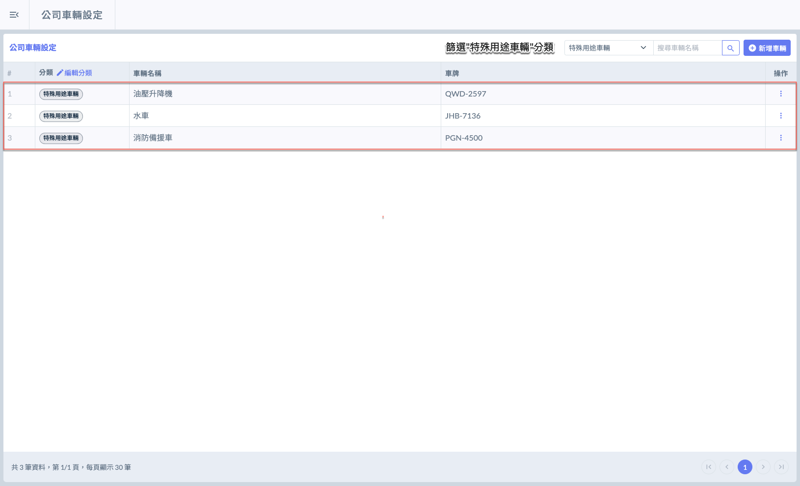




***

## 02｜車輛相關

於欲編輯/刪除的車輛右側點&#x9078;**「⋮」**&#x5716;示 (於操作欄位)，即可開啟功能選單，並選擇 <kbd>**編輯車輛**</kbd> / <kbd><mark style="color:red;">**刪除**<mark style="color:red;"></kbd>。

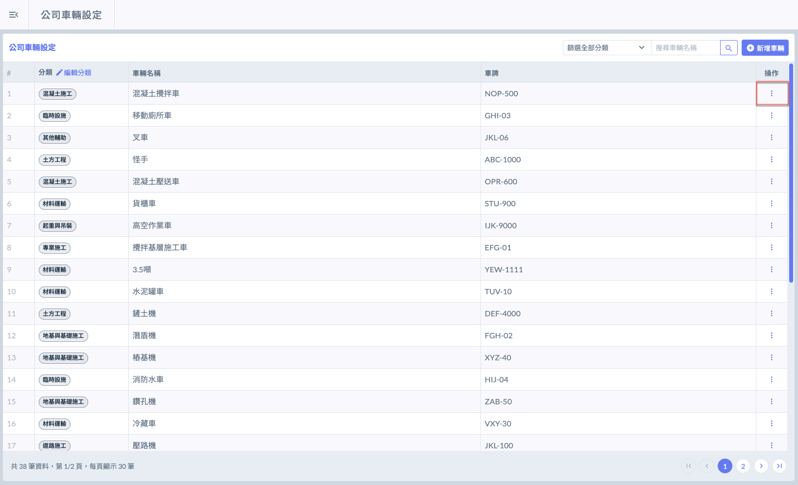 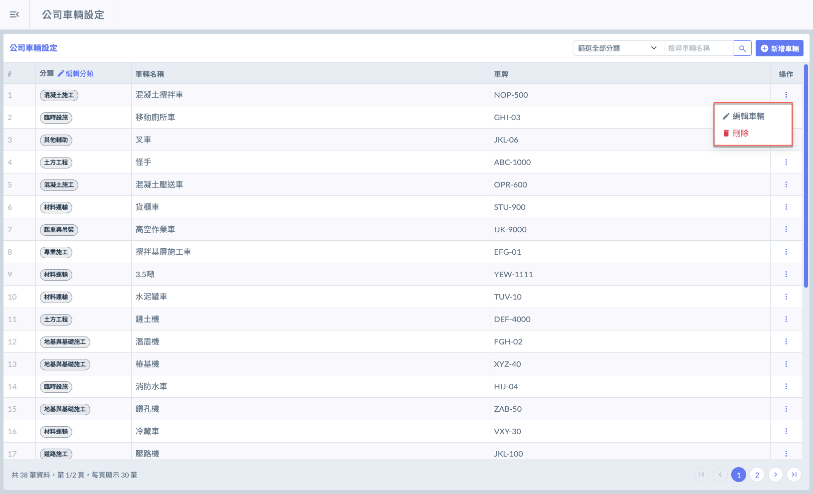

***

### 02 - 1｜編輯車輛

如圖三所示，於欲編輯之次分類右側點&#x9078;**「⋮」**&#x5716;示 (於操作欄位)，即可開啟功能選單，並選擇 <kbd>**編輯車輛**</kbd> 。

如圖四所示，開啟選單後，點選<kbd>**編輯車輛**</kbd>，即可進入編輯畫面，可修改車輛名稱並調整所屬車輛分類。

修改完畢並確認無誤後，請點&#x9078;**「儲存」**&#x4EE5;套用變更。

 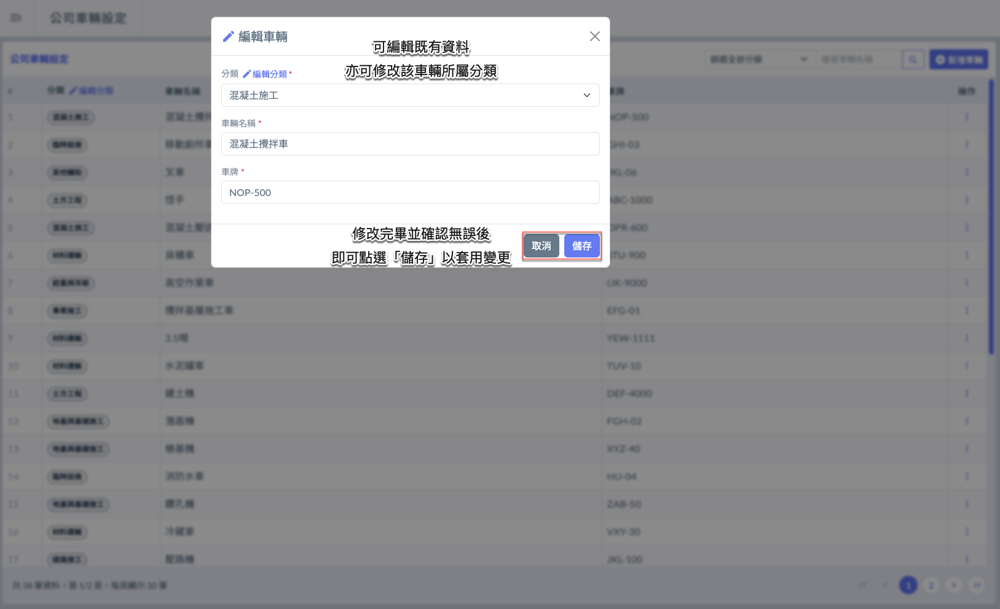

***

### 02 - 2｜刪除車輛

如圖五 \~ 圖六所示，開啟選單後，請點選<kbd><mark style="color:red;">**刪除**<mark style="color:red;"></kbd>，系統將跳出確認視窗，請再次確認是否刪除。

!!! warning
    請注意：
    
    車輛資料一旦刪除，將導致相關資料無法追溯，且無法復原，可能影響作業紀錄、進度回報與歷程查詢。
    
    建議**僅於確認該車輛完全未被使用或不再使用時**，才執行刪除操作，並務必審慎確認。

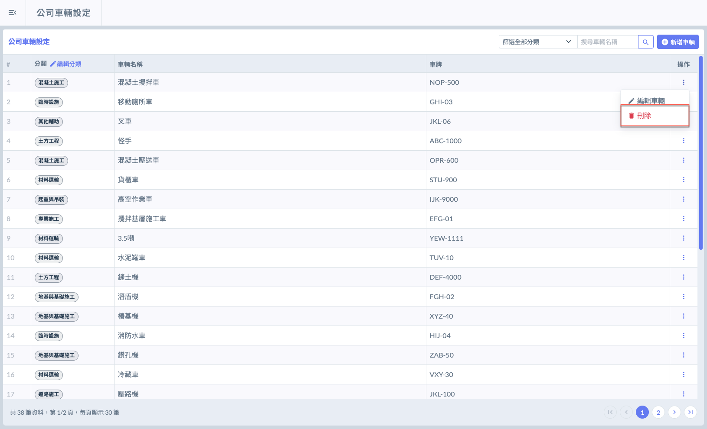 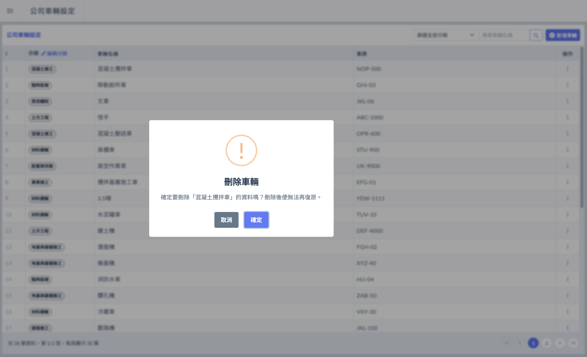

***

### 02 - 3｜篩選車輛

當車輛資料較多時，您可使用篩選器，選擇車輛分類並輸入車輛名稱，快速篩選並找到欲查詢的車輛項目。

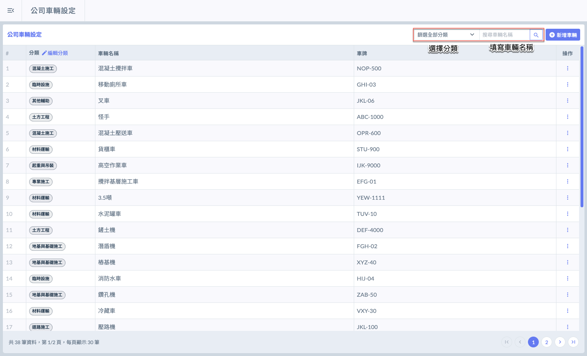 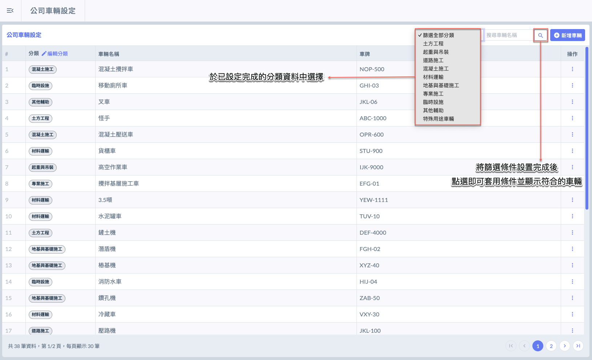

輸入篩選條件並確認無誤後，點選「」即可查找相符的車輛資料，實例畫面如圖九所示。

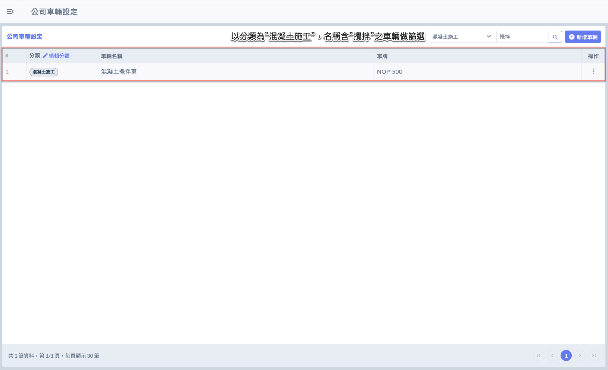
