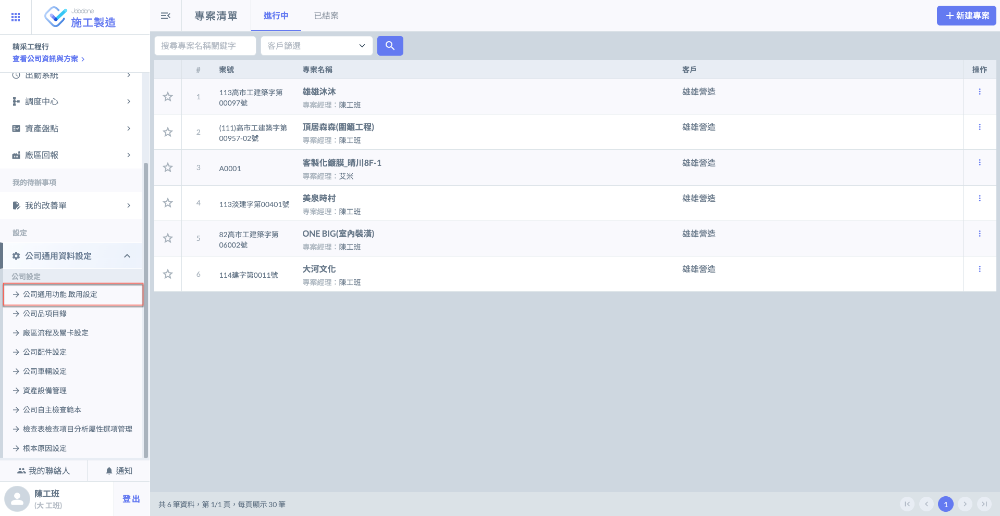
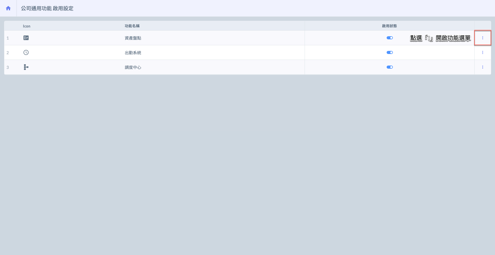
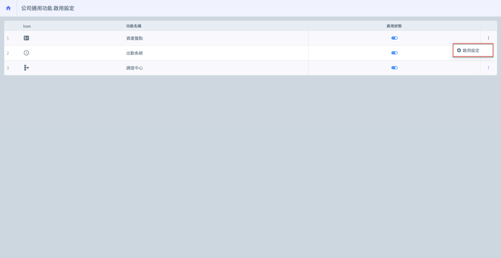
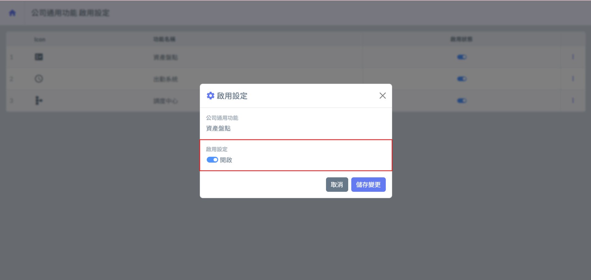
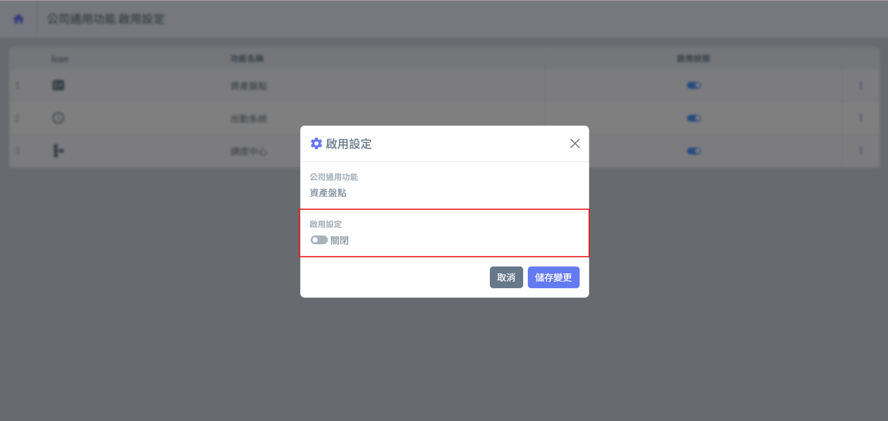

# 公司通用功能 啟用設定

---
description: Company General Features – Activation Settings
---

# 公司通用功能 啟用設定

公司通用功能為系統中屬「公司層級」的全域設定功能，凡該公司帳號之成員皆可使用，不受職位限制 (如是否為專案經理、工地主任)。其設計目的在於：統一管理依據、簡化跨專案設定重工、提升各模組作業效率等。

***

#### 功能定位

為配合不同模組的管理需求，**Jobdone** 提供多項對應的公司通用功能，協助公司預先建置必要資料結構，確保各專案於執行階段能快速套用並一致化執行標準。

目前，各模組所支援的公司通用功能如下：



提供完整的<kbd>**出勤系統**</kbd>，可統一管理所有工地及人員的出勤紀錄，方便稽核與報表彙整。



額外提供<kbd>**調度中心**</kbd>與<kbd>**資源盤點**</kbd>功能，協助廠區進行人力與物料的統籌調度與庫存管理，強化整體作業效率與透明度。



亦提供<kbd>**出勤系統**</kbd>，專為派遣商與營建商點工管理而設立。提供派遣商使用。



進入「啟用設定」頁面後，於欲設定的功能右側點&#x9078;**「⋮」**，再選&#x64C7;**「啟用設定」**，即可開始啟用或停用該通用功能。

!!! info
    每一項公司通用功能皆可透&#x904E;**「啟用設定」**&#x9032;行開啟或關閉，該設定為公司層級，將影響所有公司成員使用之權限與功能。

 

 

