# 公司配件設定

---
description: Company Accessory Settings
---

# 公司配件設定

**公司配件設定**功能提供您預先建立施工過程中常見的相依配件，主要用於記錄施工單中需一併攜帶的零星耗材或輔助組件，以提醒現場攜帶、備料與後續成本統計。

* 僅有簡單的一階分類架構，無需設定子分類
* 每筆配件需登錄其**名稱**與**單位**（如：條、支、片、組等）
* 設定後可於施工單中選擇該配件並填寫數量，作為施工依附項目之一

!!! info
    #### 注意事項 & 其他須知
    
    * 此功能所設定之配件為**單次使用性或低價耗材**，性質上接近消耗品
    * 若為**可重複使用之機具或設備** (如：電鑽、發電機、腳手架)，請於「資產設備管理」模組中進行設定與調度管理
    * 進行特定施工項目時，若需要攜帶額外的耗材 (如：鐵線、錨栓、墊片、防護貼、標示卡等)，可透過此功能預先定義。
    * 現場人員在建立施工單時，可勾選所需配件並填寫用量，避免遺漏攜帶或臨場缺料
    * 可做為日後**耗材用量統計與成本分析**的一部分，利於工程預算控制與採購計畫

進入施工製造主頁面後，點選「公司通用資料設定」下的<kbd>**公司配件設定**</kbd>，即可開始進行相關操作。

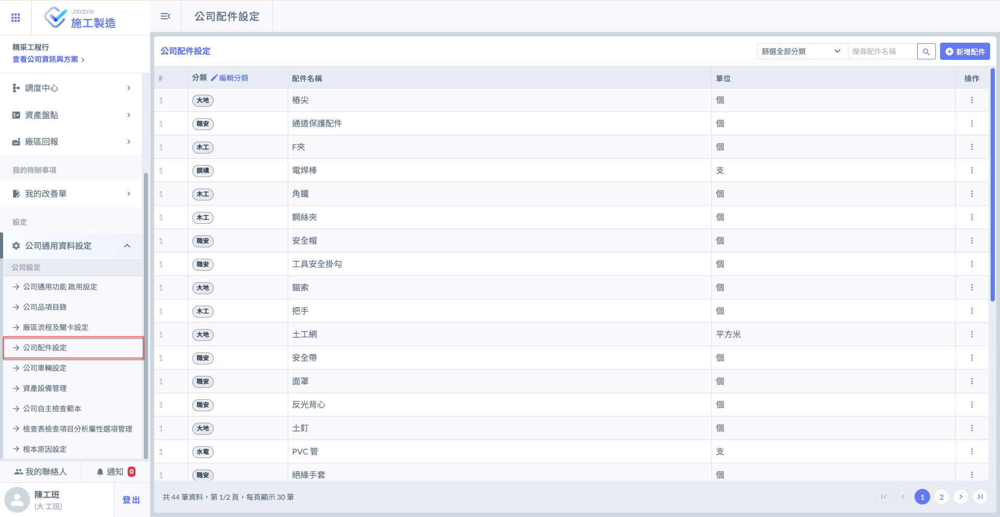

***

## 01｜操作流程說明



### 編輯分類

進入「公司配件設定」功能後，點選**分類**欄位右方的<kbd><mark style="color:purple;">**編輯分類**<mark style="color:purple;"></kbd>，即可開始建立配件分類。

進入編輯視窗後，點&#x9078;**「+新增一筆」**，即可新增欄位，供您填寫多個分類名稱並進行後續設定。

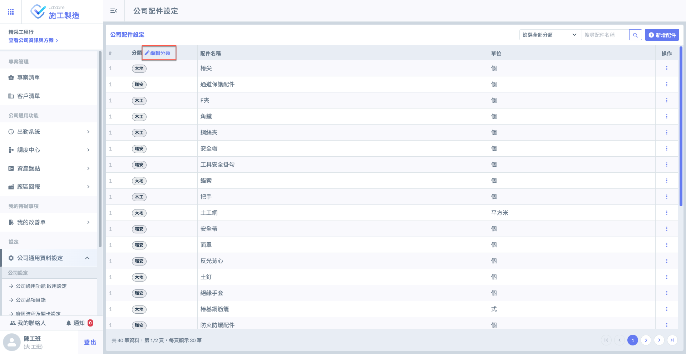 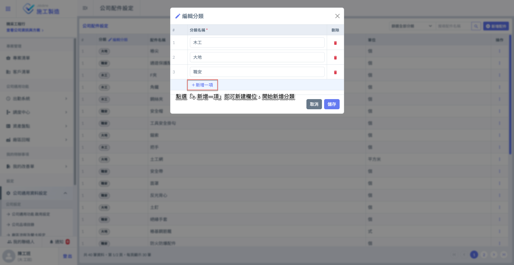

如圖三所示，將分類資料填寫完成並確認無誤後，請點&#x9078;**「儲存」**&#x4EE5;套用變更。

如圖四所示，儲存成功後，系統即會將該分類納入選項，您即可在新增配件時選擇此分類使用。

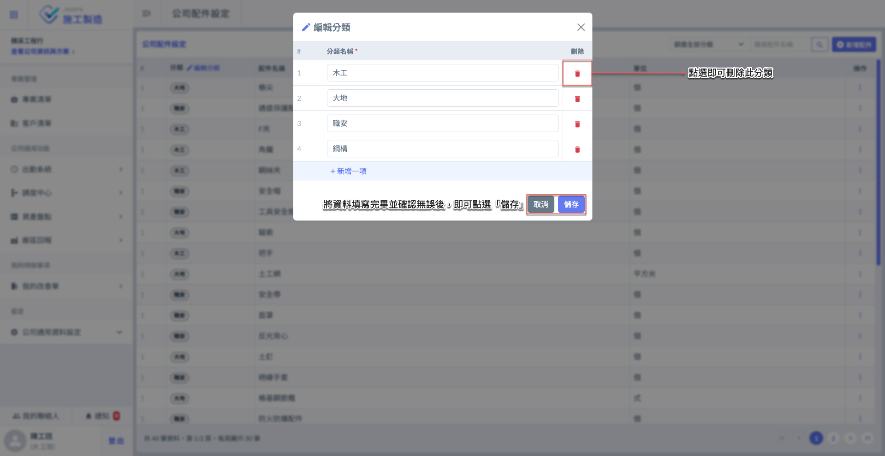 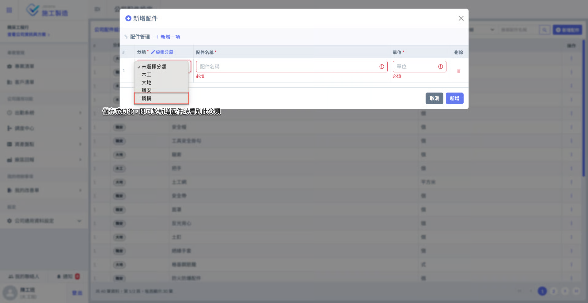




### 新增配件

進入主頁面後，點選右上方的<kbd><mark style="color:purple;">+新增配件<mark style="color:purple;"></kbd>，即可開啟新增視窗，開始建立配件資料。

進入新增視窗後，點&#x9078;**「+新增一筆」**，即可新增欄位，供您填寫多個配件資料並進行後續設定。

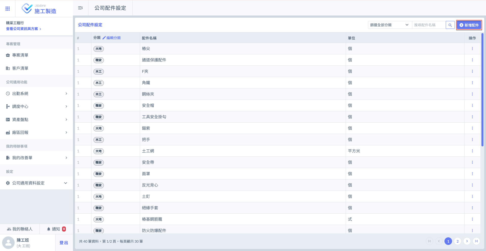 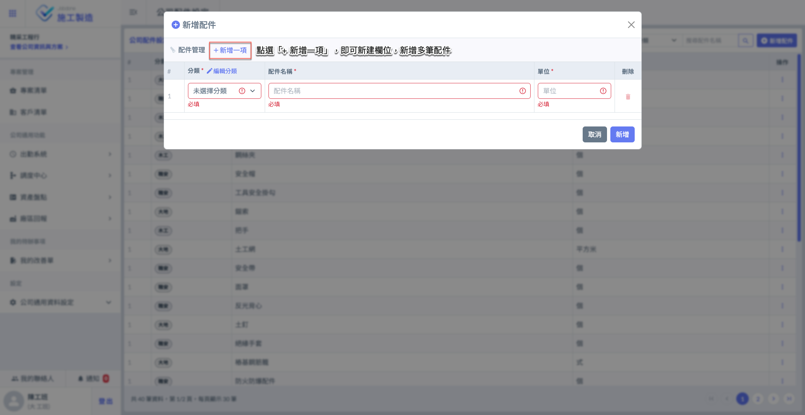

如圖七所示，將配件資料填寫完畢並確認無誤後，請點&#x9078;**「新增」**&#x4EE5;儲存資料。

如圖八所示，新增成功後，所建立的配件將立即顯示於配件列表中，供後續查閱與使用。

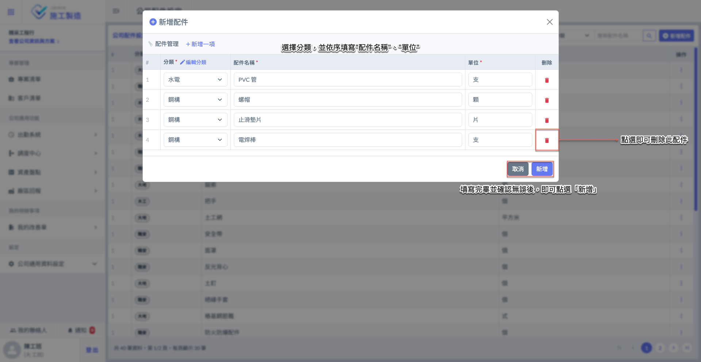 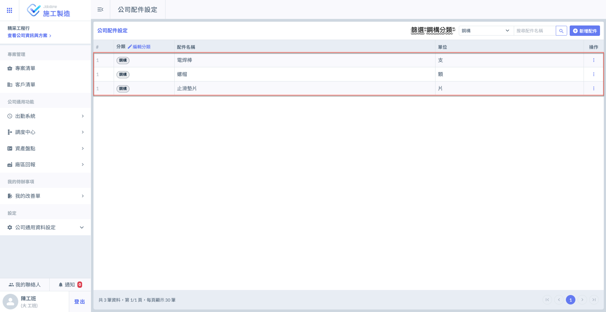




***

## 02｜配件相關

於欲編輯或刪除的車輛右側點&#x9078;**「⋮」**&#x5716;示 (於操作欄位)，即可開啟功能選單，並選擇 <kbd>**編輯車輛**</kbd> / <kbd><mark style="color:red;">**刪除**<mark style="color:red;"></kbd>。

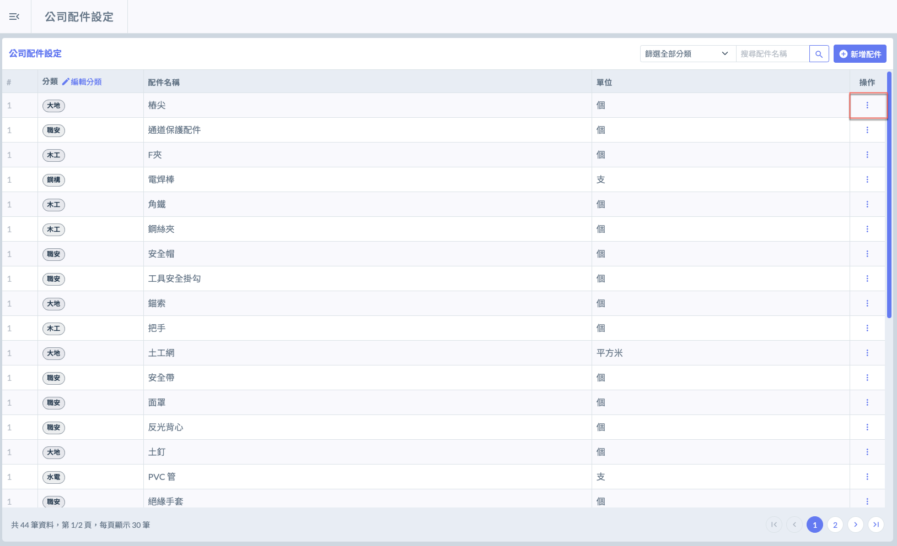 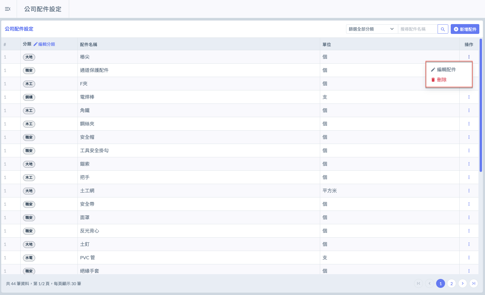

***

### 02 - 1｜編輯配件

如圖三所示，於欲編輯之次分類右側點&#x9078;**「⋮」**&#x5716;示 (於操作欄位)，即可開啟功能選單，並選擇 <kbd>**編輯配件**</kbd> 。

如圖四所示，開啟選單後，點選<kbd>**編輯配件**</kbd>，即可進入編輯畫面，可修改配件名稱並調整所屬配件分類。

修改完畢並確認無誤後，請點&#x9078;**「儲存」**&#x4EE5;套用變更。

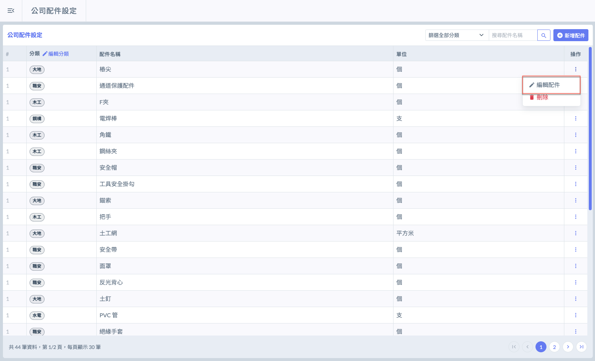 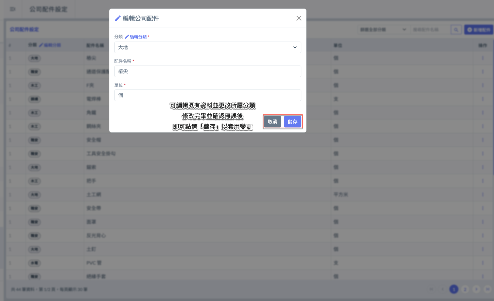

***

### 02 - 2｜刪除配件

如圖五 \~ 圖六所示，開啟選單後，請點選<kbd><mark style="color:red;">**刪除**<mark style="color:red;"></kbd>，系統將跳出確認視窗，請再次確認是否刪除。

!!! warning
    請注意：
    
    配件資料一旦刪除，將導致相關資料無法追溯，且無法復原，可能影響作業紀錄、進度回報與歷程查詢。
    
    建議**僅於確認該配件完全未被使用或不再使用時**，才執行刪除操作，並務必審慎確認。

 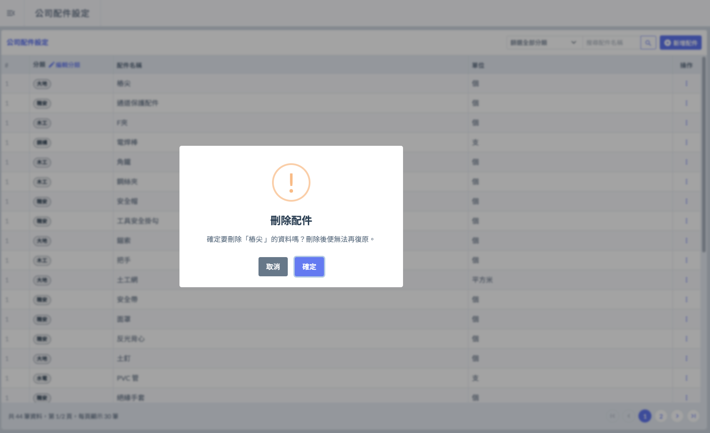

***

### 02 - 3｜篩選配件

當配件資料較多時，您可使用篩選器，選擇配件分類並輸入配件名稱，快速篩選並找到欲查詢的配件項目。

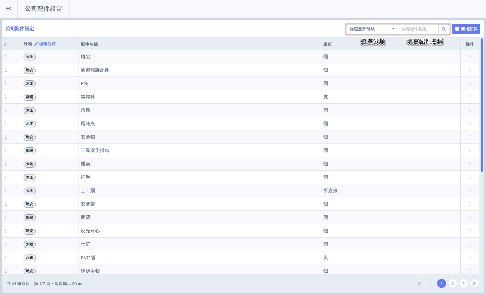 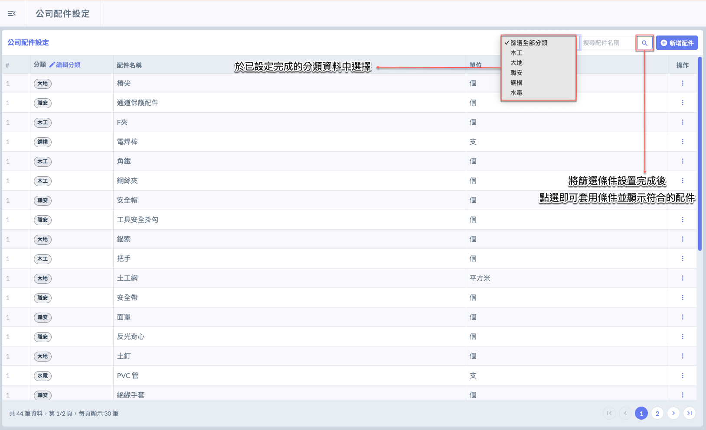

輸入篩選條件並確認無誤後，點選「」即可查找相符的配件資料，實例畫面如圖九所示。

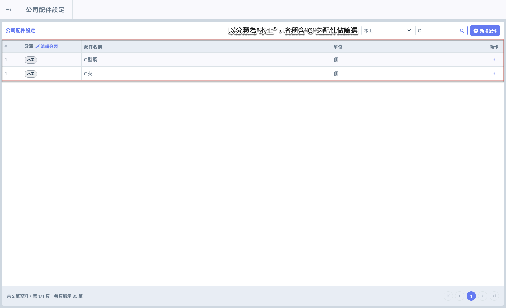
