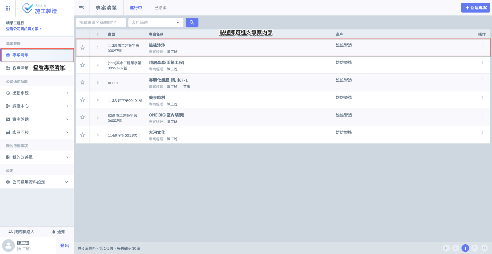
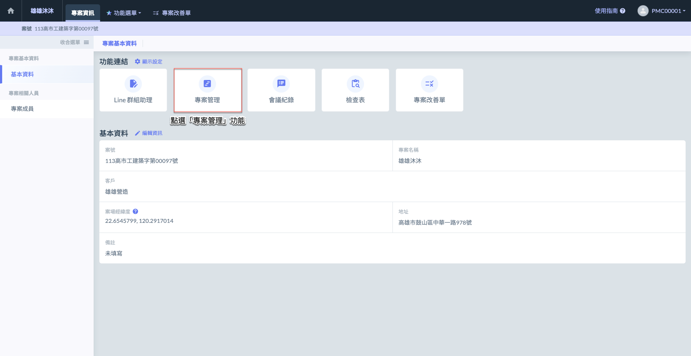

# 專案管理

---
description: Project Management
---

# 專案管理

## 01｜如何使用專案管理？

請選擇專案，並點擊該專案&#x7684;**「專案管理」**&#x529F;能進入。

一個專案可包含多個合約，合約內含多項承攬之工項或品項，並記錄對應的單位與數量。

如下圖所示，以專&#x6848;**「雄雄沐沐」**&#x70BA;例，點選該專案後，即可進入其詳細頁面，選&#x64C7;**「專案管理」**&#x9032;行後續操作。

 

