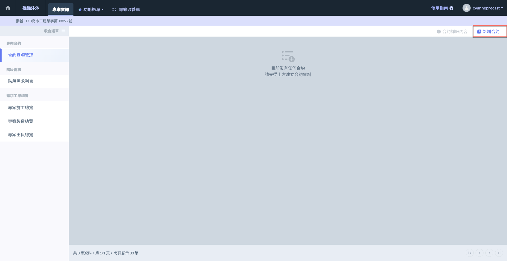
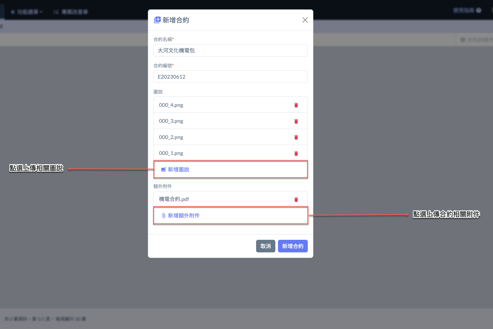
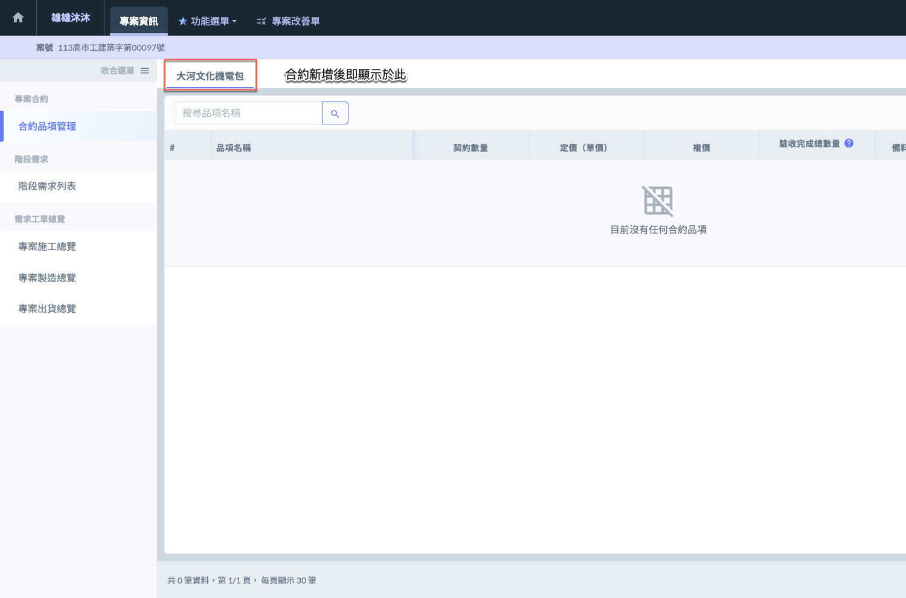
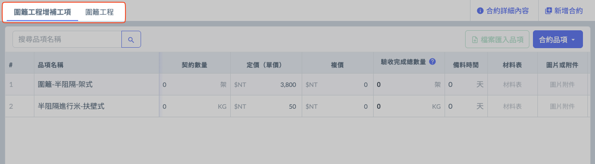

# 專案合約

---
description: Project Contract
---

# 專案合約

在施工製造的起始階段，**專案合約**功能扮演著建立作業依據的關鍵角色。此功能提供一個明確且結構化的合約建檔機制，使用者需在此建立各項施工品項所對應之合約，作為後續所有申請、製造與施工作業的準據。

人員常用情境

在開工前，依實際合約與分包內容，先建立&#x5404;**「專案合約」**&#x4F5C;為品項歸屬主檔。

品項經由專案合約編列後，依照工程進度流&#x5165;**「階段需求單」**，啟動後續施工製造流程。

合約作為稽核依據，於後期資產盤點、驗收、材料追溯等環節發揮完整管理價值。

<table><thead><tr><th width="182.8763427734375">特點</th><th>說明</th></tr></thead><tbody><tr><td>多合約管理</td><td>一個專案可建立多份合約，依不同工種、分包單位、作業範圍劃分，利於日後作業分類與責任釐清。</td></tr><tr><td>合約主檔設定</td><td>每筆合約需填寫合約名稱、編號，並可附上圖說與附件，作為完整工程紀錄。</td></tr><tr><td>品項歸屬依據</td><td>所有施工品項皆需對應至已建立的專案合約，避免作業無依據、資料錯掛或查核困難。</td></tr></tbody></table>

***

## 01｜新增合約

進入<kbd>**合約品項管理**</kbd>主頁後，點選右上角&#x7684;**「新增合約」**，開始填寫合約基本資料，並進一步編列合約品項。



欄位需填寫合約的名稱，為合約的主要識別標題。



此欄位需填寫合約的唯一編號，用於識別與管理合約。



可隨時新增圖說內容，用以補充說明本合約的作業內容或設計意圖。



可上傳與合約相關的檔案，例如圖面、說明文件或其他資料，便於後續查閱與管理。



 

#### 多個合約

一個專案可建立多個合約，便於分項管理與作業規劃。

