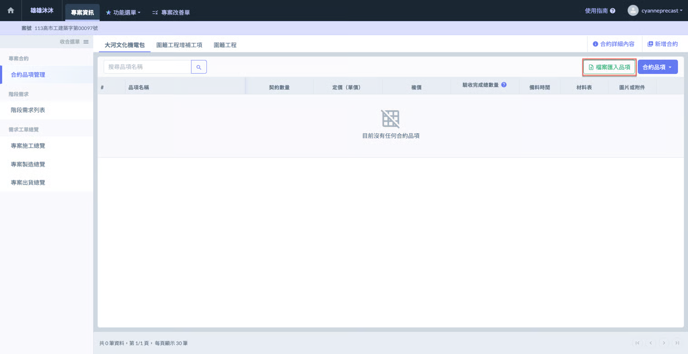
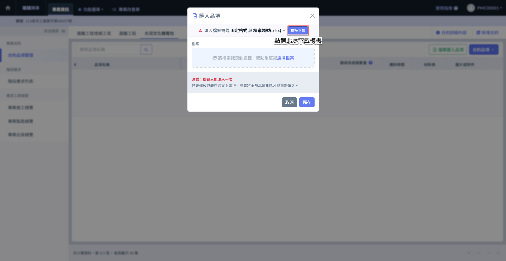
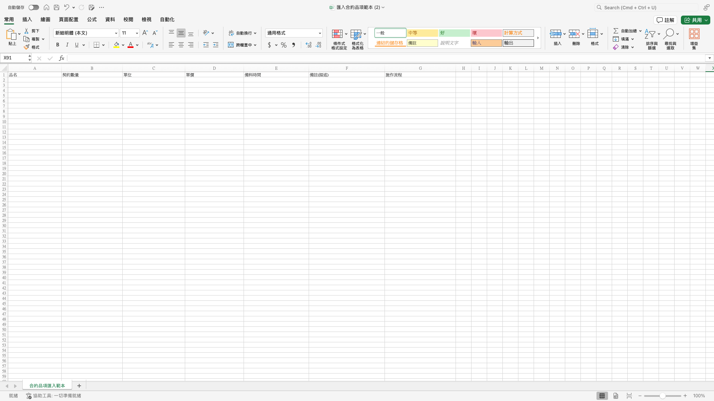
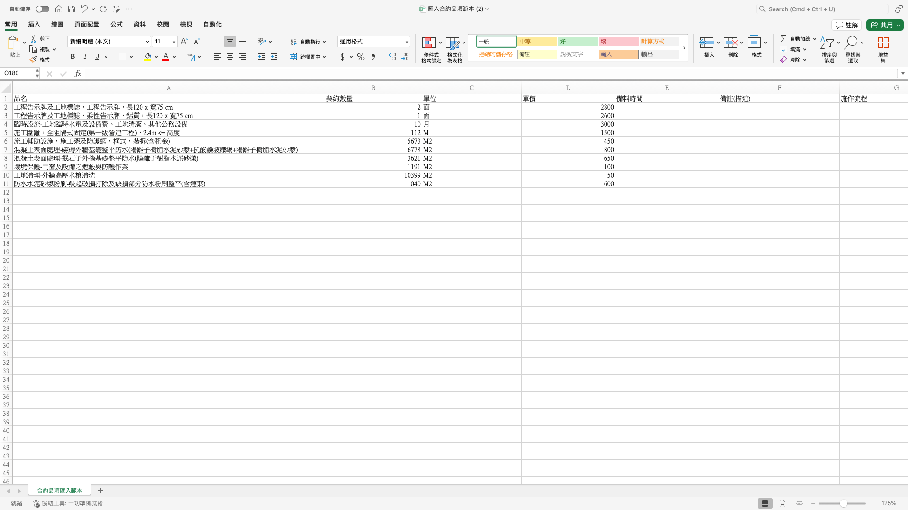
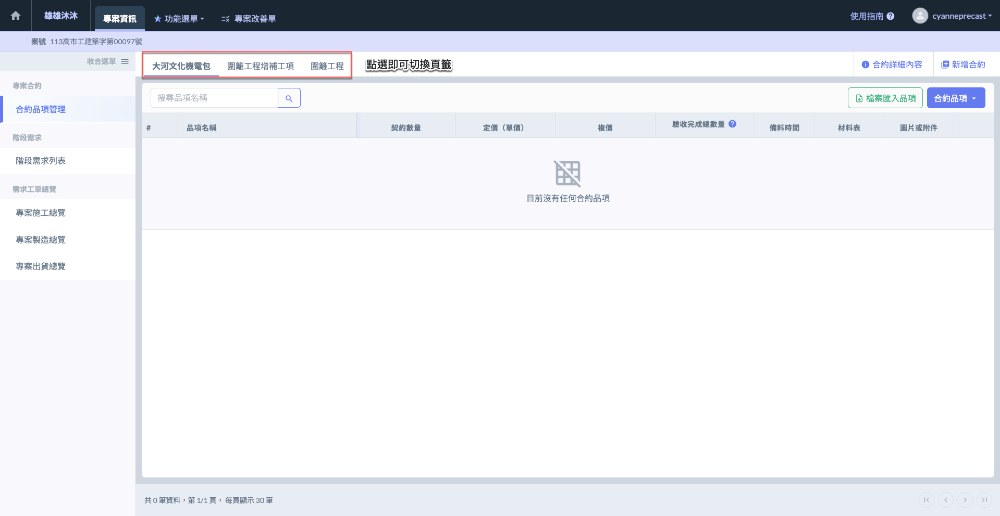
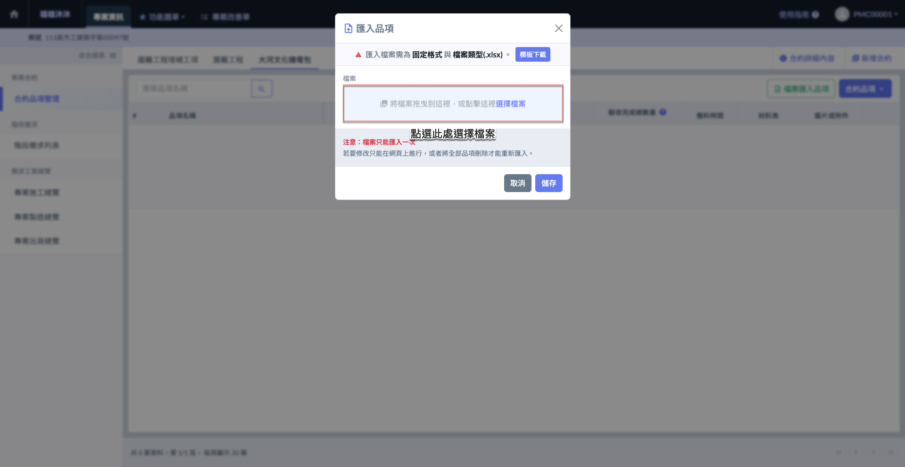
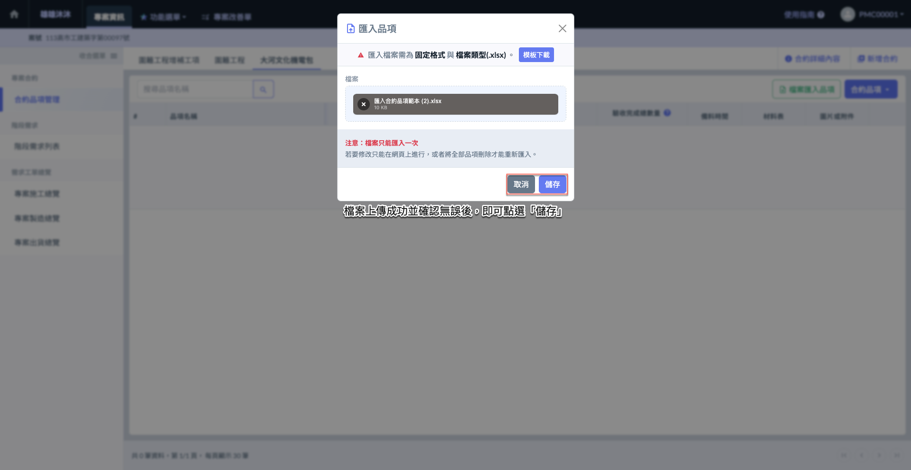
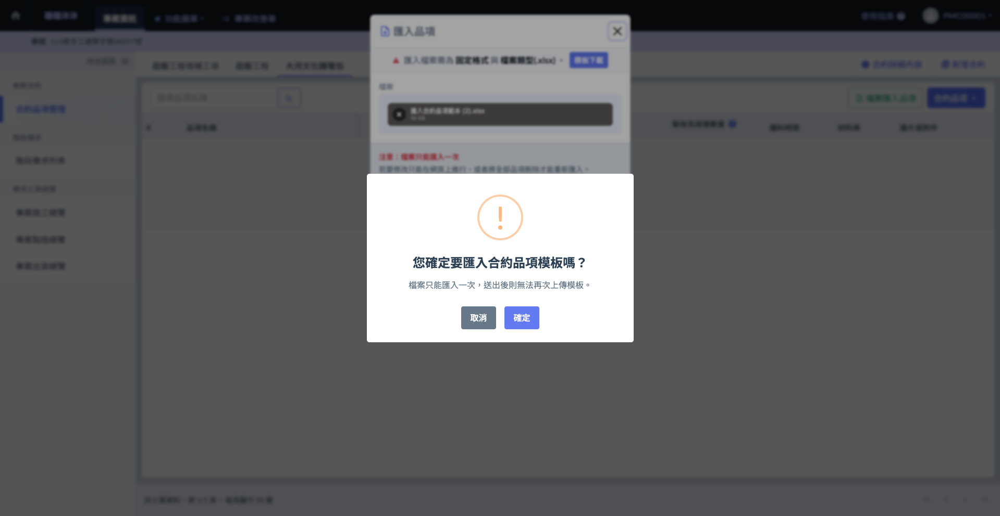
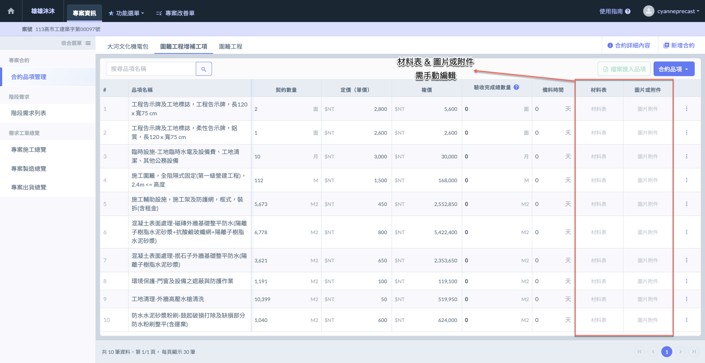

# Excel 檔案匯入品項

---
description: Import Items via Excel
---

# Excel 檔案匯入品項

## 01｜檔案匯入品項



### 下載 Excel 模板

進入「合約品項管理」主頁面後，點選右上角之<kbd><mark style="color:green;">**檔案匯入品項**<mark style="color:green;"></kbd> 。

如圖二所示 (點選<kbd><mark style="color:green;">**檔案匯入品項**<mark style="color:green;"></kbd>後之畫面)，點選右上方&#x7684;**「下載模板」**，即可下載 Excel 範本。

模板格式如下圖所示，請您依據表格填寫<kbd>**品名**</kbd>、<kbd>**契約數量**</kbd>、<kbd>**單位**</kbd>、<kbd>**單價**</kbd>、<kbd>**備料時間**</kbd>、<kbd>**備註(描述)**</kbd>、<kbd>**施作流程**</kbd>等。                                                                                                                                                                                                                                                                 &#x20;




### 填寫品項模板

!!! warning
    請注意：
    
    1. 僅當合約中尚未新增任何品項時，才可使用 Excel 檔案一次匯入所有品項；若合約中已有品項，則僅能透過網頁介面進行新增或刪除。
    2. 由於系統需依格式判讀資料，務必使用上述提供的模板，並確實依照指定格式正確填寫。




### 選取合約

匯入各合約的品項前，請先確認當前所在的合約是否正確，以確保品項資料填寫至正確的合約中。

有關切換合約之操作，亦可請參考下方影片：

{% embed url="https://files.gitbook.com/v0/b/gitbook-x-prod.appspot.com/o/spaces%2FEqUCL3D5WQfpxJw8NL3P%2Fuploads%2FzAnKeE96R1R3HAodOAyx%2F%E5%88%87%E6%8F%9B%E5%90%88%E7%B4%84%E9%A0%81%E7%B1%A4.mp4?alt=media&token=9ff430cb-a9fe-4cdd-b78f-e0d367660cae" %}
切換合約




### 上傳品項模板

如圖六所示，進入檔案上傳視窗後，請在上傳區域中選擇您欲上傳的檔案。

!!! warning
    請注意：
    
    1. Excel 匯入功能僅限於尚未新增任何品項資料時使用，匯入後即無法再次使用。
    2. 若需變更或新增品項資料，請透過系統進行手動編輯。
    3. 由於檔案僅能上傳一次，若需重新匯入 Excel 資料，請先刪除原有所有資料後再進行匯入。

如圖七 \~ 圖八所示，檔案上傳成功並確認內容無誤後，即可點&#x9078;**「儲存」**&#x5B8C;成匯入作業。

 




### 完成畫面

如圖九所示，檔案上傳成功後，品項即會顯示於合約品項管理列表中。

!!! warning
    請注意：品項所對應之<kbd>**材料表**</kbd>、<kbd>**圖片或附件**</kbd>等資料，需由您手動編列，無法透過 Excel 匯入。
    
    有關手動編輯之詳細操作流程，請參閱 ➙ 



