# 合約品項管理

---
description: Contract Item Management
---

# 合約品項管理

<kbd>**合約品項管理**</kbd>為施工製造模組中承接專案合約之後的核心作業環節，提供使用者依據已建立的合約架構，逐一編列該合約下所需的施工品項。

此功能為整個施工製造流程的品項來源主體，所編列的每一筆品項，皆會作為後續：

* **階段需求單**（如進度推動用料申請）
* **施工單**（現場作業安排與交付）
* **製造單**（指派加工製程與生產）
* **出貨單**（出場/進場控制與配送）

等作業的實體作業對象，亦是未來工程資產與進度管控的資料基礎。

<table><thead><tr><th width="210.37420654296875">特點</th><th>說明</th></tr></thead><tbody><tr><td>品項編列與分類</td><td>使用者可針對每一筆合約，獨立建立多筆對應品項，依工種、用途、施工階段分類管理。</td></tr><tr><td>品項明細設定</td><td>每一筆品項皆可填寫品名、規格、單位、數量、描述、施工流程別等欄位，確保資料完整。</td></tr><tr><td>材料組織表設定</td><td>若該品項為組裝性作業或半成品，可進一步編列內部之組成材料（含料號、數量、來源等），做為後續製造單與調度中心的依據。</td></tr><tr><td>圖說與附件管理</td><td>每筆品項可上傳相關圖說、施工節點圖、說明文件等，方便現場查核與設計對照。</td></tr><tr><td>手動與Excel編列雙軌支援</td><td>合約尚無品項時可使用 Excel 模板批次匯入；合約已有品項後則可手動新增、修改與補充。系統自動控管資料一致性與覆寫風險。</td></tr></tbody></table>

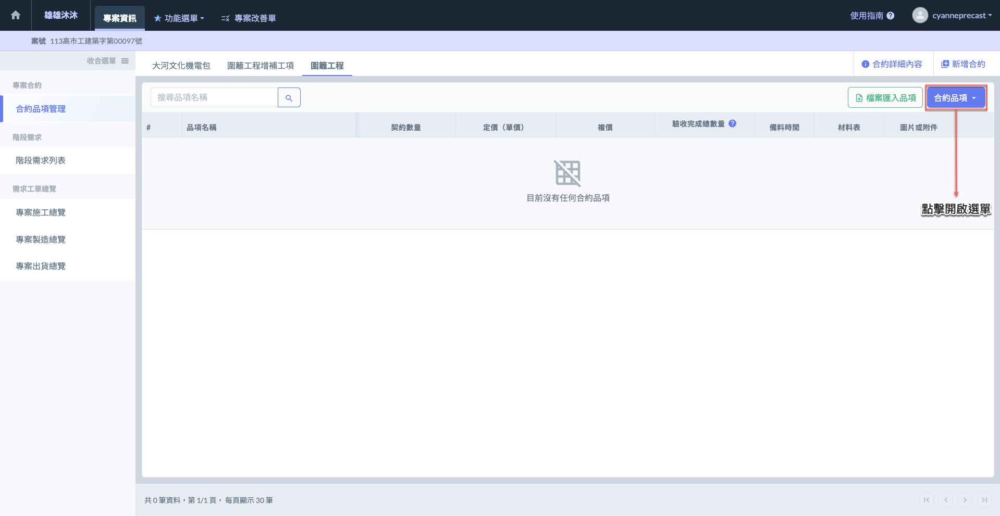 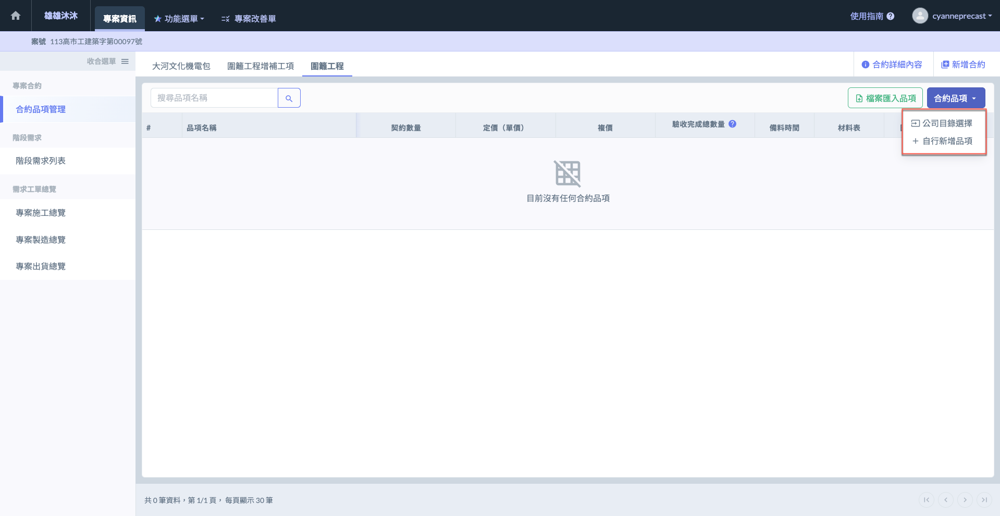

***

## 01｜公司目錄選擇

進入合約品項管理主頁面後，點選右上方合約品項之<kbd>**公司目錄選擇**</kbd> ，即可開啟篩選器並選擇公司品項。

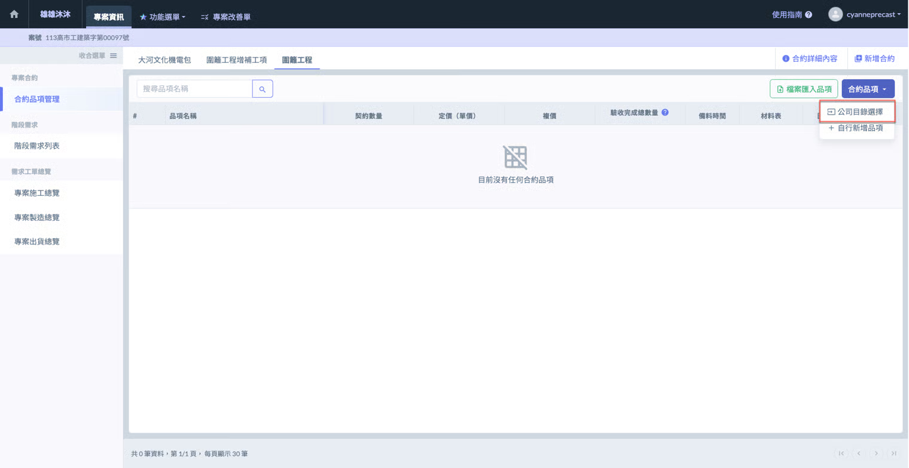

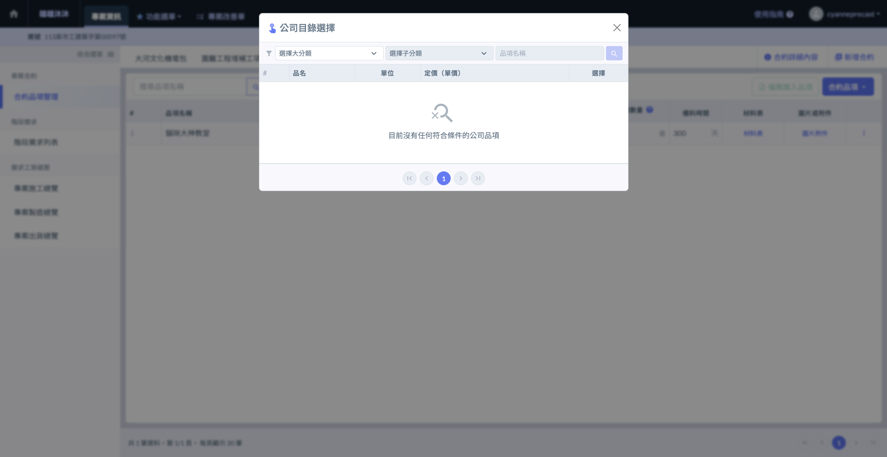

***

## 02｜自行新增品項

除檔案匯入與公司目錄選擇外，系統亦提供<kbd>**+自行新增品項**</kbd>功能，供使用者手動輸入各合約品項資料。此功能適用於需個別調整或不在標準目錄中的特殊品項。

### 02 - 1｜開啟新增品項頁面

進入合約品項管理主頁面後，點選右上方合約品項之<kbd>**+自行新增品項**</kbd>，即可開啟頁面並填寫品項相關資料。

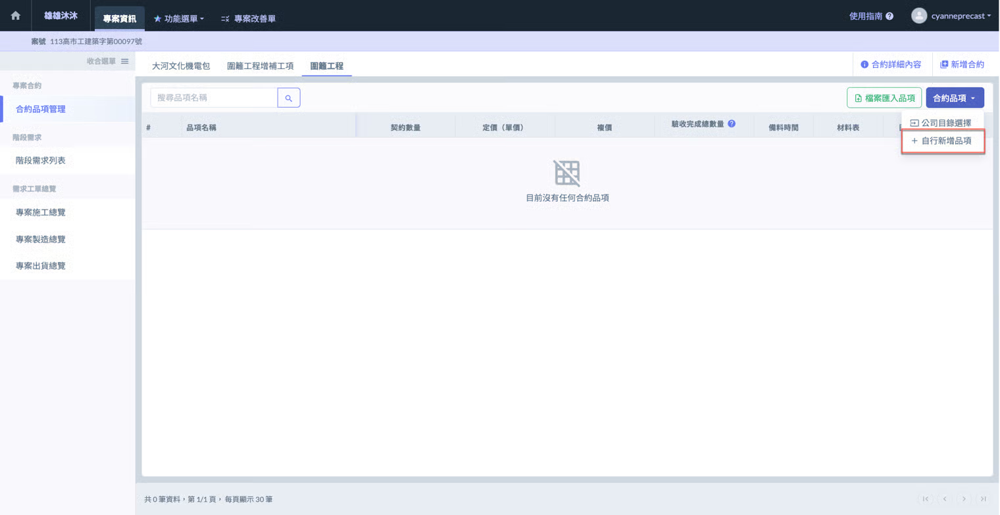

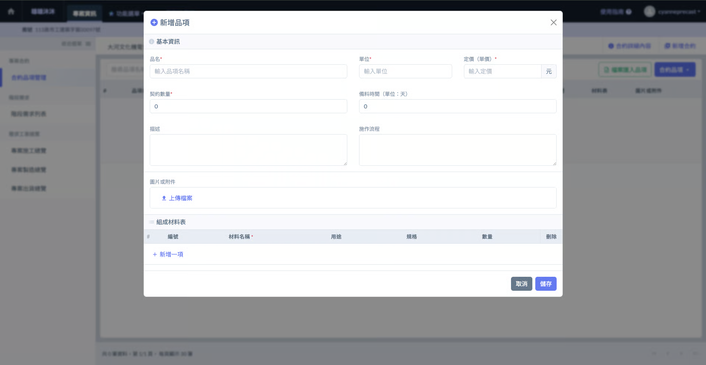

***

### 02 - 2｜填寫品項資料

#### 圖片或附件

請點選圖片或附件欄位的「」圖示，即可開啟上傳視窗，選擇並上傳您的檔案。

!!! tip
    圖片與附件支援多種檔案類型，不論是 pdf、xls、xlsx、jpg、png 等多種格式皆可上傳。

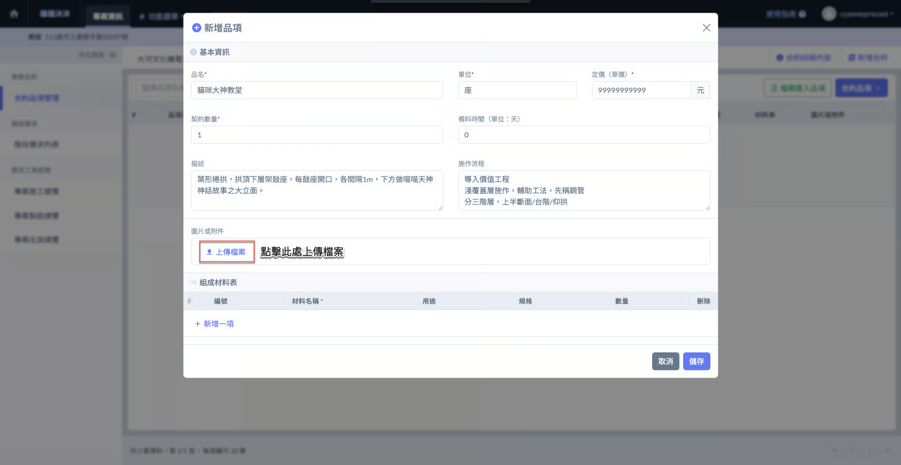 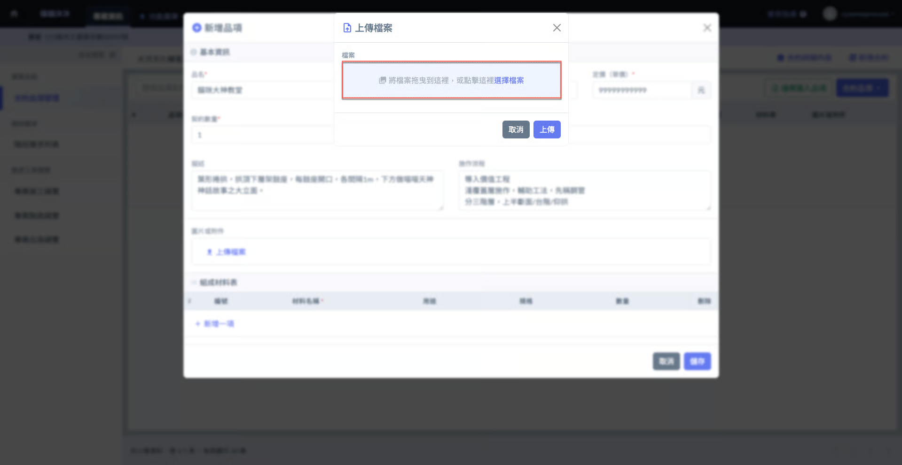

檔案選取完畢後，即可點&#x9078;**「上傳」** (圖五)，附件將儲存於圖片或附件欄位中，您即可繼續編輯其他品項相關資料。

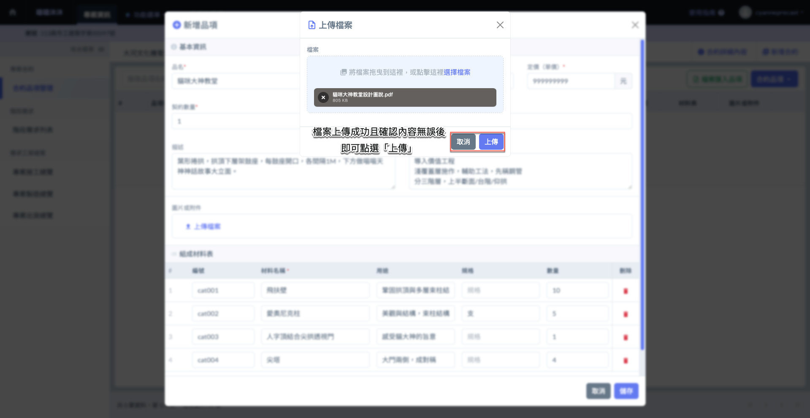 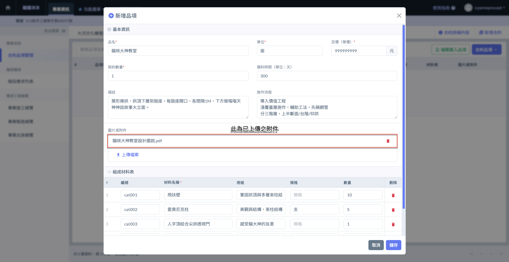

#### 組織材料表

點選組成材料表中的「」圖示 (圖七)，即可新增欄位，填寫該品項的組成材料資訊，如名稱、用途及數量等。

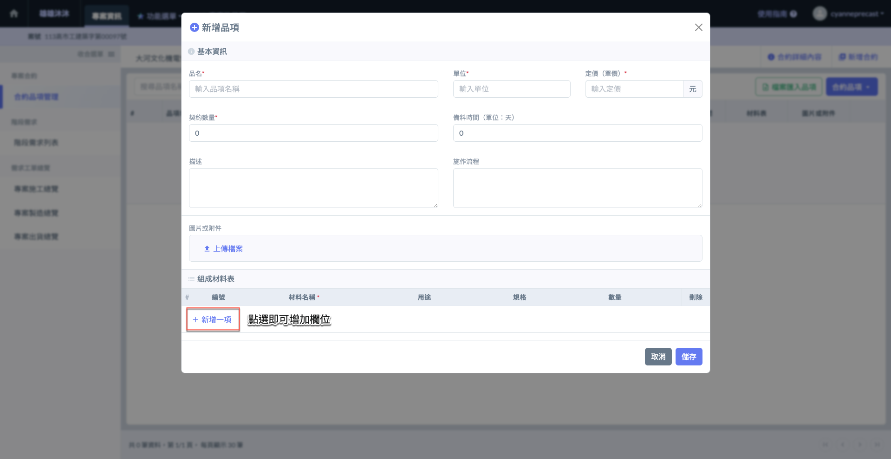 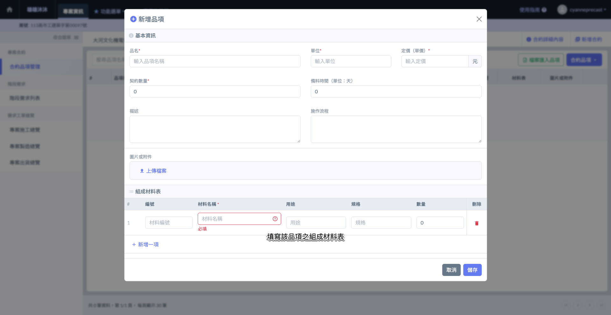

如圖八\~九所示，確認所有品項相關資料填寫完畢且無誤後，即可點選右下方&#x7684;**「儲存」**，該品項將顯示於合約品項列表中。

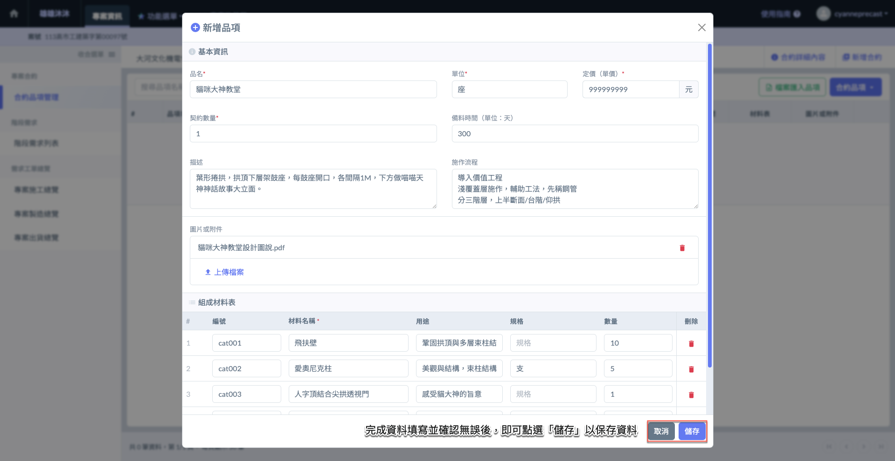 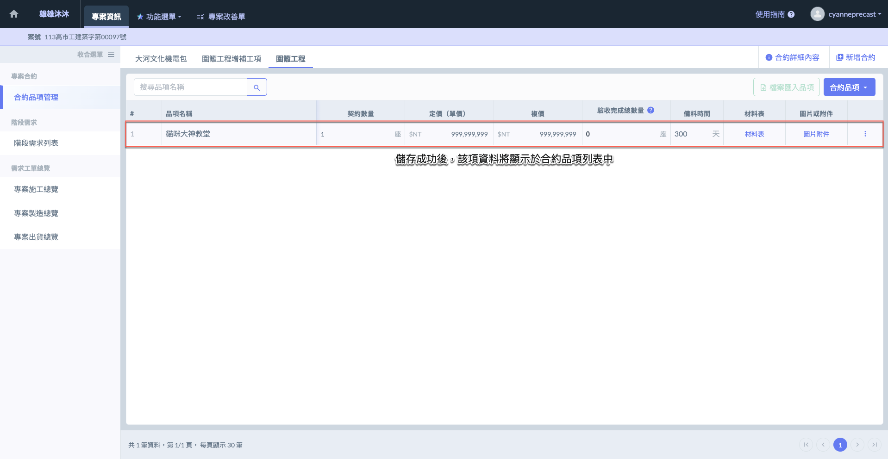

