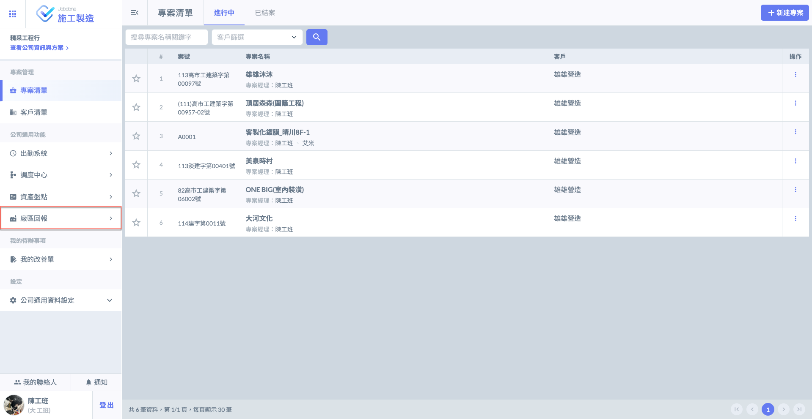
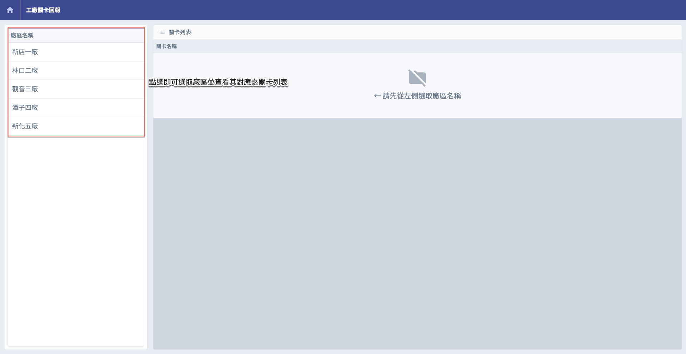
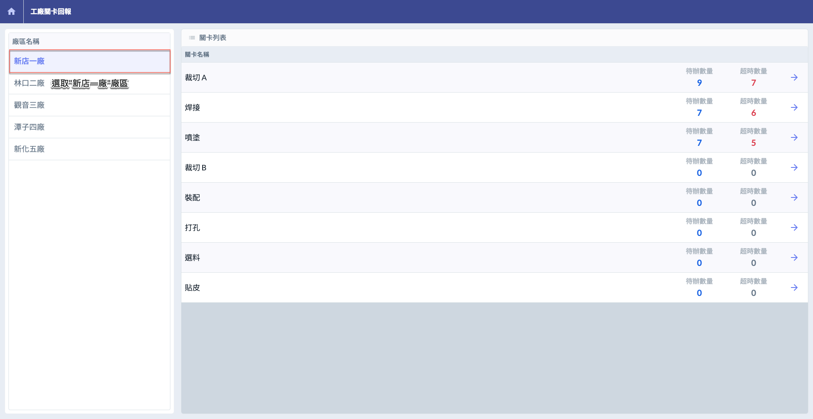
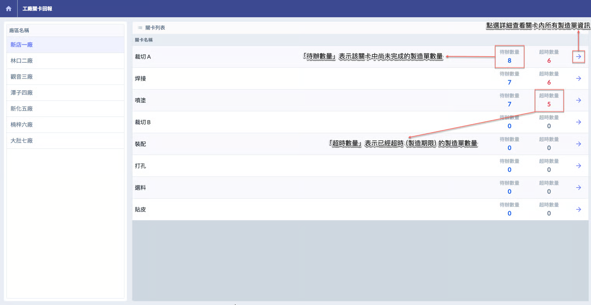
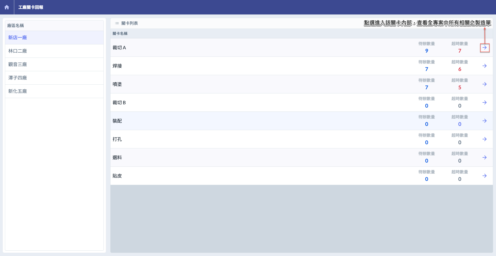
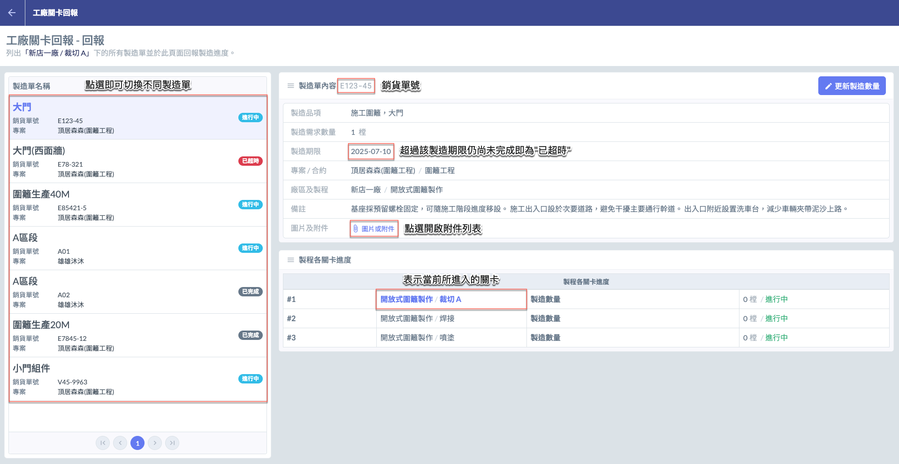
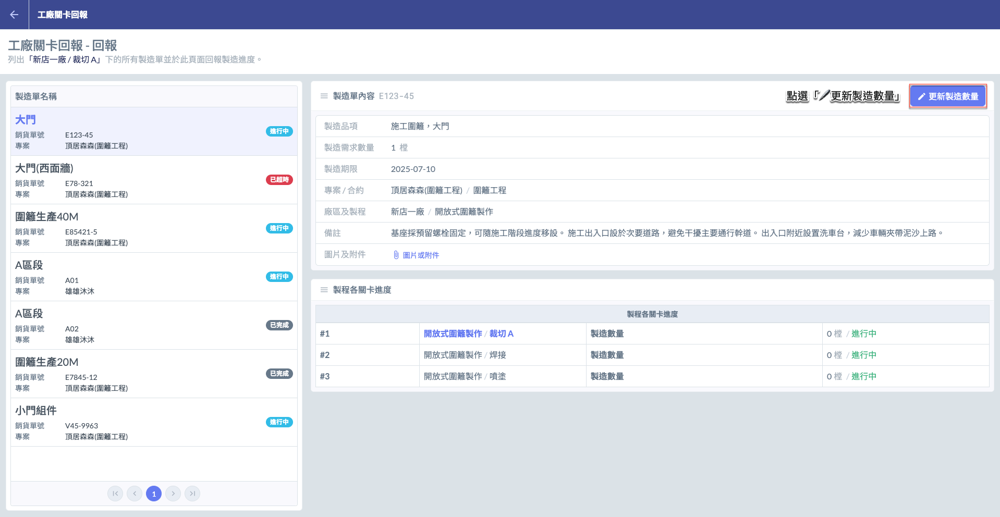
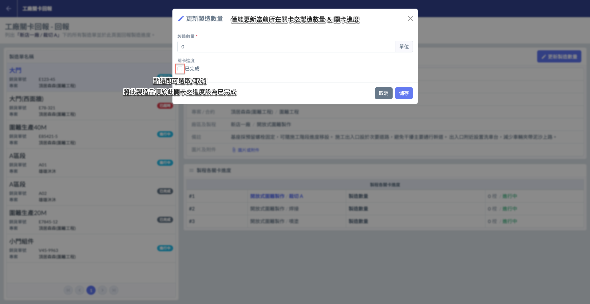
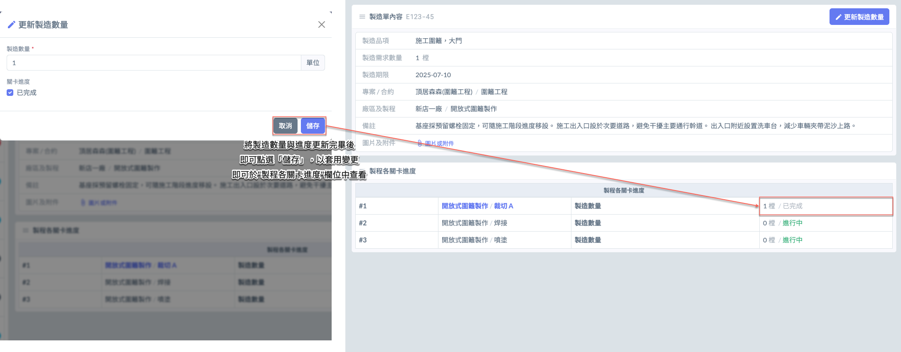

# 工廠關卡回報

---
description: Factory Gate Report
---

# 工廠關卡回報

## 01｜如何進入廠區回報？

當進入施工製造主頁面後，點選左側的「公司通用功能」欄位中的<kbd>**廠區回報**</kbd>，即可進入並使用廠區回報功能。

***

## 02｜操作流程說明

有關廠區及其流程關卡設定說明，請參閱 ➙ [workflow-checkpoint](../company-configuration/workflow-checkpoint "mention")



### 選擇廠區

如圖一所示，進入廠區回報主頁面後，請先於廠區名稱欄位中選取欲查看的廠區。

如圖二所示，以選取<kbd>**新店一廠**</kbd>為範例，系統即會顯示其對應的關卡列表。




### 關卡列表說明

如圖三所示，選取廠區後，即可看到各個關卡目前的<kbd><mark style="color:purple;">**待辦數量**<mark style="color:purple;"></kbd>、<kbd><mark style="color:red;">**超時數量**<mark style="color:red;"></kbd>：



待辦數量表示該關卡尚未完成的製造單數量 (進行中)。



超時數量表示已逾製造期限的製造單數量。






### 選擇關卡

如圖四，於欲查看之關卡右側點選 ，即可進入該關卡，查看全專案中所有相關的製造單資訊。

如圖五所示，此張製造單所對應之製程為『開放式圍籬製作』。於製程的各關卡進度欄位下可見**三筆**資料，**表示此製程包含三個關卡**， 分別為：裁切A、焊接與噴塗。系統將顯示該製造品項於各關卡的當前製造數量與製造狀態。

此外，製造單有三種狀態，分別為：<kbd><mark style="color:blue;">**進行中**<mark style="color:blue;"></kbd>、<kbd>**已完成**</kbd>與<kbd><mark style="color:red;">**已超時**<mark style="color:red;"></kbd>。



<kbd><mark style="color:blue;">**進行中**<mark style="color:blue;"></kbd>表示該製造單尚未完成，但仍處於製造期限內。



<kbd>**已完成**</kbd>表示該製造單內之製造品項，已完成其對應製程中的所有關卡 (即製造完成)。



<kbd><mark style="color:red;">**已超時**<mark style="color:red;"></kbd>表示該製造單尚未完成，且已超過其設定之製造期限。






### 更新製造數量

開啟指定製造單後，點選右上方的，即可開啟編輯視窗。您可於此編輯該製造品項在當前關卡中的實際製造數量，並勾選是否「已完成」（表示已達設定之需求數量）。

更新視窗如圖七所示：

!!! danger
    #### ⚠️ 注意事項
    
    1. 您僅能編輯當前關卡的製造數量與進度狀態。若需調整其他關卡 (如焊接、噴塗等) 的製造數量或進度，請返回並進入對應之關卡進行操作。
    2. 即使該製造單所有製造關卡皆已標示為完成，系統亦**不會**自動將該製造單狀態更新為<kbd>**已完成**</kbd>。仍須使用者&#x65BC;**「階段需求單」**&#x5167;部&#x6216;**「專案製造總覽」**&#x4E2D;**手動**將該製造單更新為已完成。

如圖八所示，將製造數量與關卡進度調整完成後，請點選「儲存」以套用此次變更。



