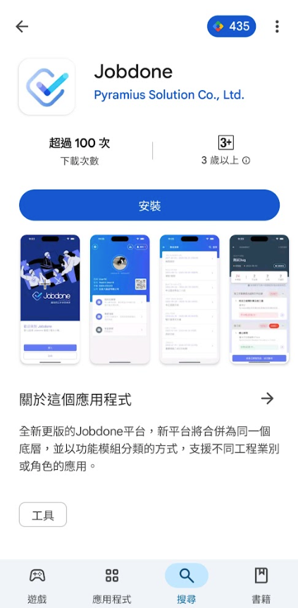
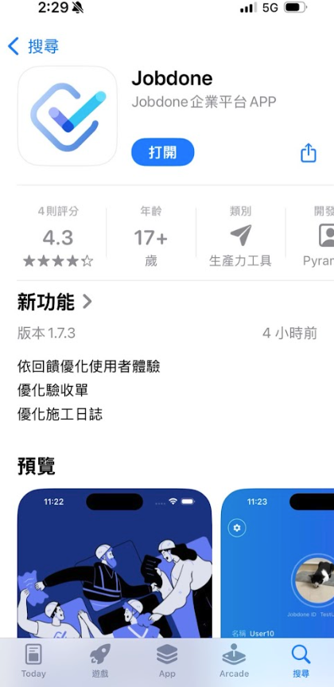
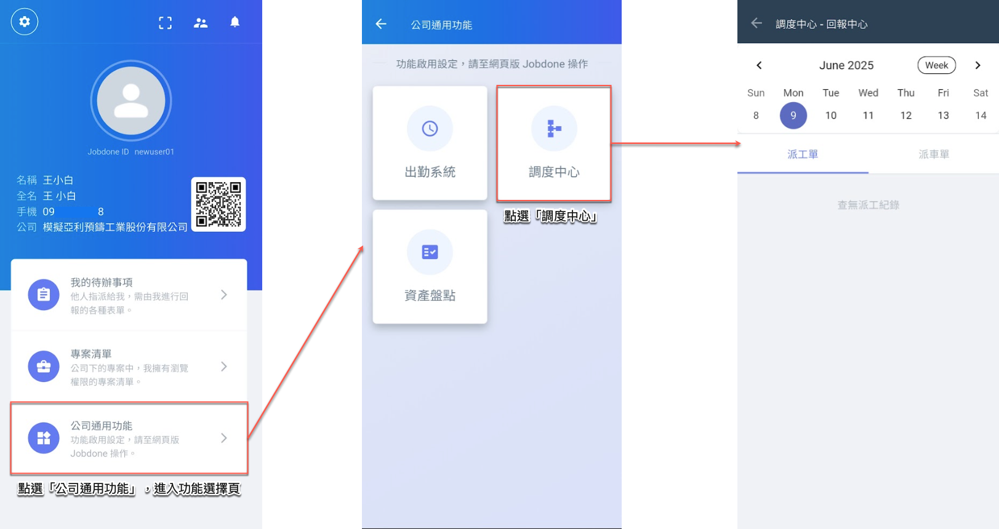
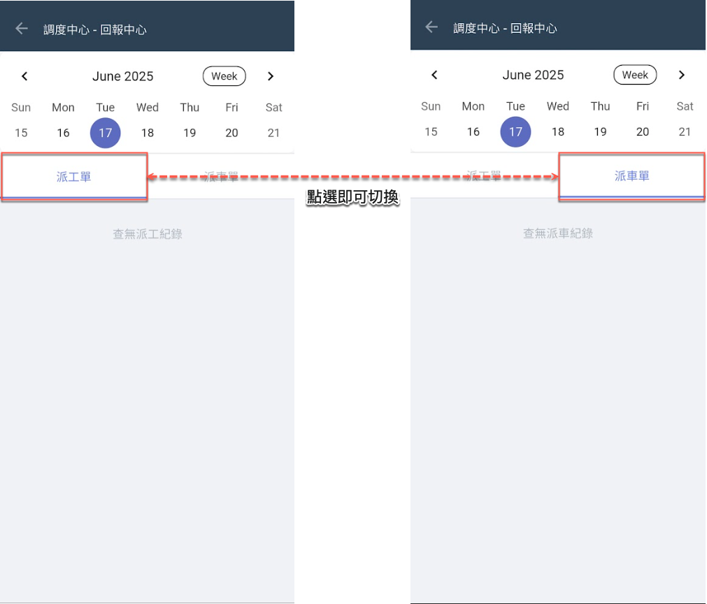

# APP 版

---
description: App Interface
---

# APP 版

## 01｜如何進入調度中心？



### 使用 Jobdone App

請您下載 **Jobdone** App版，支援 Android 和 iOS 系統。&#x20;

 

 




### 進入調度中心功能

進入 App 系統後，點選下方&#x7684;**「公司通用功能」**，再選擇<kbd>**調度中心**</kbd>，即可進入並使用相關功能。

!!! warning
    請注意，務必確認所登入之帳號使&#x7528;**「施工製造」**&#x6A21;組。




### 切換頁面 (派工單/派車單)

如下圖所示，您可依需求查看所需資料，點選相應頁籤即可切換至<kbd><mark style="color:purple;">派工單<mark style="color:purple;"></kbd>或<kbd><mark style="color:purple;">派車單<mark style="color:purple;"></kbd>頁面。



