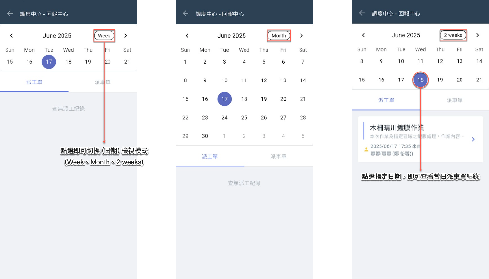
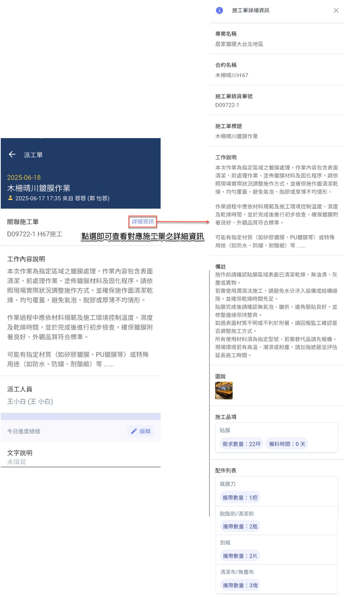
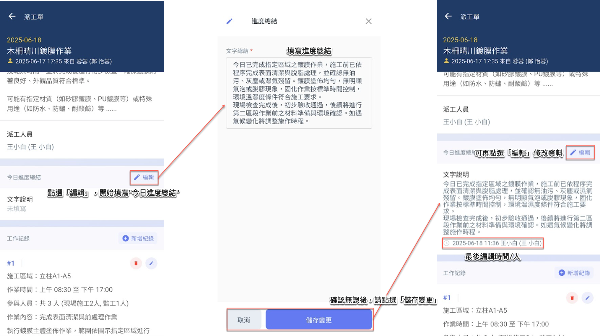
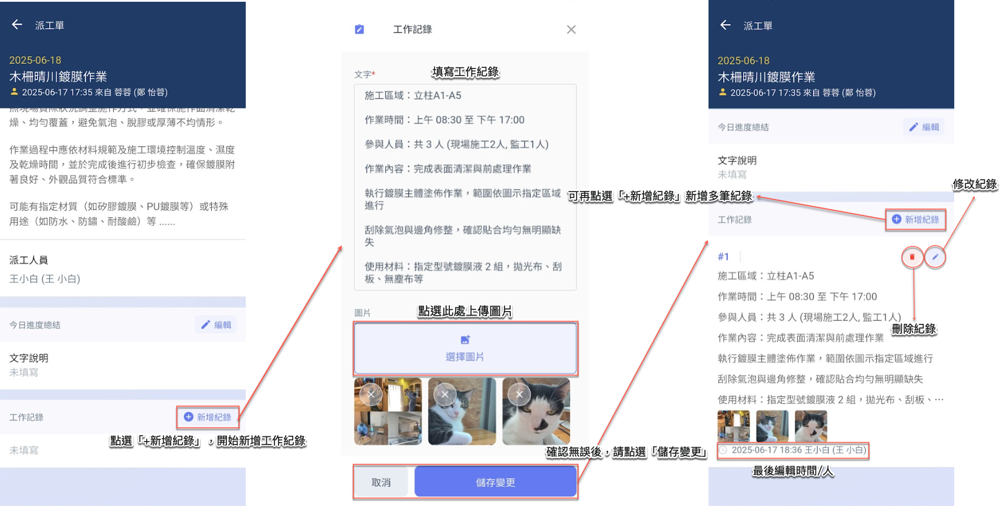

# 派工單

---
description: Labor Assignment Sheet
---

# 派工單

**派工單**功能為施工製造流程中的重要執行介面，用於指派現場人員進行特定工項的實作任務。系統依據施工單內容拆解對應工項，由現場負責人/管理人員進行派工操作，並交由派工人員執行、填寫紀錄與回報進度。

!!! info
    #### 🖥 管理端 (Web) 整合功能
    
    於 Web 端，管理人員可針對每筆派工單進行以下操作與查閱：
    
    * 指派與修改派工人員
    * 查看每日回報紀錄（總結與工作紀錄）
    * 查閱施工單－派工單關聯進度
    * 輸出進度報表與照片紀錄
    * 統整為階段驗收貨結算依據

👷 **適用對象**：派工人員專用操作介面 (App 端)

若您為某張派工單的「派工人員」，系統將自動顯示您所屬之派工單列表，您可於**App 端介面**進行以下操作：



* 該筆派工單基本資訊
* 對應的施工單資料（來源工項、所屬階段、數量、位置等）
* 作業所需配件（由上層施工單或派工單帶入）



* **今日進度總結**：簡述當日施工進度、完成比例與現場狀況
* **工作紀錄**：分段記錄實際執行內容，支援上傳現場照片 (系統可填寫多筆紀錄)



所有填寫紀錄均會即時回傳至系統，並同步於**Web 介面**供專案經理、主管查閱，作為進度監控與驗收依據。

!!! warning
    #### 注意事項
    
    * 派工人員**僅能填寫所屬之派工單**，無法檢視或編輯他人作業
    * 所有填寫內容即時回傳，無需另行提交，填寫後即會顯示於 Web 端
    * 若有圖說、配件錯誤或派工範圍疑義，請回報負責主管協助調整

***

## 01｜選擇日期

如下圖所示，您可切換不同的日期檢視模式，並選擇欲查看派工單的指定日期 (系統預設顯示當日資料)。

***

## 02｜查看施工單資訊

點選任一派工單，進入畫面後請點選右上方的<kbd><mark style="color:purple;">詳細資訊<mark style="color:purple;"></kbd>，即可查看該派工單對應之施工單的詳細內容。

!!! info
    請注意，派工單皆為依附於施工單所產生，僅能由施工單發出指派。

***

## 03｜編輯派工單

若您為該派工單的指派人員，系統將於您的派工單列表中顯示此筆派工任務，您可進入該派工單頁面填寫相關資料。內容包含：**今日進度總結**及**工作紀錄**。



用於記錄當日施工整體進度與完成情形，提供主管或後續人員參考。



可依實際作業狀況分段填寫，並搭配現場施工照片上傳，以建立完整施工歷程。



### 03 - 1｜今日進度總結

如下圖，進入派工單後，點選「今日總結」欄位右側的<kbd><mark style="color:purple;">編輯<mark style="color:purple;"></kbd>，即可撰寫或更新當日施工總結內容。

完成後，請點&#x9078;**「儲存變更」**&#x4EE5;套用變更。

***

### 03 - 2｜工作紀錄

如下圖，進入派工單後，點選「工作紀錄」欄位右側的<kbd><mark style="color:purple;">+新增紀錄<mark style="color:purple;"></kbd>，即可輸入當日工作內容並上傳現場圖片。

完成後，請點&#x9078;**「儲存變更」**&#x4EE5;套用變更。

!!! tip
    系統支援多筆工作紀錄上傳，可依實際作業進度分段記錄，完整保留施工歷程。

