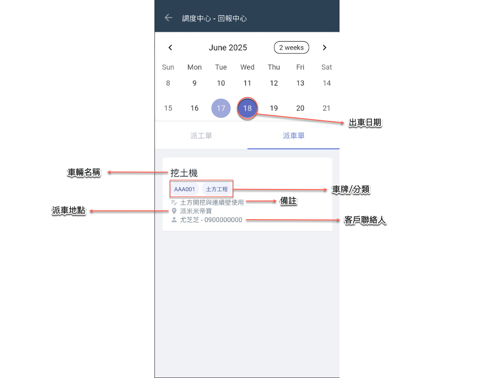
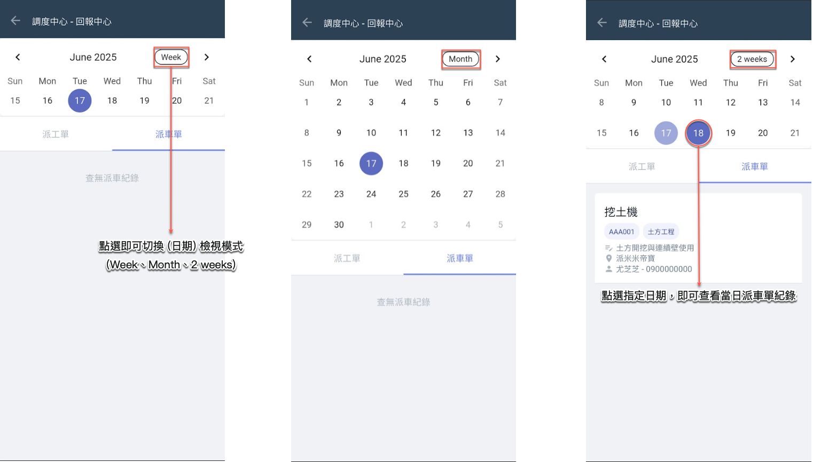

# 派車單

---
description: Vehicle Dispatch Sheet
---

# 派車單

本功能提供現場執行人員透過 App **查看與自身相關的派車單紀錄**，目的在於讓作業人員即時掌握每日派遣安排與任務內容。

<table><thead><tr><th width="191.177490234375">功能特點</th><th>說明</th></tr></thead><tbody><tr><td>個人化資料呈現</td><td>登入人員若為派車單之執行人員，系統將自動顯示其所屬之派車任務，便於隨時查閱。</td></tr><tr><td>日期篩選</td><td>使用者可自由切換日期，查看任一指定日期的派車紀錄 (系統預設當日)。</td></tr><tr><td>快速頁籤切換</td><td>可依需求切換至<kbd>**派工單**</kbd>或<kbd>**派車單**</kbd>頁籤，查看對應類型之工作資訊。</td></tr><tr><td>僅供查閱，無操作權限</td><td>此介面設計為唯讀模式，執行人員僅能查看派車內容。</td></tr></tbody></table>

!!! tip
    此功能讓現場人員能隨時透過手機查閱當日與歷史派車紀錄，達到資訊透明、任務明確、執行有序的目的。適用於日常運輸調度、物料配送、施工支援等行為的提醒與查核。

***

## 01｜選擇日期

如下圖所示，您可切換不同的日期檢視模式，並選擇欲查看派車單的指定日期 (系統預設顯示當日資料)。

