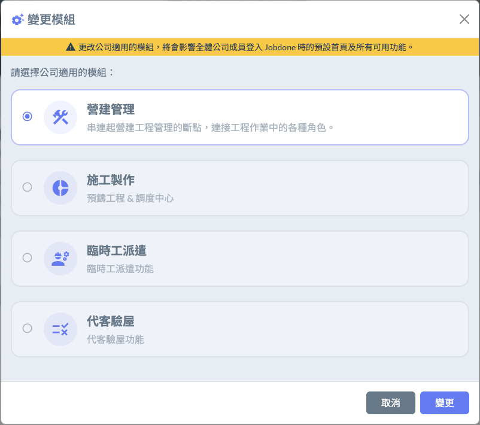
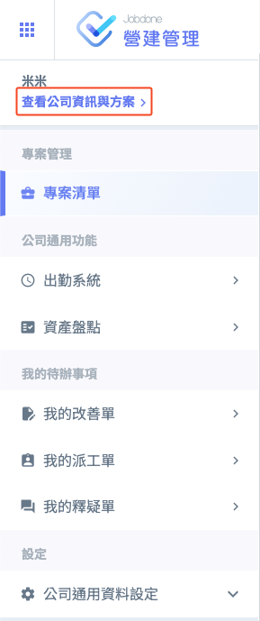
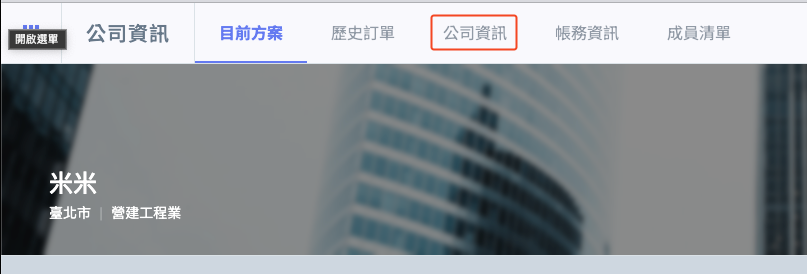

# 模組與功能組合

在建立公司時，您需要選擇適用的**模組**，每個模組都包含不同的功能組合，能根據公司業務類型量身定制，提供最適合的管理工具。透過選擇合適的模組，企業可以針對特定需求進行業務流程優化，提升工作效率和管理效果。

***

## 模組一覽表

系統目前已上線模組：**「營建管理」、「臨時工派遣」、「施工製造」、「代客驗屋」：**

<table><thead><tr><th width="153.373291015625">模組</th><th>功能</th></tr></thead><tbody><tr><td>營建管理</td><td>專案營建工程與專案動態管理而設立，系統提供產業上下游串連，不論您是營造廠商、監造單位、建設公司、建築師事務所等等皆可使用。</td></tr><tr><td>臨時工派遣</td><td>專為派遣商與營建商點工管理而設立，提供派遣商使用作為承接點工需求與調度臨時工的作業中心。</td></tr><tr><td>施工製造</td><td>以專業廠商承攬的角度，整合出勤、出貨、生產製程、派車、派工等功能。可以簡單的調度資源應對多個案場。</td></tr><tr><td>代客驗屋</td><td>給代客驗屋公司使用，驗屋的結果可以直接跟建或營造的驗收功能串聯，省略雙方紙本輸入的重覆過程。</td></tr></tbody></table>

## 切換模組

切換模組只能在網頁端執行

1. 請到左上角 「查看公司設定與方案」
2. 進入到 「公司資訊」
3. 選擇 「變更模組」

