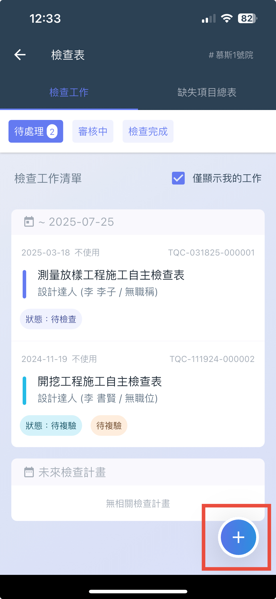
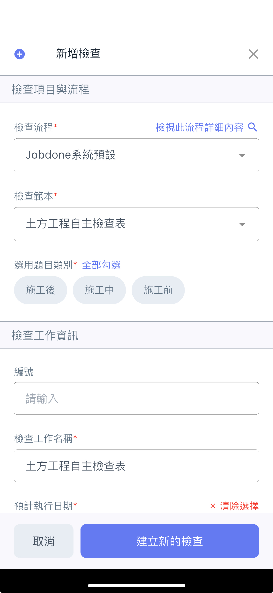
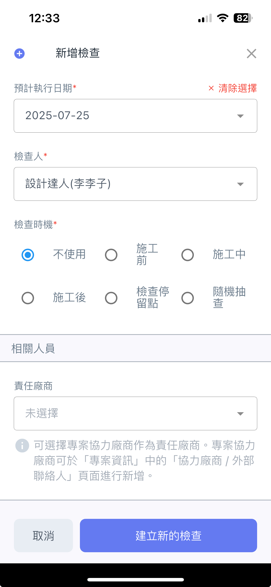
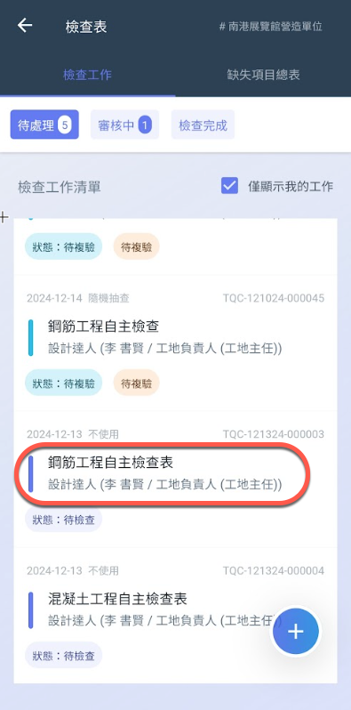
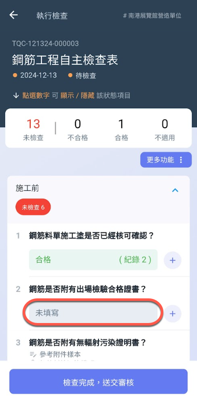
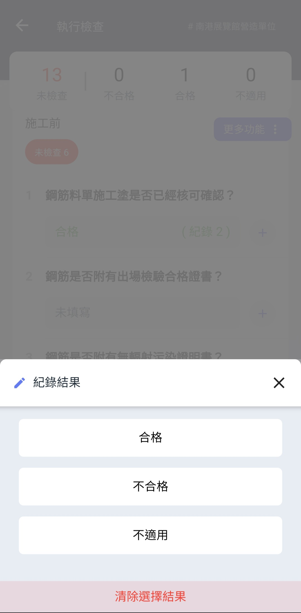
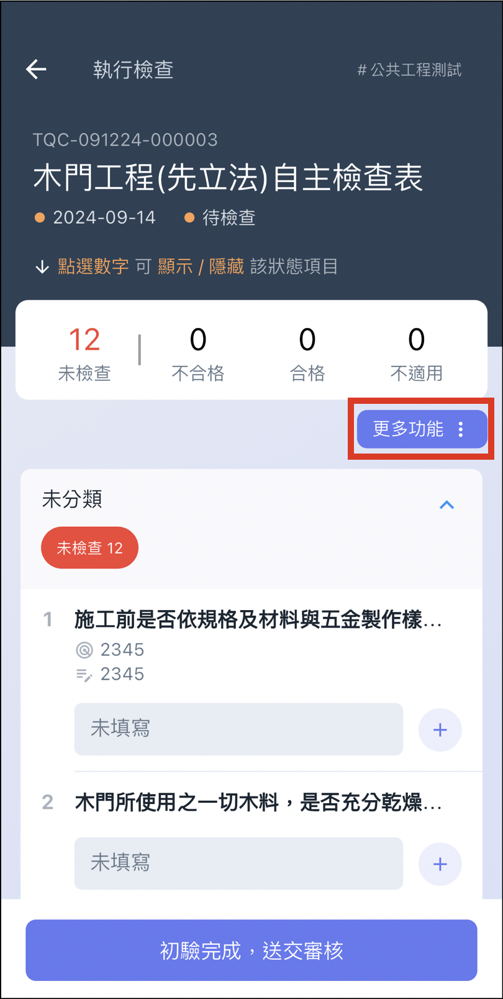
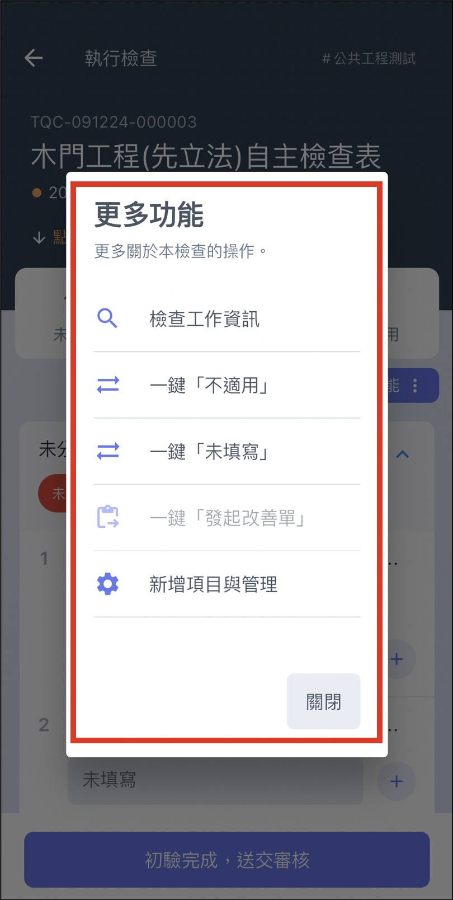
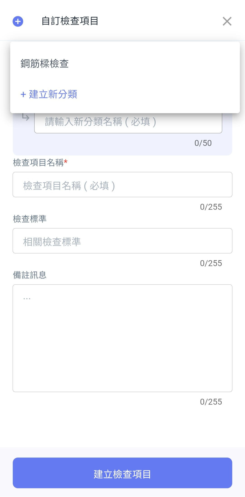
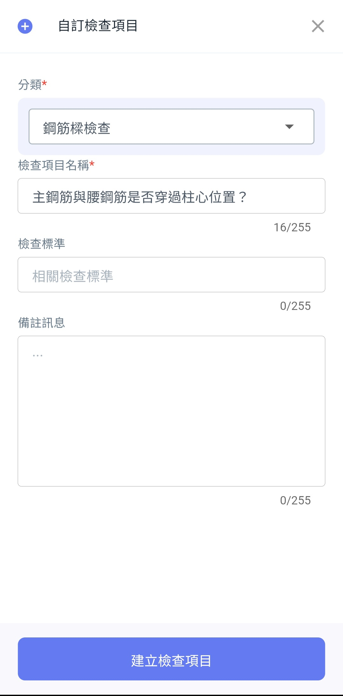

# 執行檢查工作

## 新增檢查工作

進&#x5165;**「檢查表」**，&#x65BC;**「檢查工作」**&#x9801;面點&#x64CA;**「＋」，**&#x7531;此建立新的檢查。

  

***

## 執行檢查工作

點擊欲執行的檢查工作。

!!! warning
    系統預設自動勾&#x9078;**「僅顯示我的檢查工作」**，若有需要請關閉，避免找不到需查看的檢查工作。

  

!!! warning
    請注意圖二不能點擊旁邊&#x7684;**「＋」**&#x7B26;號，因為會&#x9032;**「**[**檢查紀錄**](broken-reference)**」**&#x5167;，而不是紀錄結果。

***

一鍵不適用、一鍵未填寫

當原定的檢查表項目與當日檢查工作完全不相符或依使用者自身情況而定，系統提&#x4F9B;**「一鍵不適用」**&#x53CA;       **「一鍵未填寫」**，讓您能夠一次更改所有檢查項目的檢查結果。

 

***

### 新增項目與管理

由於檢查現場項目可能與當初設定好的檢查範本有些微差異，因此我們提供此功能使檢查過程更為彈性。

透過此功能您可&#x4EE5;**「新增自訂的檢查項目」**&#x65BC;檢查工作，即每個檢查工作都可於現場自行增列檢查項目。

!!! warning
    由於此功能專為檢查現場設計，因此此功能只能&#x65BC;**「APP」**&#x4E0A;操作。

1. 根據自身需求建立檢查項次分類 ➙ **圖一**
2. 填寫該項次內的檢查項目 ➙ **圖二**
3. 填寫完畢 ➙ **圖三**
4. 直接與當前檢查工作合併 ➙ **圖四**

   

