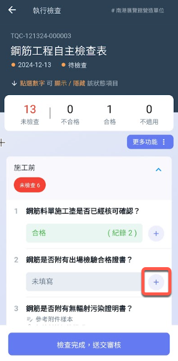
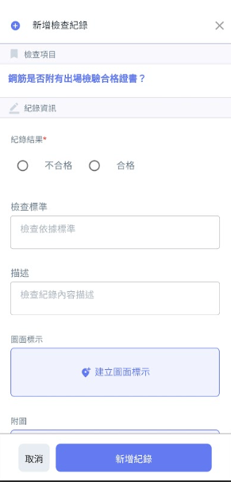
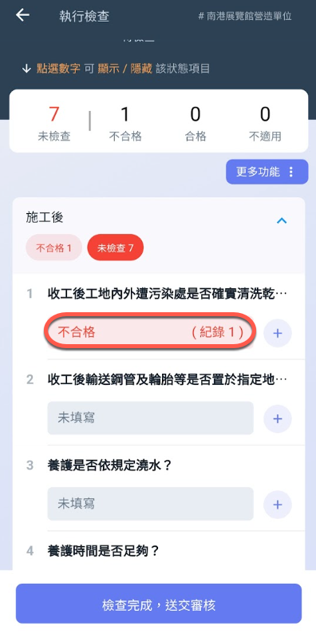
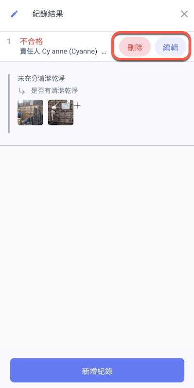

# 檢查紀錄填寫

## 檢查紀錄填寫

對於每一&#x7B46;**「合格」**、**「不合格」**&#x6AA2;查項目都可新增多個紀錄，詳細描述檢查結果。

!!! tip
    若手機處於離線模式，仍然可以建立檢查紀錄，並於恢復連線後點&#x9078;**「未上傳的離線紀錄」**&#x91CD;新上傳檢查紀錄。

***

### 新增紀錄

 

***

### 修改或刪除紀錄

若已有檢查紀錄，點擊進行修改。

!!! warning
    若要修改紀錄，請直接點擊紀錄進入內部修改。若點&#x64CA;**「＋」**&#x5C07;為新增紀錄。&#x20;

 

