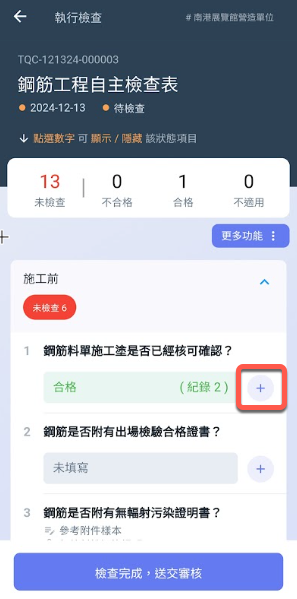
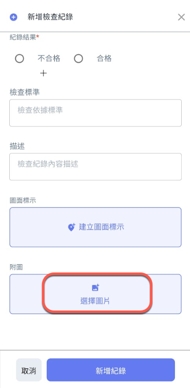
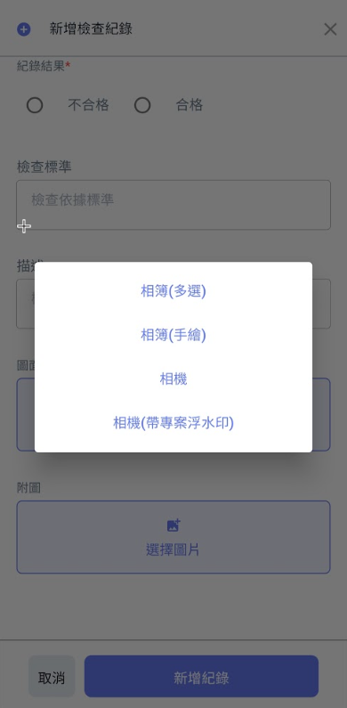
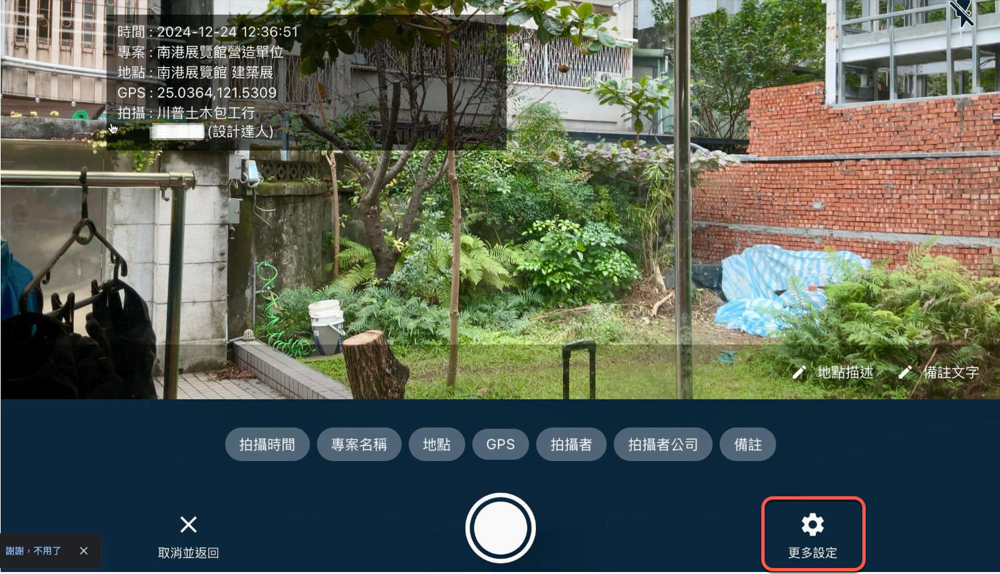
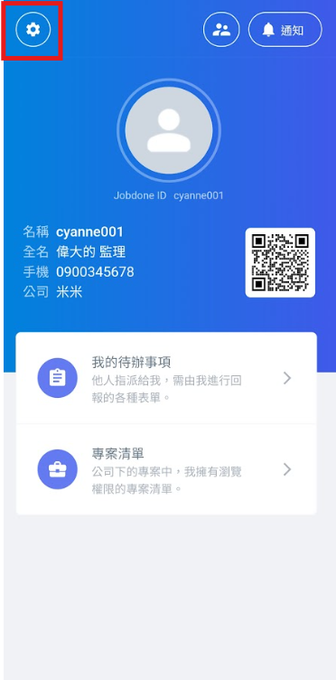
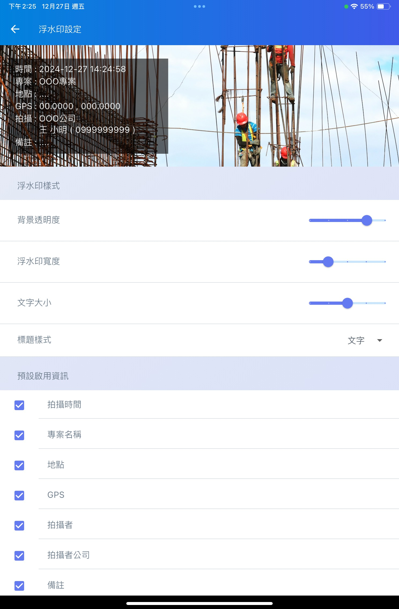

# 附圖相機功能

## 功能列表

&#x65BC;**「新增檢查紀錄」**&#x5167;&#x7684;**「附圖」**&#x63D0;供以下幾種功&#x80FD;**：**

**「相簿（多選)」**、**「相簿 (手繪)」**、**「相機」**、**「相機（帶專案浮水印)  ➙  工程相機」**

  

## 工程相機（帶專案浮水印）

其內部資訊包括：**「拍攝時間」**、**「專案名稱」**、**「地點」**、**「GPS」**、**「拍攝者」**、**「拍攝者公司」**、**「備註」**&#x7B49;。

您可透&#x904E;**「更多設定」**&#x6216;裝置設定&#x4E4B;**「浮水印相機功能設定」**&#x4F86;設定您專用的浮水印。

透過「裝置設定」設定浮水印。

  

