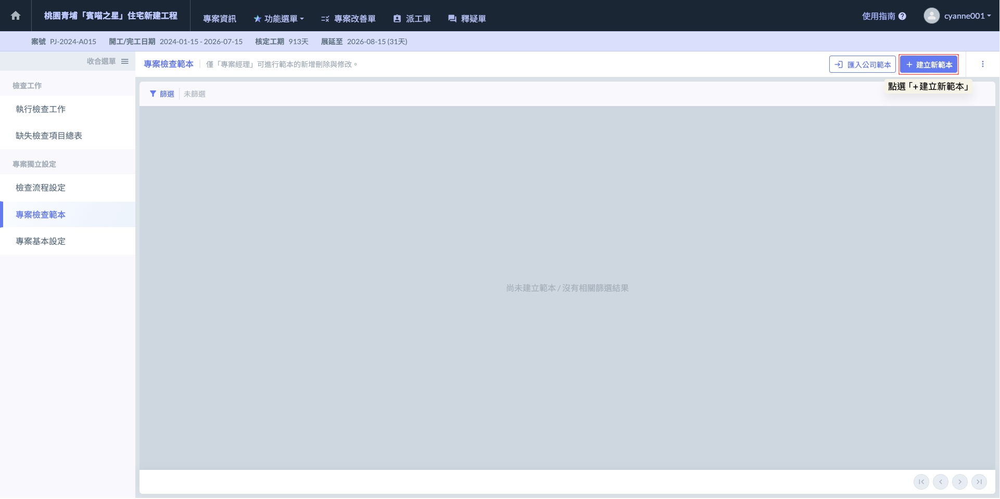

# 專案檢查範本

在營建工程中，從開工到完工涉及數百項工序，每一項工序的查驗重點皆不相同。『專案檢查範本』功能旨在將公司的施工標準、契約規範及計畫書內容數位化。透過範本化管理，確保現場人員在執行查驗時，皆能依照統一的基準（Standard）進行判斷，杜絕漏項風險。

#### 01｜範本結構與分類管理（Template Architecture）

系統支援高度結構化的範本建立模式，專案經理可依據分項工程的特性進行分層設定：

<table><thead><tr><th width="179.9947509765625">功能</th><th>說明</th></tr></thead><tbody><tr><td><strong>定義範本標題與分項工程</strong></td><td>依據工程契約編號或工項名稱（如：連續壁工程、鋼筋綁紮、室內裝修）建立範本，並指定對應的分項工程分類，便於後續數據歸納與進度追蹤。</td></tr><tr><td><strong>範本使用人員限制</strong></td><td>可指定特定範本僅供相關職稱（如：相關技師/工程師、品質管理人員等）使用，落實專業分工。</td></tr><tr><td><strong>檢查項目分類</strong></td><td>
範本內可依照需求進行檢查項目分類，例如：

<strong>時間：</strong>施工前(材料進場檢驗)、施工中(工序查核)、施工後(成品驗收)

 <strong>專業程序：</strong>以連續壁工程為例，可分類為『鋼筋龍製作』、『穩定液性能檢測』、『特密管灌漿』等。
<blockquote>
實務建議：依據需求建立無限層級或分類，確保查驗邏輯貼合現場實際施作順序。
</blockquote></td></tr></tbody></table>

***

#### 02｜檢查項目與標準設定 (Inspection Items & Criteria)

在各個分類下，管理員可進一步細化具體的檢查內容：

<table><thead><tr><th width="171.4696044921875">功能</th><th>說明</th></tr></thead><tbody><tr><td><strong>建立多個檢查項目</strong></td><td>針對該工序的關鍵品質控制點（Quality Control Points）逐一列項。</td></tr><tr><td><strong>設定項目標準值</strong> (Tolerance/Criteria)</td><td>明確填寫「合格標準」，例如：「鋼筋間距誤差 ±1cm 以內」、「穩定液比重需介於 1.05~1.10」。</td></tr><tr><td><strong>上傳相關附件</strong></td><td>可於範本內預先夾帶「施工圖說」、「標準圖」、「大樣圖」或「品管標準照片」。現場人員在檢查時可隨時調閱參考，確保施工與設計相符。</td></tr></tbody></table>

系統兼顧了「公司標準化」與「專案特殊性」的雙重需求：



為了省去逐筆輸入的時間，系統支援從「公司自主檢查範本庫」中一鍵匯入。這適用於全公司統一的標準 SOP，確保不同案場的品管水平一致。



匯入後，專案管理員可依照該案場的特殊契約要求（如業主特別要求的額外檢測項），彈性增刪或修改檢查項目、標準值與附件，實現「標準化起步，在地化調整」。



進入專案檢查範本頁面後，點選右上方『+建立新範本』，即可開啟視窗建立新範本

需填寫的欄位有 類型 條例型：由使用者自行新增欄位，自由編列檢查項目與檢查標準，適用於需要彈性調整的檢核內容。 檔案型：可上傳既有的檢查表格檔案

分項工程(選取範本相關的分項工程) 編號 名稱 施作頻率  權限設定-可使用人員限制 標籤 備註訊息

請充分補充並說明欄位

