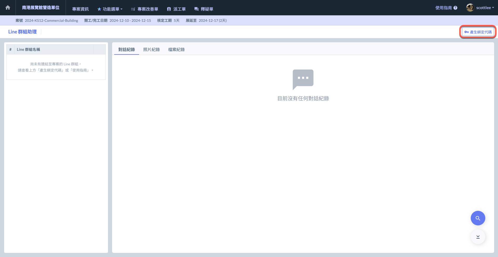
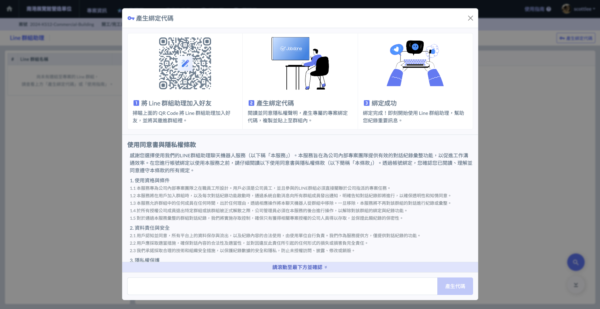
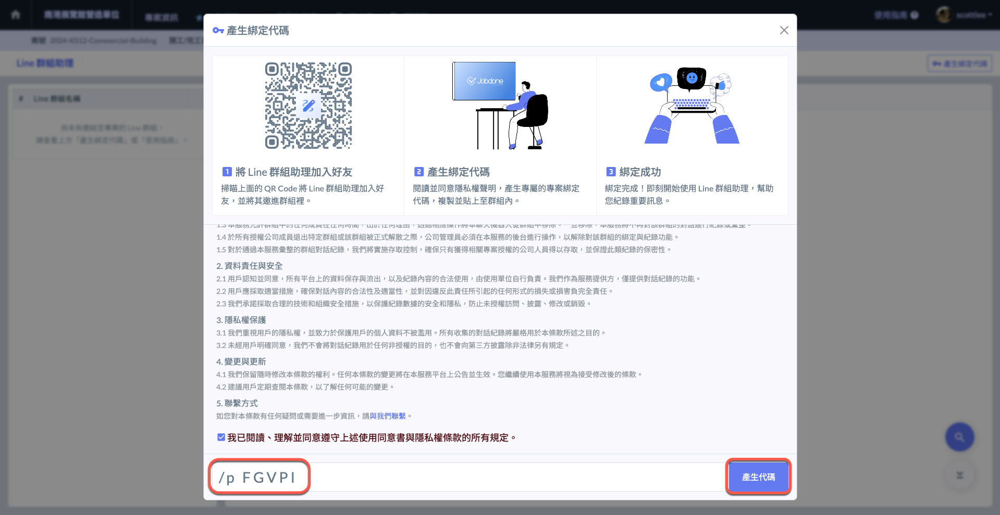
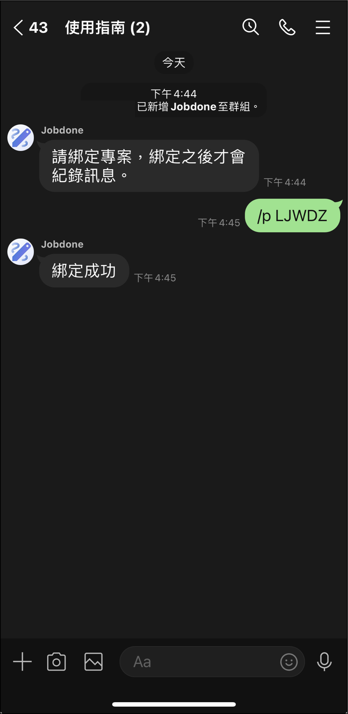

# 操作流程簡介

---
description: Introduction to the Operational Process
---

# 操作流程簡介

## 操作流程簡介



### 將 Line 群組助理 加為好友

掃描下方 QR code 將 Line 群組助理 加為好友




### 將群組助理加入群組

邀請群組助理到您的專案群組內。



### 產生綁定代碼

進入Line 群組助理後，點&#x64CA;**「產生綁定代碼」**。

詳細閱讀使用說明書與隱私權條款後，點&#x9078;**「產生代碼」**。




### 綁定群組助理

將群組助理加入您的專案群組，並於群組內輸入該代碼。

群組助理發&#x9001;**「綁定成功」**&#x5F8C;，即會開始紀錄您專案群組的所有聊天記錄 (包括上傳的檔案與圖片)。

!!! tip
    &#x20;一個專案只能綁定一個 Line 群組，但您可隨時取消綁定並重新更換群組。




