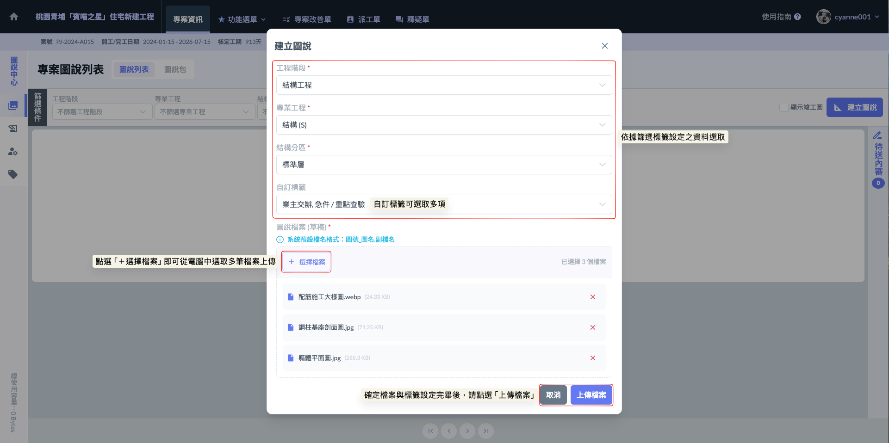
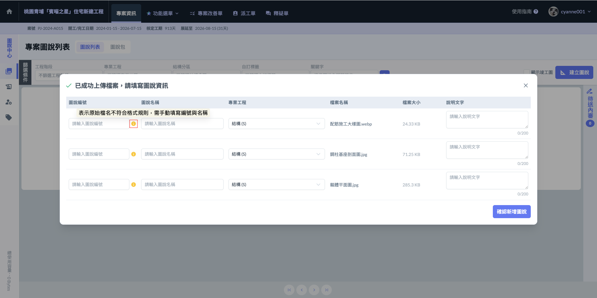
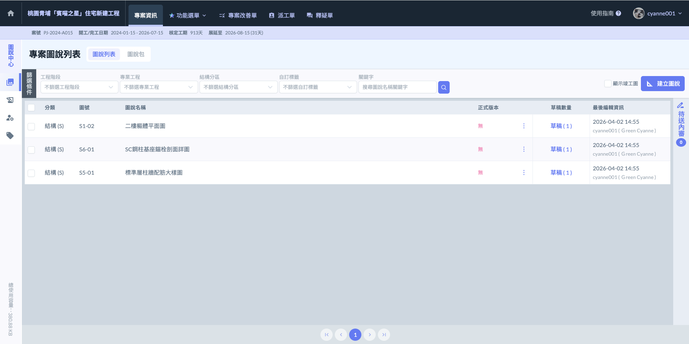

# 圖說列表

圖說列表是專案的「圖紙總表」。它不只是存放檔案的地方，而是用來控管每一張施工圖從草稿、送審、正式發佈到竣工存檔的完整歷程。

透過這個列表，管理人員可以確保現場師傅看到的永遠是「最新正式版」，避免誤用舊圖造成施工錯誤。

!!! info
    #### **核心用途**
    
    * 進度追蹤： 一眼確認哪些圖還在「草稿」階段、哪些正在「送審中」。
    * 版本控管： 統一發佈「正式版」圖說，系統會自動歸檔舊版本，解決現場圖紙混亂的問題。
    * 狀態切換： 根據施工現況，將圖紙標註為「竣工圖」作結案存檔，或針對廢棄設計執行「作廢刪除」。
    * 權責分明： 只有經過審核程序並設為正式版的圖說，才會同步給所有現場人員，落實精確的圖面管理。

***

### 01｜圖說列表

**建立新圖說與上傳草稿**

如圖一，進入圖說列表主頁面後，點選右上角的  圖示，即可開啟視窗開始建立圖說基本資料與檔案。

**建立步驟與必要欄位：**

1. 標註分類標籤：依序從下拉選單中選擇該圖說對應的<kbd>**工程階段**</kbd>、<kbd>**專業工程**</kbd>、<kbd>**結構分區**</kbd>及<kbd>**自訂標籤**</kbd>。
   * _實務提醒：_ 這些標籤決定了日後現場人員能否快速篩選出這張圖，請務必精確選取。
2. 上傳圖說檔案（草稿）： 將欲發布的圖紙檔案上傳。此時系統會預設為<kbd><mark style="background-color:blue;">**未送審**<mark style="background-color:blue;"></kbd>狀態。
   * _實務意義：_ 剛建立的圖說僅供具權限的人員進行內部校對與送審，尚未正式發布至全案現場。
3. 填寫圖說資訊： 輸入圖號、圖名及版本說明（如：第一版施工圖、變更 A 版），確保後續版本更迭時有跡可循。

!!! warning
    #### ⚠️ 批次建立重要建議：屬性相同再同捆
    
    在建立圖說視窗中，最上方的工程階段、結構分區等標籤屬於「批次設定」。這意味著同一個視窗內上傳的所有圖檔，****都會被自動套用相同的工程階段與結構分區****。
    
    **操作準則：**
    
    * 性質不同，請分批建立：若您手邊的圖說橫跨不同樓層（分區）或不同施工時期（階段），請務必分兩次（或多次）執行建立動作。
    * 避免誤標：由於同一批次上傳的圖說，在系統中僅能選擇一組固定的工程階段與結構分區，若強行混在一起上傳，會導致後續篩選結果錯誤，增加重新修正的人力成本。
    
    **實務建議流程：**
    
    1. 先分類：上傳前先將圖檔按「樓層」或「專業」分好資料夾。
    2. 批次傳：勾選各標籤後，一次上傳所有相關圖說檔；存檔案，再次點選  處理其他圖說。
    3. 細部調：雖然大項標籤是批次設定，但進入細節編輯時，仍可針對單張圖紙微調『專業工程』標籤，保持作業彈性。

如圖二，點選上傳檔案後，系統會開啟詳細編輯視窗。在此階段，您需要針對每一個附加的草稿檔案，確認其圖說編號、圖說名稱以及專業工程標籤。



為了提稱作業效率，系統具備自動抓取功能。若您原始檔案名稱符合<kbd>**圖號\_圖名.副檔名**</kbd> 的命名結構（如：A101\_一樓平面圖.pdf），系統會自動將資訊帶入對應的「圖說編號」與「圖說名稱」欄位，省去重複輸入的時間。



* 不符結構處理：若原始檔名不符合格式，則需要您手動逐一填寫該張圖紙的編號與名稱。
* 專業工程標籤：每一張上傳的圖紙都必須指定其所屬的專業領域（如建築、結構、水電），以便後續依工種精確篩選。



!!! info
    #### **實務建議**
    
    建議在電腦端整理圖檔時，先統一將檔案重新命名為「圖號\_圖名」，上傳時就能享受自動帶入的便利，大幅降低人工輸入錯誤的風險。

在批次建立視窗中，雖然最上方的「工程階段」與「結構分區」會整批套用，但進入下方的細節清單時，您仍保有高度的調整彈性。

!!! info
    #### **操作要領**
    
    ****個別標籤微調****： 即使是同一批上傳的檔案，每一張圖說仍可針對其特性，單獨選擇對應的「專業工程」標籤。
    
    * _實務範例：_ 同時上傳 A 棟 3 樓的圖，您可以將其中一張標為「建築」，另一張標為「結構」。
    
    ****填寫說明文字****： 請務必在各張圖說的說明欄位中，填入具體的施作功能或變更摘要。
    
    * _建議：_ 好的說明文字能讓現場工程師在不點開圖檔的情況下，就知道這張圖的用途。
    
    **確認新增圖說**： 逐一核對圖號、圖名、標籤與說明皆正確無誤後，點選右下方的 ，系統即會將這批圖紙存入圖說列表中。

完成畫面如下：

***

### 02｜圖說包
