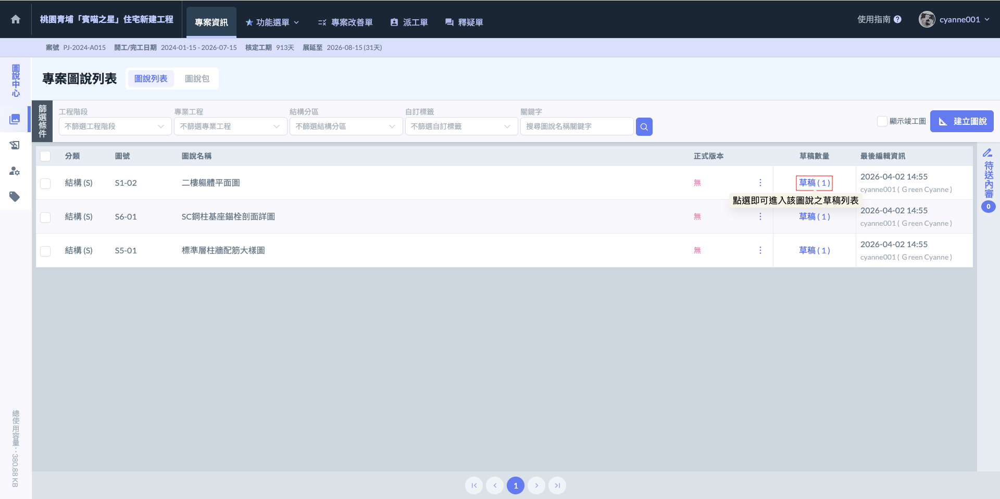
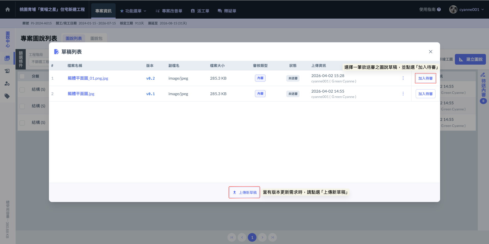
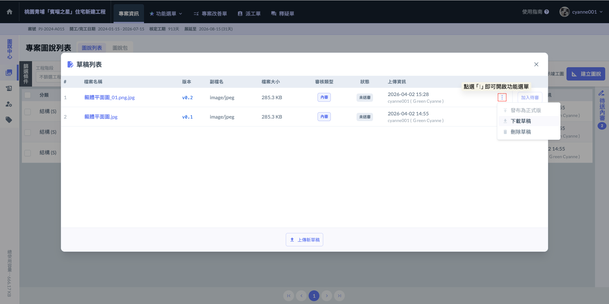
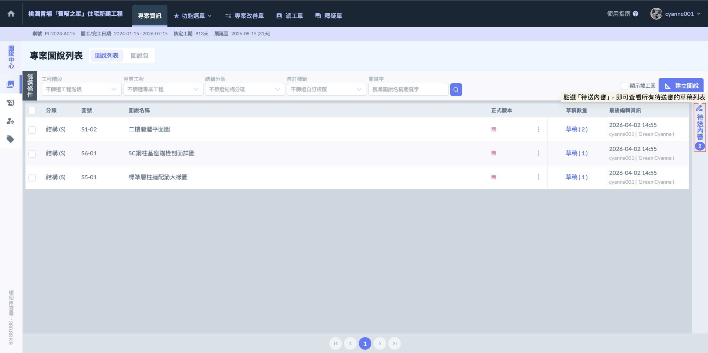
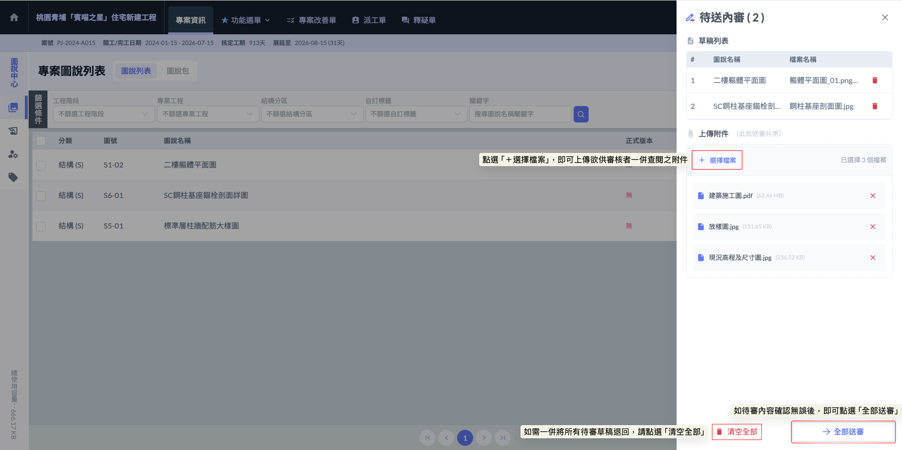
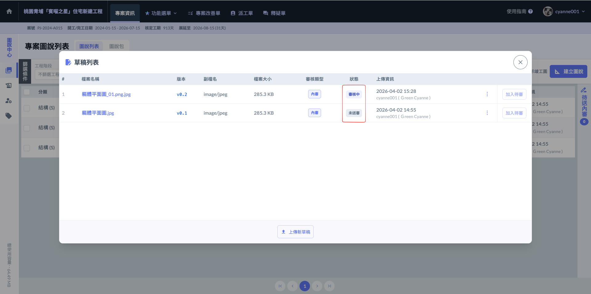

# 草稿列表與送審

### 01｜圖說草稿管理：版本更新與送審機制

在系統邏輯中，「建立圖說」只是第一步，這動作就像是在雲端櫃子裡建立了一個專屬的「圖說管理資料夾」。後續無論是因為設計變更或是現場套圖修正，所有的圖紙更新都是在同一個圖說資料夾下持續新增「草稿」。

**一、 草稿列表：圖紙的版次紀錄**

進入特定圖說的「草稿列表」後，您可以查看該圖號過往上傳的所有版本。這讓內業與現場人員能隨時對照舊版與新版草稿的差異，確保設計脈絡不中斷。

**二、 核心功能：加入待審**

草稿列表最主要的操作就是 。當您上傳了新的修正檔，必須手動將該筆草稿推入審核流程，否則該圖檔僅會停留在草稿區，不會對現場生效。

!!! info
    #### **嚴謹的審核限制：「一圖一審」原則**
    
    為了避免版本衝突與審核混亂，系統設定了嚴格的控管機制：
    
    * 一次僅限一筆：在同一個圖說資料夾（同一個圖號）中，一次只能選擇一筆草稿進入『內審』流程。
    * 循序執行：必須等到當前的草稿審核完畢（無論是通過或退回）後，系統才會允許您將該圖號下的下一筆草稿加入待審。
    * 實務目的：這是為了確保審核者與現場人員面對的是唯一的「當前待核定版」。防止多份草稿同時送審導致的作業錯誤。

**三、下載 /** **清理多餘草稿**

如圖三，若上傳了錯誤的草稿或誤選加入待選之草稿，可直接在列表移除，保持管理目錄的乾淨。

!!! info
    草稿在加入「待審區」後，並不代表流程已經鎖定。只要尚未點選最終的「提交送審」，該筆草稿皆可隨時刪除。

***

#### 01 - 1｜草稿送審

當您在個別圖說下完成  的動作後，請回到圖說列表頁面。

如圖四，在頁面的最右側，您會看到一個  的圖示（通常帶有數字標示目前待處理的件數）。點選該圖示後，系統會開啟一個總表視窗，列出目前所有「已勾選待審」但「尚未正式發出」的圖說草稿。

!!! info
    #### 最終檢核
    
    此為提交給審核者前的最後確認機會。您可以在此視窗中再次核對清單內的圖說名稱、檔案名稱是否正確，確保送出的資料完整無誤。

**送審附件與補充說明**

如圖五，在提交每一批待送內審的圖說草稿時，系統支援「上傳附件」功能。這些附件會隨同圖紙一併進入審核區，供審核者在覆核圖面時作為參考依據。

<table><thead><tr><th width="152.9400634765625">補充</th><th>附註</th></tr></thead><tbody><tr><td><strong>1. 附件的實務用途</strong></td><td>
附件通常用來存放「非圖紙類」但與施工依據密切相關的證明文件，例如：
<ul><li>會議紀錄： 註明本次圖面修正是依據哪一次工地協調會的結論。</li><li>計算書：結構或機電的計算數據，證明圖面變更後的安全性。</li><li>建築師/業主公文：官方發出的變更令 (VO) 或指示函，確認變更來源。</li><li>現場照片：提供施工現況照片，解釋為何圖面需要配合現場微調。</li></ul></td></tr><tr><td><strong>2. 操作邏輯</strong></td><td>
透過附件補充，可以減少審核者因不了解變更背景而產生的退件（駁回）率，縮短圖說從草稿轉為正式版的時間。
<ul><li>整批關聯： 您在此處上傳的附件會關連至「這一整批」送審的草稿中。審核者進入審核介面後，可以同時開啟圖檔與附件進行比對。</li></ul></td></tr><tr><td><strong>3. 提醒</strong></td><td>附件是用來「輔助說明」的。若該文件本身就是一張需要被發布到現場的「施工圖」，則應透過前面提到的「建立圖說」流程上傳，而非僅僅作為附件。</td></tr></tbody></table>

**狀態變更：審核中 (Under Review)**

原先標示為「未送審」的檔案，狀態會統一更新為 「審核中」。

!!! info
    權限鎖定： 為了確保審核過程中的資料一致性，處於<kbd><mark style="color:$primary;">**審核中**<mark style="color:$primary;"></kbd>的草稿將暫時無法再進行刪除。

***

### 02｜設為正式版
