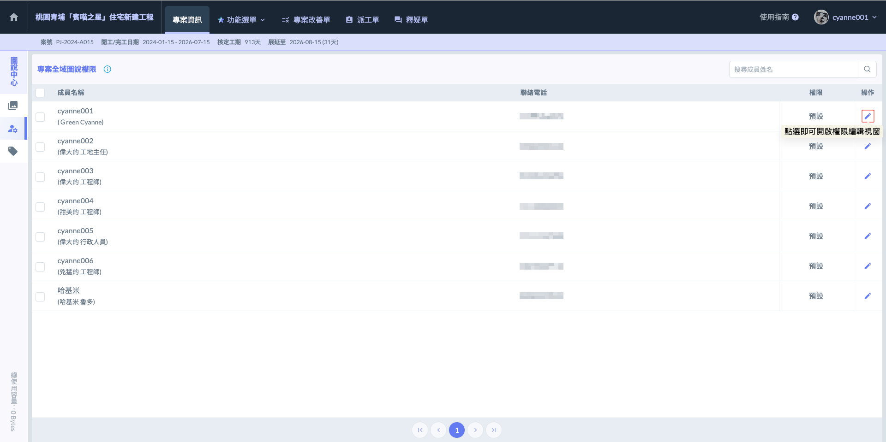
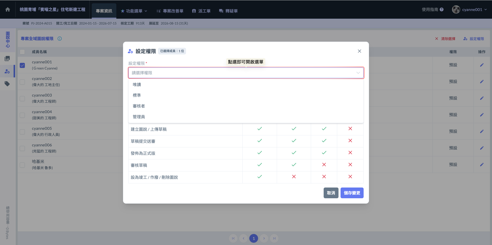
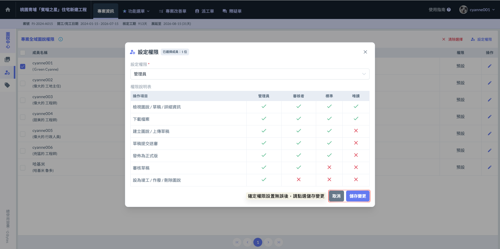
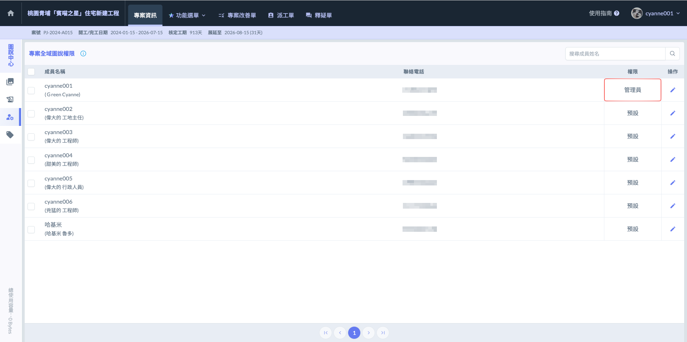
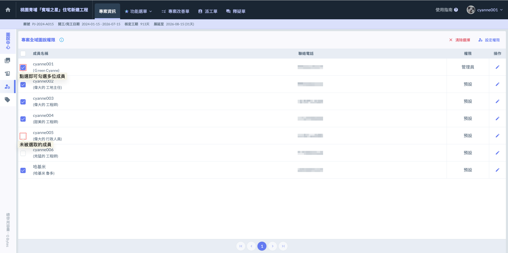
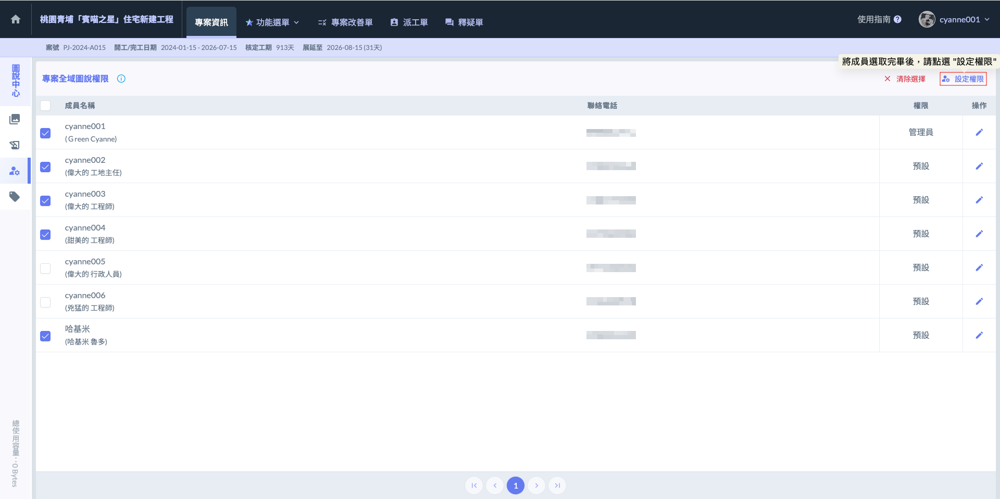
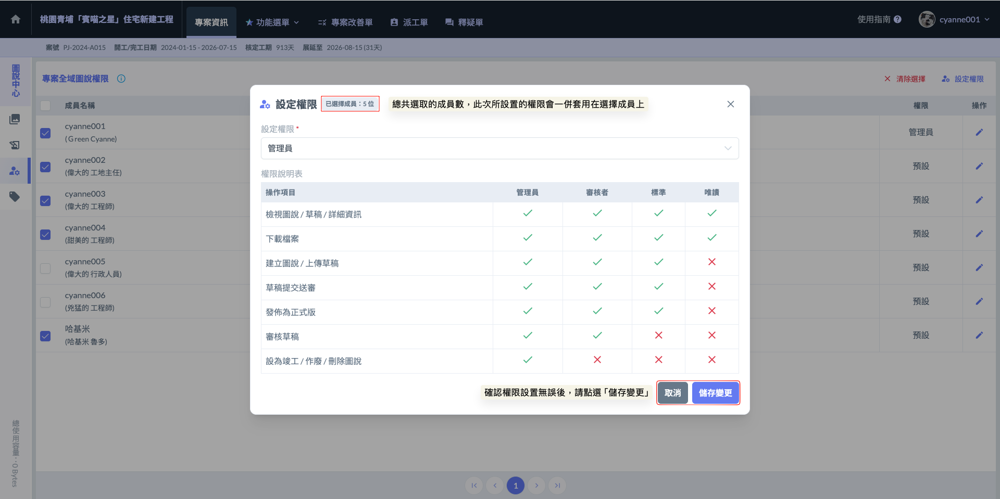
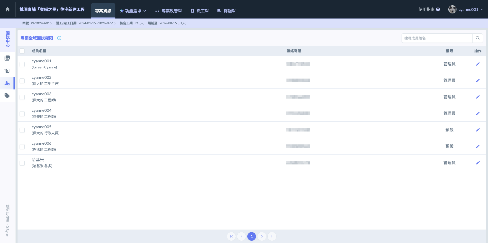

# 專案全域圖說權限

「專案全域圖說權限」是針對整個****專案範圍內的圖說管理所進行的頂層設定****。這套權限架構決定了不同專案成員對於系統內所有文件的存取邊界與操作能力。透過全域權限的配置，管理人員可以精確控管哪些成員具備檢視、編輯或刪除專案文件的權限，確保資訊傳遞的同時兼顧資料安全性。

由於圖說涉及計價與結構安全，因此必須由特定人員負責審核與發行。圖說管理中心透過嚴謹的權限分配，確保每一張正式發布的圖紙都具備法律與施工效力，並落實崗位責任：



全域管控與結案權責 具備系統最高權限。除了日常的圖說編輯與發布外，最重要的職責是處理「設為竣工圖」、「作廢」及「刪除圖說」等涉及合約結案與資料清理的動作。這些動作會更動到專案的最終成果，因此僅限管理員執行。



品質控管與版本把關。主要負責圖說草稿的「審核」。僅審核者權限以上之成員，可以進入待審核草稿區，並檢視所有草稿內容，核定其正確性。雖然無法直接刪除圖說，但具備核可草稿的權限，是確保圖紙進入正式發行階段前的關鍵過濾角色。



現場作業與上傳執行 這是第一線工程人員最常用的權限。具備建立圖說、上傳草稿、提交送審以及將核可後的圖說「發布為正式版」的權限。這個設定讓現場人員可以即時更新進度，但限制其進行審核、作廢刪除與設為竣工圖的動作，以維持資料的嚴謹度。



純查閱與檢驗使用。僅開放最基礎的「檢視」與「下載」功能。此權限無法建立草稿或異動任何版本狀態。適合分包商、外部查驗單位或僅需持手機對照圖紙施工的工班人員，確保他們能隨時調閱最新資訊，但不會誤觸系統設定。



***

### 01｜設定權限

在專案圖說剛建立時，所有成員的初始權限皆為「預設」狀態。這意味著在管理端尚未指派權限前，所有人員都無法查看、下載或使用「圖說」模組內的任何功能與內容。

若要開啟或調整成員的作業權限，必須由****該專案下具備「專案管理權限」的人員****進行設定。

!!! info
    請注意，「圖說全域權限」的調整，並非由圖說模組內的管理員自行更動。僅有具備「全專案管理權限」的人員（即擁有該專案最高控管權者），方可進入成員管理介面，針對個別人員指派或修改其在圖說功能中的權限層級。
    
    有關專案管理權限之設置說明，請參閱 ➙ [team-members](../../project_level/project_stakeholders/team-members "mention")
    
    

如圖一所示，進入權限設定頁面後，於欲更動權限的成員後方「操作」欄位，點選  圖示，即可開啟該成員的設定權限視窗，進行後續的權限指派與調整。

如圖二所示，開啟設定權限視窗後，點選上方「設定權限」欄位展開下拉選單，即可依據成員職責指定對應的權限層級。

如圖三所示，確認權限等級設置無誤後，請點選視窗右下方的 ，系統將立即套用設定並更新該成員的圖說作業權限。

完成畫面如下：

***

### 01 - 1｜批次設定權限

如圖五，若需同時變更數位成員的權限，您可直接勾選成員欄位旁的  進行複選。選取完成後，即可統一調整所選成員的圖說作業層級，大幅提升開案初期的人員設定效率。

：表示該成員未被選取，再次點選即可勾選。

：表示該成員已被選取，再次點選即可取消勾選。

如圖六，確認欲操作的成員皆勾選完畢後，請點選頁面右上方的  圖示，即可開啟權限設置視窗，統一調整所選成員的圖說作業權限。

如圖七所示，確認權限等級設置無誤後，請點選視窗右下方的 ，系統將立即套用設定並更新該成員的圖說作業權限。

完成畫面如下：

