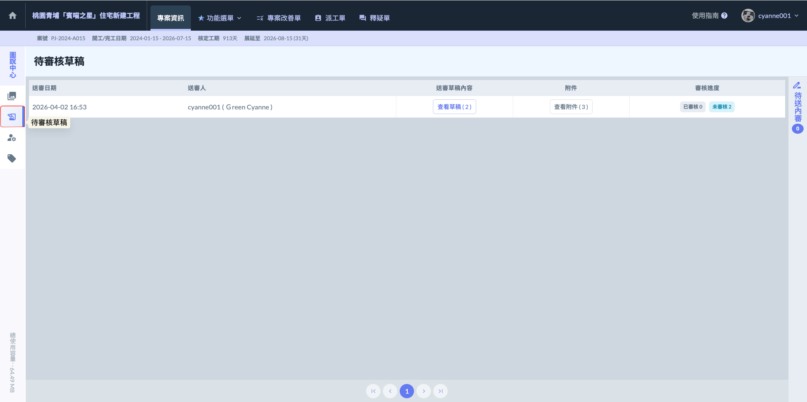
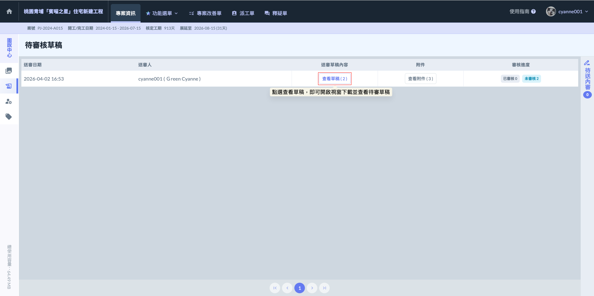
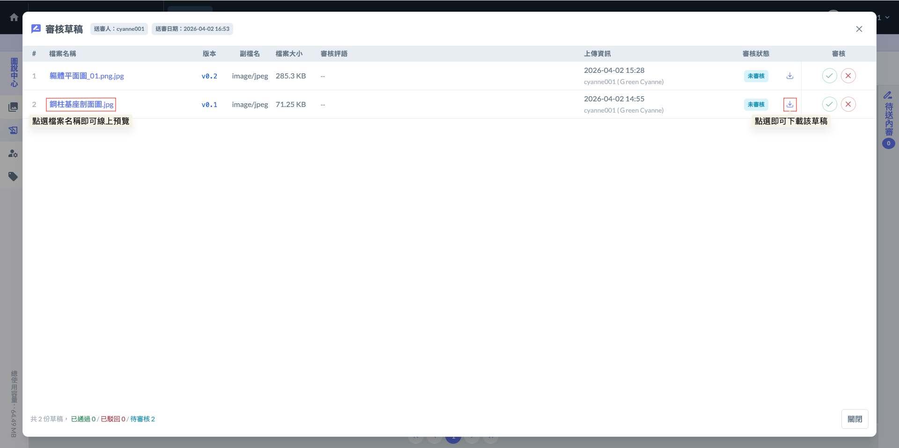
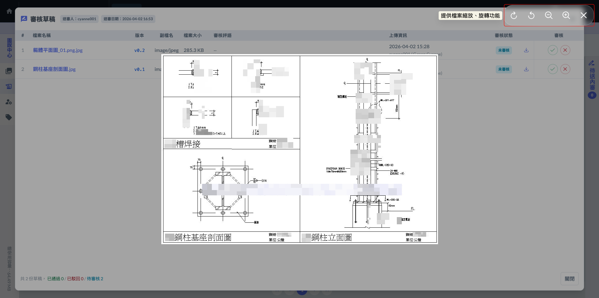

# 待審核草稿

在圖說功能中，「待審核草稿區」 是專為覆核程序設計的管制區。為了維持審核流程的嚴謹性，系統對此功能設有嚴格的權限過濾：

**權限進入限制**

此功能僅限以下兩類使用者可見並進行操作：



負責核對圖紙內容、確認與變更設計是否相符，並執行最終的「通過」或「駁回」操作。



具備圖說最高權限，可監督審核進度，並在必要時介入調整審核清單。



!!! info
    #### **為什麼一般使用者看不到？**
    
    防止圖面誤用： 現場工程師或分包商只需專注於「正式版」施工圖。隱藏待審核區能避免人員看到未經核定的草稿，防止因資訊落差導致的施工錯誤。
    
    ***
    
    施工圖的審核涉及結構安全、法規符合性及工種介面衝突。
    
    * 專人負責： 只有具備專業背景的工程師、主任或技師（即系統中的審核者），才能對圖面內容進行最後的確認。
    * 防止誤放行： 若開放給一般人員（如內勤、初階助理或一般工班）審核，可能會因為缺乏專業判斷而誤將錯誤的圖說「正式化」，導致現場施工錯誤，造成不可挽回的損失。
    
    ***
    
    每一張從草稿轉為正式版的圖說，系統都會記錄是「誰」在「什麼時間」點下操作什麼。
    
    * 簽核履歷： 這就像是在紙本圖說上蓋章簽名。未來若發生施作爭議或需要追溯原因時，系統紀錄能明確查出該版本的核定人。
    * 權限隔離： 一般人員的身分是「資訊接收者」，負責按圖施工；而審核者則是「品質把關者」。兩者權責分開，才能確保管理流程的公正性。

***

### 01｜審核草稿

進入待審核區後，審核者的操作將決定該圖說是否具備現場施工的效力。為了確保核定內容無誤，在執行審核動作前，請務必落實以下「先讀後審」的查閱步驟：



雖然系統提供線上預覽，但針對高解析度的施工圖（如配筋圖、細部大樣），建議務必先下載原始檔案。

* 查核重點：放大確認圖面的尺寸標註、標高及文字說明是否清晰準確，並核對圖號、圖名是否與系統欄位填寫的一致。



附件通常包含本次圖說更新的重點依據。

* 查核重點：仔細閱讀附件中的會議記錄、業主公文或設計變更通知單。確認本次草稿的修正內容，確實符合附件中所要求的變更方向。



比對「草稿圖面」與「補充附件」兩者資訊是否吻合。確實將送審內容仔細閱覽完畢，確認圖說資訊完整且正確後，再進行最終的審核判定。

!!! info
    #### 實務提醒
    
    審核區的設計是為了每一施工圖說準確性的過濾與保證。先下載、後查閱、再審核，能有效避免『沒看清楚』而誤將錯誤資訊正式發佈到現場，這也是權責劃分中 審核者 最重要的職責。




#### 01 - 1｜查看草稿

當您找到欲處理的送審項目後，請依照以下步驟確認圖說內容：

* 執行動作： 在該筆資料的「送審草稿內容」欄位中，點選 。
* 檢視範圍：點選後系統會開啟明細視窗，您可以一次看到該次送審中包含的所有圖說草稿（可能是一張，也可能是整套批次送審的圖紙）。

如圖二，在「查看草稿」的視窗中，系統提供了兩種方式供審核者確認檔案內容，您可以根據核對的深度自由切換：



直接點選 <kbd><mark style="color:purple;">**檔案名稱**<mark style="color:purple;"></kbd>，即可在視窗內直接開啟圖檔進行快速預覽。這對於核對圖名、圖號或大致配置非常方便，省去反覆下載檔案的時間。



點選檔案審核狀態欄位右方的  圖示，即可將原始圖檔或附件下載至電腦中。



***

#### 01 - 2｜查看附件

