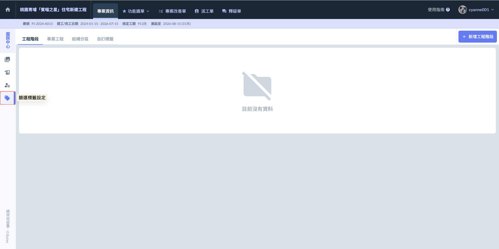
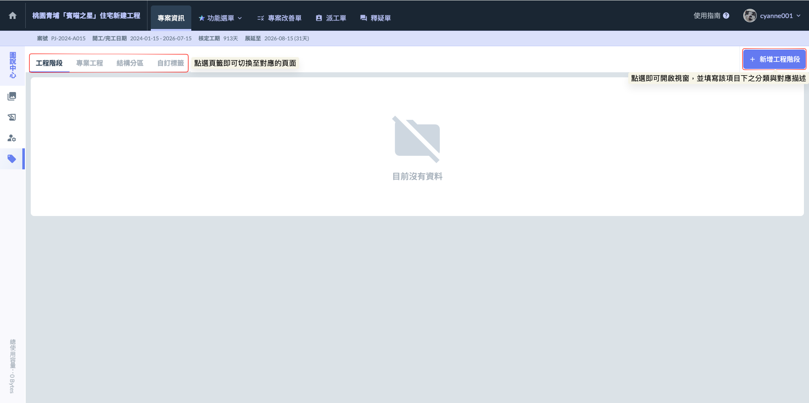
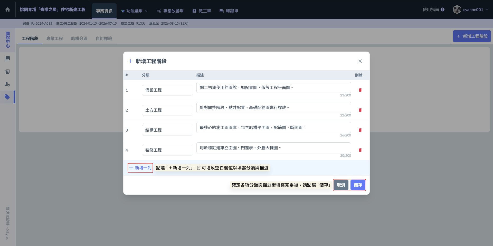
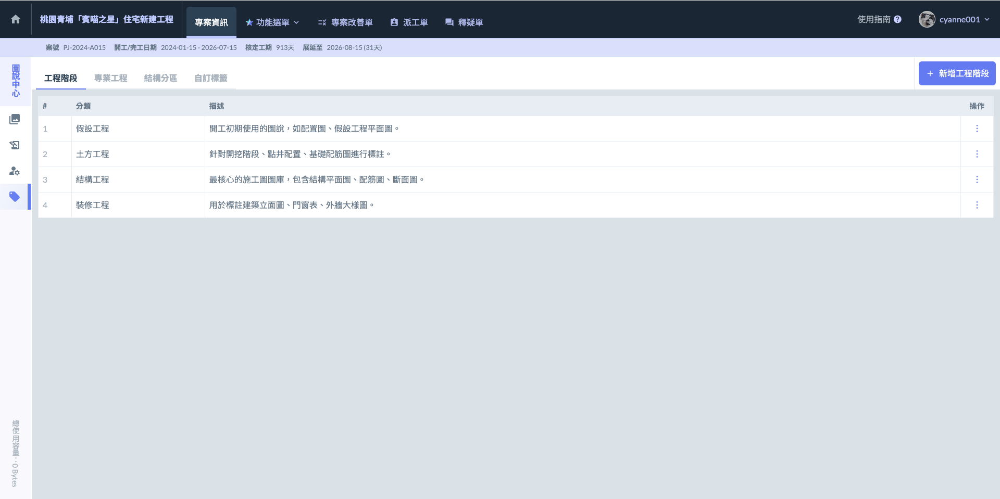
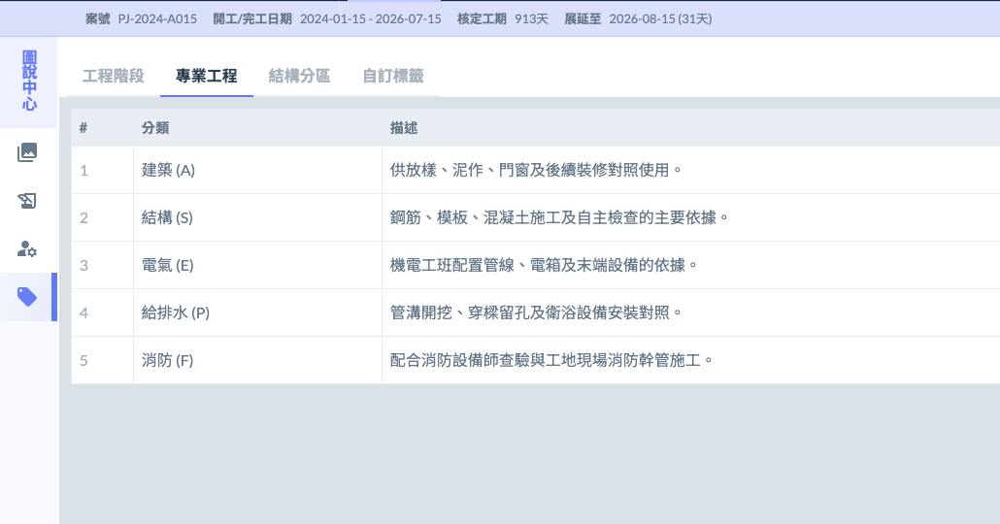
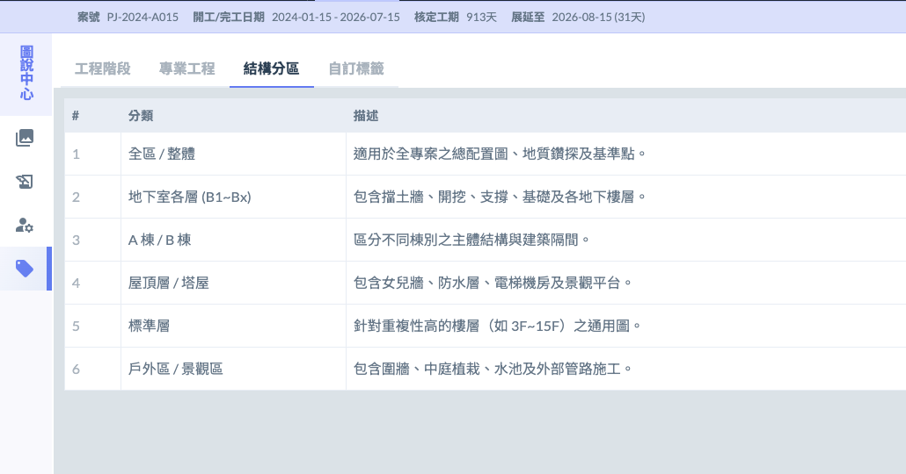
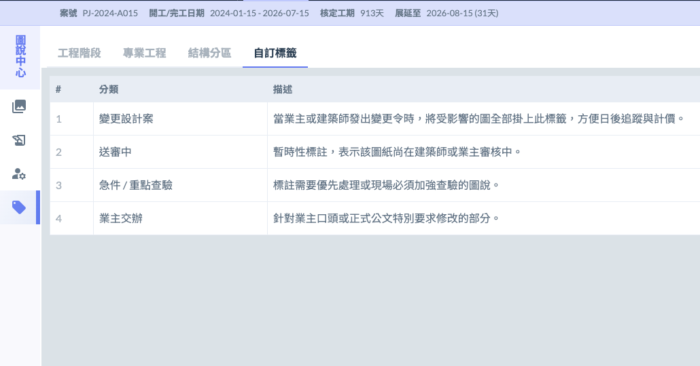
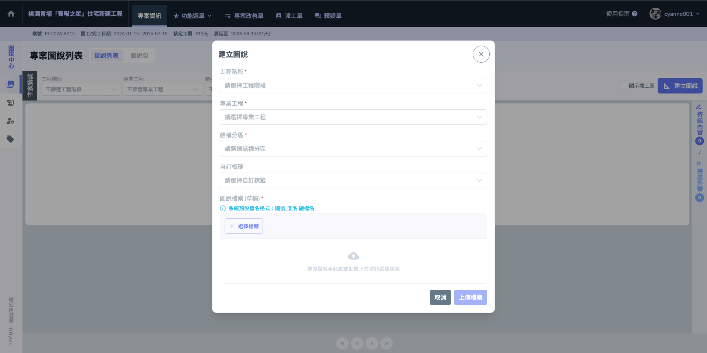

# 篩選標籤設定

圖說標籤不只是為了事後篩選，更是在上傳圖說與建立草稿時，為每一張圖紙標註精確的「身分證」。透過四個複合標註，系統能自動將成千上萬張圖說進行結構化歸類，讓管理人員不論是在辦公室檢索，還是在現場巡檢，都能透過標籤快速定位目標。



用於標註圖說適用的時間點，對其施工進度管理。

* 標註範例：基礎工程、結構工程、裝修階段、景觀工程。
* 實務效益： 當工程進行到裝修期時，可一鍵過濾掉前期土方或結構的舊圖，避免畫面雜亂。



依據技術領域進行分類，確保各工種權責分明。

* 標註範例：建築 (A)、結構 (S)、電氣 (E)、給排水 (P)、消防 (F)、弱電 (T)。
* 實務效益：如機電工程師進場時，只需勾選「電氣」與「給排水」標籤，即可精確調閱所有相關套圖，不必在數百張建築圖中翻找。



針對工地現場的物理空間進行劃分，對齊施工分區。

* 標註範例： A 棟、B 棟 3 樓、地下三層 (B3)、戶外擋土牆、特定機房區。
* 實務效益： 現場查驗時，可直接篩選當前所在的「樓層」或「區域」，快速比對現場配筋或留孔位置是否正確。



提供高度彈性，用於標註專案特有的管理分類。

* 標註範例： 變更設計案號、特定發包單元、急件處理、業主交辦事項、樣品屋範圍。
* 實務效益： 針對某次大規模的變更設計，可統一標註該案號標籤，方便日後在辦公室彙整受影響的圖說清單，進行批次送審等操作。



***

### 01｜新增標籤資料

在圖說管理中，標籤的大分類是由系統預設好的固定配置，目的是為了維持工程資料的結構化。這四個大項——工程階段、專業工程、結構分區、自定義標籤——無法被刪除或更動名稱。

然而，這四個大項內部的具體分類清單與對應描述，則可由具備「專案管理權限」的人員依據工地現場實際需求進行編輯與發布。

!!! info
    請特別注意，圖說中心所使用的這四類篩選標籤（工程階段、專業工程、結構分區、自定義標籤），其架構與細項設定，僅能由具備「專案管理權限」之人員進行配置（****並非由圖說內的管理員操作****）。
    
    

如圖一，進入頁面後，請先於左上角點選頁籤切換至欲設定的標籤項（如下圖為工程階段），進入對應頁面後，即可點選右上方之 圖示，開啟視窗並新增 分類與描述。

如圖二所示，在開啟標籤設定視窗後，若預設欄位不足，請點選左下方的 ，系統即會增加空白欄位。您可直接在欄位中自行輸入所需的分類名稱與對應描述，以建立符合該案場需求的標籤細項。

完成畫面如下：

其他相關範例如下：

  

***

### 02｜標籤在哪裡使用？

當具備專案管理權限的人員設置好分類後，現場人員即可在「建立圖說」或「上傳草稿」時直接勾選使用。系統的標籤邏輯採取彈性設計，以符合工地複雜的套圖需求：



這三個大項屬於圖說的「基礎屬性」，為了確保分類的嚴謹性，每一張圖說在這三個標籤中通常僅能各標註一個最主要的類別。



與其他大項不同，「自定義標籤」支援多選（複選）功能。

* 實務情境： 一張圖可能同時涉及「0325 設計變更案」以及「業主特別交辦事項」。
* 效益： 您可以同時勾選這兩個自定義標籤。未來管理人員不論是搜尋該變更案，或是彙整業主交辦清單，這張圖說都會同時出現在兩個篩選結果中，確保資訊不遺漏。



