# APP 版

---
description: App Interface
---

# APP 版

### 01｜裝置設定

系統針對圖片的拍攝及儲存有精細的設定，包含**拍照存入相簿**、**圖像壓縮比例**、**浮水印相機設定**。

開啟 App 主畫面後，請點選左上方的  圖示進入系統設定頁面，並選取 。

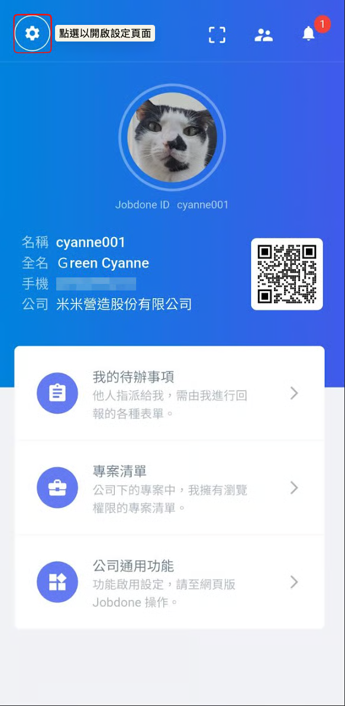 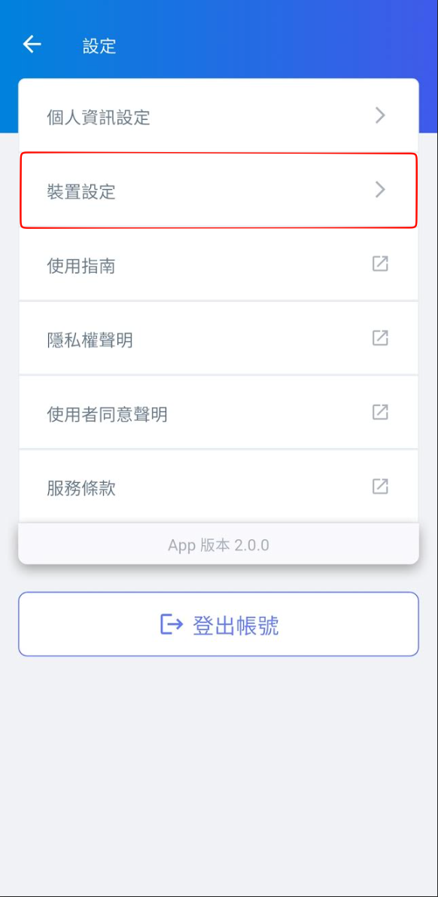 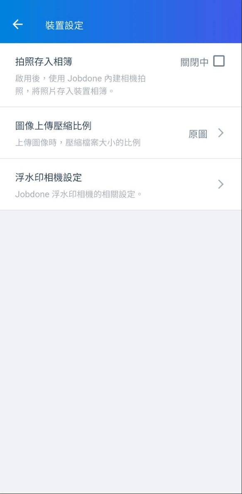

#### 01 - 1｜拍照存入相簿

在使用 App 影音日誌功能進行現場勘察時，針對拍攝照片的儲存邏輯，系統提供了高度的隱私與空間管理彈性。您可以根據個人的使用習慣或手機容量狀況，透過系統設定自行決定照片的流向。

當您使用 Jobdone 內建相機功能或『專案浮水印相機』（標註時間、座標、專案資訊）進行拍攝時，可於設定中切換以下模式：



開啟此功能後，透過系統拍攝的每一張工程照片，除了會上傳至 Jobdone 雲端暫存區外，也會自動同步儲存一份副本至您的手機原生相簿中。

> **實務效益：**&#x65B9;便您在離線狀態下，或是透過通訊軟體（如 Line）快速分享照片給協力廠商，且即便日後刪除雲端紀錄，手機仍保有原始檔備份。



若關閉此功能，拍攝的照片將僅存在於 Jobdone App 內部與雲端伺服器，不會佔用手機相簿的空間。

> **實務效益：**&#x71DF;建工程照片動輒數千張，此模式能有效避免個人相簿被大量施工照片（如鋼筋、泥作、垃圾清理等）佔據，保持個人手機空間的純淨，並減緩手機容量爆滿的可能性。



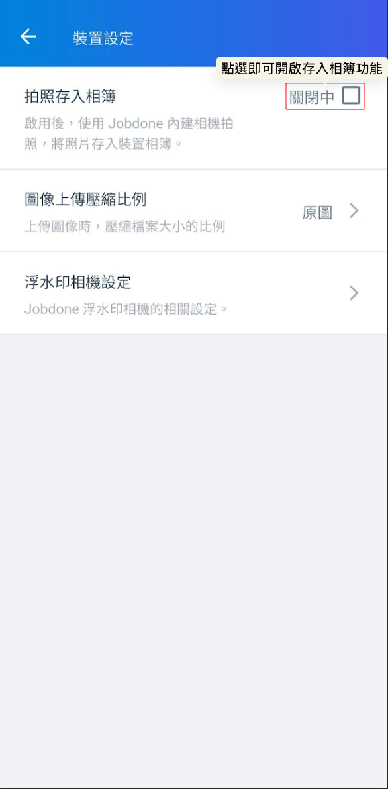 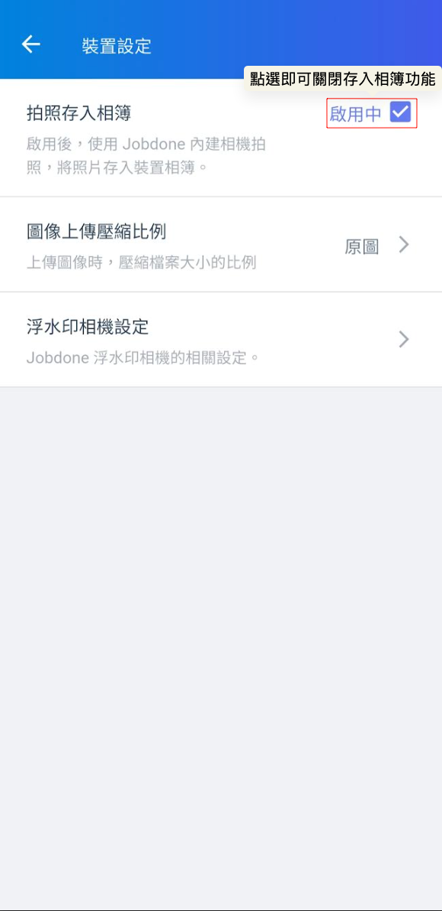

***

在裝置設定中，您可以針對現場拍攝與資料傳輸的效率進行深度自定義。除了決定照片是否同步存入手機相簿外，還包含以下核心設定：

#### 01 - 2｜圖像上傳壓縮比例

您可以根據案場的網路環境（如地下室收訊較弱）調整上傳品質。選擇較高的壓縮比可大幅提升上傳速度並節省流量；若需保留極高精細度（如裂縫觀測），則可調低壓縮比以維持影像原真。

值得一提的是，即使在設定中選擇了『效能』模式（最大化壓縮），Jobdone 的圖像處理引擎仍能保持極佳的視覺辨識度。

有關壓縮比詳細說明，請參閱 ➙ [App拍照壓縮比](../../../faq/app-pai-zhao-ya-suo-bi)

  

***

#### 01 - 3｜浮水印相機設定

針對營建現場高頻率的拍照需求，您可以預先配置相機行為：



開啟後，可在拍攝時針對照片進行裁切處理，方便聚焦於特定的施工細節。



開啟後，無需反覆進出快門，適合針對連續工序或大面積區域快速紀錄。



在裝置設定中，您可以針對浮水印的呈現進行微調，確保數位標籤既能清晰辨識，又不干擾照片本身的細節：

* 背景透明度： 調整浮水印文字後方底色的透明程度。
* 浮水印寬度： 設定浮水印在畫面中所佔據的寬度比例。
* 文字大小： 依照您的檢視需求縮放標記文字。

> **實務應用**
>
> 1. 若拍攝背景較為雜亂，可調低透明度（增加底色）以突顯文字內容；若需確保標籤下方的影像不被遮蔽，則可提高透明度。
> 2. 針對需要檢視微小裂縫或精密構件的照片，可縮小文字避免遮擋；若為大範圍區域的進度照片，則可加大文字以便在縮圖模式下直接閱讀。



您可以自定義浮水印呈現的資訊（如：專案名稱、拍攝時間、地點、GPS、拍攝者等），確保每張照片都具備標準化的數位標籤。



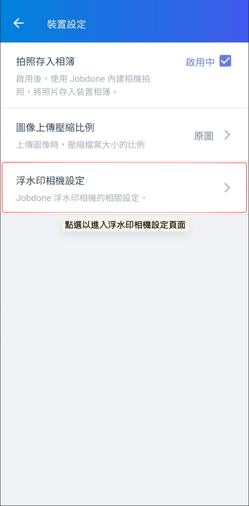 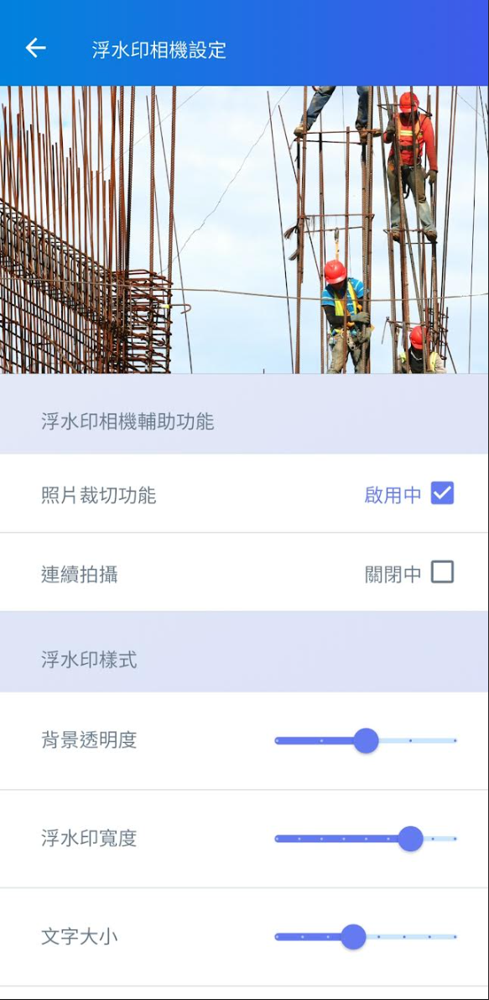 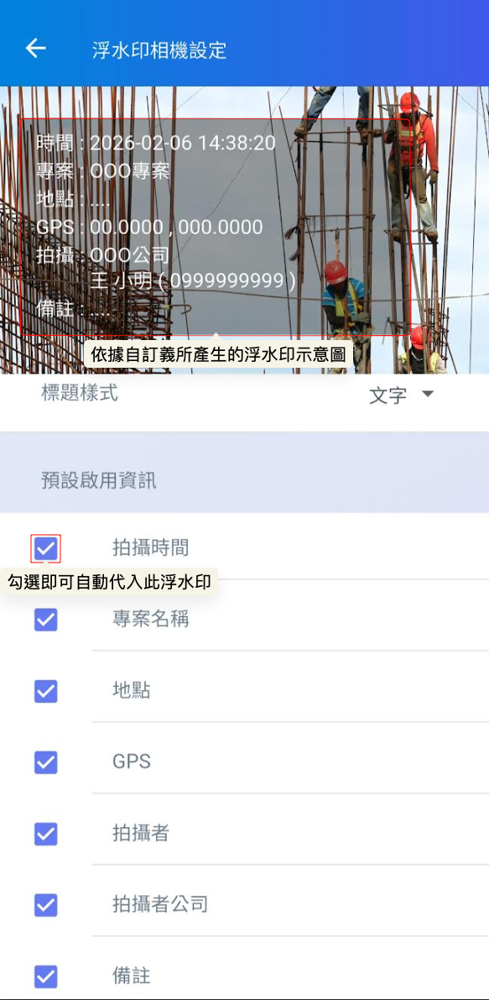

***

### 02｜新增紀錄

如圖一，進入專案功能選單後，請點選『影音日誌』。進入功能頁面後，請執行以下步驟來建立現場紀錄：

1. 發起紀錄(圖二)： 點選畫面下方的  按鈕。
2. 選取日期： 系統會跳出日期選取視窗（預設為當日）。您可以依照實際施工發生時間進行調整。
3. 開始紀錄(圖三)： 確定日期選取無誤後，點選 ，即可進入資料填寫與影音上傳介面。

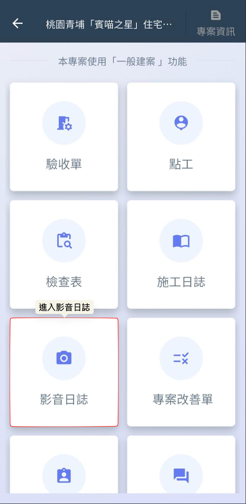 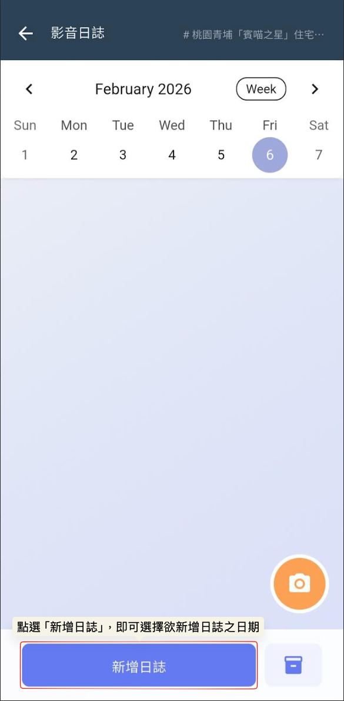 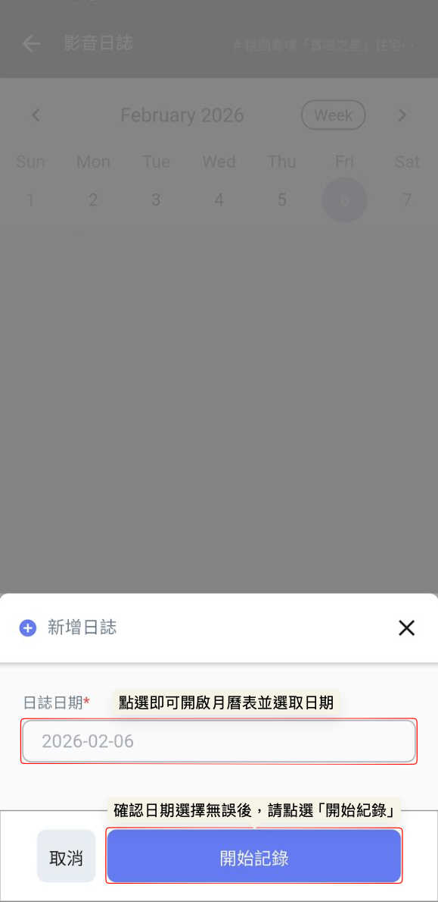

進入日誌紀錄頁面後，針對影音資料的匯入與管理，請依照以下步驟操作：

1. 進入編輯模式： 於『影音內容』欄位右側，點選  按鈕，系統即會切換至對應的媒體編輯畫面。
2. 上傳檔案： 在編輯介面中，您可以開始上傳現場拍攝的圖片與影片。此時可選擇**直接開啟相機拍攝**，或從**手機相簿**及**系統暫存媒體庫**中選取已有的檔案。



若您先前已透過 App 離線同步，或是在網頁端預先於『暫存媒體庫』上傳了大量照片，可點選此選項。系統會開啟媒體庫視窗，讓您直接勾選已在雲端緩衝區的圖檔，快速轉化為正式紀錄。此模式適合處理批次圖檔或已完成標註的編輯檔。

!!! warning
    #### **⚠️ 重要提示**
    
    由於暫存媒體庫目前專為圖檔管理設計，若欲上傳影片紀錄，則僅能直接上傳或從手機相簿選取。




若您手邊已有整理好的檔案（存於手機相簿中），可選擇此模式直接將檔案匯入日誌。這能跳過暫存媒體庫的中轉步驟，適合單筆、即時性的紀錄。



3. 確認與儲存： 確認所有欲歸檔的檔案皆已上傳完畢且預覽無誤後，請務必點選 。

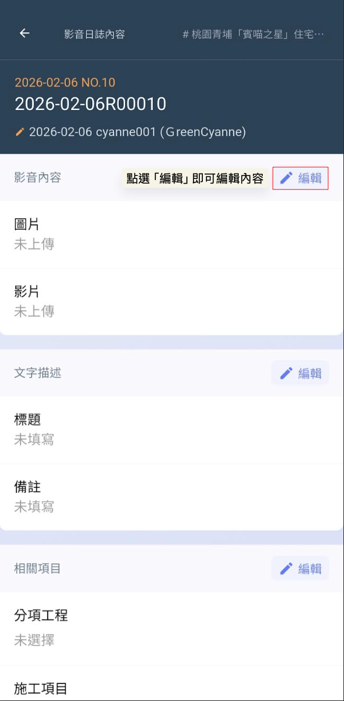 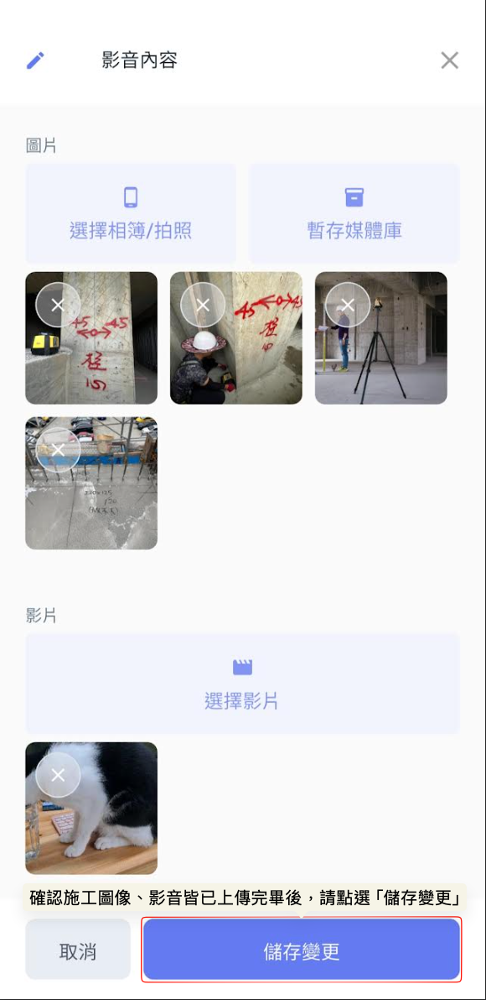 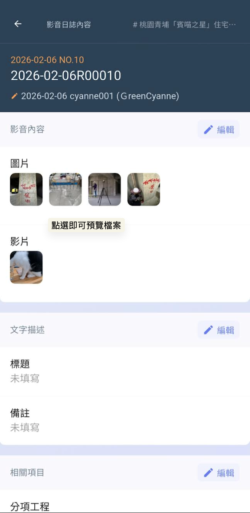

完成影音檔案的上傳後，接下來是完善日誌的資訊內容。同樣於『文字描述』欄位右側點選 ，即可開啟詳細的文字編輯頁面：

1. 填寫標題： 請為該筆紀錄擬定一個具備辨識度的標題。

> **實務建議：** 建議以「工項名稱 + 狀態」命名，例如：「1F柱筋綁紮驗收」、「基地西側擋土牆漏水巡檢」。標題越明確，日後在紀錄列表中檢索的速度就越快。

2. 填寫備註： 在此欄位補充影像無法完全表達的細節。例如：施工廠商的人數、機具進場型號、具體的施工參數（如坍度、試體編號），或是現場遭遇的特殊情況說明。
3. 點選儲存變更： 內容填寫完畢後，點選 。

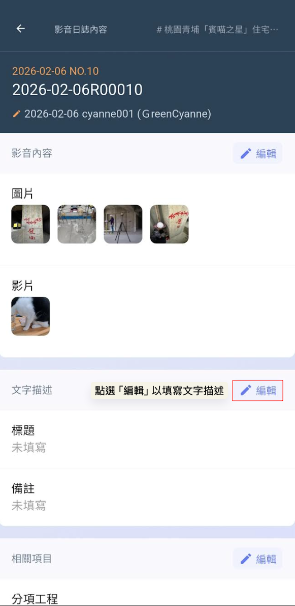 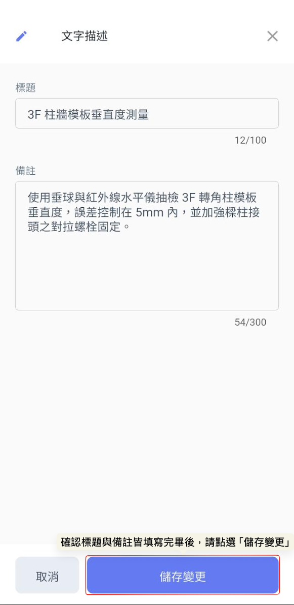 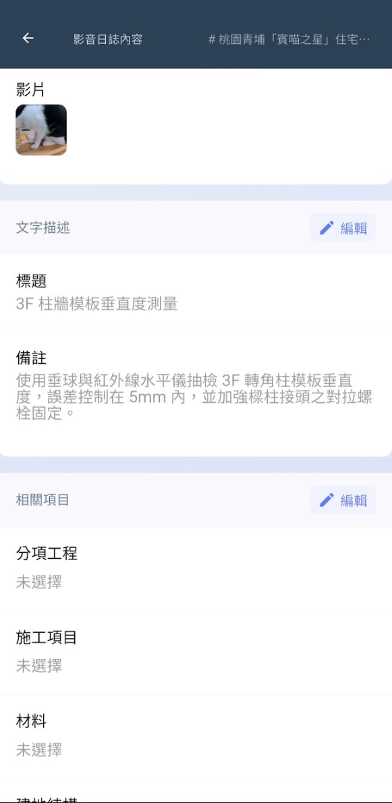

以下欄位均連動專案後台之預設資料，確保全案場資訊一致性：



歸類於合約中的工程大項（如：土建、機電、裝修）。方便管理層從大範圍視角檢視各專業領域的施工歷程。

有關分項工程之編列說明，請參閱 ➙ [專案分項工程](../../project_level/project_data/zhuan-an-fen-xiang-gong-cheng)



對應具體的作業內容（如：連續壁澆置、防水打底、鋼筋組立）。此標籤有助於分析各項工序的執行週期。

有關施工項目之編列說明，請參閱 ➙ [施工項目](../../project_level/project_data/construction_item)



標記該紀錄所使用的關鍵物料（如：4000psi 混凝土、D19 鋼筋、防護漆料）。建立影像與材料履歷的連結，確保施作與報審規格吻合。

有關材料管理之相關說明，請參閱 ➙ [材料管理](../../project_level/project_data/material_management)



將影像精確定位於建物部位（如：B1F、頂板、A棟梯廳）。這在未來發生爭議或修繕需求時，能秒速過濾出該位置的所有歷史影像。

有關建地結構之編列說明，請參閱 ➙ [建地結構](#jian-di-jie-gou-location)



標註負責的包商名稱，這不僅是進度追蹤，更是責任劃分與履約評價的重要數據。

有關協力廠商之編列說明，請參閱 ➙ [協力廠商 / 外部聯絡人](../../project_level/project_stakeholders/subcontractor)



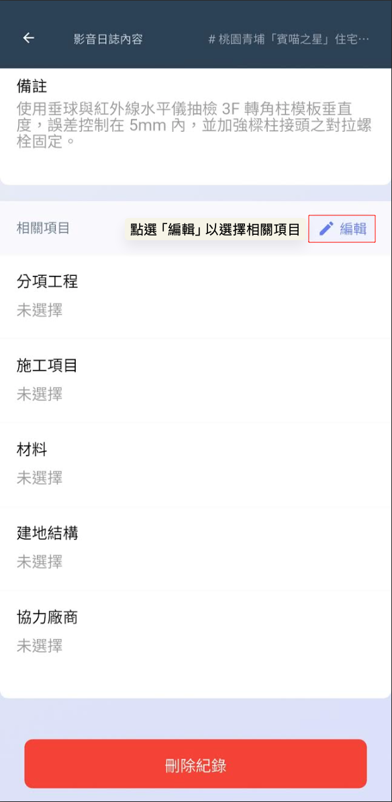 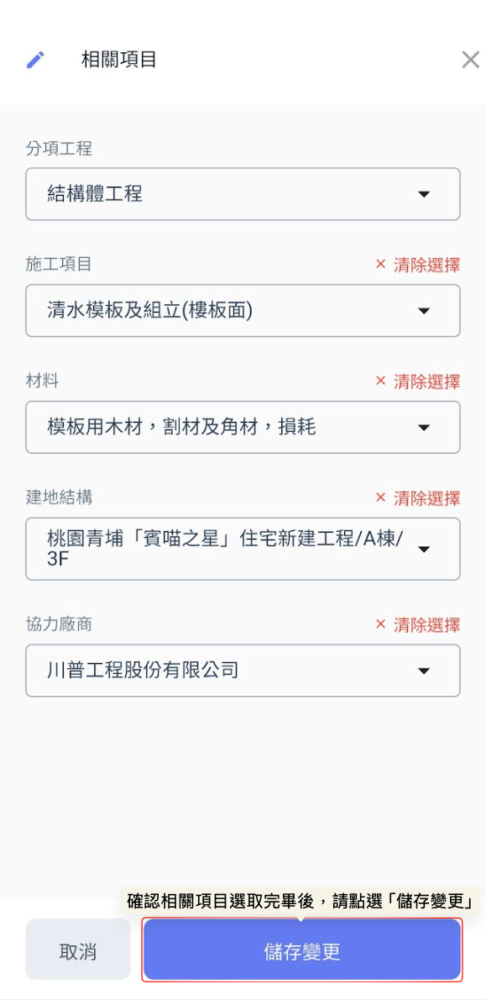 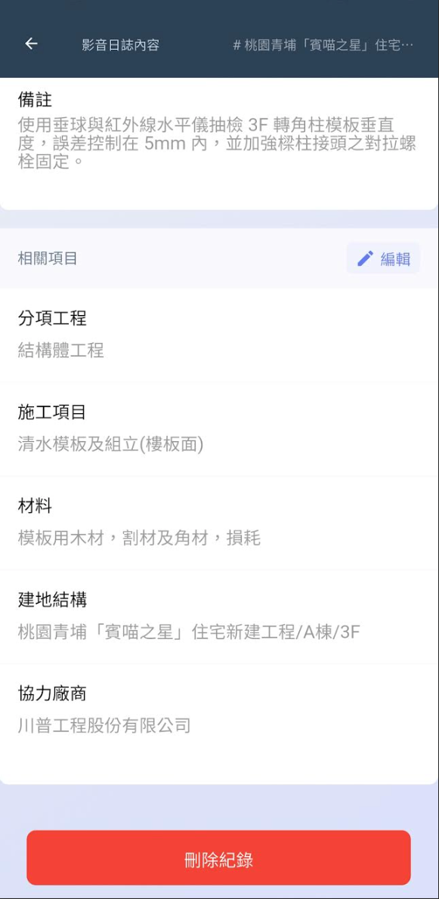

***

### 03｜暫存媒體庫

在營建現場，穩定的網路環境往往是種奢求。為了因應地下室、偏遠山區或強電磁干擾等離線情境，與網頁端直接手動上傳至媒體庫的邏輯不同，App 端的媒體庫是為了『現場搶拍』與『延時同步』而設計的。

**📸 App 離線觸發機制：暫存媒體庫的運作邏輯**

此功能機制的核心在於確保『紀錄不因斷網而中斷』，讓現場工程師能先補捉畫面，帶環境允許時再進行歸檔。

!!! info
    #### 💡 實務現場管理效益
    
    * 現場人員不再需要為了等照片轉圈上傳而停在原地。在斷網的區域中，您可以連續拍攝數十張鋼筋配置圖，所有照片都會乖乖待在 App 的暫存隊列中，等您回到收訊良好的地方再一鍵上傳。
    * 傳統手機相機拍照容易與系統紀錄脫節，導致是候補日誌時『對不上照片』。透過 Jobdone 離線相機觸發並匯入媒體庫，於後續填寫影音日誌時能輕鬆選取並引用。當您處於收訊不佳的現場時，可直接開啟 App 內提供的離線浮水印相機進行拍照。



此時拍攝的照片會帶有精確的浮水印資訊（可自行調整，如經緯度、時間），並暫時儲存在 App 的離線資料暫存區。



當您回到辦公室或網路微服後，您需要進入 App 內的離線紀錄區執行『手動上傳』。

這些離線拍攝的照片再上傳成功後，會自動流向雲端的『暫存媒體庫』。

* **後續引用：**&#x6B64;時，無論您是想在 App 端補做日誌，或是回到辦公室透過網頁端進行精細編輯，都能在暫存媒體庫中看到這些『離線搶拍』的成果。



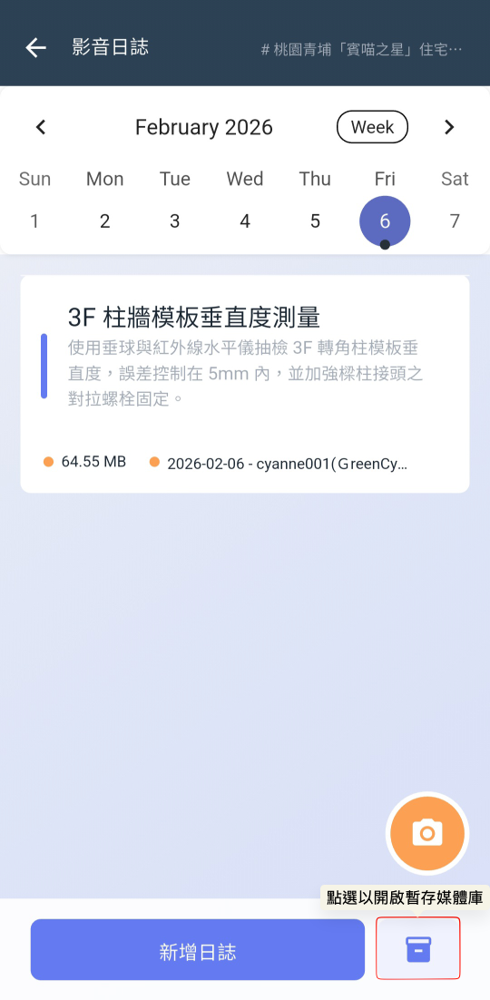 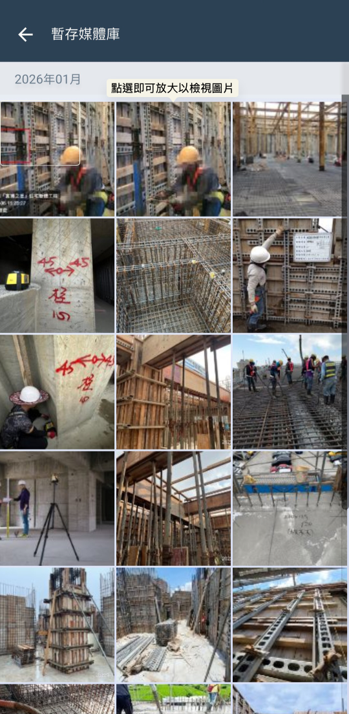 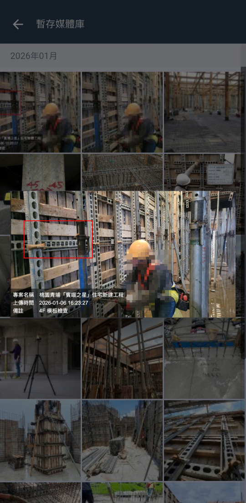

***

### 04｜離線相機

承接前段關於暫存媒體庫的機制，接下來詳細介紹支撐這套邏輯的核心工具：『離線相機』。

在營建工程的實務環境中，網路訊號往往極不穩定，從深開挖的地下層道高聳的電梯井，訊號斷斷續續的常態。離線相機的設計初衷，就是為了打破『有網路才能做紀錄』的限制，確保現場工程師的快門節奏不被收訊環境干擾。

!!! warning
    #### ⚠️ 重要限制說明：影音日誌的離線機制
    
    在使用影音日誌離線功能時，請務必區分其與其他功能（如檢查表的離線紀錄）的邏輯差異，影音日誌的核心在於『影像搶拍』，而非全資料的自動帶入：
    
    * **僅支援『圖片』離線存儲：**&#x5F71;音日誌的離線功能主要服務於****離線拍照****。當您在收訊不良處使用離線相機時，一桶鎖定的是現場的影像與浮水印資訊。
    * **標題與描述需『另行建立』：**&#x4E0D;同於檢查表可同時填寫離線紀錄（說明、缺失等），影音日誌的紀錄標題、文字描述、相關分項工程、建地結構......等，無法在離線狀態下填寫。
    * **操作邏輯建議：**&#x73FE;場人員的標準動作應為：在離線環境下優先完成拍照，待網路恢復、照片上傳至暫存媒體庫後，再回到紀錄頁面點選 ，手動補齊日誌的文字標題及內容，再引用對應的圖片。

**📸 專業級浮水印支撐**

離線相機全面採用 Jobdone 浮水印工程相機。這意味著即便在斷網狀態下，每一張拍下的照片都會即時壓上：



鎖定快門落下的瞬間，確保紀錄的真實性。



透過 GPS 離線紀錄定位資訊。



如專案名稱、施工地點等。讓照片在進入媒體庫前就已具備專業身份。



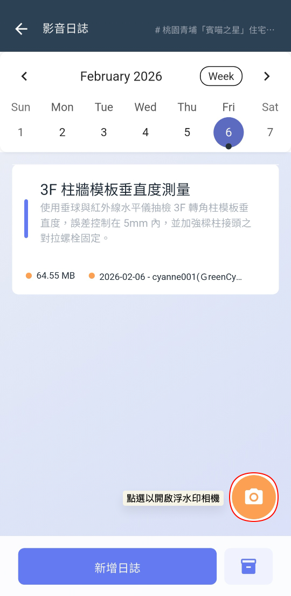 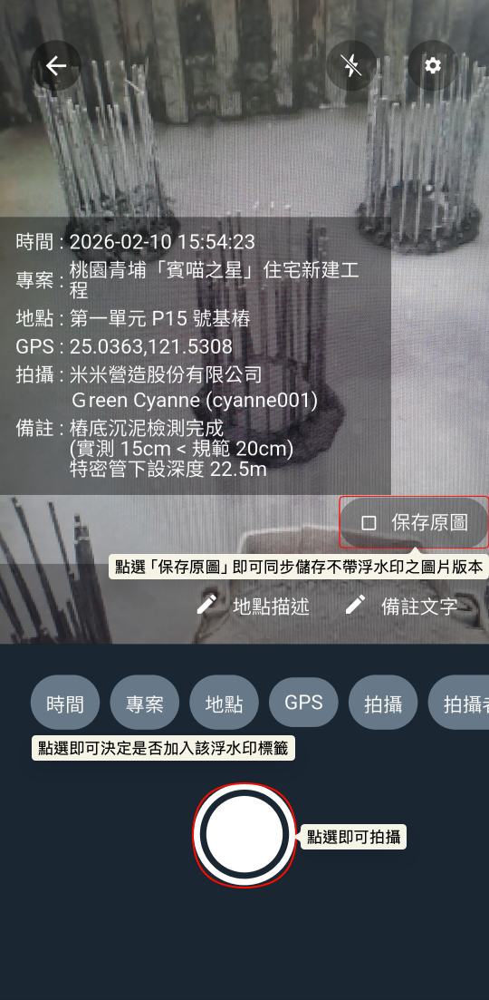 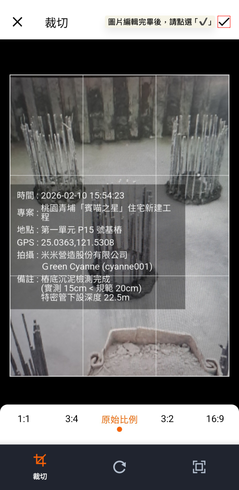

完成離線照片的編輯與標記後，系統會將這些紀錄安全地存放於『離線暫存區』。為了確保數據不遺漏，App 介面提供了直觀的提示機制，引導您完成最後的上傳步驟：

**📤 離線檔案同步流程**

1. 紅點提示機制(圖四)：請留意 App 影音日誌畫面右下方的  圖示。若該圖示出現，即代表目前暫存區內尚有未上傳的離線圖檔。這是一個重要的防呆提醒，確保您在離開案場前不會忘記同步資料。
2. 查看未上傳清單(圖五)：點選  圖示，系統將列出所有待命中的離線檔案。在此介面中，您可以預覽即將上傳的照片，確認無誤。
3. 啟動檔案上傳：確認網路環境穩定後（建議連接 Wi-Fi 或處於 4G/5G 收訊良好處），點選最下方的  按鈕，系統將開始批次將檔案匯流至雲端暫存媒體庫。

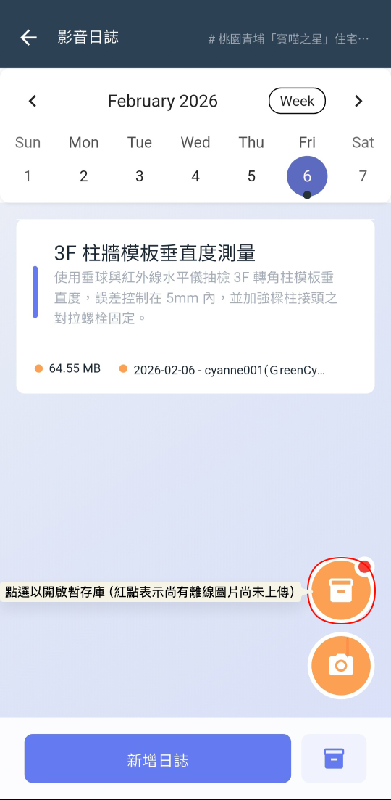 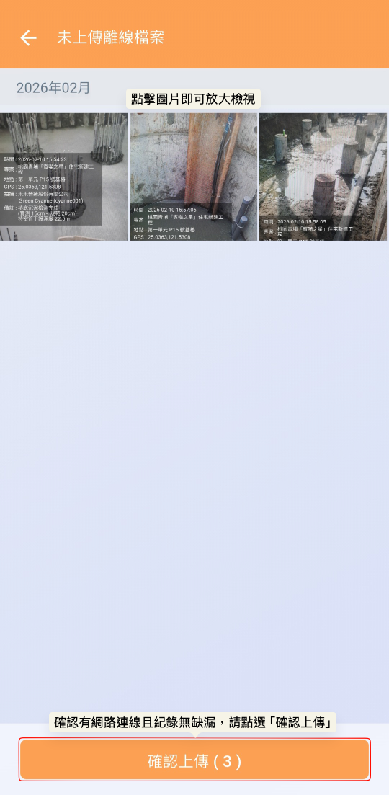 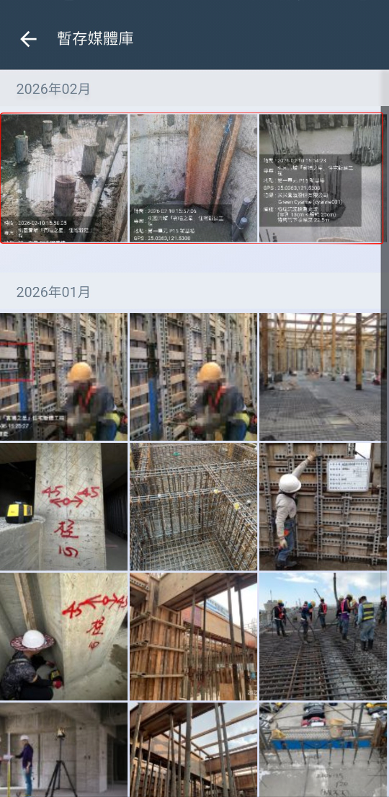

