# 紀錄列表

## 01｜紀錄列表

進入「影音日誌」功能後，您可點選頁籤切換至<kbd>**紀錄列表**</kbd>分頁，此處彙整了專案內所有的影音檔案與施工紀錄。在列表頁中，您可以快速閱覽各項紀錄的分類與進度，點擊任一項目即可進入編輯模式，針對影像標籤或內容細節進行修正；若需建立新的現場紀錄，點選<kbd><mark style="color:purple;">**+新增紀錄**<mark style="color:purple;"></kbd>即可開始上傳影音並填寫對應的結構化資訊。

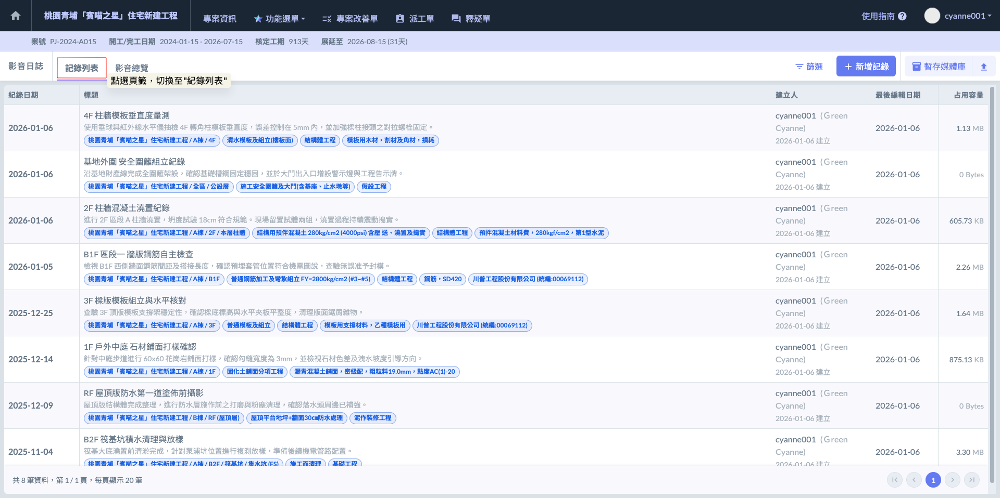

### 01 - 1｜暫存媒體庫

營建案場常面臨地下室或電梯井網路收訊不佳的情境，導致紀錄無法即時送出。本系統提供「暫存媒體庫」功能，作為手機 App 與網頁 Web 端的數據中繼站，確保每一份珍貴的影像都不因網路波動而遺失。



當施工現場網路收訊不良時，您可使用「離線上傳」功能，將拍攝的圖片與影片先行儲存於 App 內的離線區。待回到工務所或網路流暢環境後，系統將提示您進行同步，屆時可將所有檔案一併上傳至「暫存媒體庫」。



暫存媒體庫支援跨平台同步。除了 App 端的離線回傳，行政人員或管理層亦可直接在網頁端將大量拍攝的檔案預先上傳至媒體庫中。

1. 您可以先將大量影像上傳至暫存區，待有空暇時，再從媒體庫選取照片來建立正式的影音日誌，並補齊建地結構、協力廠商等標籤。
2. 檔案進入暫存媒體庫即代表已受雲端保護，不佔用手機儲存空間，且網頁與 App 資訊即時連動，方便辦公室與現場協同作業。



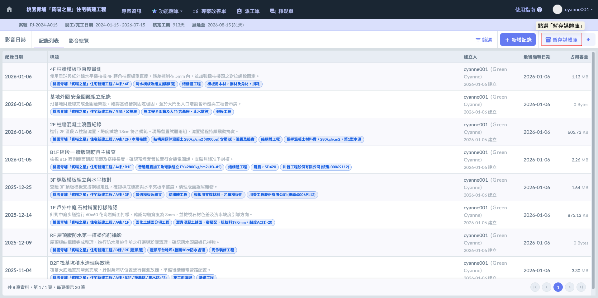

#### 01 - 1 - 1｜上傳檔案

如圖二，開啟『暫存媒體庫』視窗後，點選右上角的  圖示，即可開啟檔案上傳視窗，開始挑選您欲上傳的圖檔。

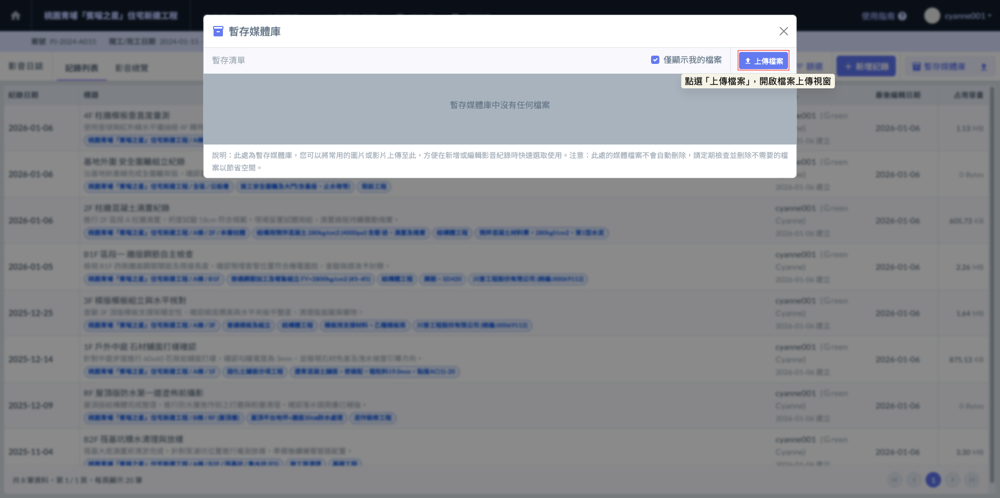

如圖三，開啟檔案上傳視窗後，點選  圖示，，即可批次選取您電腦中的圖檔進行上傳。

圖檔選取完成並確認無誤後，請點選右下方之<kbd><mark style="color:purple;">**確認上傳**<mark style="color:purple;"></kbd>，系統即會正式將檔案傳輸至暫存媒體庫中。

!!! info
    上傳期間請保持網路連線穩定，待傳輸進度完成後，該批影像將自動同步至您的帳號下。此時，無論是在網頁端還是手機 App 端，您皆可即時在暫存區看見這些檔案。

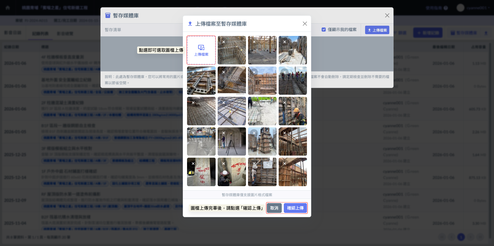

完成畫面如下，為了方便使用者在大量的團隊檔案中精確管理自己的紀錄，系統設有視圖篩選功能：

 (預設勾選)：&#x20;

當您進入暫存媒體庫時，系統會自動過濾，清單中僅會出現由您個人上傳的內容。這能讓您在建立日誌時，不受其他成員上傳檔案的干擾，專注於處理自己的紀錄。

：

若您需要查看其他專案成員回傳的影像（例如：協助休假同事建立日誌，或由行政人員統一編修），只需取消勾選此項，即可閱覽該專案下所有成員上傳至暫存區的內容。

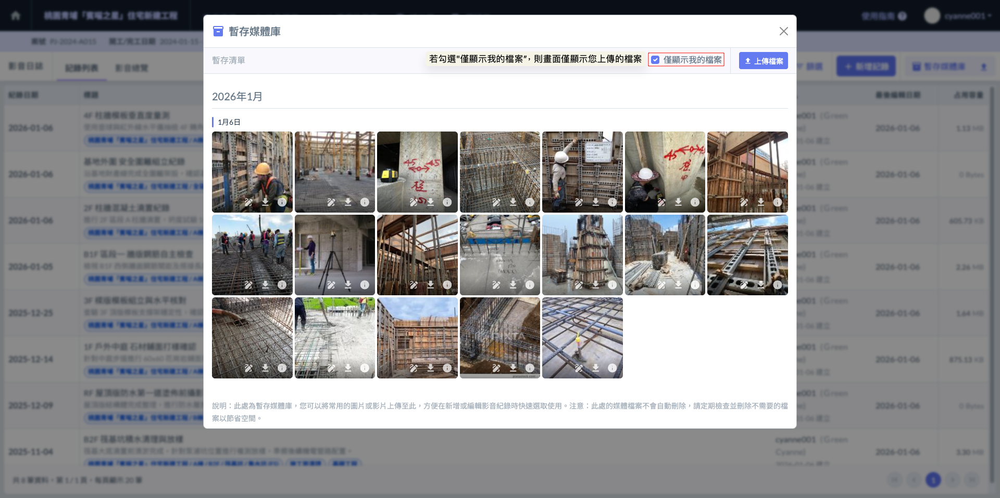

***

#### 01 - 1 - 2｜編輯圖片

系統提供圖片編輯功能，於暫存清單選取欲編輯之圖片後，點選該圖片的  圖示，即可開啟圖片編輯器。

您可以針對該張圖進行**畫記**（如：紅圈標註瑕疵、使用箭頭指引部位）、**插入浮水印**（如：自動帶入專案名稱、上傳時間等資訊）並可添加文字說明等。這在實務上能協助管理人員快速識別施工重點，並確保每張照片都具備不可抹滅的現場資訊。

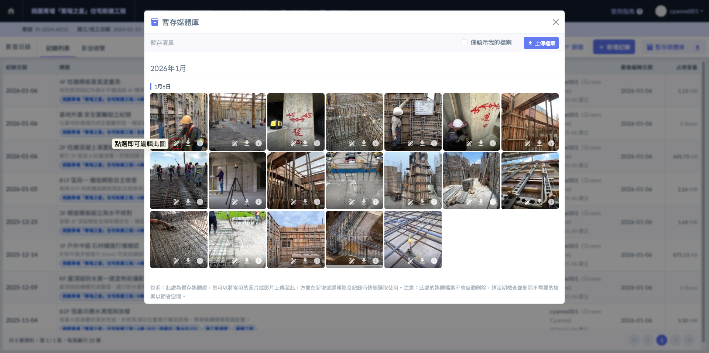

如圖六，圖片編輯器提供直觀的標註工具，介面與功能說明如下：

<table><thead><tr><th width="165.567138671875">功能</th><th>說明</th></tr></thead><tbody><tr><td>
畫記工具

(畫筆、方框、箭頭)
</td><td>
您可依現場狀況選擇合適工具。如：
<ol><li>使用  自由標註裂縫走向。</li><li>用   框選施工瑕疵。</li><li>或利用  精確指引特定的構件部位（如樑柱接頭、管線套管）。</li></ol></td></tr><tr><td>畫記調整</td><td>選定工具後，可針對<mark style="color:red;"><strong>畫筆顏色</strong></mark>（建議選用顯眼的紅色或黃色）及<mark style="color:red;"><strong>筆畫寬度</strong></mark>進行調整，確保標註內容在複雜的工地背景下依然清晰可辨。</td></tr><tr><td>移動模式</td><td>當您將圖片放大以檢視施工細節（如鋼筋細部、材料標籤或裂縫紋路）時，若圖片範圍超出視窗，點選  圖示後，即可透過滑鼠直接拖曳圖片，靈活查看各個局部係區域。</td></tr><tr><td>浮水印功能</td><td>點選  功能，系統會自動在圖面上疊加關鍵資訊（專案名稱與上傳時間），並可依據需求自行增添浮水印備註。這在實務上能有效防止圖檔混淆，並為每一張現場照片提供具備時效性與空間性的事實依據。</td></tr></tbody></table>

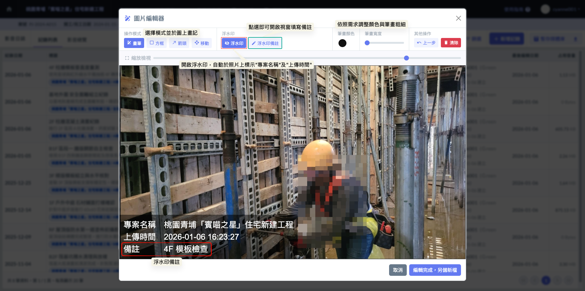

如圖七，圖片編輯完成後，即可點選<kbd><mark style="color:purple;">**編輯完成，另存新檔**<mark style="color:purple;"></kbd>，系統將會為標註過的內容生成一份新的圖檔，並自動儲存於暫存清單中。

!!! info
    採用『另存新檔』的機制，能確保您的原始照片（Original Evidence）不被覆蓋。在營建管理實務中，這能同時保留**未受干擾的現場原貌**與**帶有專業註解的圖檔**，確保查核時具備完整的資訊維度。

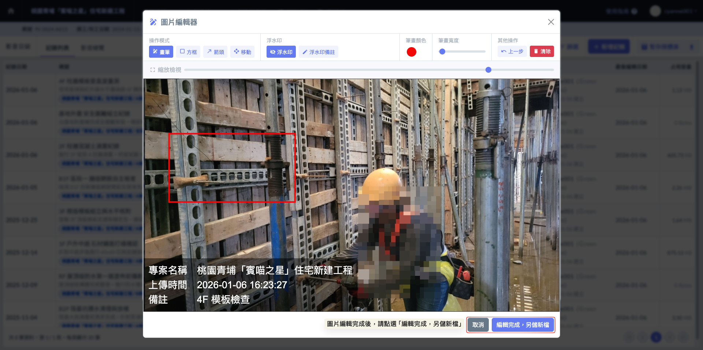

完成畫面如下：

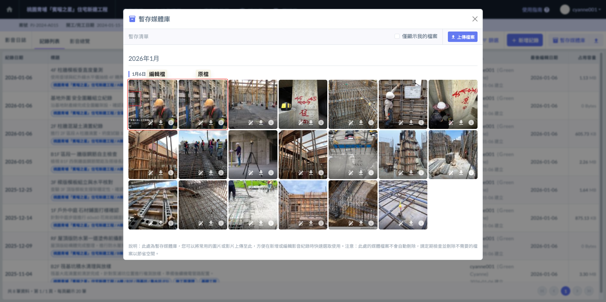

***

#### 01 - 1 - 3｜下載圖片

如圖九，系統提供圖片下載功能，於暫存清單選取欲下載之圖片後，點選該圖片的  圖示，即可將此圖檔下載至電腦中。

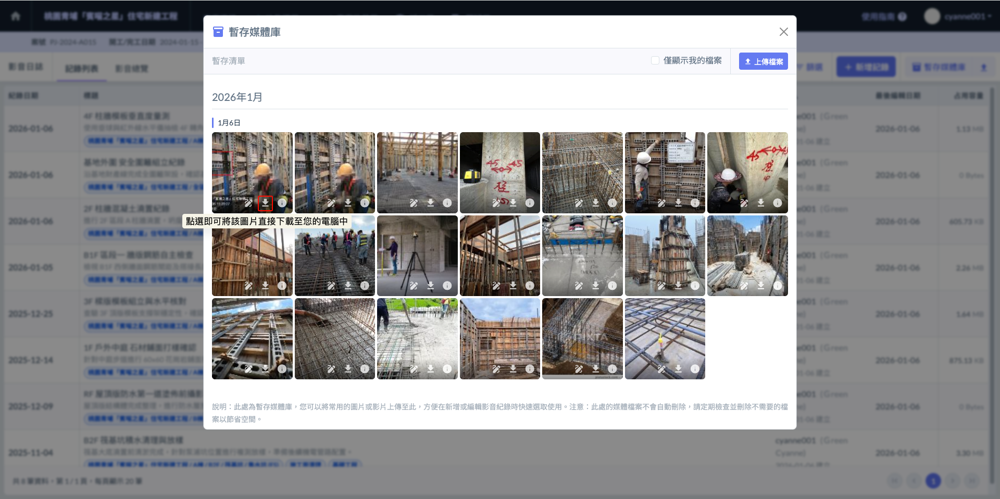

***

#### 01 - 1 - 4｜檔案使用資訊

當您在『暫存媒體庫』中看到  圖示時，代表該張圖片已經被選取並關連至某一份正式的影音日誌中。

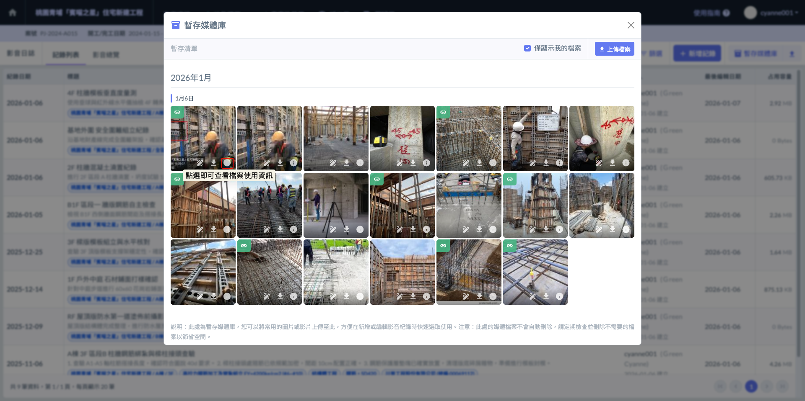

點選 ⓘ 圖示後，即可開啟檔案使用資訊視窗。該視窗會詳列此圖檔的數位足跡與關連路徑，包含：



原始上傳之檔案名稱。



檔案進入雲端暫存區的精確時刻。



標註該圖檔是由哪位成員所拍攝並上傳。



若該圖檔已被引用，此處會顯示對應的影音日誌連結。您可以點擊連結直接跳轉至該筆日誌，確認這張照片在報告中是如何被使用的。



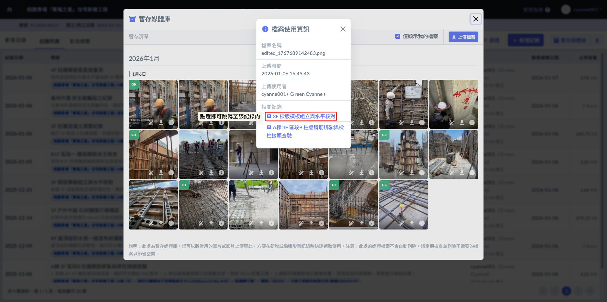

相關影音紀錄畫面如下：

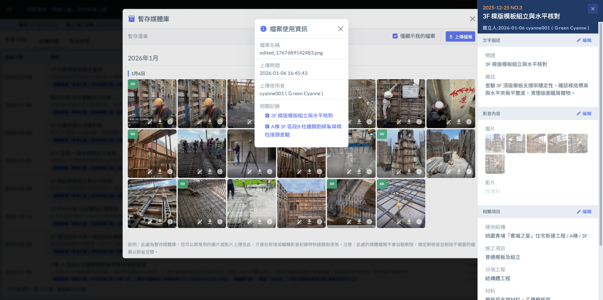

***

### 01 - 2｜新增紀錄

如圖十三，進入紀錄列表頁面後，點選右上角之<kbd><mark style="color:purple;">**+新增紀錄**<mark style="color:purple;"></kbd>即可進入新增畫面。

在新增紀錄時，您需填寫日期、標題、備註並上傳相關的影音檔案。為了確保日誌具備後續檢索與統計的價值，請務必選用該筆紀錄對應之建地結構、施工項目、分項工程、相關材料及相關協力廠商等結構化標籤，完成後點選儲存即可建立完整的施工履歷。

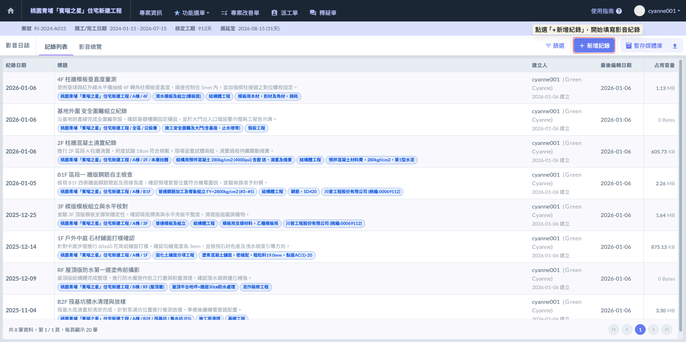

進入「新增紀錄」畫面後，系統將引導您填寫結構化的施工紀錄。這些資訊並非單純的文字，而是未來進行進度核銷、品質追蹤及責任釐清的關鍵依據。

**（一）基礎資訊填寫**



系統預設為當日，但可依實際施工時間調整。



建議採「位置 + 工種 + 動作」命名（例如：A棟 1F 區段 鋼筋綁紮查驗）。清晰的標題能讓團隊成員在紀錄列表中不需點開檔案，即可快速掌握現場概況。



用於詳細記錄現場狀況。建議包含：施工精度數據（如間距、水平）、氣候影響、或需後續追蹤的異常點。這是在影像之外，最重要的補充證言。



**（二）結構化標籤（依據專案設定自動帶入）**

以下欄位均連動專案後台之預設資料，確保全案場資訊的一致性：



將影像精確定位於建物部位（如：B1F、頂板、A棟梯廳）。這在未來發生爭議或修繕需求時，能秒速過濾出該位置的所有歷史影像。

有關建地結構之編列說明，請參閱 ➙ [construction\_structure](../../../project_level/project_data/construction_structure "mention")



對應具體的作業內容（如：連續壁澆置、防水打底、鋼筋組立）。此標籤有助於分析各項工序的執行週期。

有關施工項目之編列說明，請參閱 ➙ [construction\_item](../../../project_level/project_data/construction_item "mention")



歸類於合約中的工程大項（如：土建、機電、裝修）。方便管理層從大範圍視角檢視各專業領域的施工歷程。

有關分項工程之編列說明，請參閱 ➙ [zhuan-an-fen-xiang-gong-cheng](../../../project_level/project_data/zhuan-an-fen-xiang-gong-cheng "mention")



紀錄該工項所使用的關鍵物料（如：4000psi 混凝土、D19 鋼筋、防護漆料）。建立影像與材料履歷的連結，確保施作與報審規格吻合。

有關材料管理之相關說明，請參閱 ➙ [material\_management](../../../project_level/project_data/material_management "mention")



標註負責的包商名稱。這不僅是進度追蹤，更是責任劃分與履約評價的重要數據。

有關協力廠商之編列說明，請參閱 ➙ [subcontractor](../../../project_level/project_stakeholders/subcontractor "mention")



**（三）**&#x65B0;增日誌時，系統提供兩種檔案載入模式，您可以根據現場環境與作業習慣選擇最合適的方式：



若您先前已透過 App 離線同步，或是在網頁端預先上傳了大量照片，可點選此選項。系統會開啟媒體庫視窗，讓您直接勾選已在雲端緩衝區的圖檔，快速轉化為正式紀錄。此模式適合處理批次圖檔或已完成標註的編輯檔。

!!! warning
    #### ⚠️ 重要提示
    
    由於暫存媒體庫目前專為圖檔管理設計，若欲上傳影片紀錄，則務必使用「直接上傳檔案」模式。




若您手邊已有整理好的檔案（存於電腦或手機相簿中），可選擇此模式直接將檔案匯入日誌。這能跳過媒體庫的中轉步驟，適合單筆、即時性的紀錄。



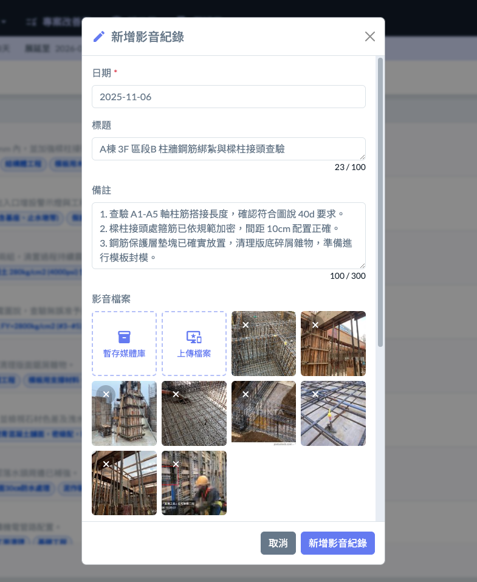 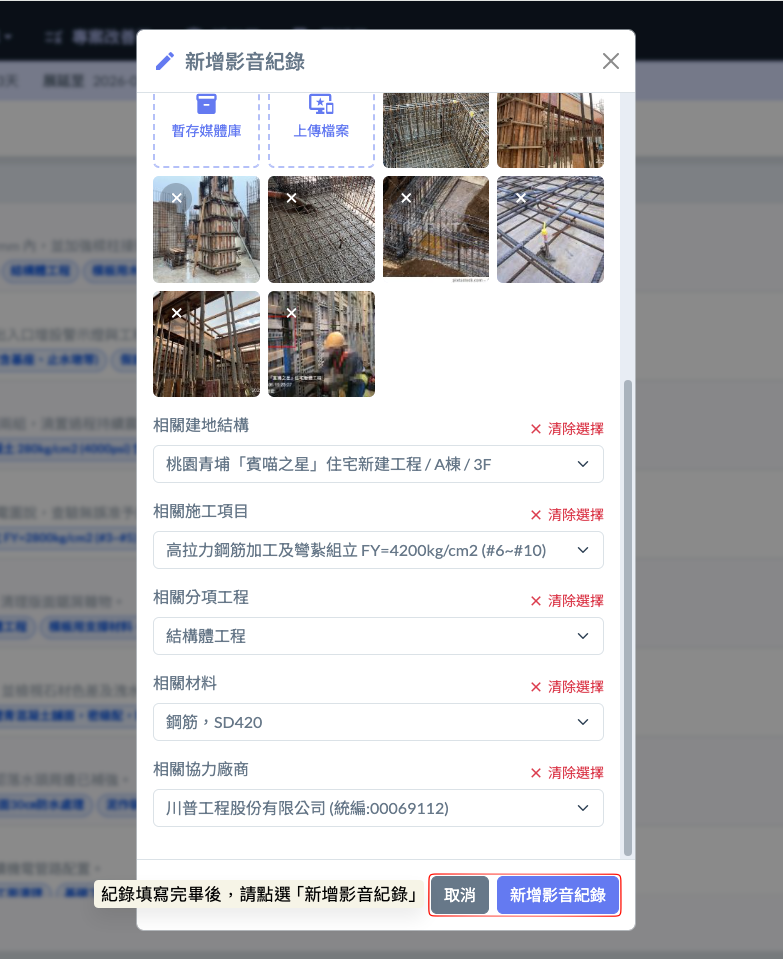

完成填寫並儲存後，系統會自動在列表中呈現該筆日誌的關鍵資訊，讓您無需點開即可掌握基本檔案狀況：



自動記錄該筆日誌的最初新增者。這在多方協作（如監造、營造、包商共同使用）的專案中，對於釐清資訊來源與權責歸屬非常重要。



系統會即時更新該紀錄最後一次被更動的時間。這有助於追蹤紀錄是否被事後增補，確保施工紀錄的時效性。



顯示該筆日誌（包含所有照片與影片）所使用的雲端空間大小。這對於大型專案的檔案管理與備份規劃提供了量化的參考數據。



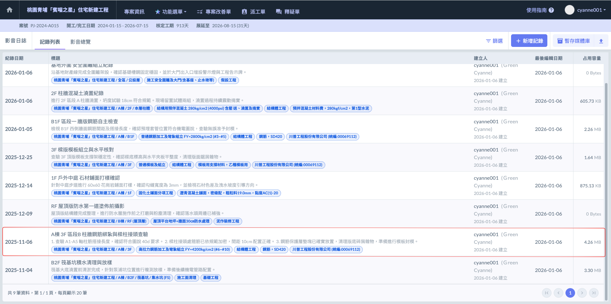

***

### 01 - 3｜篩選紀錄

考量當案場執行時間拉長，累積的影音紀錄將動輒數千筆。系統提供『篩選功能』，您無需在漫長的列表中逐一翻找，即可精確定位特定的施工關鍵點。

如圖十四、十五，點選列表右上方的  圖示，即可展開篩選選單。系統提供多維度的搜尋條件，讓您可以根據現場需求進行交叉檢索：

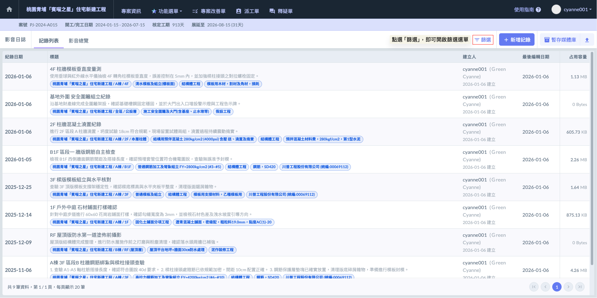 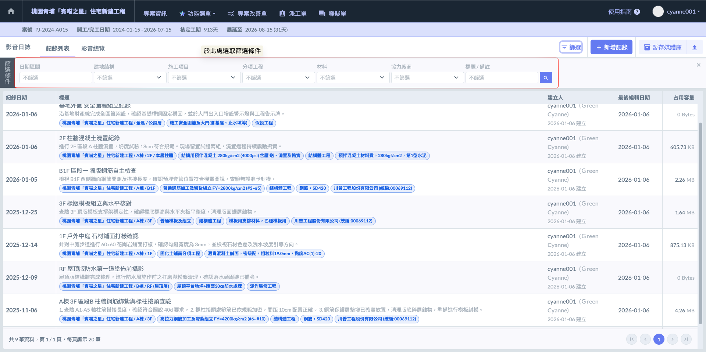

開啟篩選選單後，您可以依照管理需求，靈活交叉選用以下條件來精確定位紀錄：

<table><thead><tr><th width="102.1832275390625">條件</th><th>說明與範例</th></tr></thead><tbody><tr><td><strong>日期區間</strong></td><td>
支援極具彈性的選取方式，無論是針對單日、特定週期間，或跨月的大範圍檢索皆能輕鬆達成：

<ol><li><strong>單日紀錄：</strong> 精確選取某一天（如：2026/01/05），查看當日現場所有工項的進度。</li></ol>

<ol start="2"><li><strong>短期區間（幾天）：</strong> 選取如「週一至週五」的區間，彙整當週的施作歷程，適合用於製作週報或準備週進度會議。</li></ol>

<ol start="3"><li><strong>長期區間（好幾個月）：</strong> 選取跨月份的範圍，完整回溯該專案從基礎開挖到結構體完成的演變過程。這對於月度請款核銷或長期施工履歷建置非常實用。</li></ol></td></tr><tr><td><strong>建地結構</strong></td><td>依樓層或部位過濾，如僅查看「B1F 柱牆」或「RF 屋頂版」。</td></tr><tr><td><strong>施工工項</strong></td><td>針對具體工序分類（如：鋼筋綁紮、管路預埋、防水塗佈），鎖定特定的施作細節。</td></tr><tr><td><strong>分項工程</strong></td><td>依合約大項分類（如：結構體工程、機電工程、裝修工程），從巨觀角度切換不同專業領域。</td></tr><tr><td><strong>材料</strong></td><td>獨立篩選特定物料（如：4000psi 混凝土、D16 鋼筋），實現精準的物資溯源管理。</td></tr><tr><td><strong>協力廠商</strong></td><td>獨立篩選特定包商或供應商，用於核對施作履歷、進度表現或作為估驗計價的依據。</td></tr><tr><td><strong>標題/備註</strong></td><td>輸入如「裂縫」、「查驗不合格」或「自主檢查」等關鍵字，進行全文檢索。</td></tr></tbody></table>

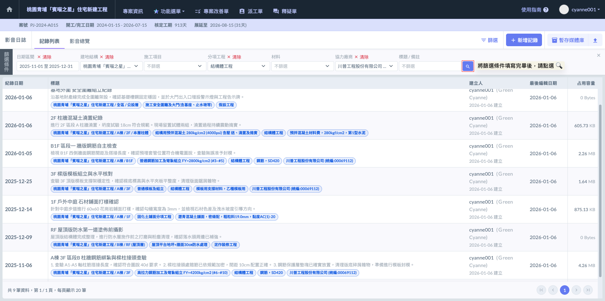

完成畫面如下：

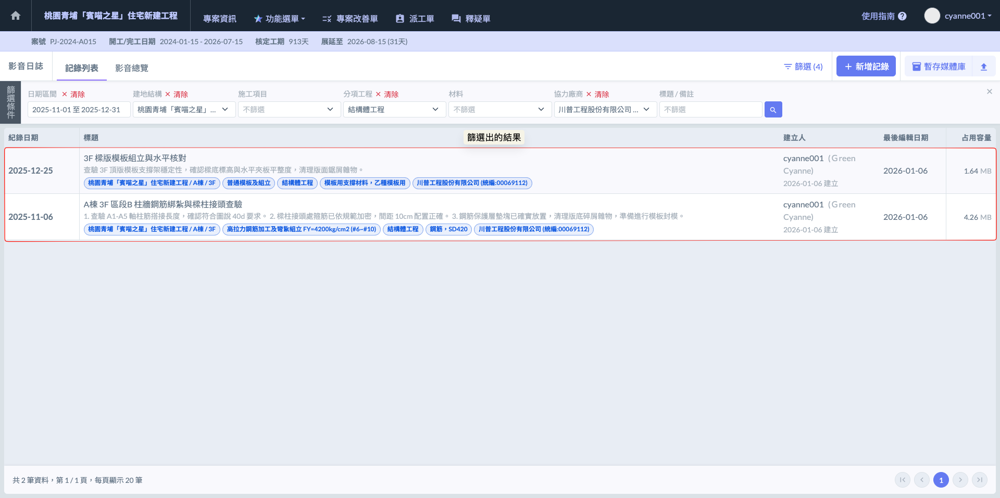

***

### 01 - 4｜編輯/查看紀錄

如圖二十一，點擊紀錄列表中的任一項目，即可進入該筆日誌的詳情頁面進行查看或內容編輯。以列表中『4F 柱牆模板垂直度量測』這筆紀錄為例，點擊後系統將帶您進入完整的紀錄資訊頁。

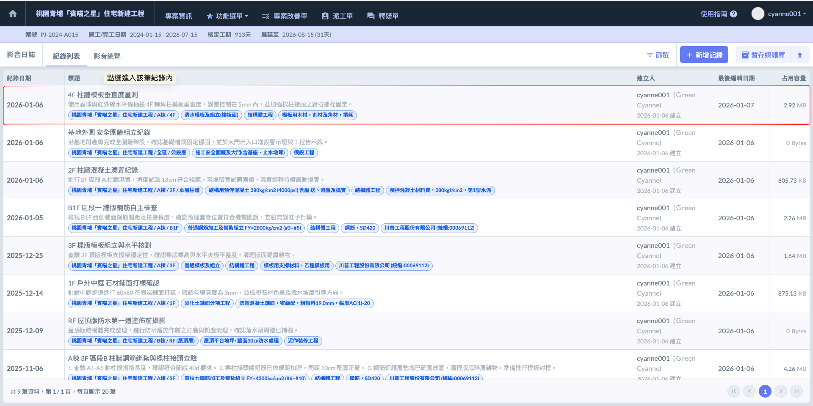

如圖二十二，進入紀錄內部如下。您可詳細查看該筆日誌的細部資訊（如文字描述、影音內容及相關項目)。

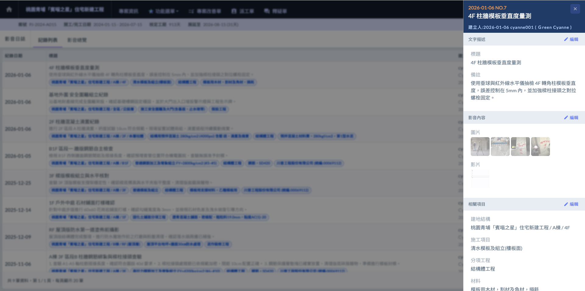

圖二十三，您亦可編輯其中之內容，於各項目欄位旁點選  圖示，即可進入修改模式調整各項資料。

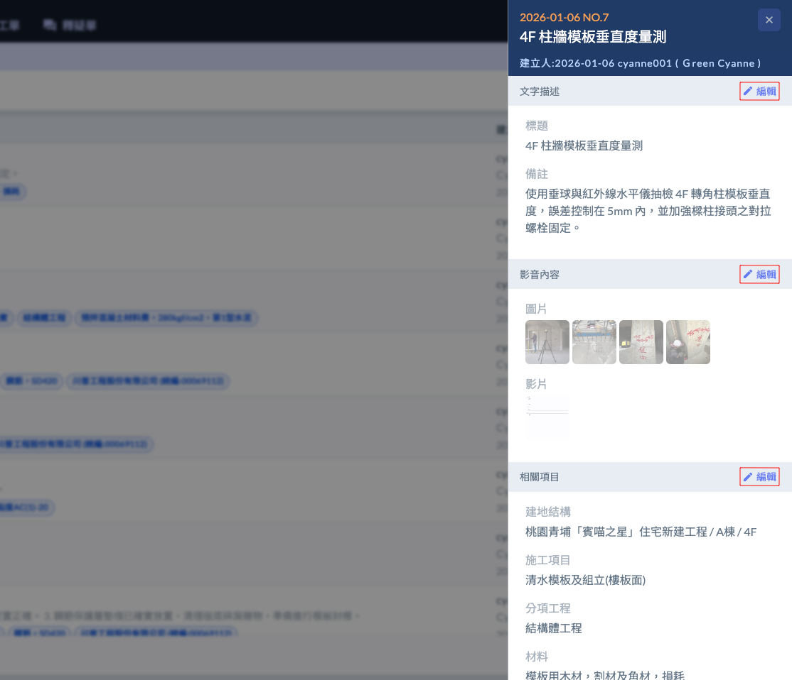

各項資料修改模式如下圖：

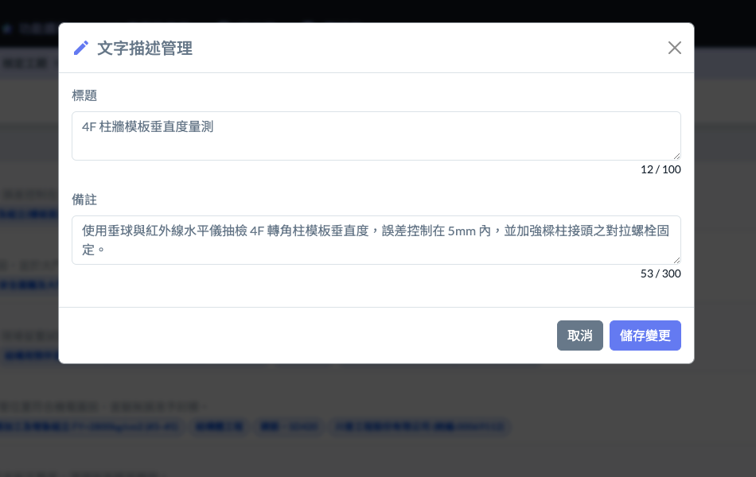 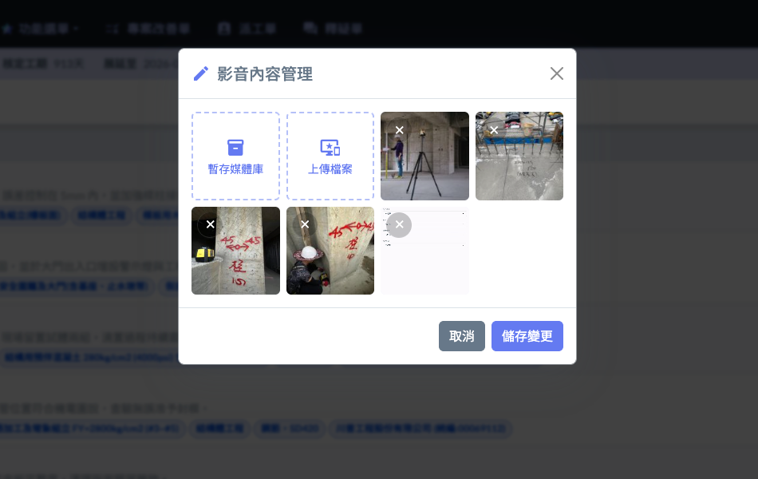 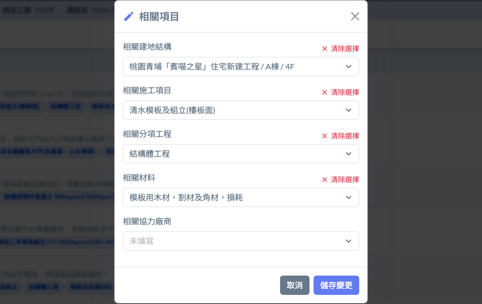

***

#### 01 - 4 - 1｜刪除紀錄

如圖二十七，於紀錄編輯頁面最下方，點選  即可刪除該筆影音日誌紀錄。

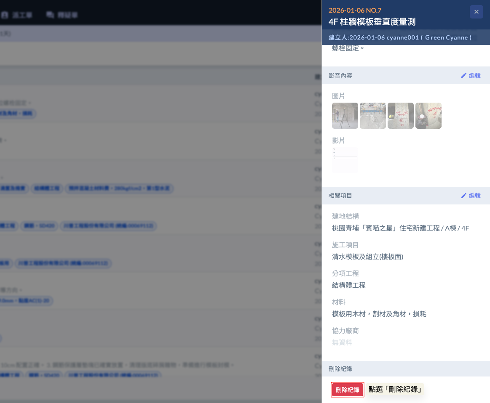
