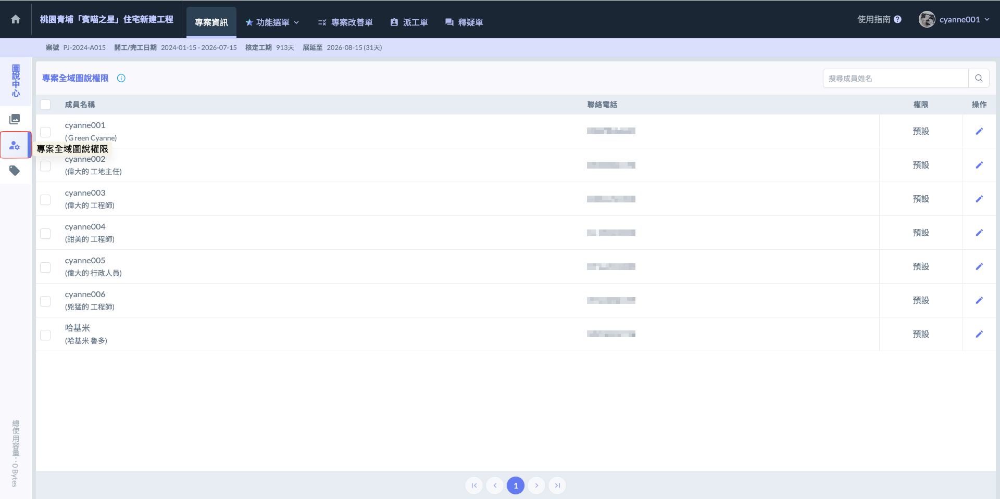

# 專案全域圖說權限

「專案全域圖說權限」是針對整個****專案範圍內的圖說文件管理所進行的頂層設定****。這套權限架構決定了不同專案成員對於系統內所有文件的存取邊界與操作能力。透過全域權限的配置，管理人員可以精確控管哪些成員具備檢視、編輯或刪除專案文件的權限，確保資訊傳遞的同時兼顧資料安全性。

由於圖說涉及計價與結構安全，圖說管理中心透過嚴謹的權限分配，必須由特定人員才能負責圖說建立、草稿上傳、審核與發佈等，確保每一張正式發布的圖紙都具備法律與施工效力，並落實崗位責任：



具備系統最高權限。除了日常的圖說編輯與發佈外，最重要的職責是處理「設為竣工圖」、「作廢」及「刪除圖說」等涉及合約結案與資料清理的操作。這些操作會更動到專案的最終成果，因此僅限管理員執行。



品質控管與版本把關。主要負責圖說草稿的「審核」。審核者以上之權限可進入待審核草稿區，可以檢視所有待審草稿內容，並核定其正確性。

無法直接刪除圖說，但具備核可草稿的權限，是確保圖說進入正式發布階段前的關鍵角色。



現場作業與上傳執行。此為第一線工程人員最常用的權限。具備建立圖說、上傳草稿、提交送審以及將核可後的圖說『發布為正式版』的權限。此設定讓現場人員可即時更新進度，但限制其進行審核、作廢刪除與設為竣工等動操作，以維持資料的嚴謹度。



純查閱與檢驗使用。僅開放最基礎的「檢視」與「下載」功能。此權限無法建立草稿或異動任何版本狀態。適合分包商、外部查驗單位或僅需持手機對照圖說施工的工班人員，確保他們能隨時調閱最新資訊，但不會誤觸系統設定。



