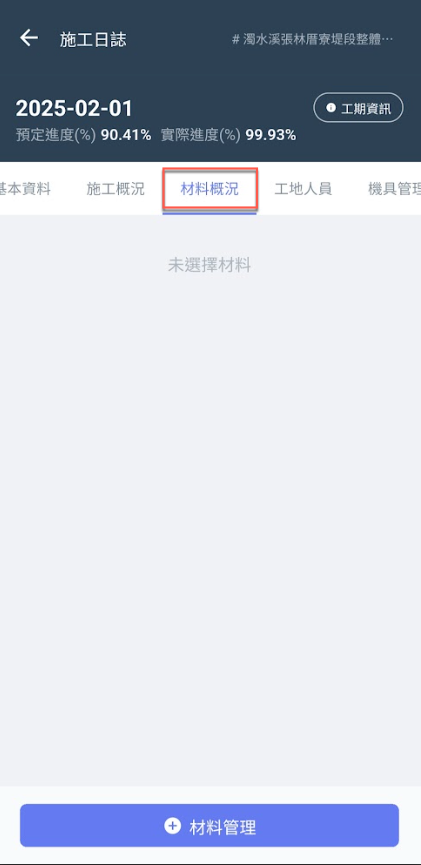
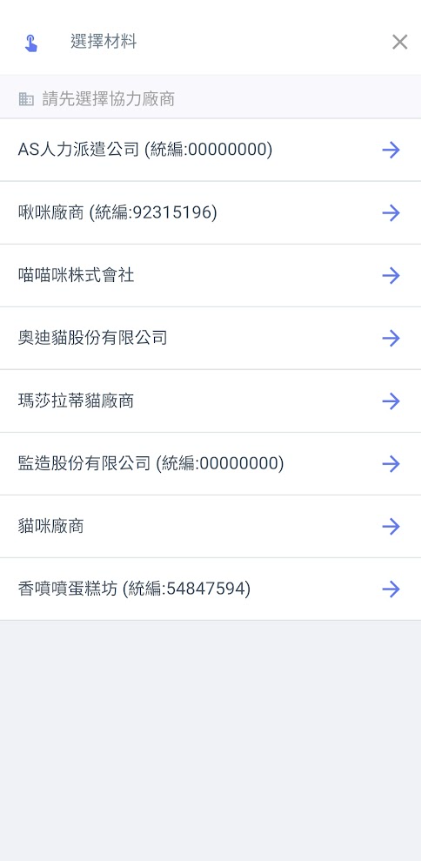
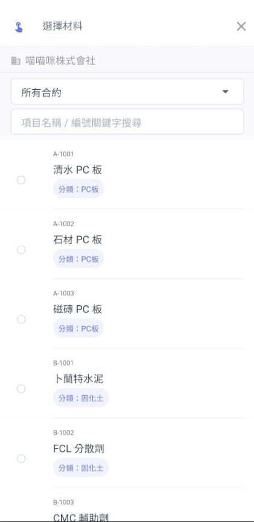
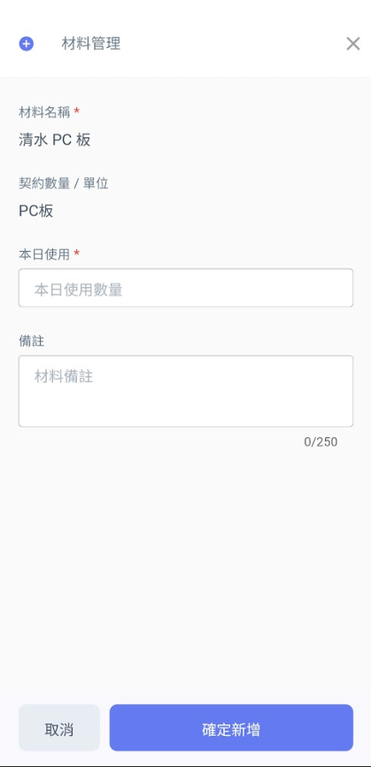
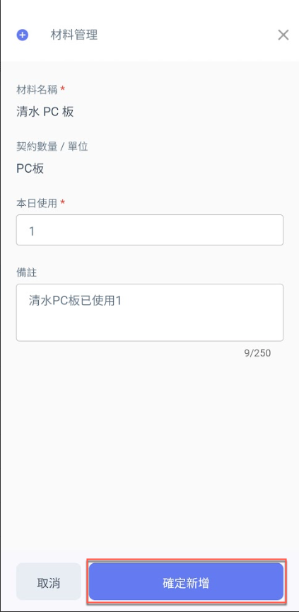
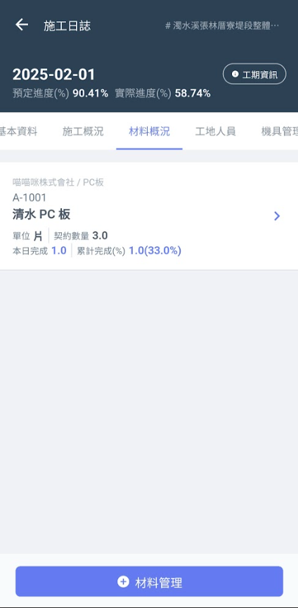
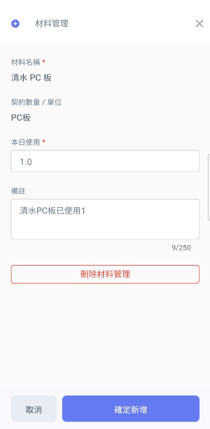

# App標準日誌 / 材料概況

如下圖，於<kbd>**材料概況**</kbd>頁籤點選下方&#x4E4B;**「+材料管理」**，即可開始選擇協力廠商及其相關材料。

選擇材料後，即可填寫該材料**本日使用數量**及**備註**。

!!! tip
    系統會依據當前所有日誌紀錄的材料使用量，計算出各材料的**累積使用數量**。

   

將資料填寫完畢後，點選圖五下方&#x4E4B;**「確定新增」**&#x5373;可見(圖六)畫面。

如需更動材料資料，點選該材料後即可見(圖七)畫面，修改**本日使用**、**備註**及**刪除該筆材料**。

修改完畢並確認資料無誤後，按&#x4E0B;**「確定新增」**&#x5373;完成資料更動。

  

