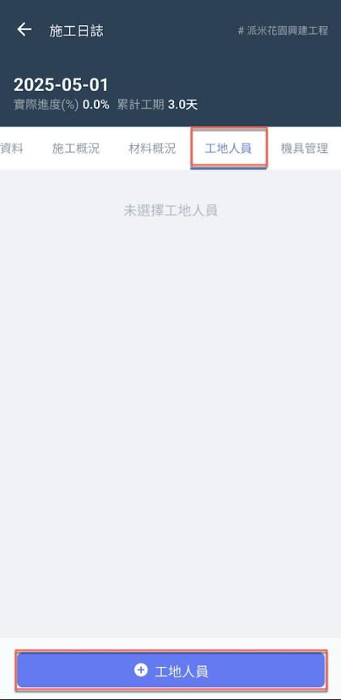
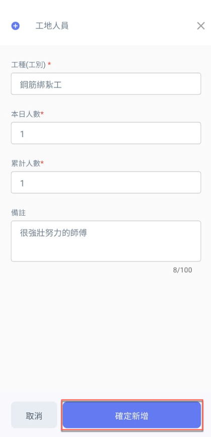
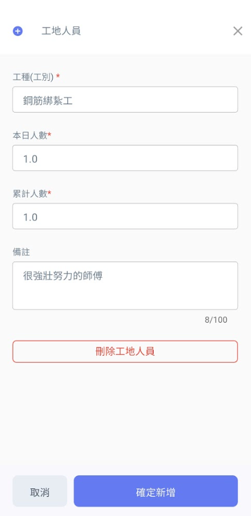

# App精簡日誌 / 工地人員

於<kbd>**工地人員**</kbd>頁籤點選下方&#x4E4B;**「+工地人員」**， 即可新增當日到場之工種，並填寫**本日人數**及**累計人數**等。

 

將資料填寫完畢後，點選圖三下方&#x4E4B;**「確定新增」**&#x5373;可見(圖四)畫面。

如需更動工地人員資料，點選該工種後即可見(圖五)畫面，修改**本日人數**、**累計人數**或**刪除工地人員**。

修改完畢並確認資料無誤後，按&#x4E0B;**「確定新增」**&#x5373;完成資料更動。

  

