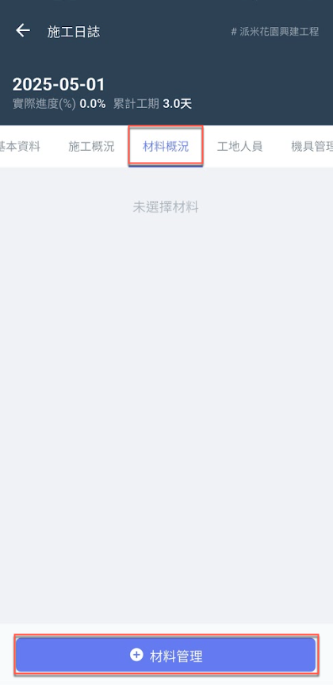
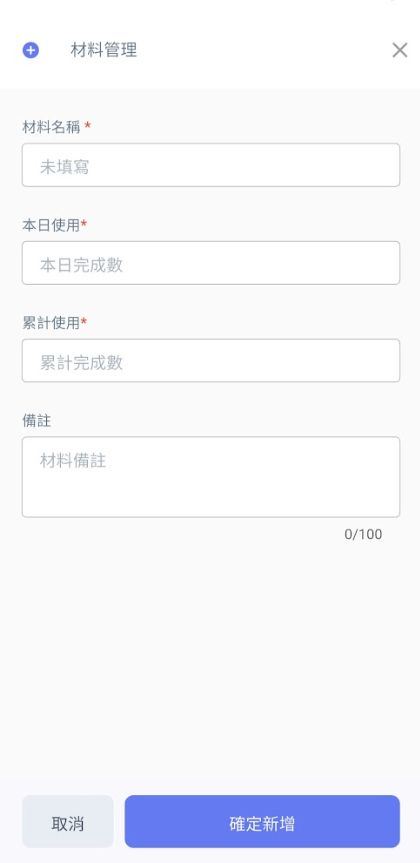
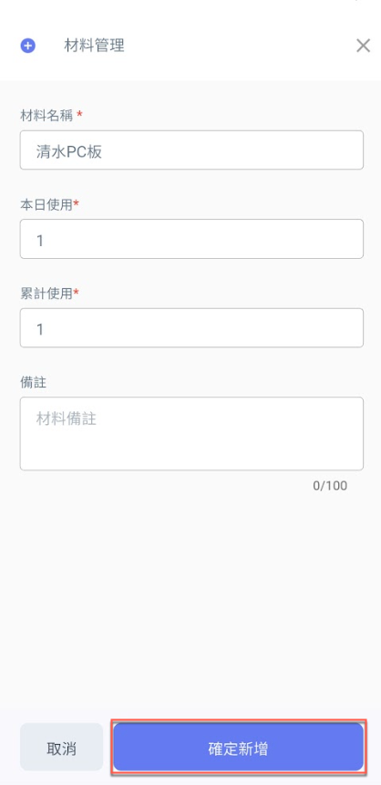
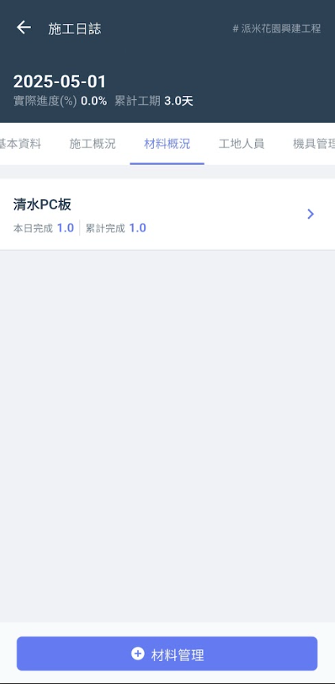
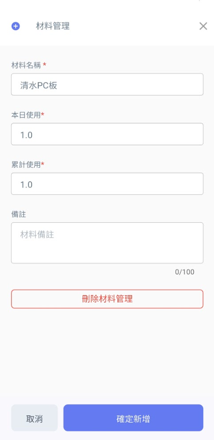

# App精簡日誌 / 材料概況

於<kbd>**材料概況**</kbd>頁籤點選下方&#x4E4B;**「+材料管理」**，即可開始新增材料，並填寫該材料**本日使用數量** & **備註**。

 

將資料填寫完畢後，點選圖三下方&#x4E4B;**「確定新增」**&#x5373;可見(圖四)畫面。

如需更動材料資料，點選該材料後即可見(圖五)畫面，修改**本日使用**、**累積使用數量**或**刪除該筆材料**。

修改完畢並確認資料無誤後，按&#x4E0B;**「確定新增」**&#x5373;完成資料更動。

  

