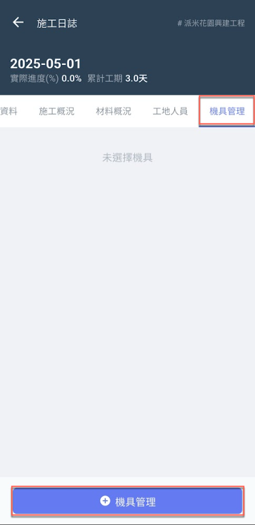
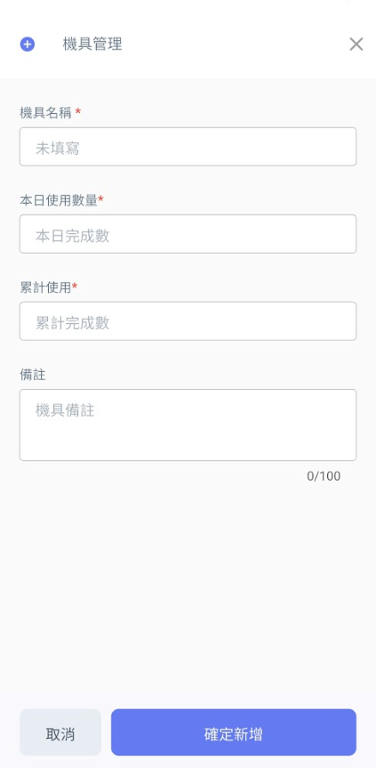
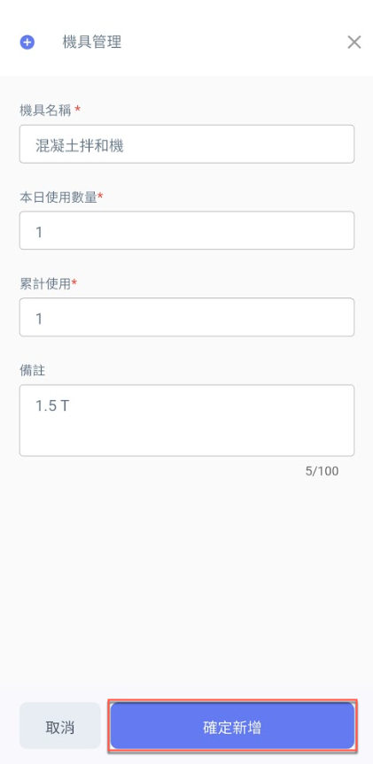
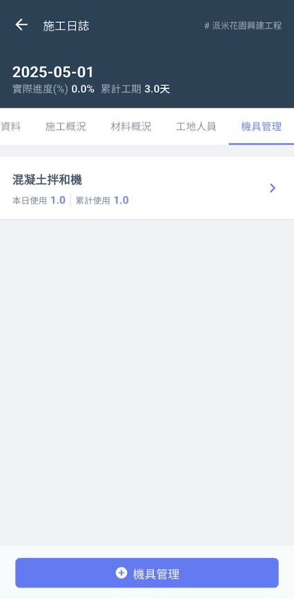
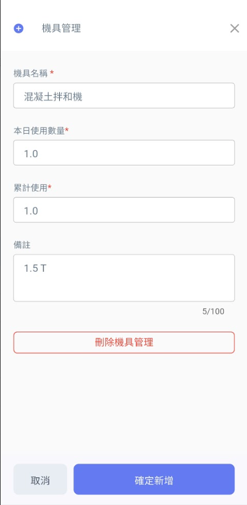

# App精簡日誌 / 機具管理

於<kbd>**機具管理**</kbd>頁籤點選下方&#x4E4B;**「+機具管理」**，即可新增當日使用到之機具，並填寫**本日使用**及**累積使用數量**。

 

將資料填寫完畢後，點選圖三下方&#x4E4B;**「確定新增」**&#x5373;可見(圖四)畫面。

如需更動機具管理資料，點選該機具後即可見(圖五)畫面，修改**本日使用數量**、**累積使用數量**或**刪除機具管理**。

修改完畢並確認資料無誤後，按&#x4E0B;**「確定新增」**&#x5373;完成資料更動。

  

