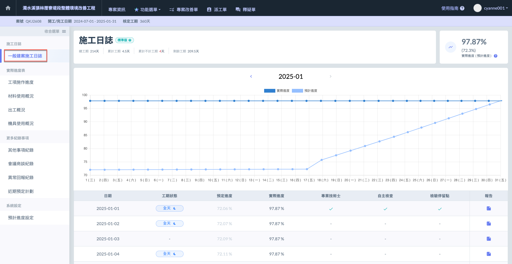

# 一般建案施工日誌

---
description: Building Construction - Daily Log
---

# 一般建案施工日誌

如下圖，系統根據您所填寫之施工概況（施工工項）完成進度，自動計算每&#x65E5;**「實際進度」**。

並根據各工項之需求，顯示該日期是否**需專業技術士**、**自主檢查**及**檢驗停留點**。

!!! info
    施工概況填寫，可參閱 **➙** 🔗 [日誌 / 施工概況](building-construction_daily-log/construction-overview)（標準版）

!!! tip
    每日預計進度可由使用者自行於 **➙** 🔗 [預計進度設定](xi-tong-she-ding/yu-ji-jin-du-she-ding) 進行設定；或由系統自動計算。

***

如下方影片所示，點選欲編輯/查看之日誌，即可編輯/查看該天日誌詳細資訊。

{% embed url="https://files.gitbook.com/v0/b/gitbook-x-prod.appspot.com/o/spaces%2FEqUCL3D5WQfpxJw8NL3P%2Fuploads%2Fd0R1xUVNbIBy5Ftshy9O%2F%E6%97%A5%E8%AA%8C%E5%BD%B1%E7%89%87.mp4?alt=media&token=5837a4a2-0389-4f15-be93-646a91ab1aca" %}
