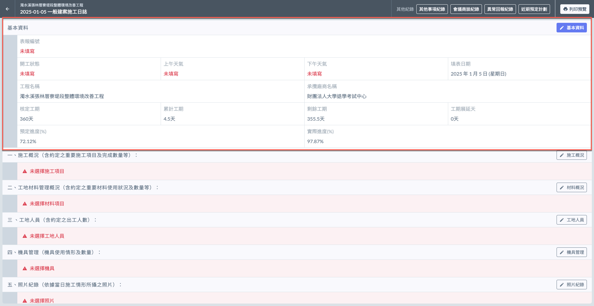
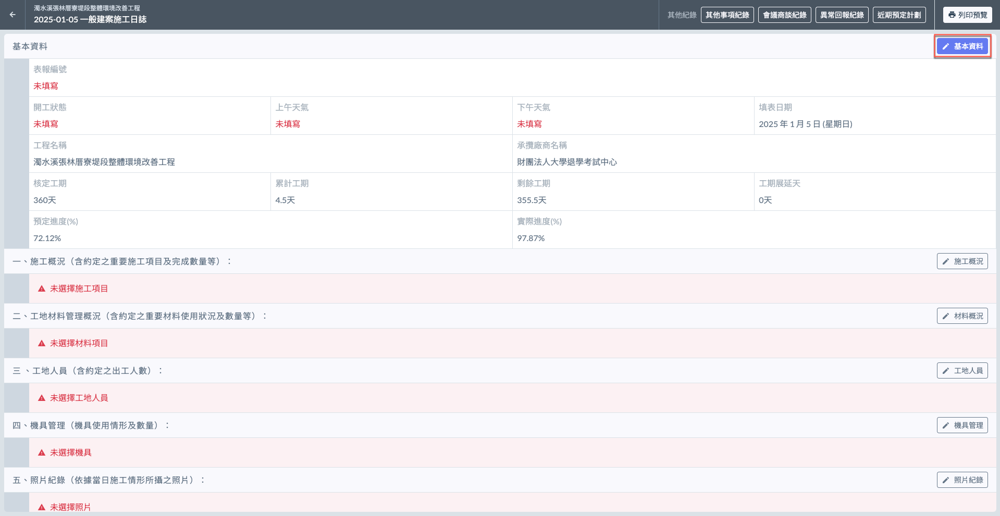
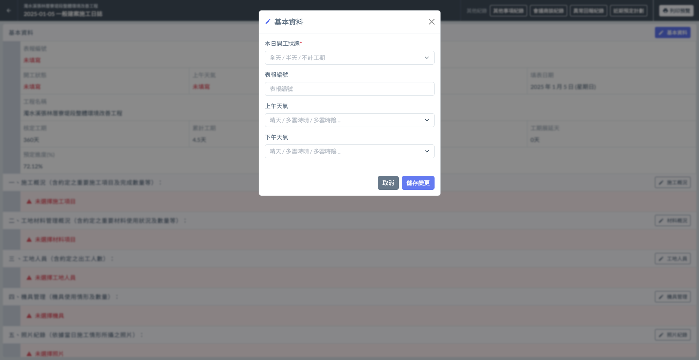

# 日誌 / 基本資料

---
description: Log / Basic Information
---

# 日誌 / 基本資料

!!! info
    在填寫日誌的其他內容之前，必須先完成基本資料的填寫。

## 欄位說明

 資料欄位說明

**表報編號**\
指的是施工日誌中每一份報表的唯一識別編號。這個編號用來追蹤和管理每一日的施工記錄，確保每個施工日誌都能與對應的工程進度及紀錄資料準確匹配。

**開工狀態**\
由使用者根據當日施工情況填寫，選項包括全天、半天及不計工期。該選項反映當日施工的實際情況，用於工期管理和進度跟蹤。

**上午天氣**\
系統提供的選項包括晴天、多雲時晴、多雲時陰、陰天、小雨、多雲陣雨、雷雨、豪雨等，幫助記錄施工過程中的天氣狀況，並作為後續分析進度延誤原因的參考。

**下午天氣**\
系統提供的選項與上午天氣相同，包括晴天、多雲時晴、多雲時陰、陰天、小雨、多雲陣雨、雷雨、豪雨等，用於記錄下午施工期間的天氣狀況。

**填表日期**\
無需填寫，系統會自動帶入施工日誌的日期，確保每一份日誌都有準確的時間戳。

**工程名稱**\
無需填寫，系統會根據專案基本資訊自動填入專案名稱，與施工日誌相關聯。

**承攬廠商名稱**\
無需填寫，系統會根據專案角色資訊自動填入承攬廠商名稱，確保與相關業者的責任範疇匹配。

**核定工期**\
無需填寫，系統會自動顯示專案基本資訊中的核定工期，作為進度控制的基準。

**累計工期**\
由系統根據日誌中填寫的開工狀態自動加總計算。比如，若一天的日誌記錄為全天，另一日為半天，則累計工期為1.5天。

**剩餘工期**\
系統利用公式（核定工期 - 累計工期）自動計算剩餘工期，幫助管理者清楚掌握項目進度。

**工期展延天**\
無需填寫，系統會自動根據專案基本資訊中的展延天數顯示，並作為後續進度調整的參考。

**預定進度 (%)**\
透過預定進度設定，系統會自動計算當前的預定進度百分比，幫助管理者了解預期進度。

**實際進度 (%)**\
系統根據施工概況中填寫的數據，會自動計算當日的實際進度百分比，並與預定進度進行比較，以便分析進度偏差。

***

## 填寫基本資料

!!! tip
    如欄位說明所述，僅**開工狀態**、**表報編號**及**上下午天氣**需由使用者自行填寫，其餘欄位項目會由專案資訊自動帶入。

進入日誌畫面後，如下圖紅框圈選處，點&#x9078;**「**&#xD83D;?️**基本資料」**，即可開啟填寫視窗。

填寫**開工狀態 ( 必填 )**、**表報編號**、**上午天氣**、**下午天氣**等資訊。填寫完畢且確認無誤後，請點&#x9078;**「儲存變更」**&#x5373;可保留資料。

