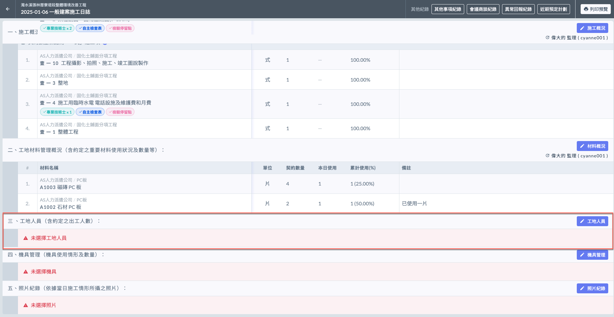
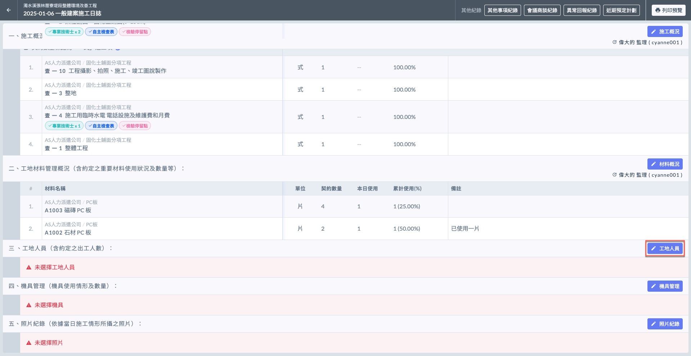
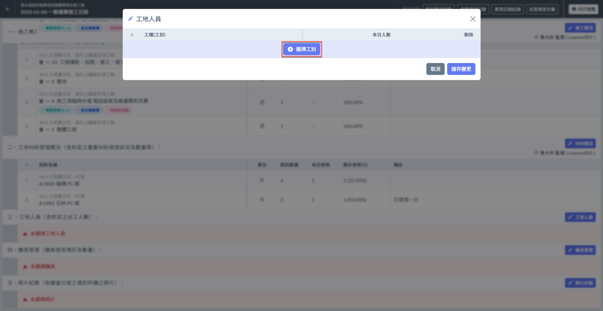
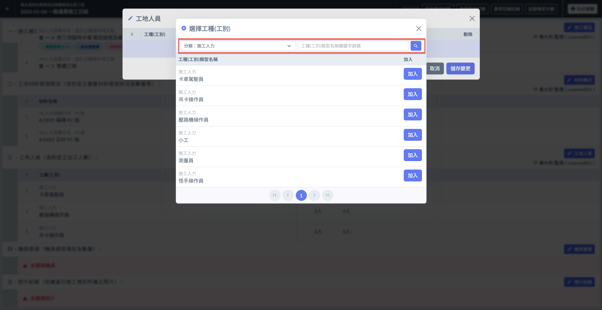
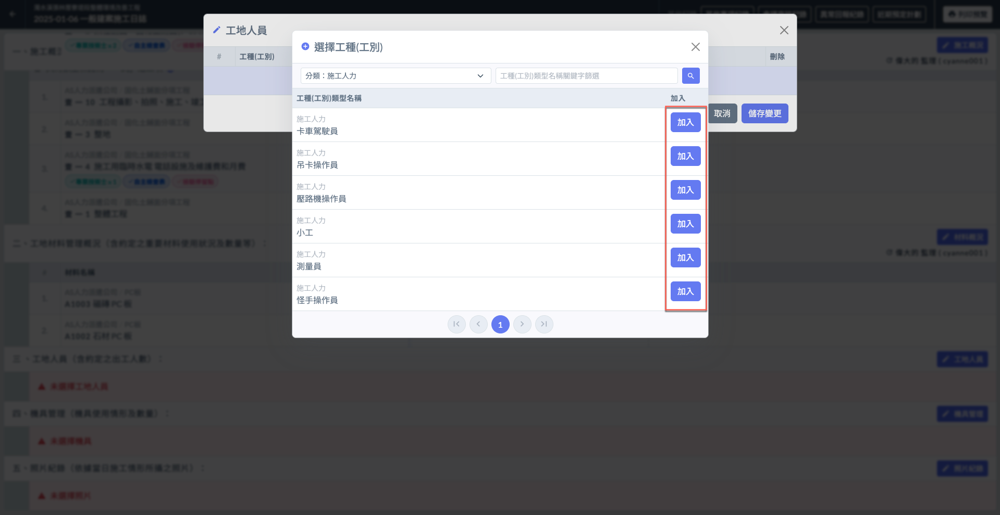
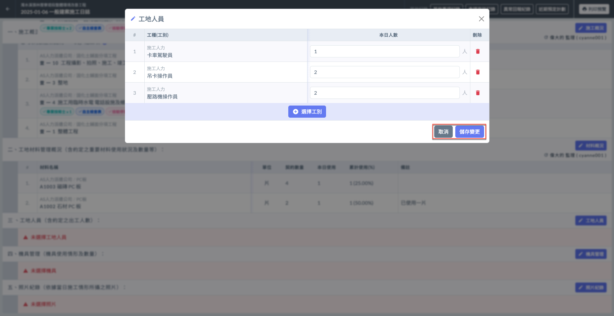
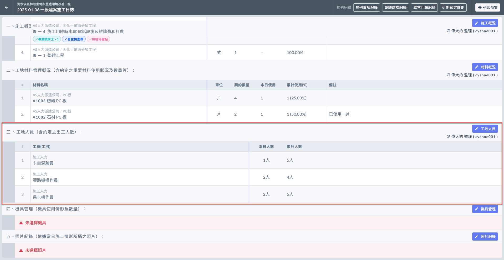
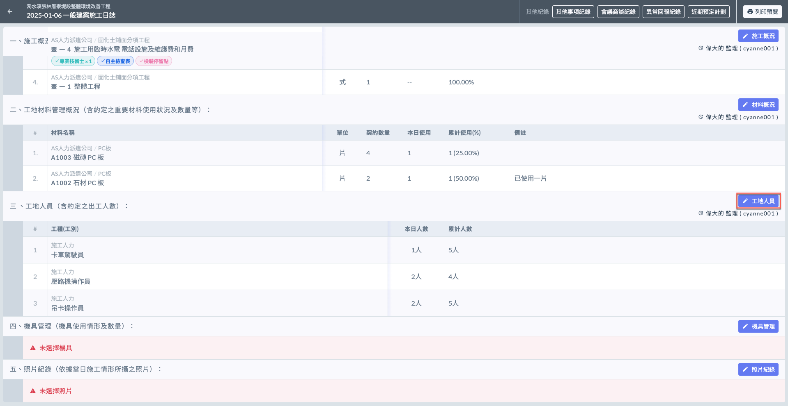
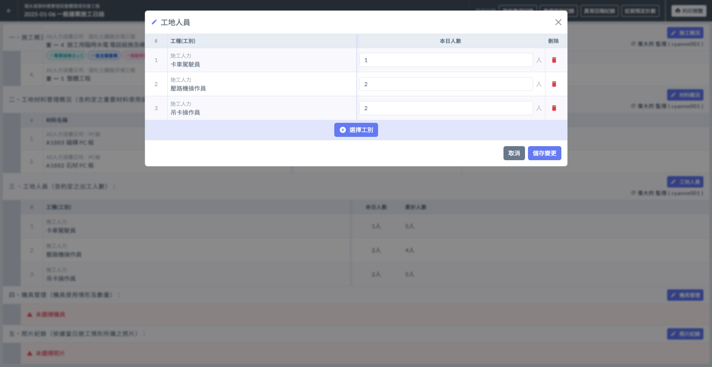
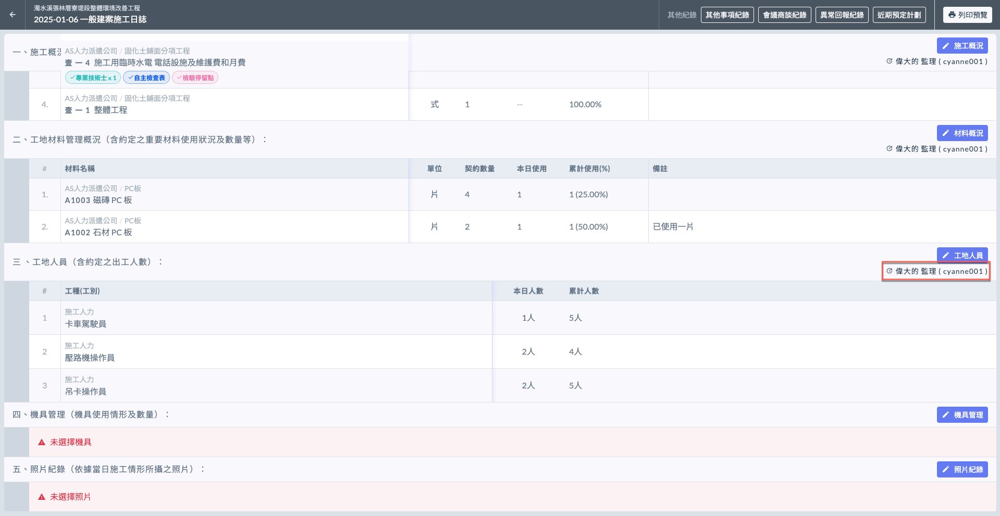

# 日誌 / 工地人員

工地人員項目記錄當日施工現場的人員出工情況。

!!! info
    在填寫日誌的工地人員之前，必須先完成基本資料的填寫。

***

## 出工概況

如下圖紅框圈選處，於工地人員欄位之右側處，點&#x9078;**「**&#xD83D;?️ **工地人員」**，即可開始選擇工種(工別)。

### 選取工別

點&#x9078;**「＋選擇工別」**(左圖)後，您可以**分類**或**工種名稱**篩選欲加入的工種。

此處工種資料皆依據**專案工種(工別)類型**，請參閱 **➙** 🔗 [專案工種(工別)類型](../../../../../project_level/project_data/trade-category)

 

選擇今日出工的工&#x7A2E;**「加入」**&#x672C;日工種列表，即可開始填寫詳細出工概況。（本日人數）

***

### 填寫各工種出工人數

!!! tip
    系統自動帶入於專案資料填寫之工種類型，包括：**預計工數**。可參閱 **➙** 🔗 [專案工種(工別)類型](../../../../../project_level/project_data/trade-category)

如下影片，選取工種後，您需要於各項材料填寫&#x5176;**「本日人數」**。

{% embed url="https://files.gitbook.com/v0/b/gitbook-x-prod.appspot.com/o/spaces%2FEqUCL3D5WQfpxJw8NL3P%2Fuploads%2Fg4IuMG1pKsU6OvHcWmxd%2F%E5%B7%A5%E5%9C%B0%E4%BA%BA%E5%93%A1%E5%BD%B1%E7%89%87.mp4?alt=media&token=aa06ee48-a322-4681-ab72-cb8a4b544668" %}

將資料填寫完畢後，即可按&#x4E0B;**「儲存變更」**&#x4FDD;存資料(左圖)。完成後即如(右圖)顯示。

!!! tip
    系統會依據當前所有日誌紀錄的工種出工數，計算出各工種的**累積人數**。

 

***

### 編輯出工概況

若欲修改現有資料，點&#x9078;**「**&#xD83D;?️ **工地人員」**，您可對各項目進行編輯（修改本日出工人數或刪除）。

如需新增工項，點&#x9078;**「＋選擇工別」**&#x4E26;重複上述操作即可。

 

#### 查看最後編輯人

如下圖紅框圈選處，系統會顯示最後更動資料的使用者。

***

!!! tip
    系統會依據每日填寫之施工日誌內容，彙整出工概況&#x65BC;**「出工概況」**。
    
    可參閱 **➙** 🔗 [出工概況](../actual-progress-chart/labor-deployment-overview)

