# 日誌 / 施工概況

施工概況記錄當日施工的主要內容及進度。幫助使用者簡要描述當日的施工工作，包括已完成的工作項目、進度狀況、特殊情況等。

!!! info
    在填寫日誌的施工概況之前，必須先完成基本資料的填寫。

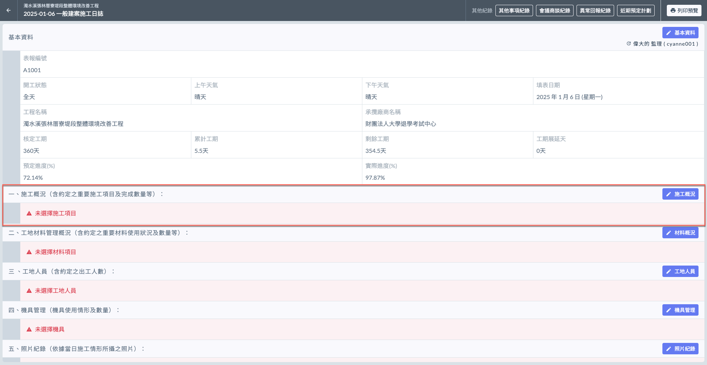

***

## 施工概況

如圖一，點選施工概況旁的  圖示，系統將彈出工項選擇視窗，方便您快速選取當日施作內容。

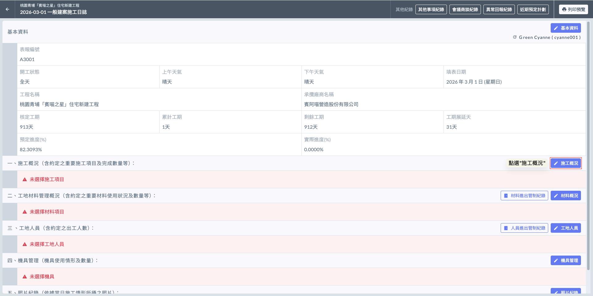

### 選取施工工項

如圖二、圖三，點選  圖示後，系統會要求您先執行雙重篩選：首先選擇 **協力廠商**，接著選定對應的 **合約**；完成後，系統將自動帶出該合約下的『工項清單』供您勾選。

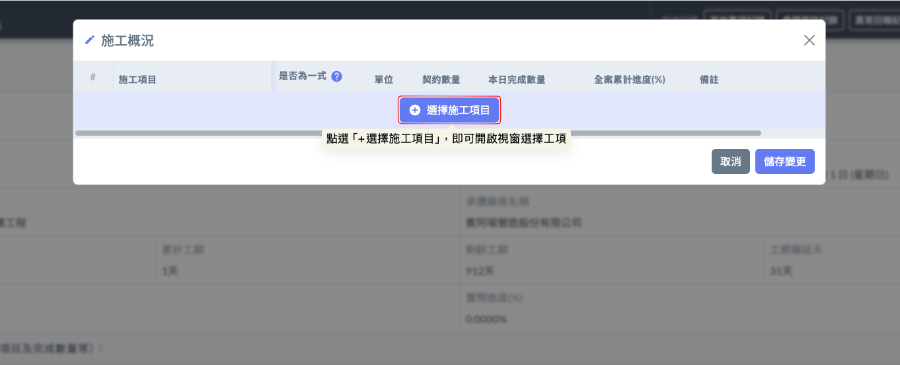 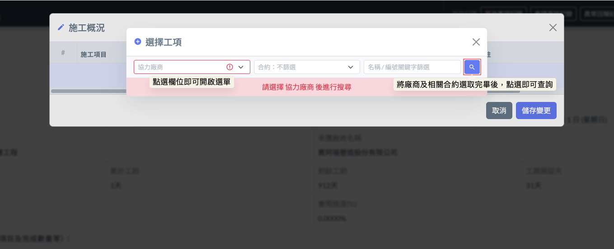

如圖四，選取好協力廠商及相關合約後，您即可查看該廠商旗下的所有施工項目。請將今日預計執行的工項   本日施工列表，隨後即可針對各項目填寫詳細的施工概況（包含：本日完成數、累積完成率等數據）。

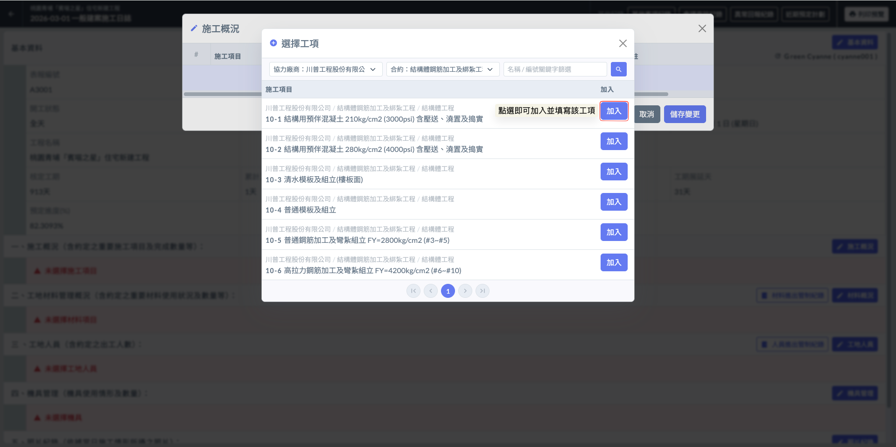

***

### 填寫各工項本日進度

**⚠️ 重要設定：工項性質與進度連動**

在此步驟填寫的數據將直接決定專案的本日實際進度。特別針對「首次填寫」的工項，系統設有不可逆的關鍵設定：



當您第一次將某個工項加入施工列表時，系統會要求您判斷該工項是否為『一式』：

* **一式項目：**&#x9069;用於無法以具體單位（如 $$\text{m}^2$$、噸、支...）量化的工作（例如：環境清潔、安全維護、保險費等）。其進度通常以『完成百分比 (%)』來估算。
* **非一式項目：** 適用於有明確合約數量的工作。其進度將根據『本日完成數量 / 合約總量』自動計算得出。

!!! info
    如果施工項目為一式項目，您不必填寫當日完成數量，但需要手動填寫累積完成進度。
    
    若為非一式項目，您只需填寫當日完成的數量，系統會自動計算並更新累積完成進度。




此設定具備首筆決定性，請在操作時務必確認：

* **僅限首次：** 只有在該工項於專案中****第一次被填寫****時，才能選用是否為一式。
* **後續鎖定：**
  * 若首次填寫未勾選為一式，日後該工項將永久視為「量化項目」，無法再改回一式。
  * 若首次填寫已勾選為一式，日後該工項將永久視為「按比例項目」，無法改為非一式（量化）。&#x20;



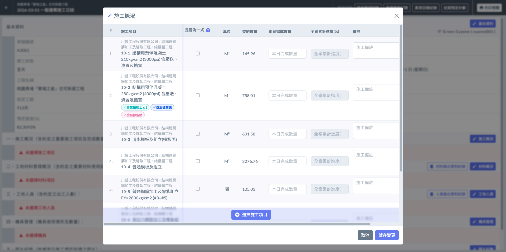

!!! tip
    系統會自動帶入於專案資料填寫之施工項目，包括：工項**單位**、**契約數量**、是否需**專業技術士**、是否有**自主檢查表**及是否設立**檢驗停留點**。詳細可參閱 **➙** 🔗[ 施工項目](../../../../../project_level/project_data/construction_item)

如下影片，針對一式之項目需自行填寫**累計完成進度**，而非一式之項目只需填寫**本日完成數量**，系統即會自動幫您計算累積完成(%)。亦可於每個工項旁增添**備註**或將其**刪除**。

{% embed url="https://files.gitbook.com/v0/b/gitbook-x-prod.appspot.com/o/spaces%2FEqUCL3D5WQfpxJw8NL3P%2Fuploads%2FuIlZdCam219jj74UDfZ2%2F2025-01-17_12-46-37.mp4?alt=media&token=72903311-6ecb-4273-8613-632ad53e90f5" %}

將資料填寫完畢後，即可按&#x4E0B;**「儲存變更」**&#x4FDD;存資料(左圖)。完成後即如(右圖)顯示。

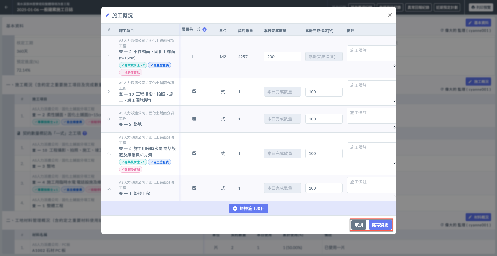 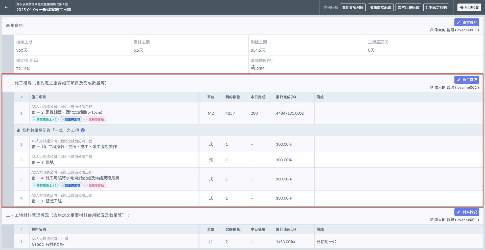

***

### 編輯施工概況

欲修改現有資料，點選 ，可對各工項編輯（修改本日完成數/累積完成進度、備註或刪除）。

如需新增工項，點選  並重複上述操作即可。

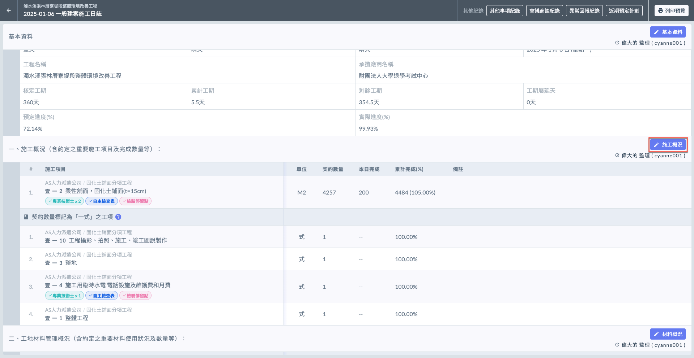 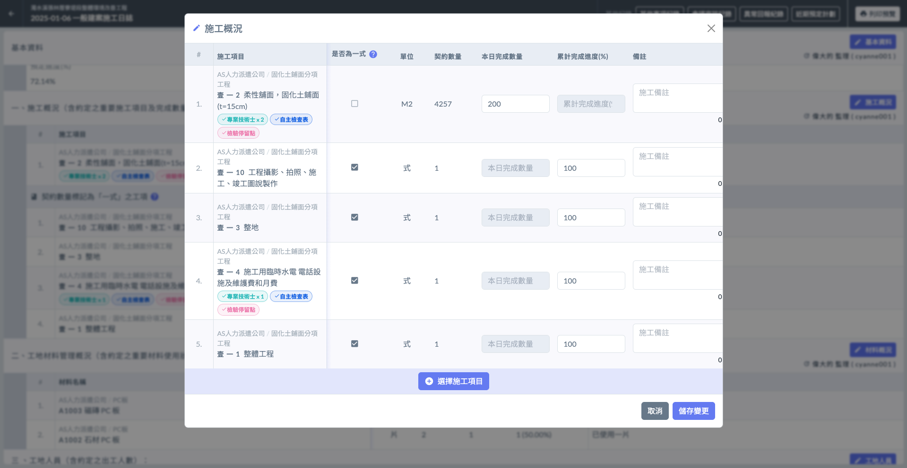

#### 查看最後編輯人

如下圖紅框圈選處，系統會顯示最後更動資料的使用者。

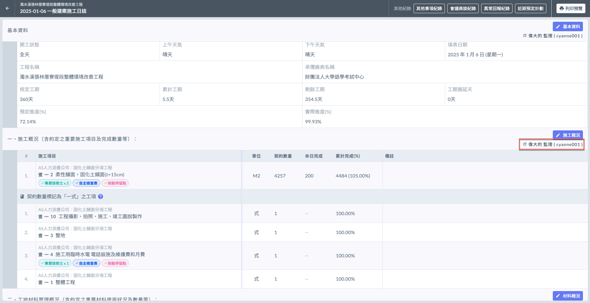

***

!!! tip
    系統會依據每日填寫之施工日誌內容，彙整施工概況&#x65BC;**「工項施作進度」**。
    
    可參閱 **➙** 🔗 [工項施作進度](../actual-progress-chart/work-item-progress)

