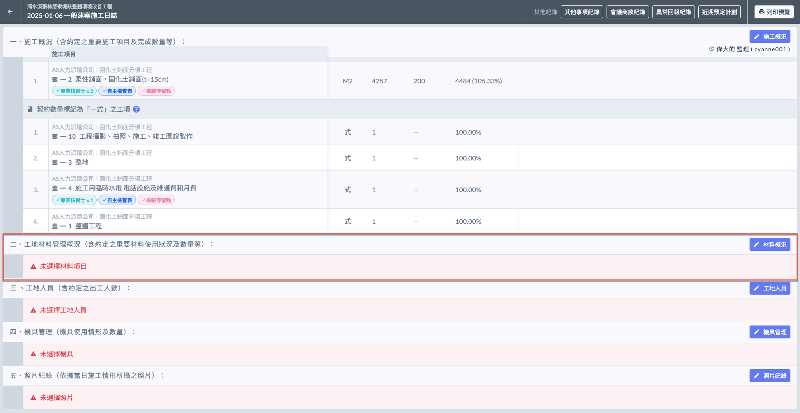
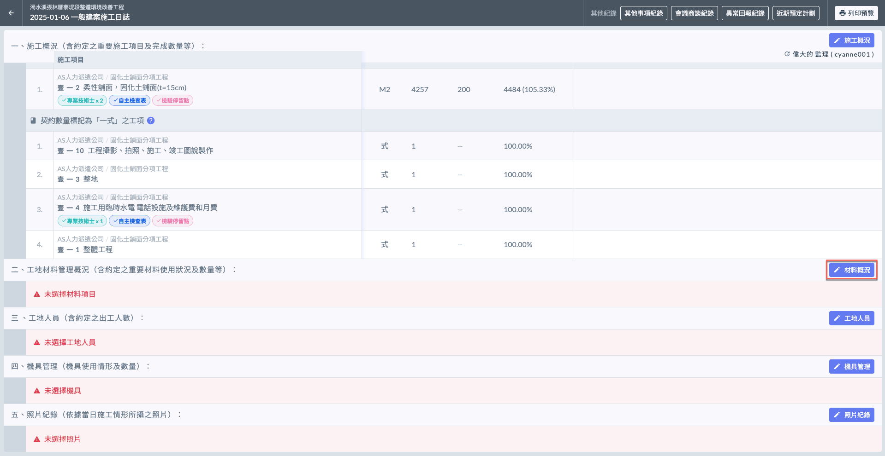
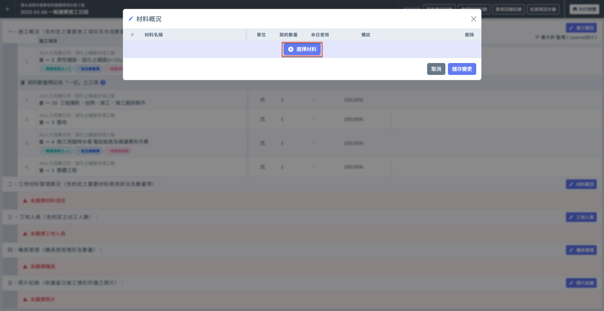
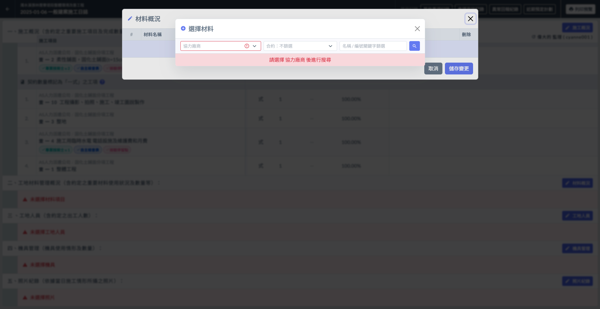
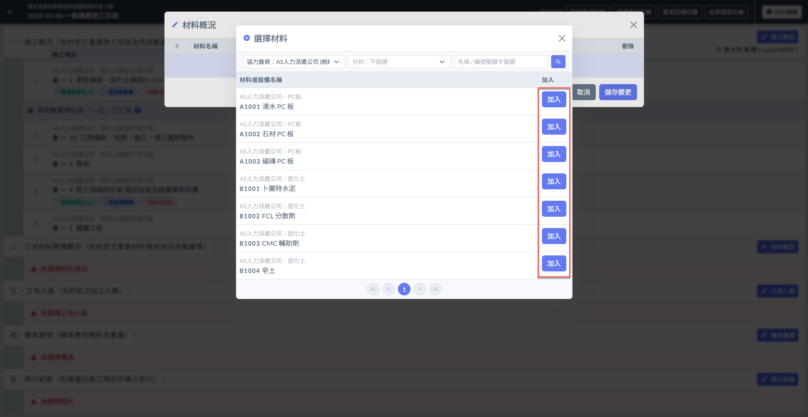
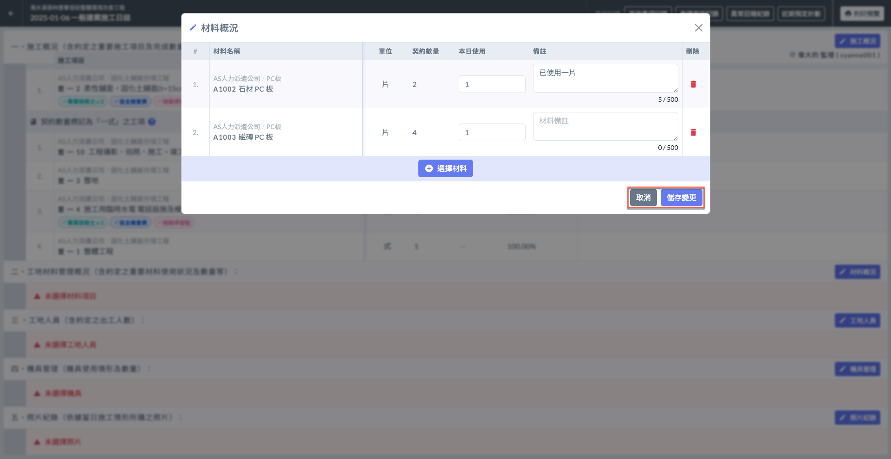
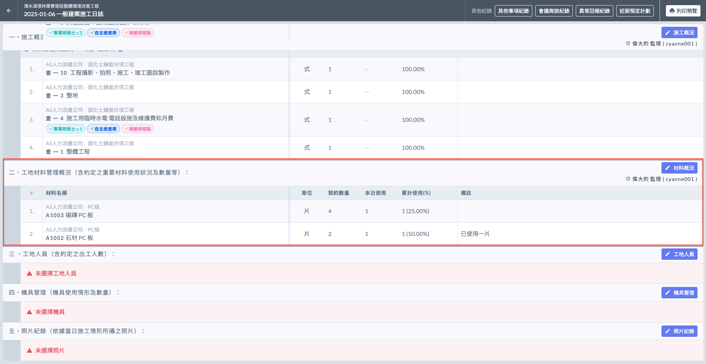
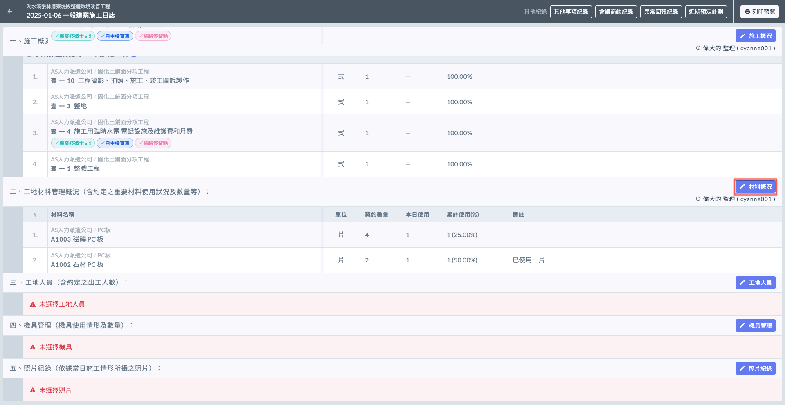
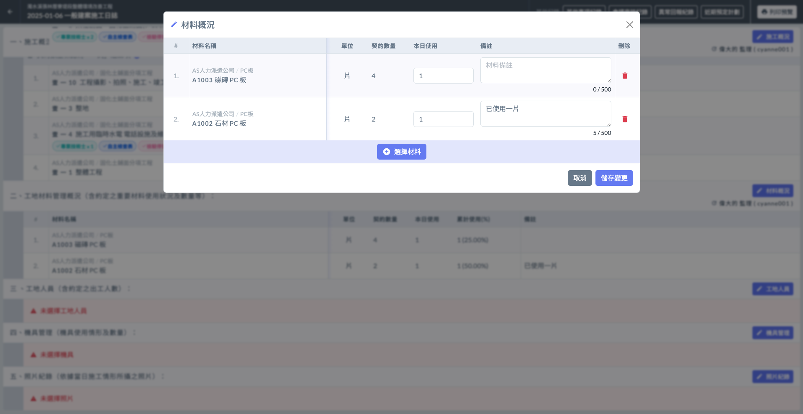
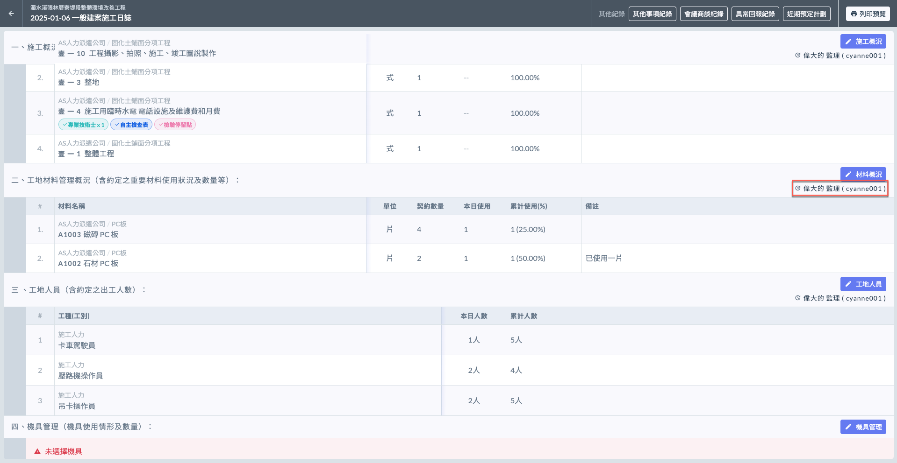

# 日誌 / 材料概況

材料使用概況記錄了當日使用的各類施工材料的數量及類別。

!!! info
    在填寫日誌的材料概況之前，必須先完成基本資料的填寫。

***

## 材料概況

如下圖紅框圈選處，於工地材料管理概況欄位之右側處，點&#x9078;**「**&#xD83D;?️ **材料概況」**，即可開始選擇材料項目。

### 選取材料項目

點&#x9078;**「＋選擇材料」**(左圖)後，即會需要您選擇協力廠商及合約(右圖)，以篩選材料項目。

 

選取好協力廠商及相關合約後，您即可查看該廠商其下的所有材料項目。資料來源請參考 **➙** 🔗 [材料管理](../../../../../project_level/project_data/material_management)

選擇今日使用的材&#x6599;**「加入」**&#x672C;日材料列表，即可開始填寫詳細材料概況。（本日使用數量）

***

### 填寫各材料使用數量

!!! tip
    系統會自動帶入於專案資料填寫之材料項目，包括：材料**單位**、**契約數量**。
    
    詳細可參閱 **➙** 🔗 [材料管理](../../../../../project_level/project_data/material_management)

如下影片，選取材料後，您需要於各項材料填寫&#x5176;**「本日使用」**&#x91CF;，亦可進行**備註**和**刪除**。

{% embed url="https://files.gitbook.com/v0/b/gitbook-x-prod.appspot.com/o/spaces%2FEqUCL3D5WQfpxJw8NL3P%2Fuploads%2F1gWyoJH4OYptM8QDSmFF%2F%E6%9D%90%E6%96%99%E6%A6%82%E6%B3%811.mp4?alt=media&token=aaa5e6b2-e254-4582-b136-b842df05b6a5" %}

將資料填寫完畢後，即可按&#x4E0B;**「儲存變更」**&#x4FDD;存資料(左圖)。完成後即如(右圖)顯示。

!!! tip
    系統會依據當前所有日誌紀錄的材料使用量，計算出各材料的**累積使用數量**。

 

***

### 編輯材料概況

若欲修改現有資料，點&#x9078;**「**&#xD83D;?️ **材料概況」**，您可對各項目進行編輯（修改本日使用數量、備註或刪除）。

如需新增材料，點&#x9078;**「＋選擇施工項目」**&#x4E26;重複上述操作即可。

 

#### 查看最後編輯人

如下圖紅框圈選處，系統會顯示最後更動資料的使用者。

***

!!! tip
    系統會依據每日填寫之施工日誌內容，彙整材料概況&#x65BC;**「材料使用概況」**。
    
    可參閱 **➙** 🔗 [材料使用概況](../actual-progress-chart/material-usage-overview)

