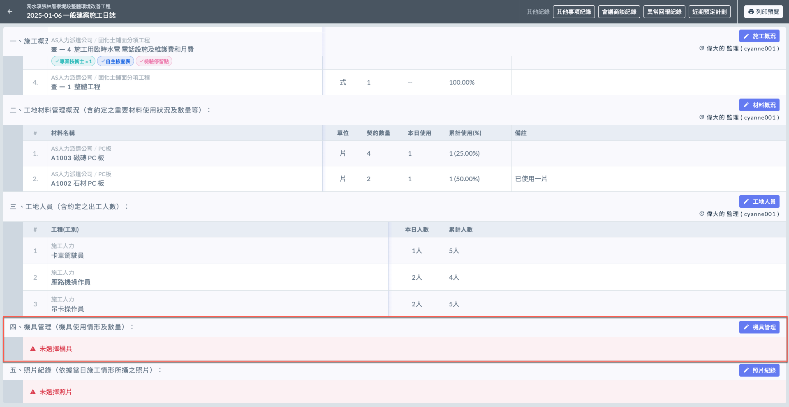
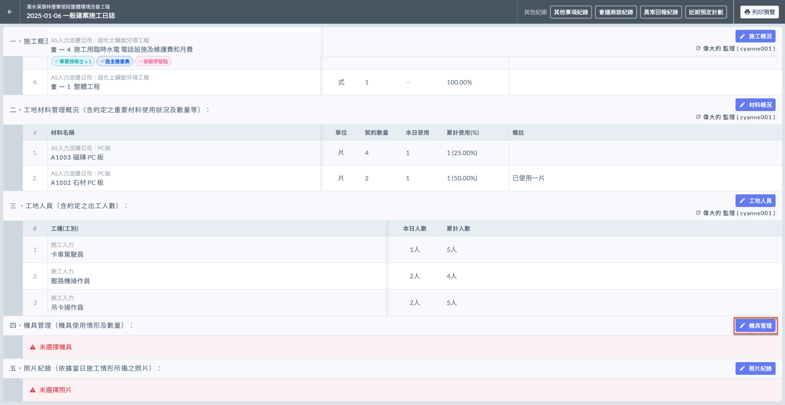
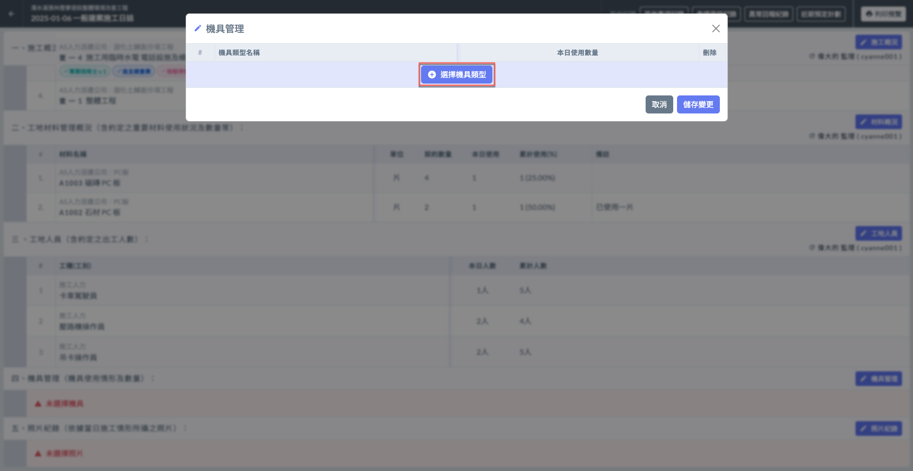
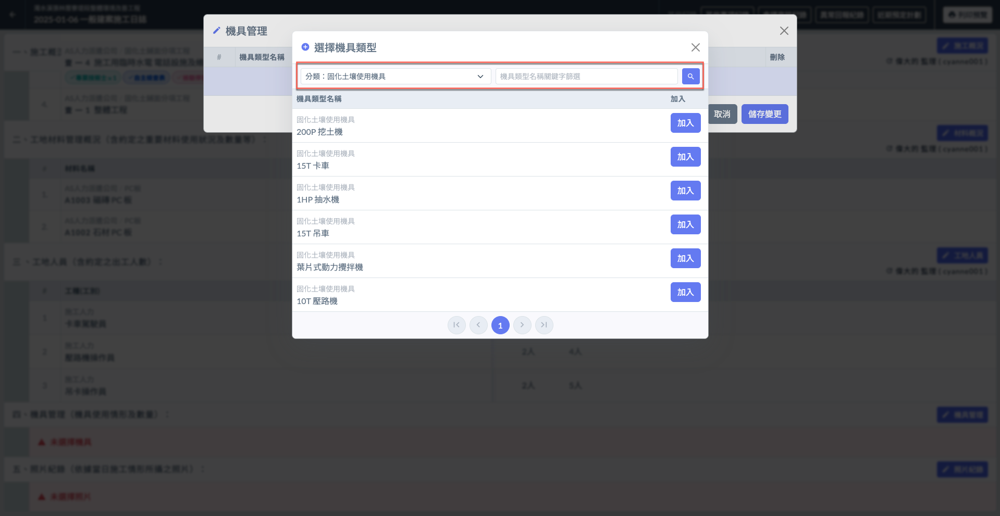
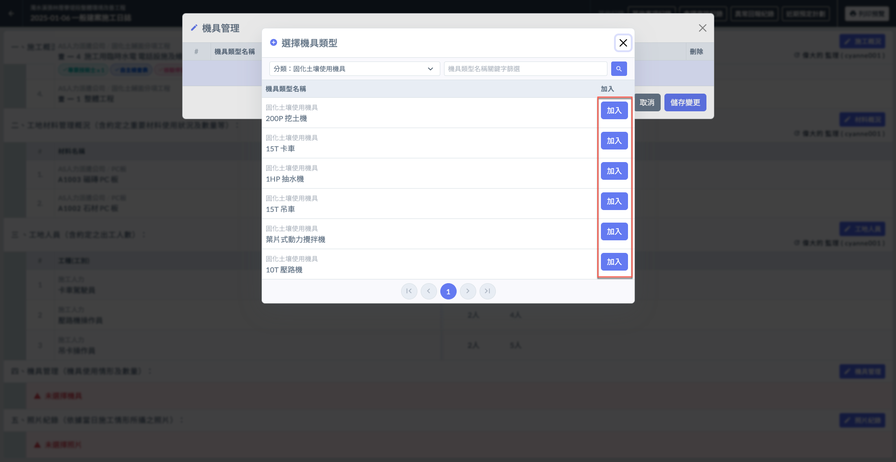
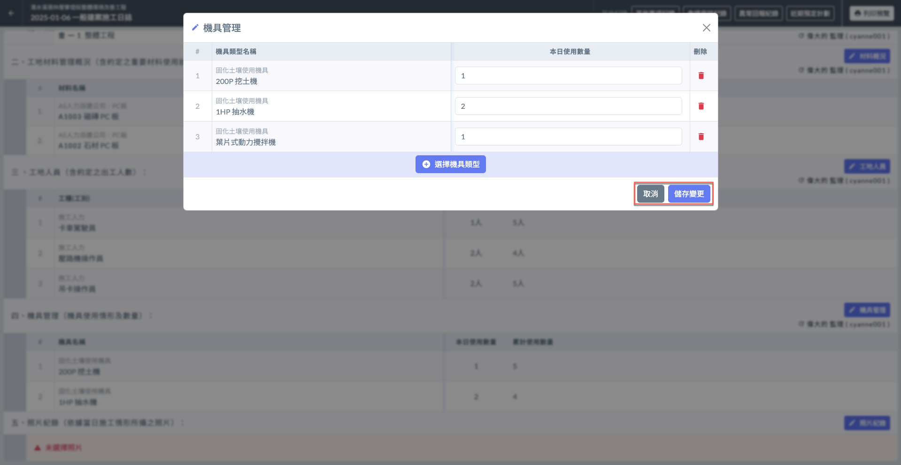
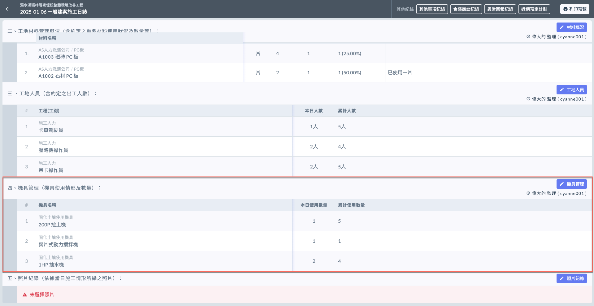
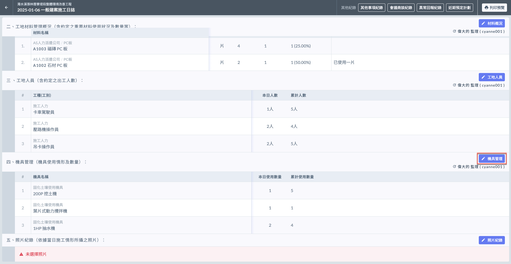
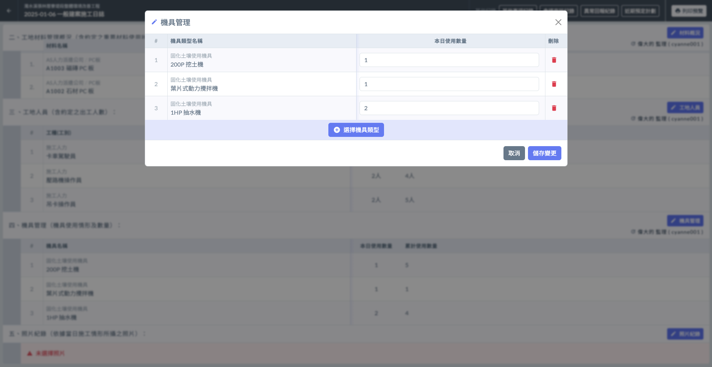

# 日誌 / 機具管理

機具管理項目記錄當日使用的設備及其數量。

!!! info
    在填寫日誌的機具管理之前，必須先完成基本資料的填寫。

***

## 機具管理

如下圖紅框圈選處，於機具管理欄位之右側處，點&#x9078;**「**&#xD83D;?️ **機具管理」**，即可開始選擇機具。

### 選取機具

點&#x9078;**「＋選擇機具類型」**(左圖)後，您可以**分類**或**機具名稱**篩選欲加入的工種。

此處工種資料皆依據公司通用設定資料之機具類型，請參閱 **➙** 🔗 [機具類型](../../../../../../company_configuration/equipment)

 

選擇今日使用的機&#x5177;**「加入」**&#x672C;日機具列表，即可開始填寫詳細機具使用概況。（本日使用數量）

***

### 填寫各機具使用數量

如下影片，選取機具後，您需要於各項機具填寫&#x5176;**「本日使用數量」**。

{% embed url="https://files.gitbook.com/v0/b/gitbook-x-prod.appspot.com/o/spaces%2FEqUCL3D5WQfpxJw8NL3P%2Fuploads%2FSrh7JEbadfFn1vrojUp5%2F%E6%A9%9F%E5%85%B7%E4%BD%BF%E7%94%A8%E6%A6%82%E6%B3%81%E5%BD%B1%E7%89%871.mp4?alt=media&token=e423479b-4580-4f34-b1a0-33e1ee0973dc" %}

將資料填寫完畢後，即可按&#x4E0B;**「儲存變更」**&#x4FDD;存資料(左圖)。完成後即如(右圖)顯示。

!!! tip
    系統會依據當前所有日誌紀錄的機具使用數量，計算出各機具的**累積使用數量**。

 

***

### 編輯機具概況

若欲修改現有資料，點&#x9078;**「**&#xD83D;?️ **機具管理」**，您可對各項目進行編輯（修改本日使用數量或刪除）。

如需新增工項，點&#x9078;**「＋選擇機具類型」**&#x4E26;重複上述操作即可。

 

#### 查看最後編輯人

如下圖紅框圈選處，系統會顯示最後更動資料的使用者。

***

!!! tip
    系統會依據每日填寫之施工日誌內容，彙整機具使用資料&#x65BC;**「機具使用概況」**。
    
    可參閱 **➙** 🔗 [機具使用概況](../actual-progress-chart/equipment-usage-overview)

