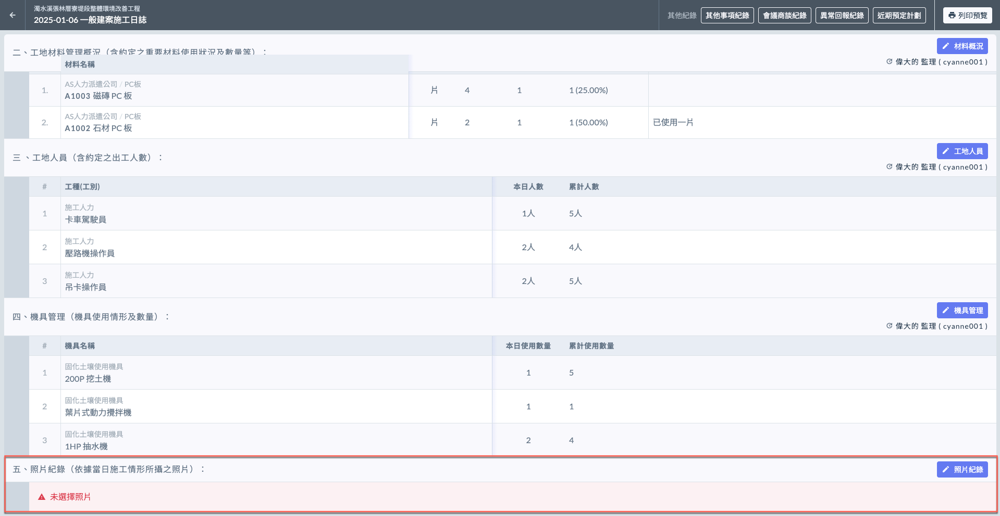
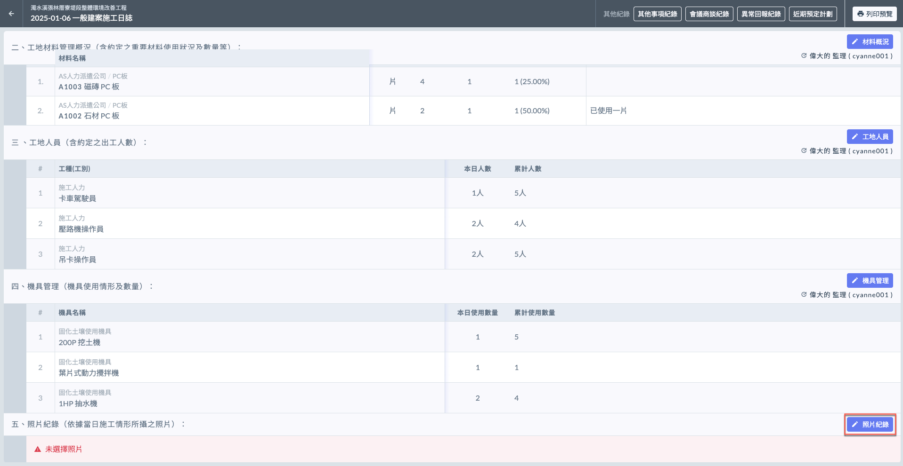
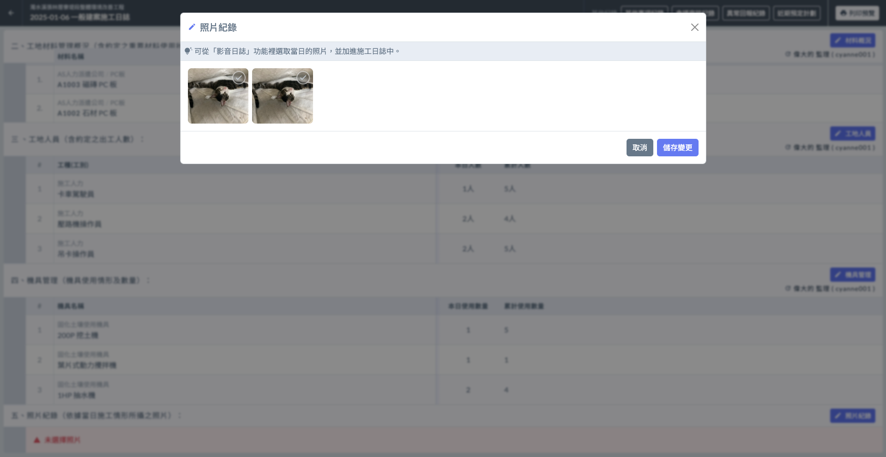

# 日誌 / 照片紀錄

!!! info
    在填寫日誌的照片紀錄之前，必須先完成基本資料的填寫。

***

## 選取照片

!!! warning
    此處照片由當日影音紀錄上傳之圖片選取。即，**當日必須有**影音日誌紀錄才能於此選擇圖片。
    
    影音日誌相關操作，請參閱 **➙** 🔗 [影音日誌](../../../../media_diary)

於照片紀錄欄位，如(左圖)紅框圈選處，點&#x9078;**「**&#xD83D;?️ **照片紀錄」**，即可進入照片選取頁面(右圖)。

可點選照片查看並勾選，勾選完畢並確認無誤後，點&#x9078;**「儲存變更」**&#x5373;可保留資料。

 

亦可參考下方影片。

{% embed url="https://files.gitbook.com/v0/b/gitbook-x-prod.appspot.com/o/spaces%2FEqUCL3D5WQfpxJw8NL3P%2Fuploads%2FK06okbdsl1qD0X3djzWq%2F%E5%A5%A7%E8%BF%AA%E5%8B%95%E7%89%A9%E5%9C%96.mp4?alt=media&token=f538d734-b559-4be3-8f5b-ec1d60ac0222" %}
