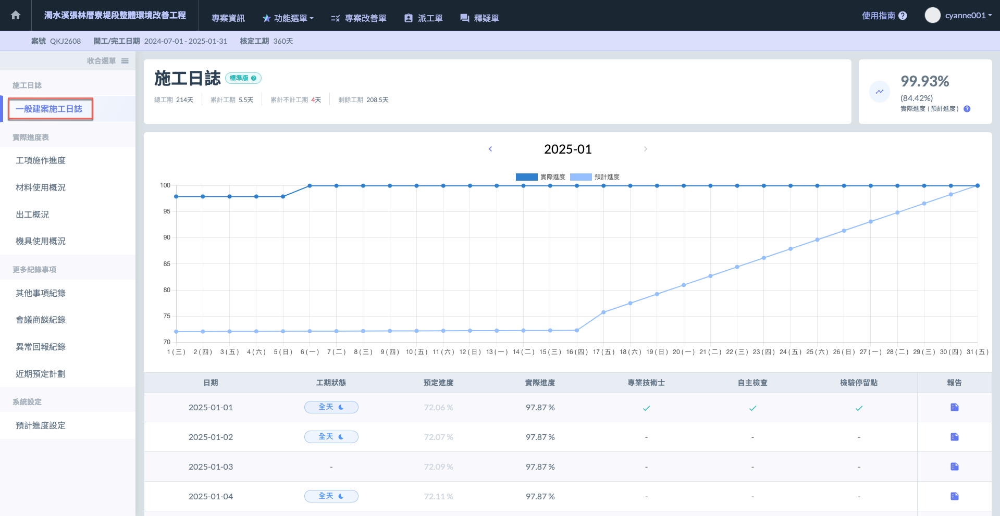
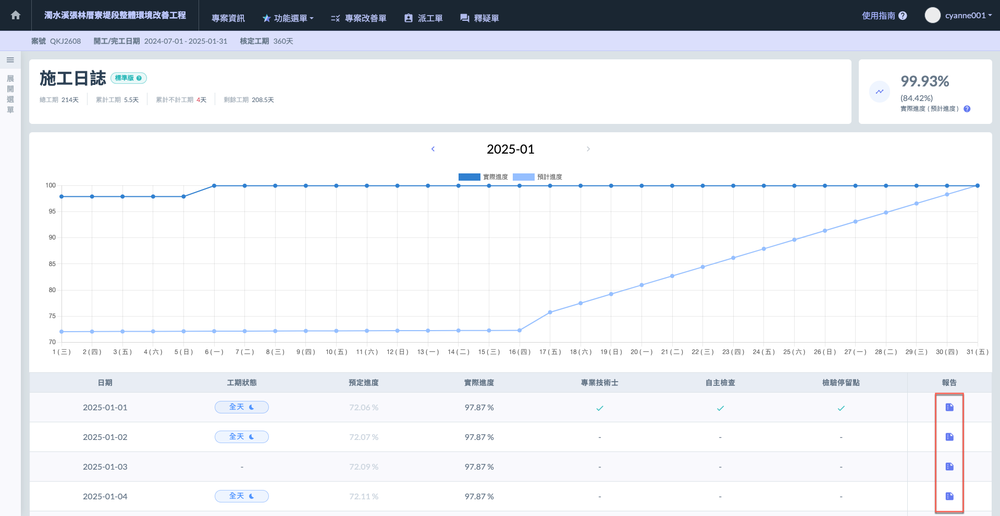
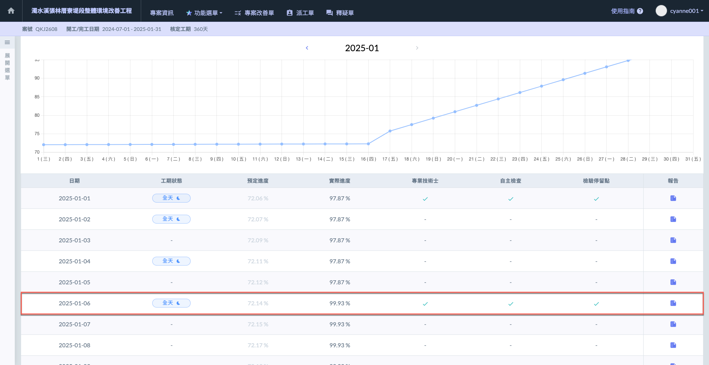
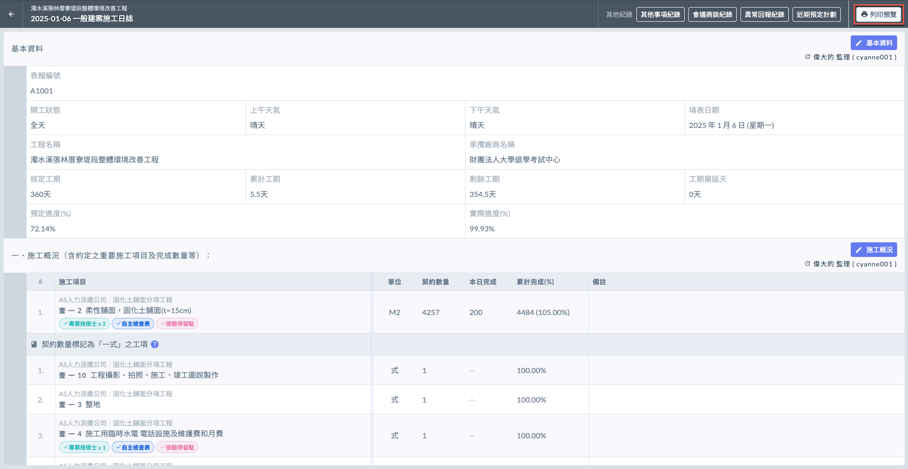
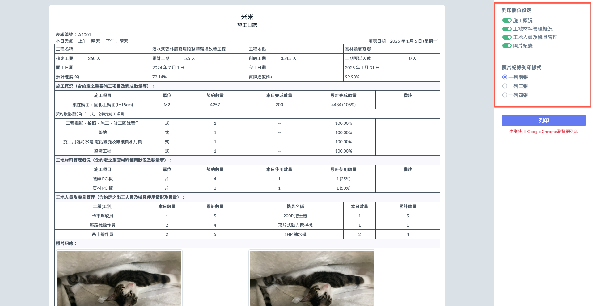

# 🖨️ 列印日誌

---
description: Printing
---

# 🖨️ 列印日誌

***

## 列印日誌

您有兩種途徑可以列印指定日期之施工日誌，分別為：直接於**日誌主頁面列印報告** / **進入日誌內列印**。

###  主頁面列印

選定欲列印之日期，如下圖紅框圈選處，於該日誌最右側報告欄位點選「」，即可列印該日日誌報告。

進入預覽頁面(右圖)，您可依需求設&#x5B9A;**「列印欄位設定」**&#x53CA;**「照片紀錄列印樣式」**。



您可選用是否列印：**施工概況**、**工地材料管理概況**、**工地人員與機具管理**、**照片紀錄**等資訊。



您可選用列印樣式：**一列兩張**、**一列三張**、**一列四張**。



 

可參考下方影片：

{% embed url="https://files.gitbook.com/v0/b/gitbook-x-prod.appspot.com/o/spaces%2FEqUCL3D5WQfpxJw8NL3P%2Fuploads%2FBoXJl6hP7jMPpW9Tc3bR%2F%E5%88%97%E5%8D%B0%E5%8D%B0%E5%A0%B1%E5%91%8A.mp4?alt=media&token=3508fdd1-590b-4e93-a4e6-7e9ced277ff3" %}

***

### 日誌內列印

選定欲列印之日誌，點擊該日誌進入日誌內部（下圖以2025-01-06之日誌為例）。

進入日誌後，如左圖紅框圈選處，於右上角處點&#x9078;**「🖨️ 列印預覽」**。即可預覽列印內容，並依需求選用需列印的欄位。

 

進入預覽頁面，您可依需求設&#x5B9A;**「列印欄位設定」**&#x53CA;**「照片紀錄列印樣式」**。



您可選用是否列印：**施工概況**、**工地材料管理概況**、**工地人員與機具管理**、**照片紀錄**等資訊。



您可選用列印樣式：**一列兩張**、**一列三張**、**一列四張**。



可參考下方影片：

{% embed url="https://files.gitbook.com/v0/b/gitbook-x-prod.appspot.com/o/spaces%2FEqUCL3D5WQfpxJw8NL3P%2Fuploads%2Fm4iD0dxKFYvYCjNdWO4K%2F%E5%88%97%E5%88%97%E5%8D%B0%E5%A0%B1%E5%91%8A%E5%91%8A.mp4?alt=media&token=91db2058-047e-4a0b-9d48-4a1f11d14126" %}
