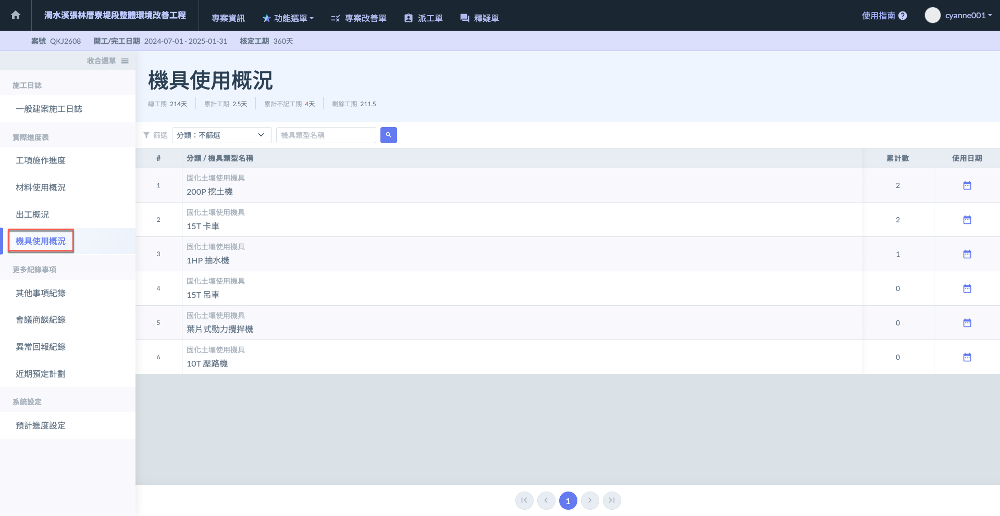
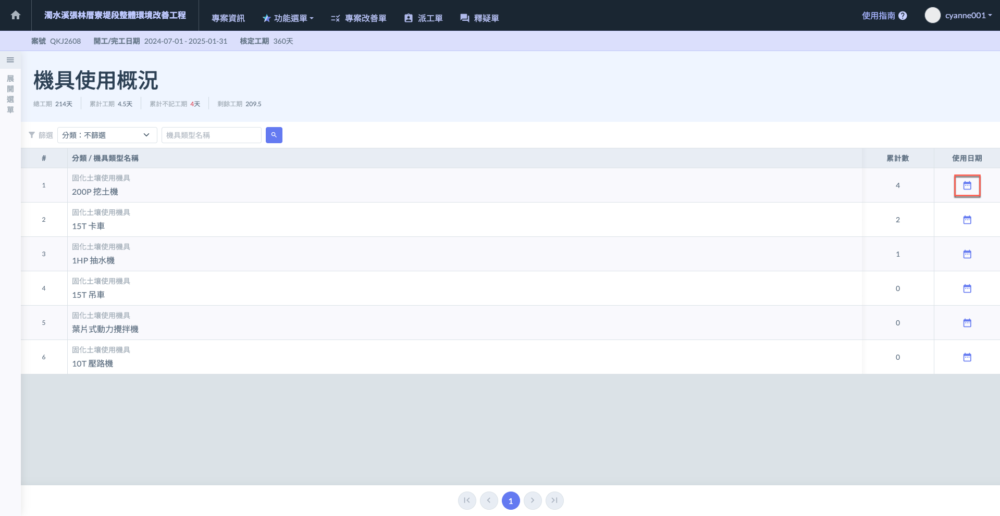
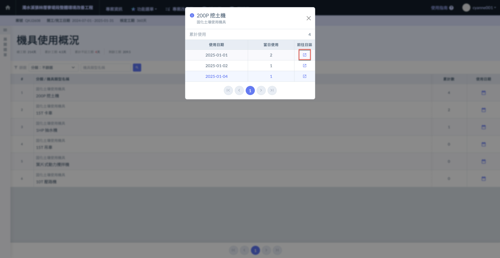
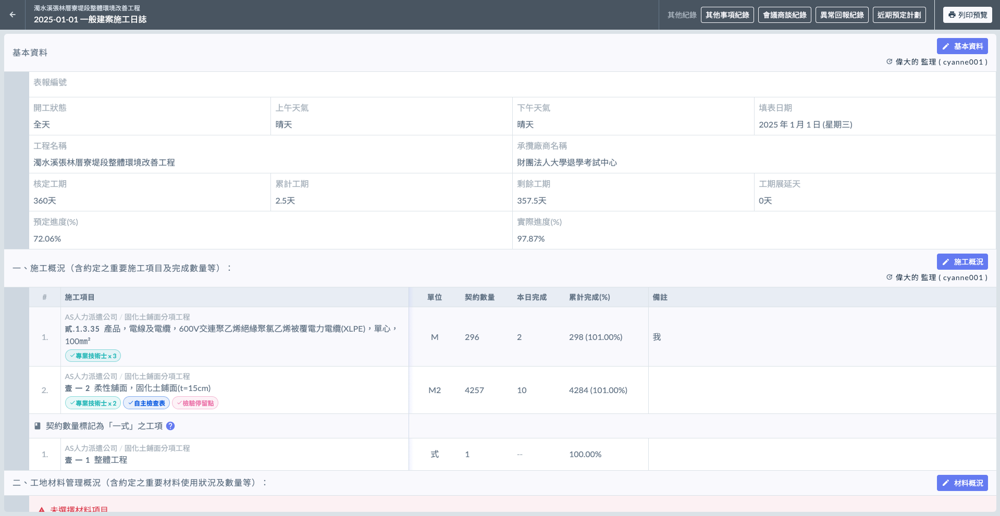
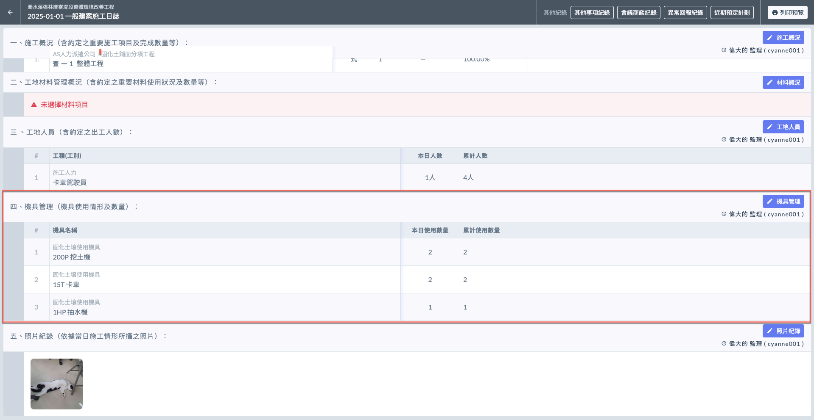
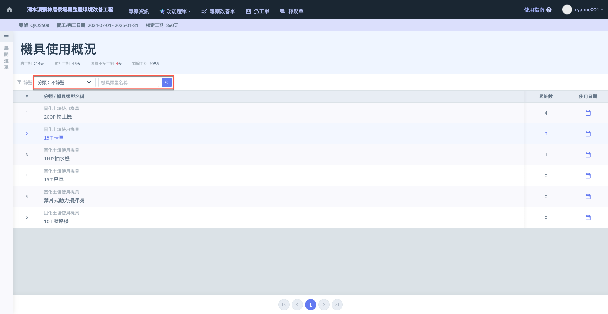
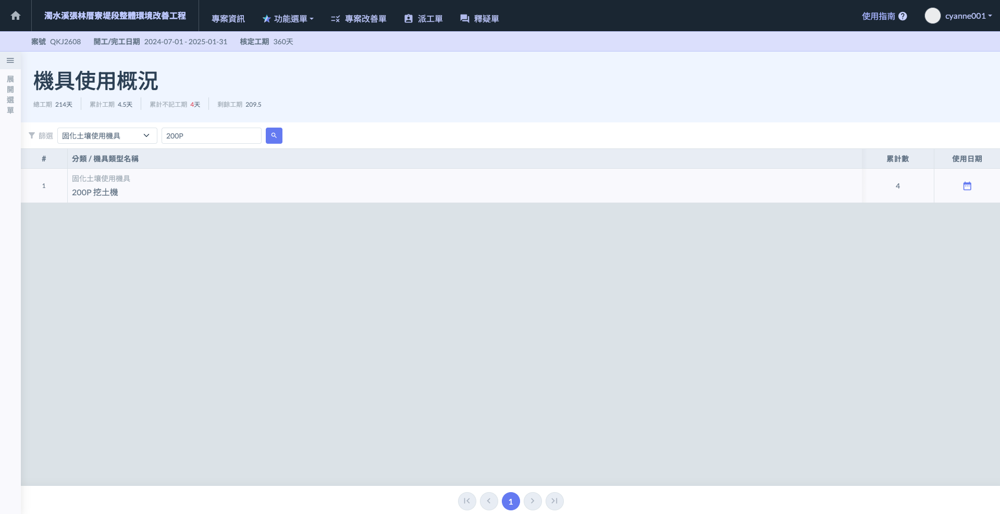

# 🚜 機具使用概況

---
description: Equipment Usage Overview
---

# 🚜 機具使用概況

此處將顯示您於**公司通用資料設定**所編列的**所有機具**。相關設定可參閱 **➙** 🔗 [機具類型](../../../../../../company_configuration/equipment)

根據施工日誌的填寫資料，系統自動彙整所有機具使用狀況於此呈現。

***

## 查看使用日期

進入主頁面後，會詳盡顯示所有機具&#x4E4B;**「累計量」**，並於使用日期內詳盡列出所有使用狀況。

如(圖一)紅框圈選處，於欲查看之機具右方，點選使用日期&#x4E4B;**「**&#xD83D;?️ **日曆符號」️**，即可查看該機具詳細使用情形。

系統會詳細顯示**使用日期**以及**當日對應的使用量**，並可直接前往當日日誌查看。

如(圖二)紅框圈選處，於欲查看之日期點選**前往日誌** (見圖三、圖四)。

如下圖，選定日期並前往日誌後，即會導至當天施工日誌紀錄。

 

***

## 機具篩選

當機具過於繁雜時，系統提供篩選功能，您可透過**分類**及**輸入機具名稱**進行查找 (如圖二演示)。

