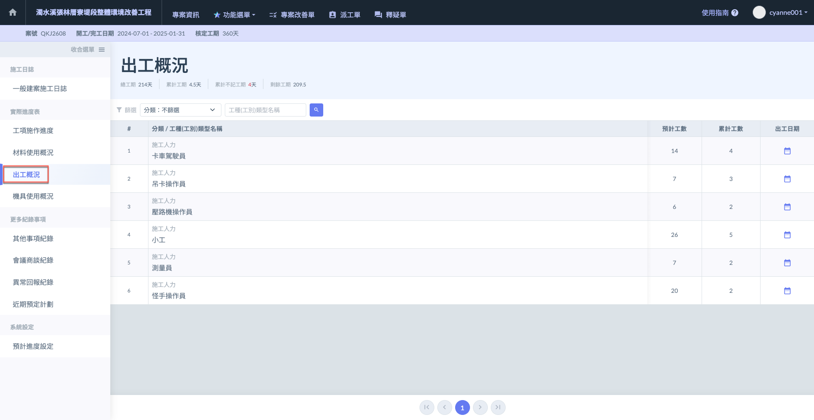
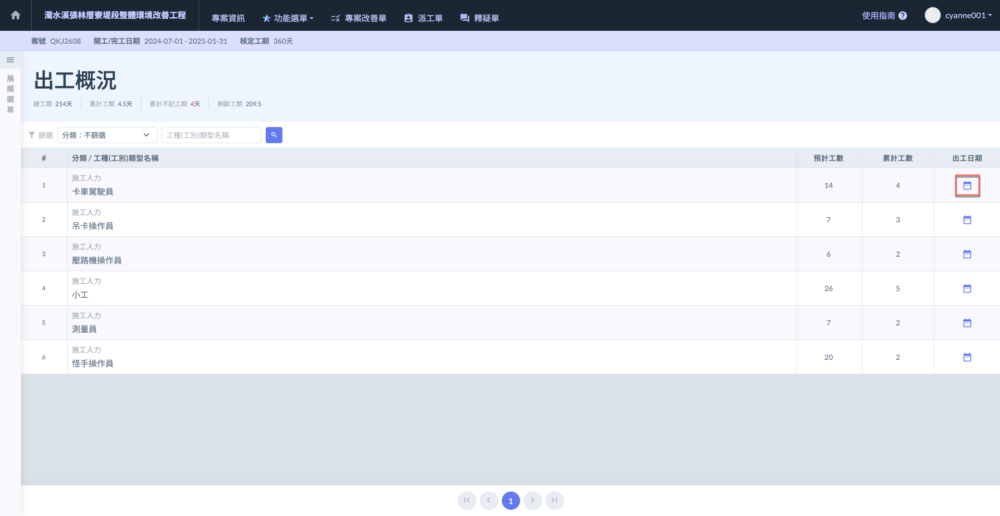
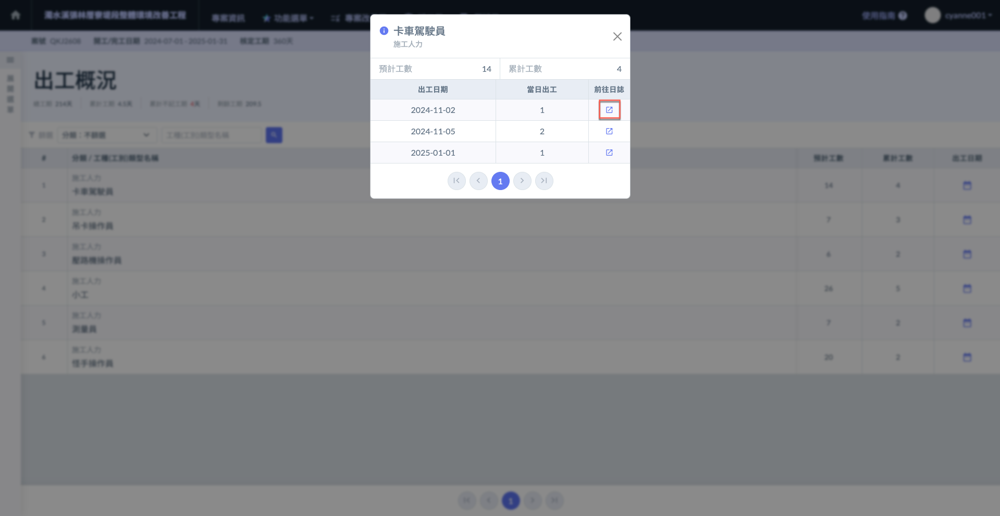
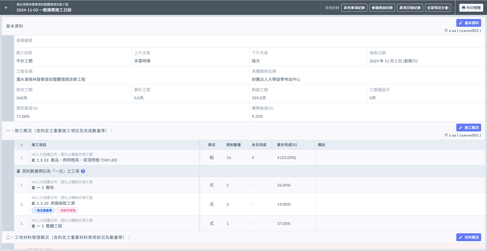
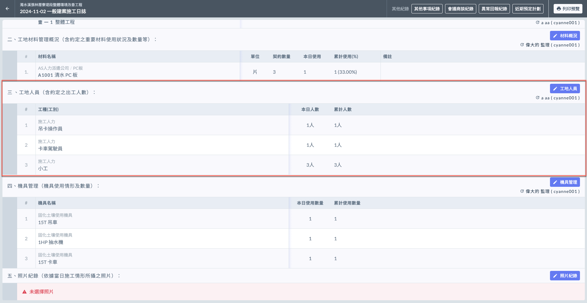
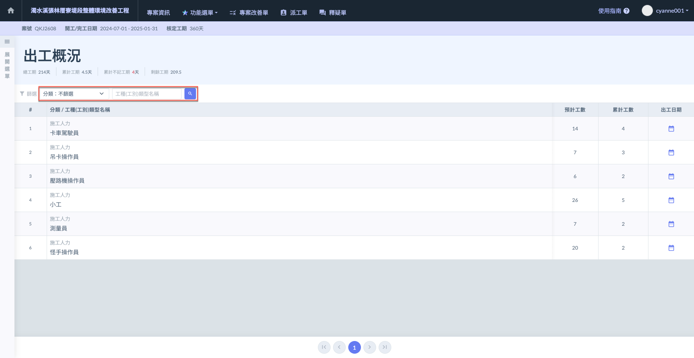
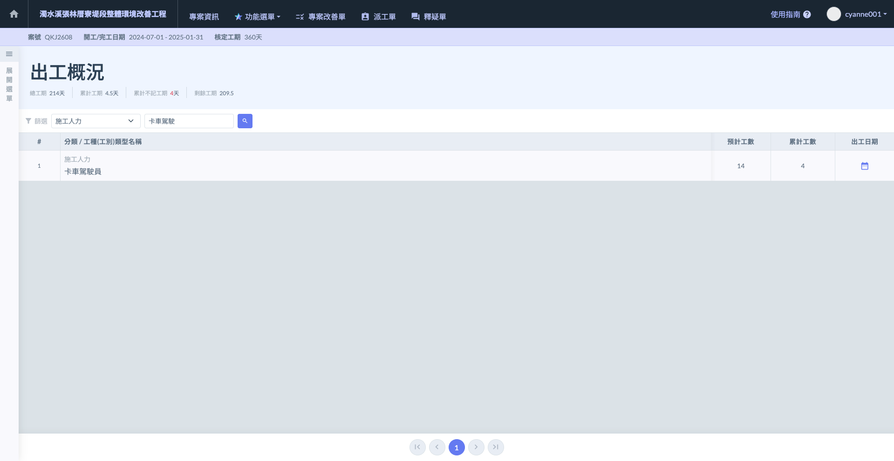

# 🦺 出工概況

---
description: Labor Deployment Overview
---

# 🦺 出工概況

此處將顯示您於**專案工種(工別)類型**所編列的**所有工種**。也因此會一併顯示**預計工數**，

相關設定可參閱 **➙** 🔗 [專案工種(工別)類型](../../../../../project_level/project_data/trade-category)

***

根據施工日誌的填寫資料，系統自動彙整所有出工狀況於此呈現。

***

## 查看使用日期

進入主頁面後，會詳盡顯示所有工種&#x4E4B;**「預計工數」**&#x53CA;**「累積工數」**，並於出工日期內詳盡列出所有出工狀況。

如(圖一)紅框圈選處，於欲查看之工種右方，點選使用日期&#x4E4B;**「**&#xD83D;?️ **日曆符號」️**，即可查看該工種詳細出工情形。

系統會詳細顯示**預計工數**與**累積工數**，並明列所有**出工日期之當日出工數**。並可直接前往當日日誌查看。

如(圖二)紅框圈選處，於欲查看之日期點選**前往日誌** (見圖三、圖四)。

如下圖，選定日期並前往日誌後，即會導至當天施工日誌紀錄。

 

***

## 工種篩選

當工種過於繁雜時，系統提供篩選功能，您可透過**分類**及**輸入工種名稱**進行查找 (如圖二演示)。

