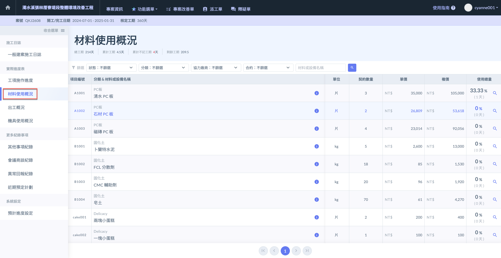
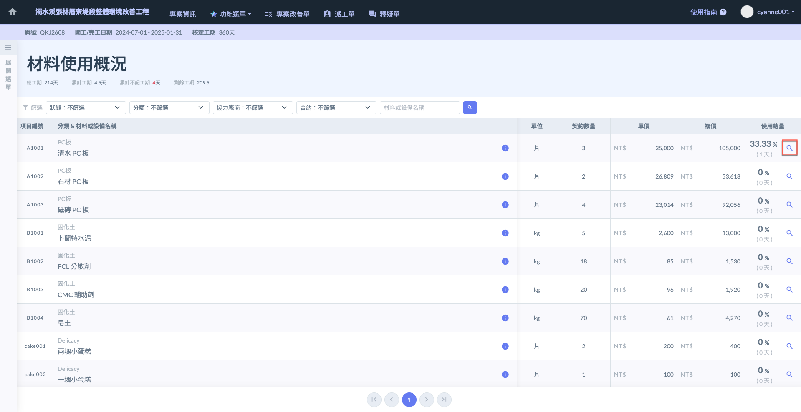
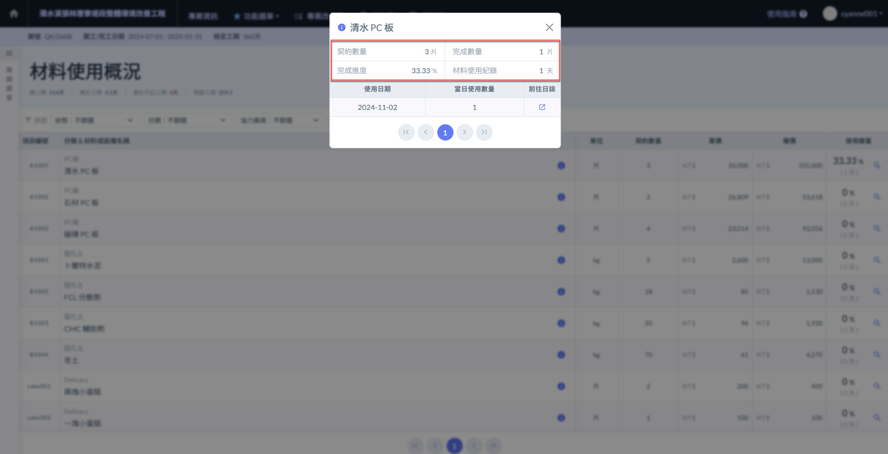
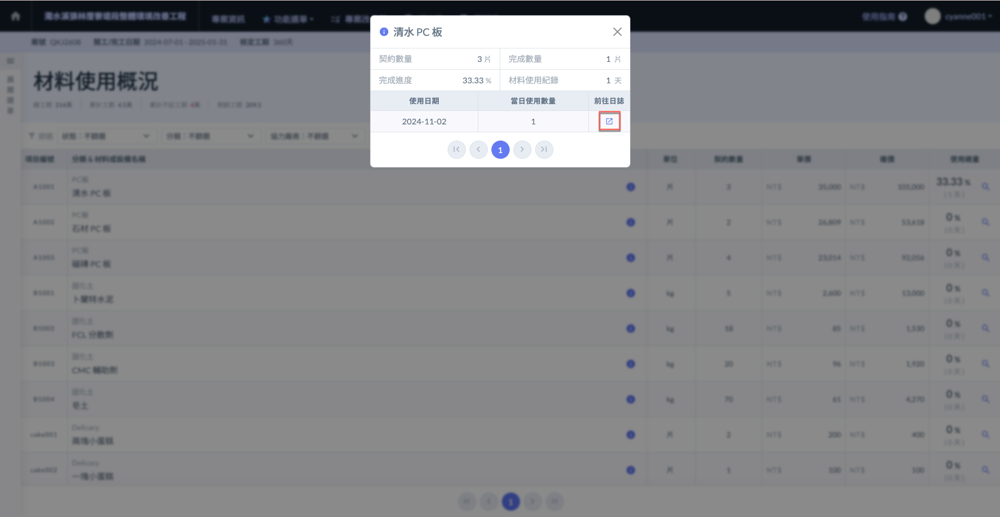
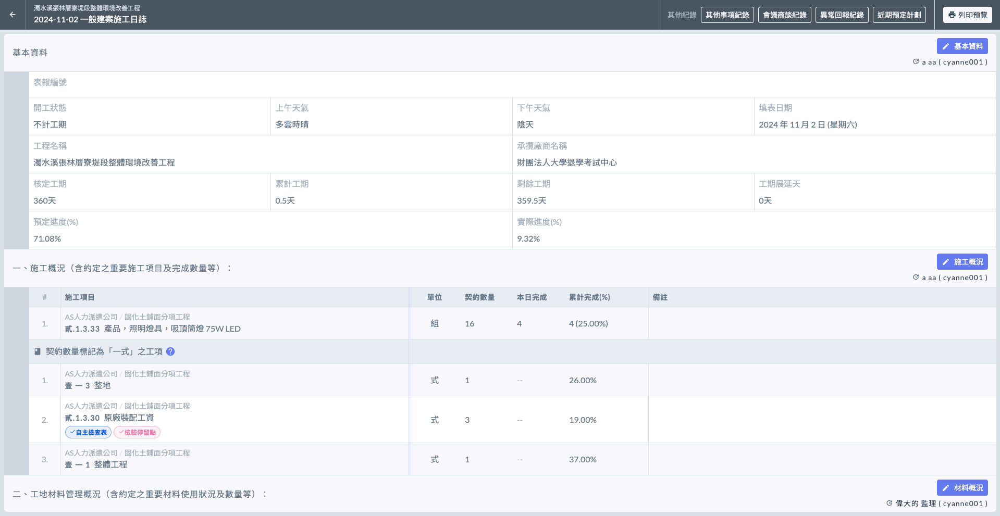
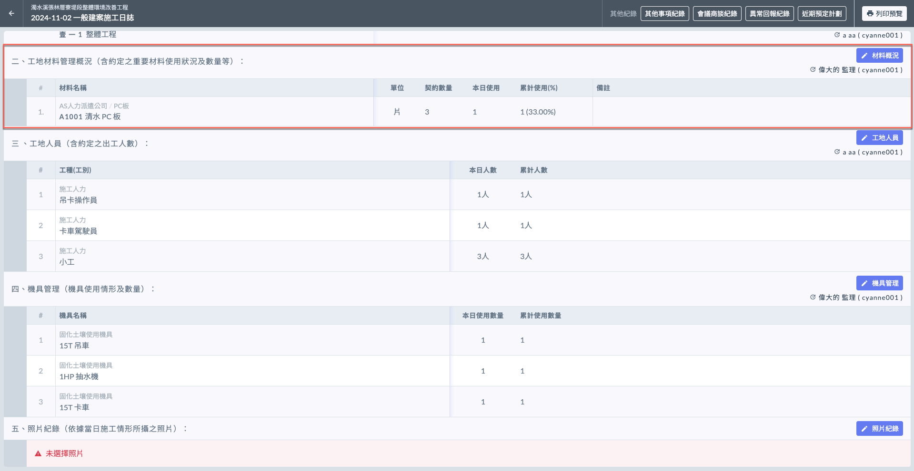
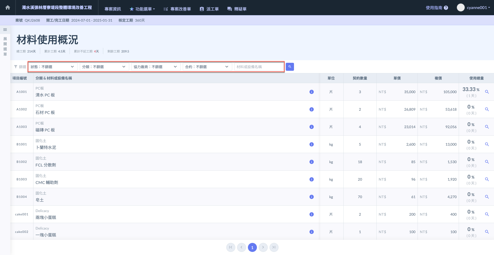
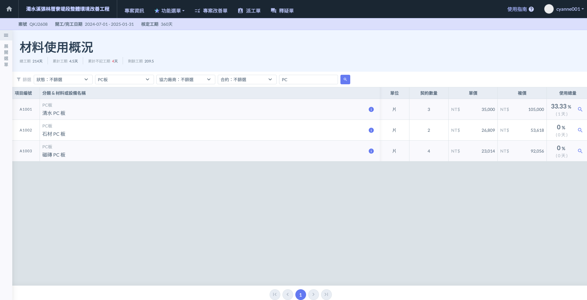

# 🧰 材料使用概況

---
description: Material Usage Overview
---

# 🧰 材料使用概況

此處將顯示您於**專案資料設定**之**材料管理**所編列的**所有材料**。也因此會一併帶入，**單位**、**契約數量**、**單價**及**複價**等先前於材料管理設定之專案資料。

相關設定可參閱 **➙** 🔗 [材料管理](../../../../../project_level/project_data/material_management)

***

根據施工日誌的填寫資料，系統自動彙整所有材料使用概況於此呈現。

***

## 查看使用總量

進入主頁面後，會詳盡顯示所有材料之**單位**、**契約數量**、**單價**、**複價**及**使用總量**，並於使用總量內詳盡列出所有材料使用狀況。

如(圖一)紅框圈選處，於欲查看之材料右方，點選使用總量&#x4E4B;**「**&#xD83D;? **放大鏡符號」️**，即可查看該材料詳細使用情形。

點選後，可詳盡查看**契約數量**、**完成數量**、**完成進度**及**材料使用紀錄**。並可直接前往當日日誌查看。

如(圖三)紅框圈選處，於欲查看之日期點選**前往日誌** (見圖四、圖五)。

如下圖，選定日期並前往日誌後，即會導至當天施工日誌紀錄。

 

***

## 材料篩選

當材料過於繁雜時，您可透過**狀態**、**分類、協力廠商**、**合約**及**材料名稱**進行查找 (如圖二演示)。

(圖二)範例僅以**分類**和**材料名稱**作篩選。

