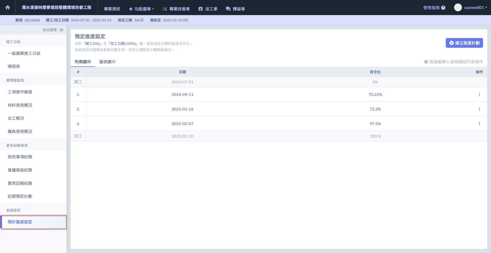
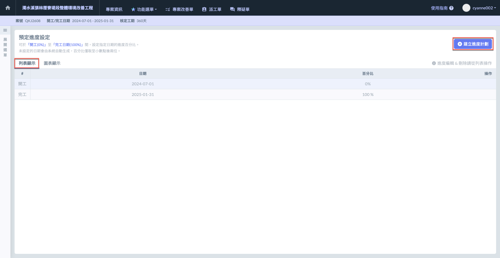
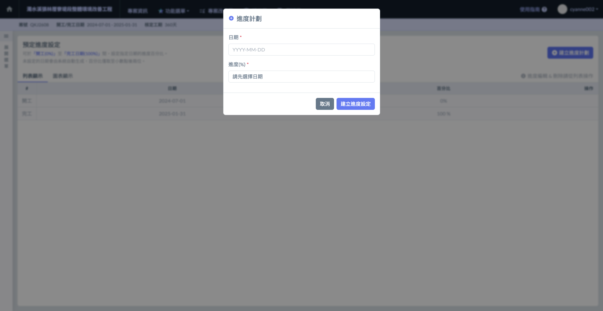
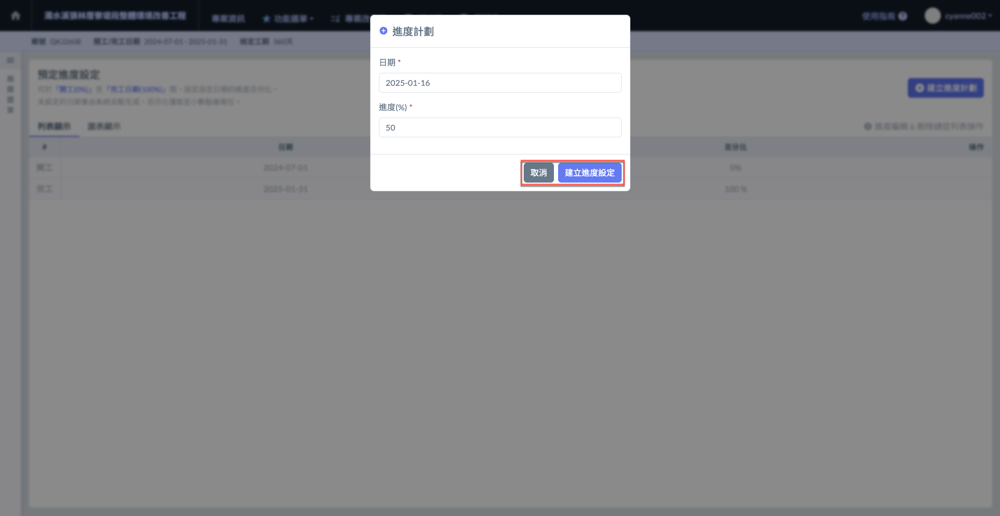
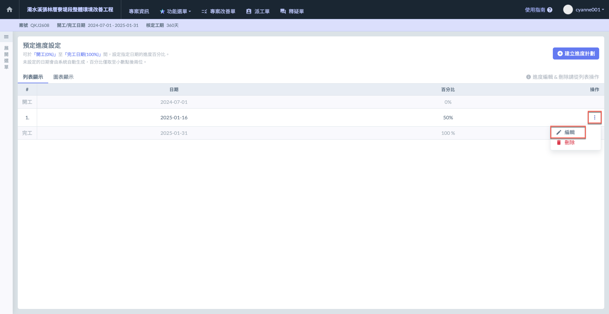
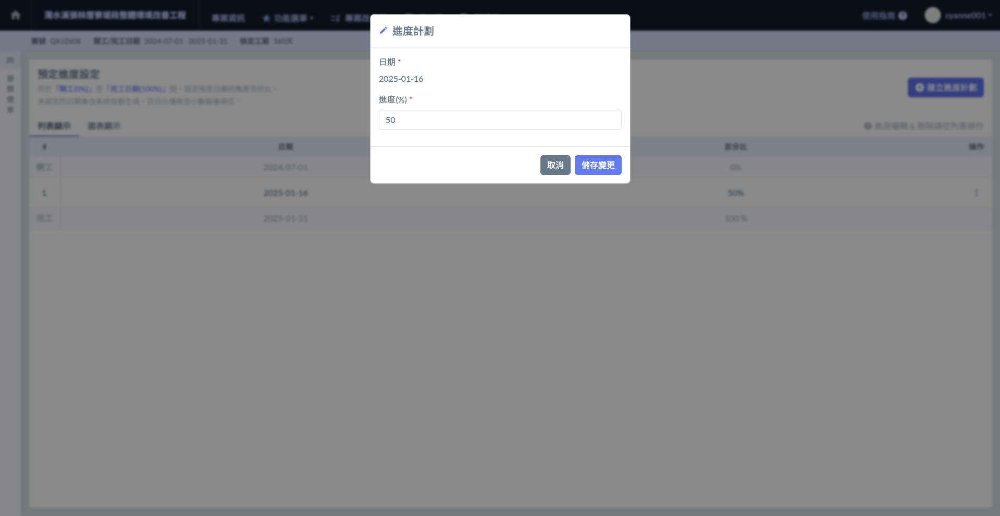
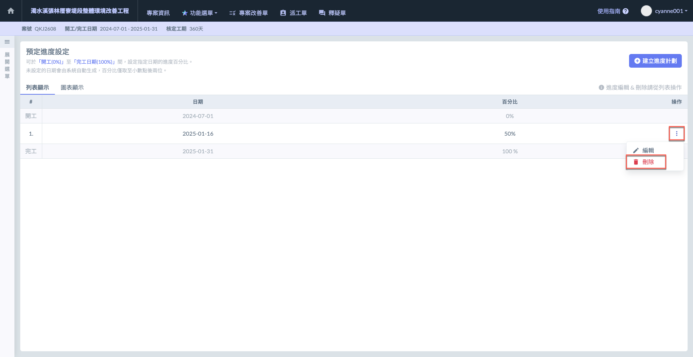
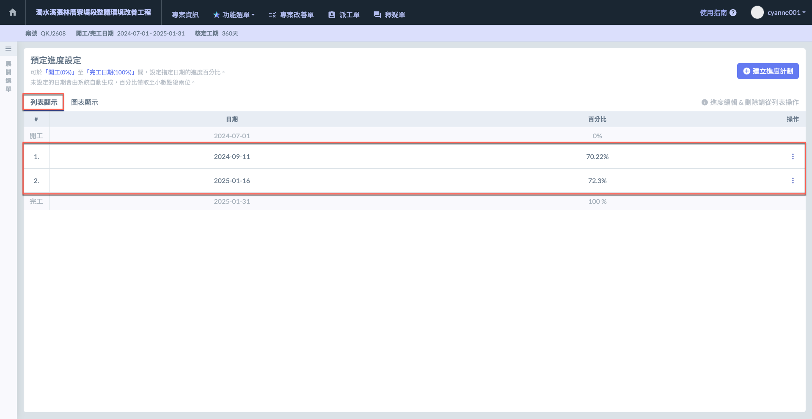

# 預計進度設定

預計進度設定頁面共&#x6709;**「列表顯示」**&#x53CA;**「圖表顯示」**&#x5169;種顯示模式。

進度編輯與刪除請於列表模式中操作。

***

## 列表顯示

### 建立進度計畫

!!! tip
    可於「開工 (0%)」至「完工日期 (100%)」間，設定指定日期之進度百分比。 未設定之日期將由系統自動生成。

進入主頁面後，點選下圖紅框圈選處&#x4E4B;**「新增進度計畫」**，即可選定日期並填寫該日期之預定進度。

請先選取日期，再填寫該日期之預定進度。

填寫完畢且確認無誤後，點&#x9078;**「建立進度設定」**&#x5373;可保留資料。

***

### 編輯 / 刪除進度計畫

#### 編輯計畫

於欲操作之計畫最右側，點選操作內&#x4E4B;**「編輯」**，即可修改該日期之**預定進度**。

#### 刪除計畫

於欲操作之計畫最右側，點選操作內&#x4E4B;**「刪除」**，即可刪除該筆預定計畫。

***

## 圖表顯示

此處之圖表資料是根據列表模式中設置的進度資料生成的。

!!! info
    即，於列表增列之預定計畫亦會一併同步於圖表中。

### 建立進度計畫

!!! tip
    於此處建立進度會更直觀，因為您能直接看到曲線變化。建立之資料會一併同步於列表中。

請見下方影片：

{% embed url="https://files.gitbook.com/v0/b/gitbook-x-prod.appspot.com/o/spaces%2FEqUCL3D5WQfpxJw8NL3P%2Fuploads%2F9VfnhywS2HPjXcQO0ETF%2F2025-01-16_14-50-51.mp4?alt=media&token=b9bdd9ae-5618-4070-8111-0d232e4b2dc2" %}

如上述所說，建立之資料會一併同步於列表中。

