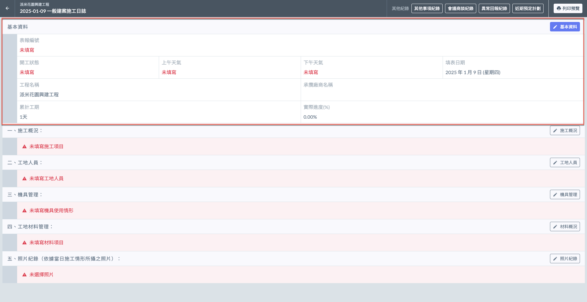
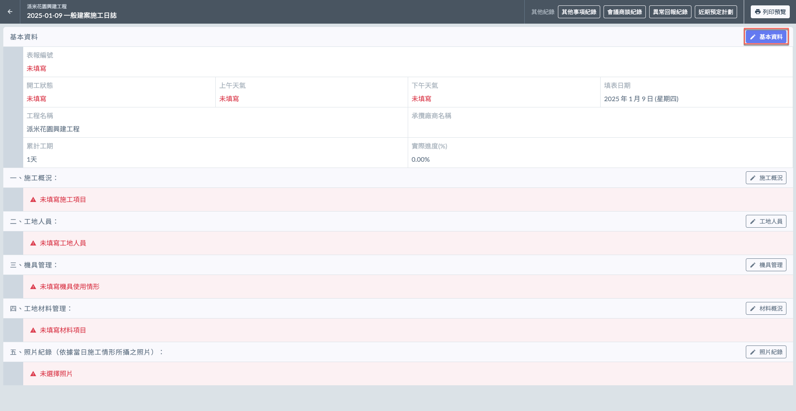
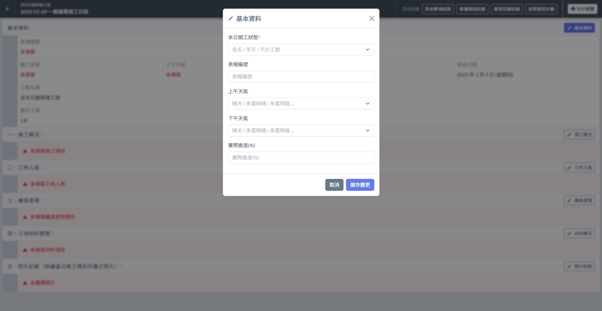

# 日誌 / 基本資料

---
description: Log / Basic Information
---

# 日誌 / 基本資料

!!! info
    在填寫日誌的其他內容之前，必須先完成基本資料的填寫。

## 欄位說明

與標準版相比，精簡版缺少**核定工期**、**剩餘工期**、**工期展延天**與**預定進度 (%)** 等相關資訊。

!!! warning
    精簡版除不會帶入專案設定資料外，亦不會統計彙整施工進度、材料使用、機具使用及出工概況等資訊。詳細差異請參閱 **➙** 🔗 [標準版與精簡版差異](../../standard_simplified)

 資料欄位說明

**表報編號**\
指的是施工日誌中每一份報表的唯一識別編號。這個編號用來追蹤和管理每一日的施工記錄，確保每個施工日誌都能與對應的工程進度及紀錄資料準確匹配。

**開工狀態**\
由使用者根據當日施工情況填寫，選項包括全天、半天及不計工期。該選項反映當日施工的實際情況，用於工期管理和進度跟蹤。

**上午天氣**\
系統提供的選項包括晴天、多雲時晴、多雲時陰、陰天、小雨、多雲陣雨、雷雨、豪雨等，幫助記錄施工過程中的天氣狀況，並作為後續分析進度延誤原因的參考。

**下午天氣**\
系統提供的選項與上午天氣相同，包括晴天、多雲時晴、多雲時陰、陰天、小雨、多雲陣雨、雷雨、豪雨等，用於記錄下午施工期間的天氣狀況。

**填表日期**\
無需填寫，系統會自動帶入施工日誌的日期，確保每一份日誌都有準確的時間戳。

**工程名稱**\
無需填寫，系統會根據專案基本資訊自動填入專案名稱，與施工日誌相關聯。

**承攬廠商名稱**\
無需填寫，系統會根據專案角色資訊自動填入承攬廠商名稱，確保與相關業者的責任範疇匹配。

**累計工期**\
由系統根據日誌中填寫的開工狀態自動加總計算。比如，若一天的日誌記錄為全天，另一日為半天，則累計工期為1.5天。

**實際進度 (%)**\
系統不會自動計算並彙總進度，您需要在每次填寫日誌時，手動更新實際進度。

***

## 填寫基本資料

進入日誌畫面後，如下圖紅框圈選處，點&#x9078;**「**&#xD83D;?️**基本資料」**，即可開啟填寫視窗。

填寫**本日開工狀態 ( 必填 )**、**表報編號**、**上午天氣**、**下午天氣**及**實際進度**等資訊。填寫完畢且確認無誤後，請點&#x9078;**「儲存變更」**&#x5373;可保留資料。

