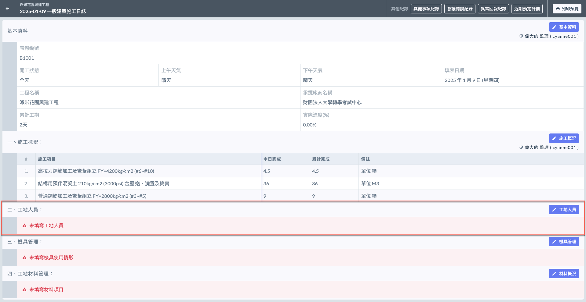
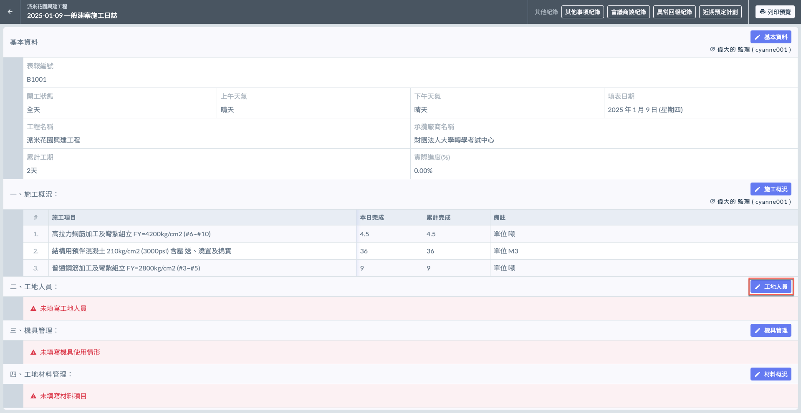
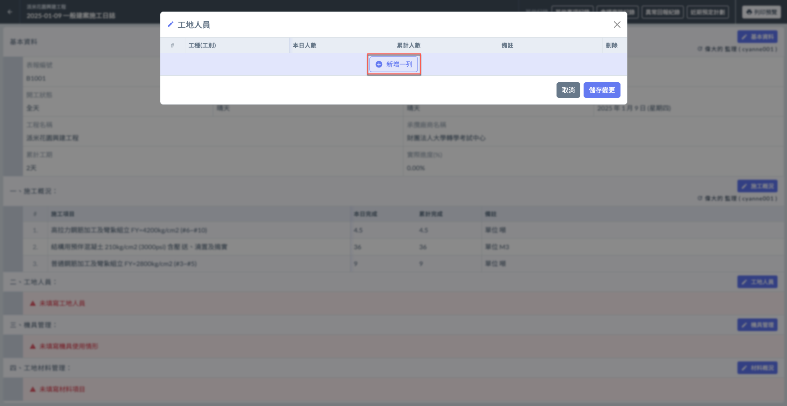
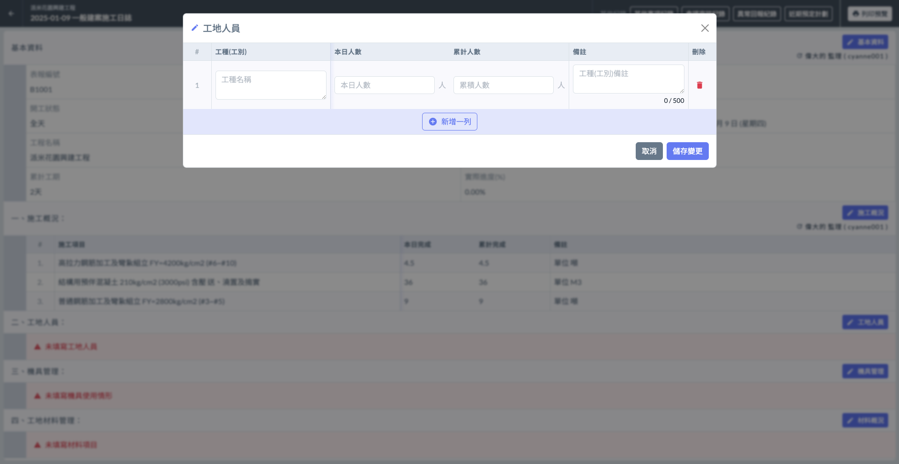
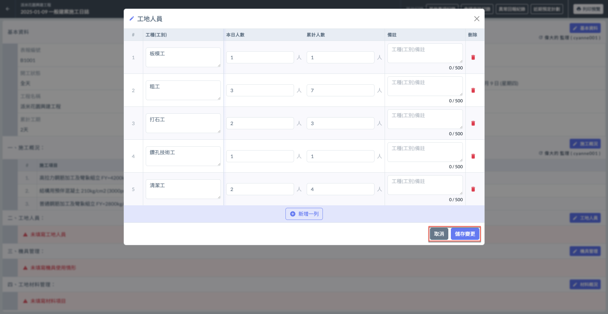
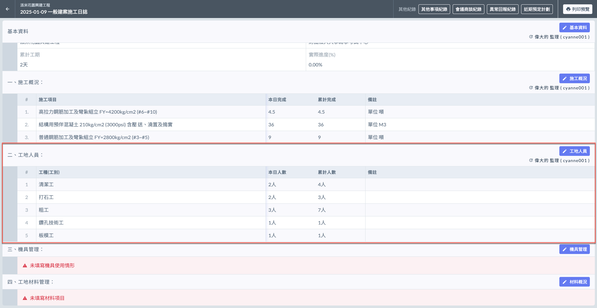
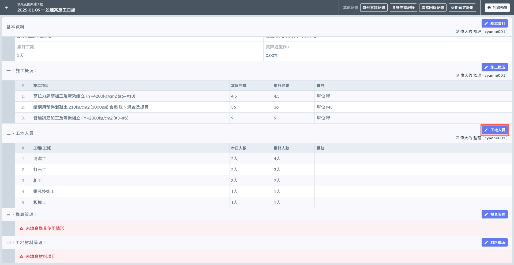
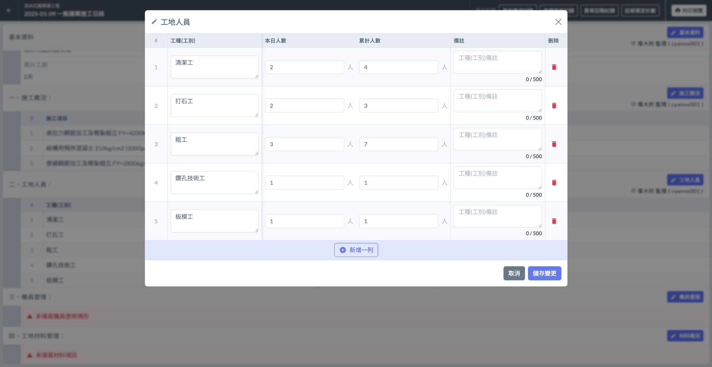
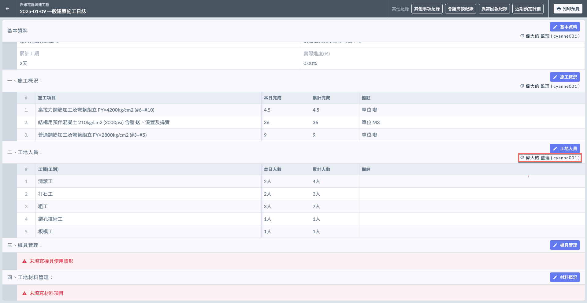

# 日誌 / 工地人員

工地人員項目記錄當日施工現場的人員出工情況。

!!! info
    在填寫日誌的工地人員之前，必須先完成基本資料的填寫。

***

## 出工概況

如下圖紅框圈選處，於工地人員欄位之右側處，點&#x9078;**「**&#xD83D;?️ **工地人員」**，即可開始增列出工工種。

### 填寫出工工種

點&#x9078;**「＋新增一列」**(左圖)後，即可開始填寫**工種**名稱、**本日人數**、**累計人數**與**備註**。

!!! warning
    由於精簡版並不會套用專案資料，因此所有資料都必須由使用者手動填寫。

 

將資料填寫完畢後，即可按&#x4E0B;**「儲存變更」**&#x4FDD;存資料(左圖)。完成後即如(右圖)顯示。

 

***

### 編輯出工概況

欲修改現有資料，點&#x9078;**「**&#xD83D;?️ **工地人員」**，可對各項目編輯（工種名稱、本日人數/累積人數、備註或刪除）。

如需新增工種，點&#x9078;**「＋新增一列」**&#x4E26;重複上述操作即可。

 

#### 查看最後編輯人

如下圖紅框圈選處，系統會顯示最後更動資料的使用者。

