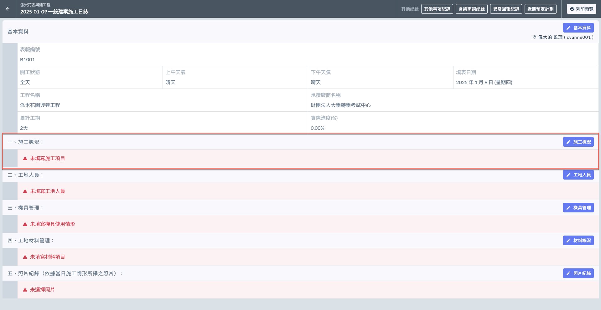
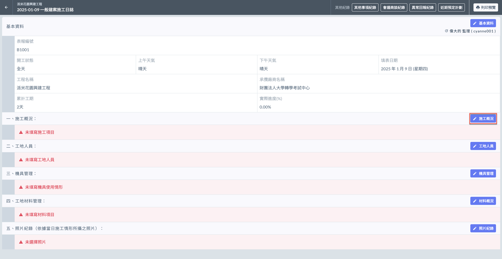
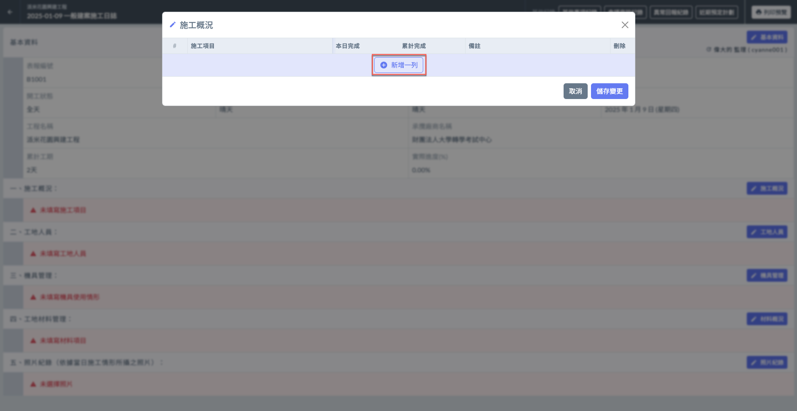
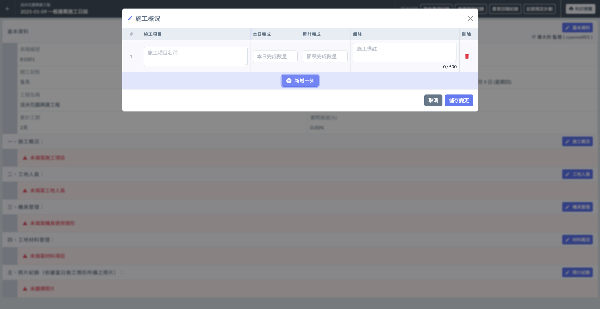
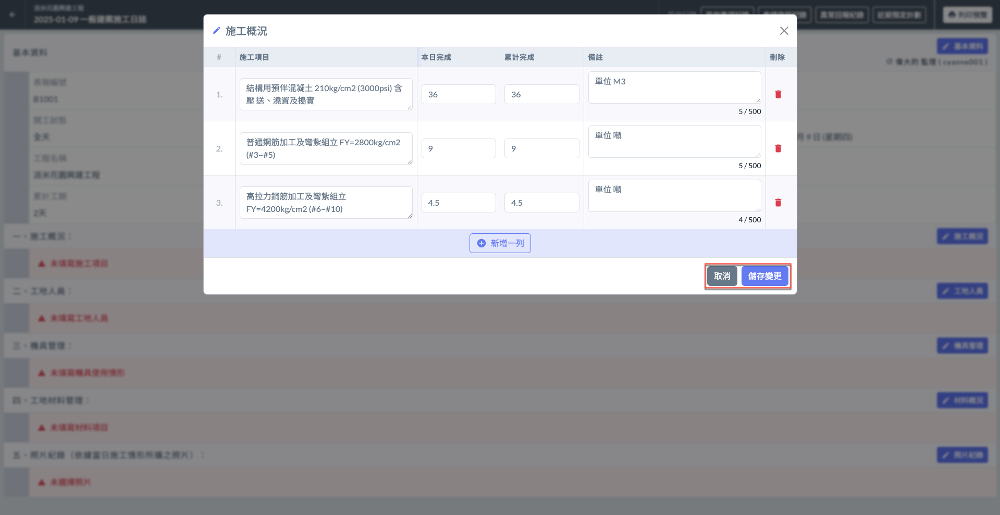
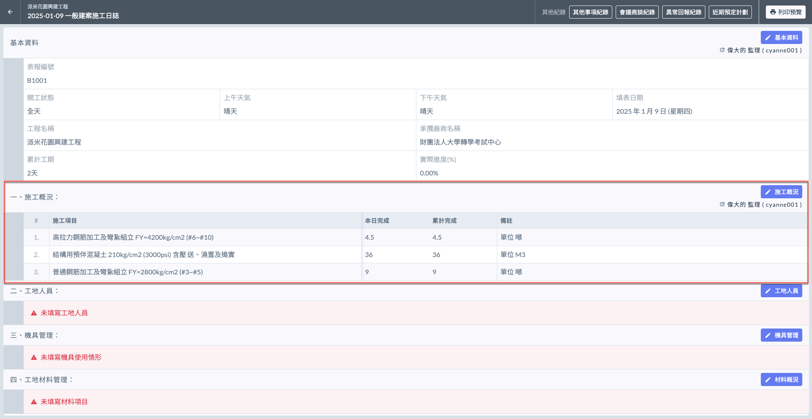
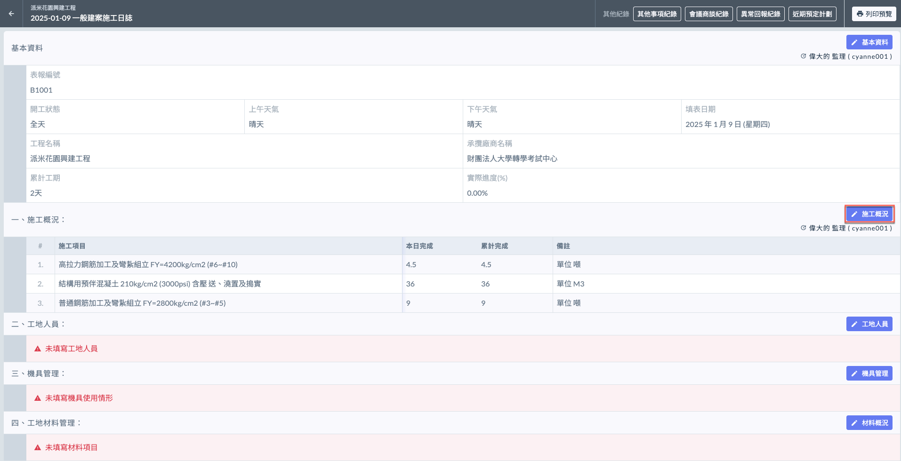
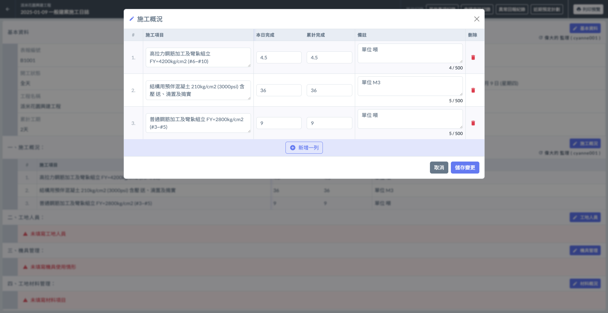
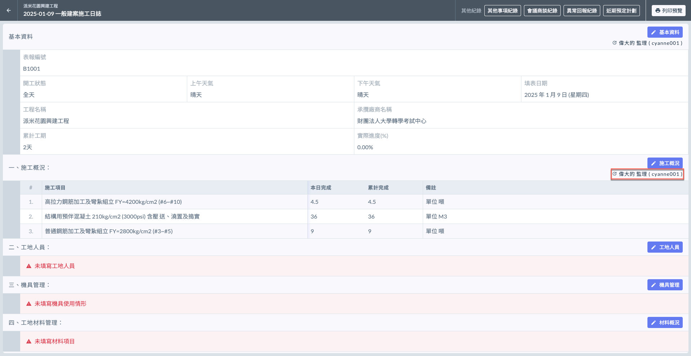

# 日誌 / 施工概況

施工概況記錄當日施工的主要內容及進度。幫助使用者簡要描述當日的施工工作，包括已完成的工作項目、進度狀況、特殊情況等。

!!! info
    在填寫日誌的施工概況之前，必須先完成基本資料的填寫。

***

## 施工概況

如下圖紅框圈選處，於施工概況欄位之右側處，點&#x9078;**「**&#xD83D;?️ **施工概況」**，即可開始增列施工項目。

### 填寫施工工項

點&#x9078;**「＋新增一列」**(左圖)後，即可開始填寫**施工項目**名稱、**本日完成**、**累計完成**與**備註**。

!!! warning
    由於精簡版並不會套用專案資料，因此所有資料都必須由使用者手動填寫。
    
    亦不會有是否為一式項目之功能讓您選擇，皆須由您自行備註。

 

將資料填寫完畢後，即可按&#x4E0B;**「儲存變更」**&#x4FDD;存資料(左圖)。完成後即如(右圖)顯示。

 

***

### 編輯施工概況

欲修改現有資料，點&#x9078;**「**&#xD83D;?️ **施工概況」**，可編輯各工項（工項名稱、修改本日完成數/累積完成數量、備註或刪除）。

如需新增工項，點&#x9078;**「＋新增一列」**&#x4E26;重複上述操作即可。

 

#### 查看最後編輯人

如下圖紅框圈選處，系統會顯示最後更動資料的使用者。

