# 日誌 / 其他事項紀錄

---
description: Log / Miscellaneous Record
---

# 日誌 / 其他事項紀錄

刪除紀錄如下圖所示，進入日誌後，點選右上角&#x4E4B;**「其他事項紀錄」**。

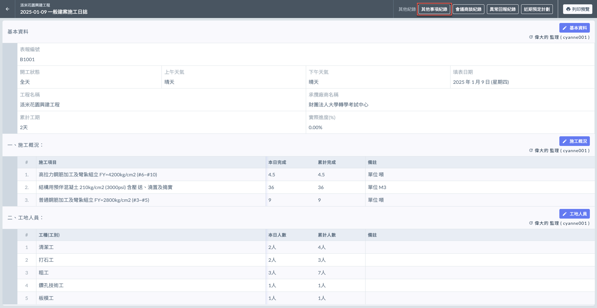

***

## 📝 01｜新增紀錄

!!! warning
    您只能新增日誌對應日期之紀錄（即紀錄日期跟隨日誌日期，使用者不能任意選擇日期）。
    
    如欲隨機指定日期可從其他日期的日誌進行新增，或是從 **➙** 🗂️ [其他事項紀錄](../../additional-records/miscellaneous-record) 中新增。

進入日誌主頁面後，點選右上角&#x4E4B;**「其他事項紀錄」**，接著如左圖的紅框圈選處點&#x64CA;**「＋其他事項紀錄」**。如此便會進入右圖所示的新增畫面，開始填寫其他事項紀錄之內容。

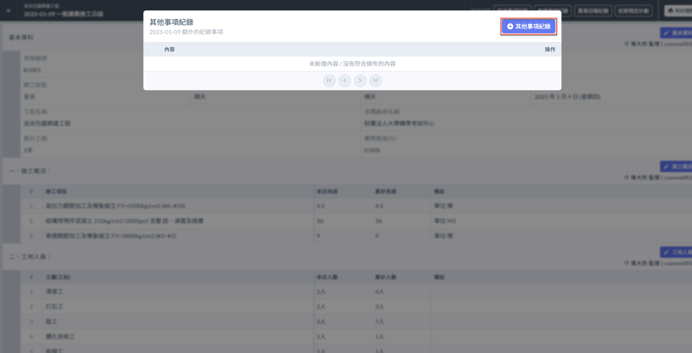 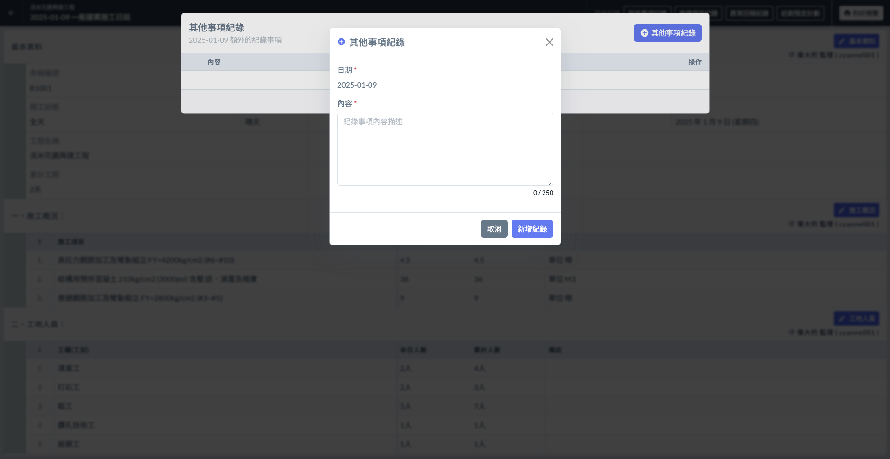

將資料填寫完畢並確認無誤後，點&#x9078;**「新增紀錄」**&#x5373;可保留此筆資料，完成畫面見右圖。

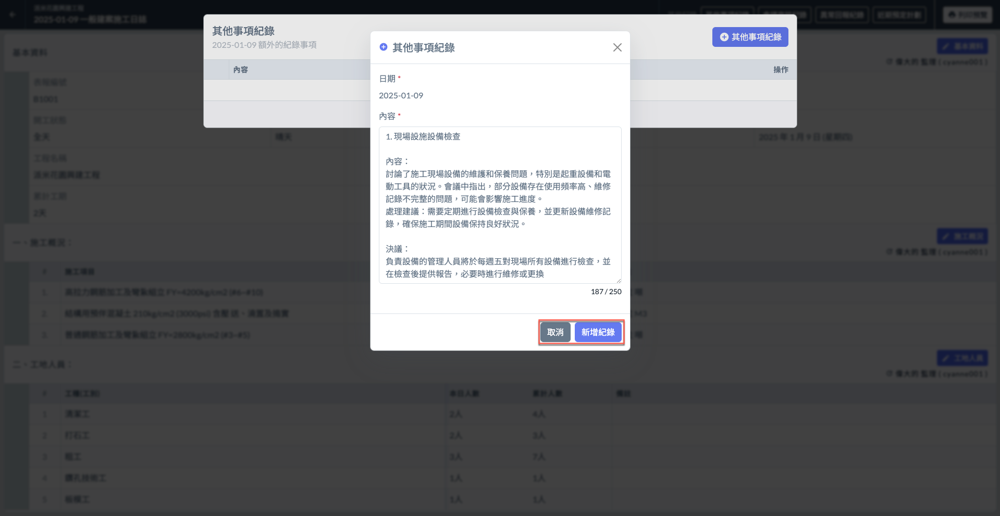 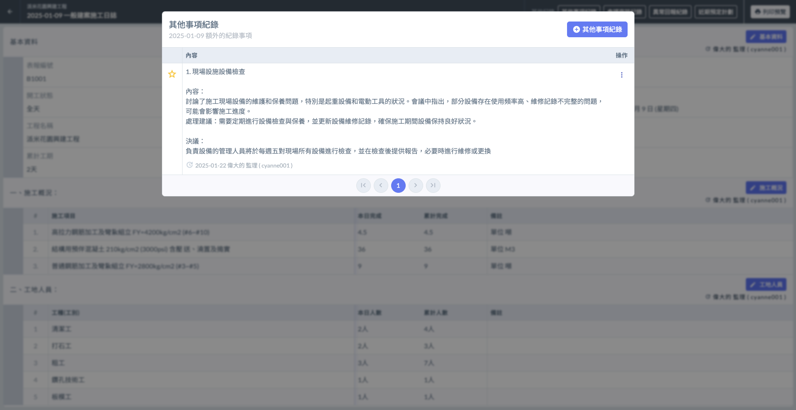

***

## ✏️ 02｜編輯/刪除記錄

### 編輯記錄

於欲編輯之紀錄事項之最右側，點選操作欄位&#x4E4B;**「編輯」**(圖一)，即可修改該筆紀錄。

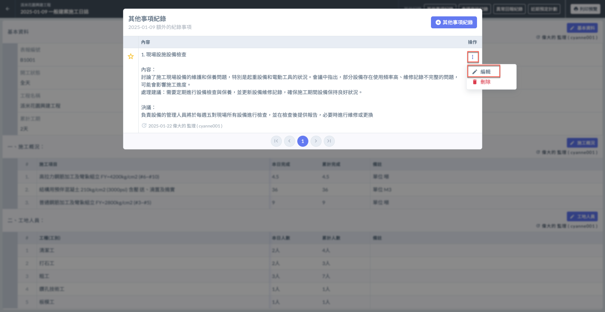 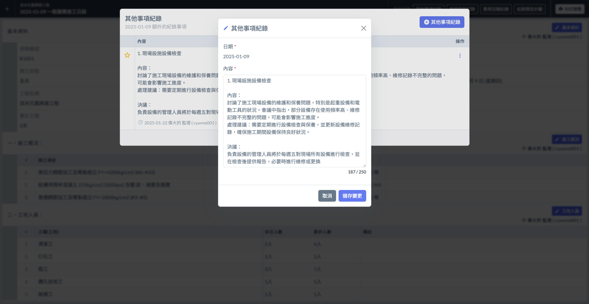

#### 最後編輯人

如下圖紅框圈選處，系統會顯示最後更動資料的使用者。

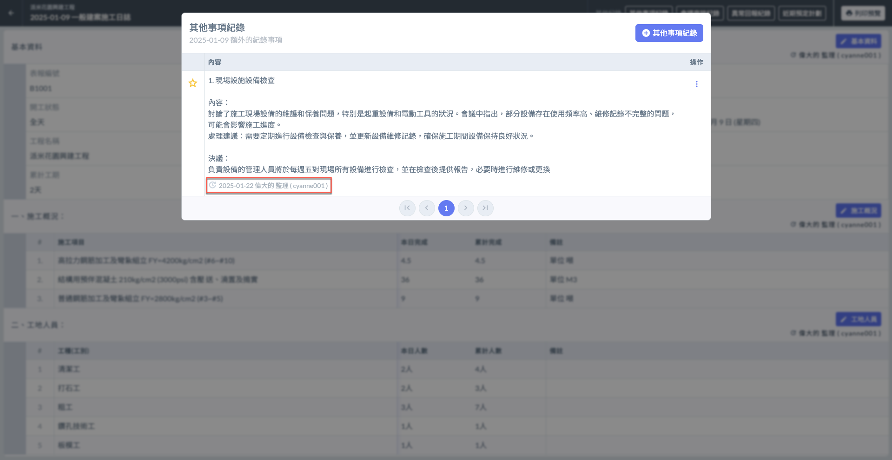

### 刪除紀錄

於欲刪除之紀錄事項之最右側，點選操作欄位&#x4E4B;**「刪除」**(圖一)，即可刪除該筆紀錄。

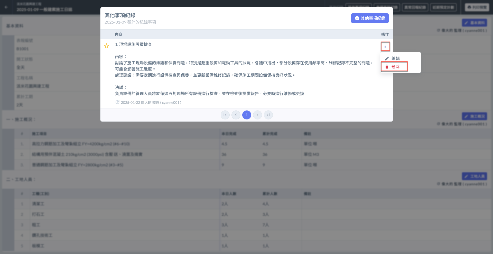 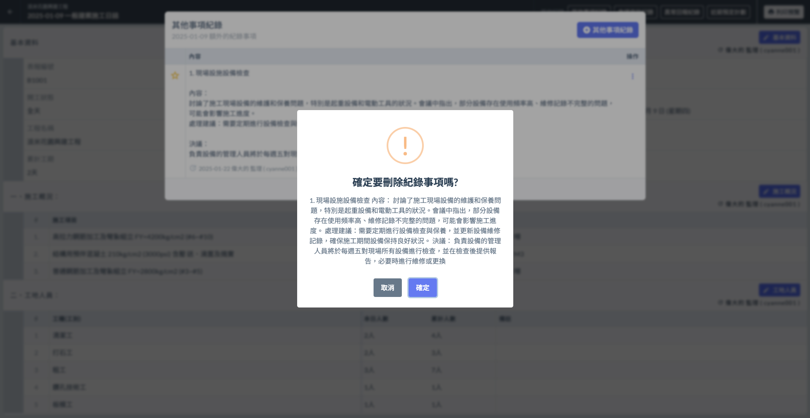

***

## ⭐️ 03｜釘選紀錄

如有重要事項需**保留於列表最上方**，可點選列表左側之**星星**進行釘選。再次點選則可取消釘選。

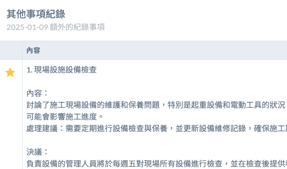 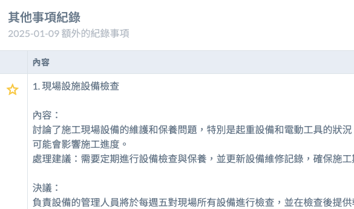

