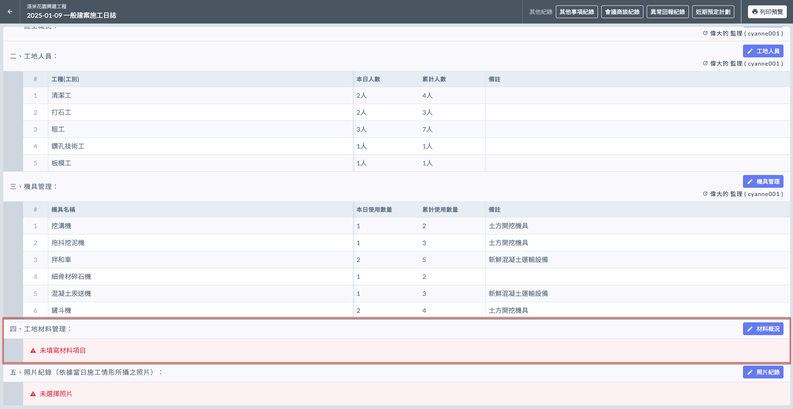
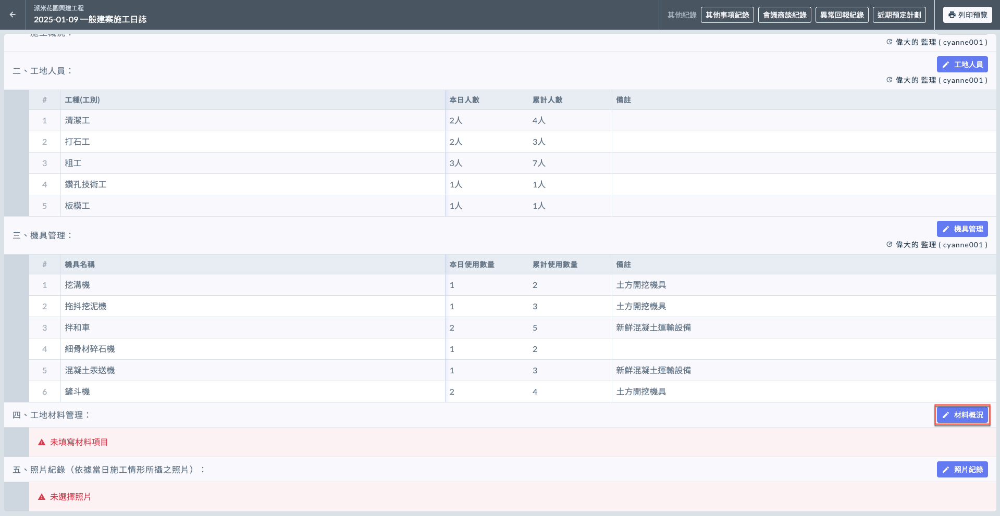
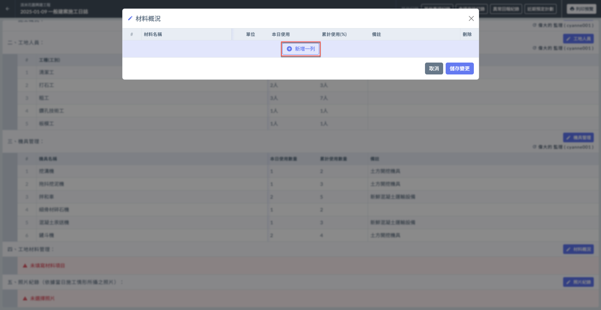
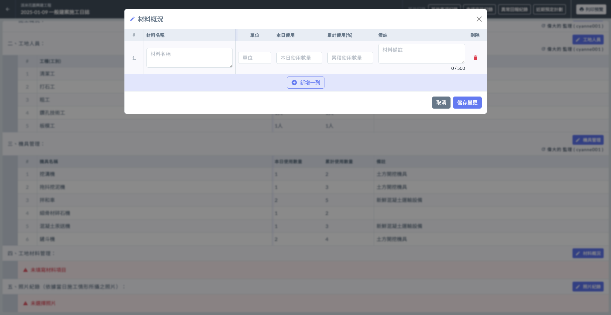
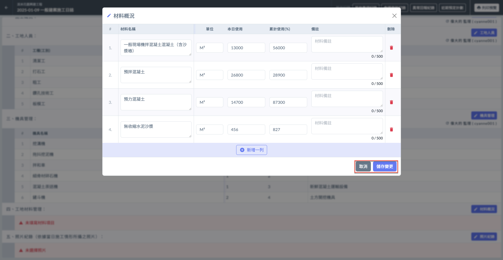
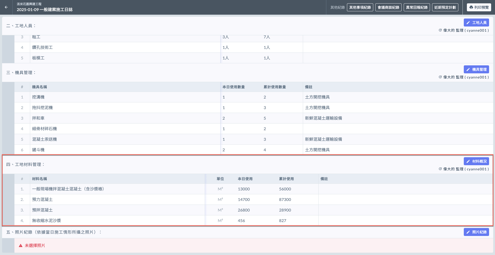
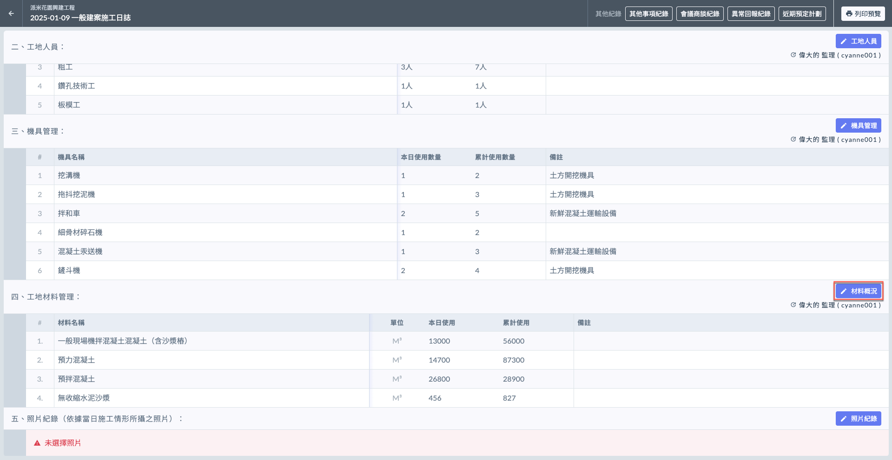
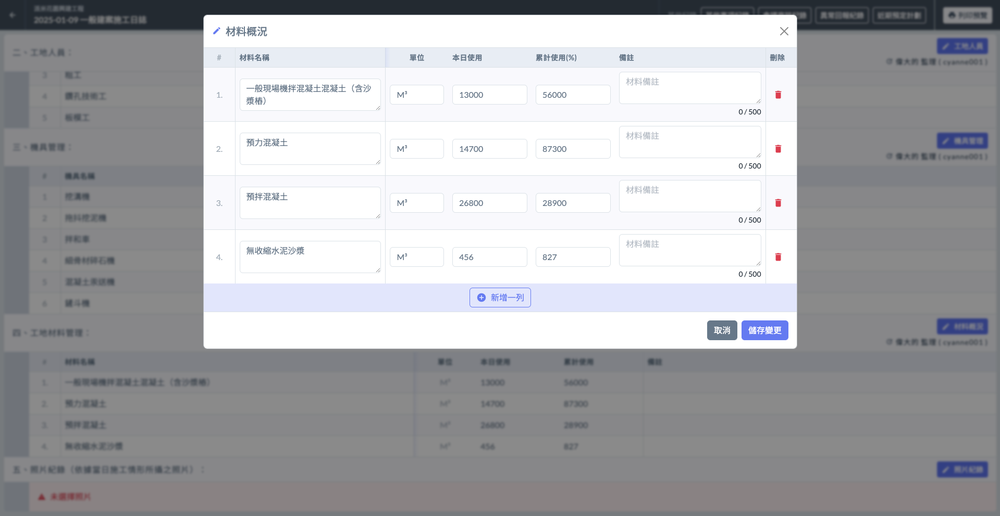
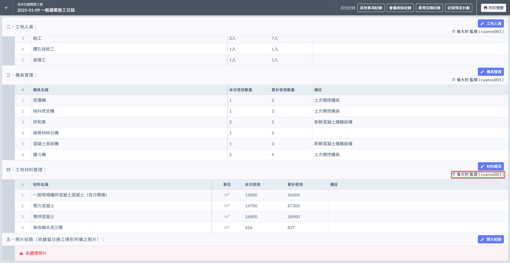

# 日誌 / 材料概況

---
description: Log / Material Overview
---

# 日誌 / 材料概況

材料使用概況記錄了當日使用的各類施工材料的數量及類別。

!!! info
    在填寫日誌的材料概況之前，必須先完成基本資料的填寫。

***

## 材料概況

如下圖紅框圈選處，於工地材料管理欄位之右側處，點&#x9078;**「**&#xD83D;?️ **材料概況」**，即可開始填寫材料項目。

### 填寫材料使用概況

點&#x9078;**「＋新增一列」**(左圖)後，即可開始填寫**材料**名稱、**單位**、**本日使用數量**、**累計使用(%)**&#x8207;**備註**。

!!! warning
    由於精簡版並不會套用專案資料，因此所有資料都必須由使用者手動填寫。

 

將資料填寫完畢後，即可按&#x4E0B;**「儲存變更」**&#x4FDD;存資料(左圖)。完成後即如(右圖)顯示。

 

***

### 編輯機具使用概況

欲修改現有資料，點&#x9078;**「**&#xD83D;?️ **材料概況」**，可對各項目編輯（修改材料名稱、單位、本日使用數量/累積數量、備註或刪除）。

如需新增機具，點&#x9078;**「＋新增一列」**&#x4E26;重複上述操作即可。

 

#### 查看最後編輯人

如下圖紅框圈選處，系統會顯示最後更動資料的使用者。

