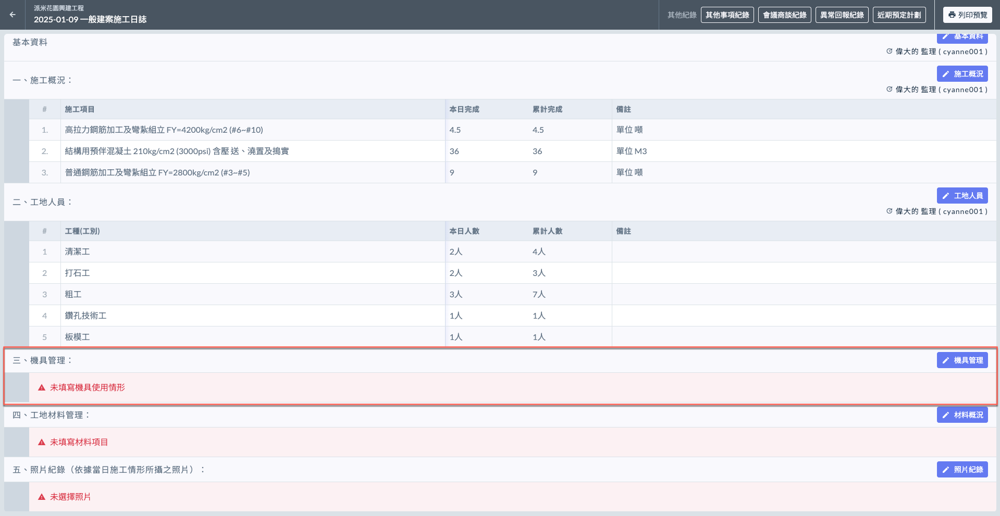
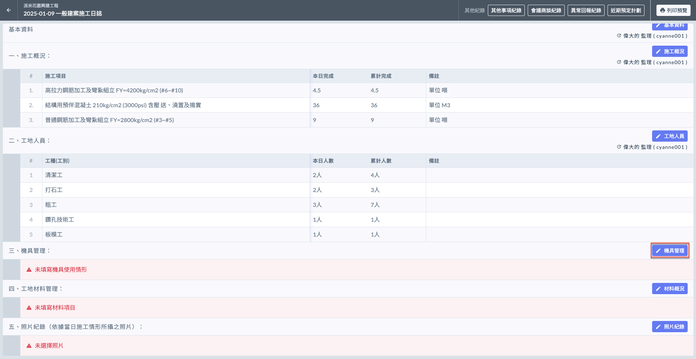
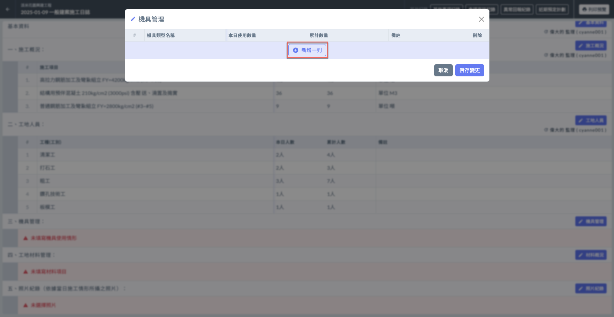
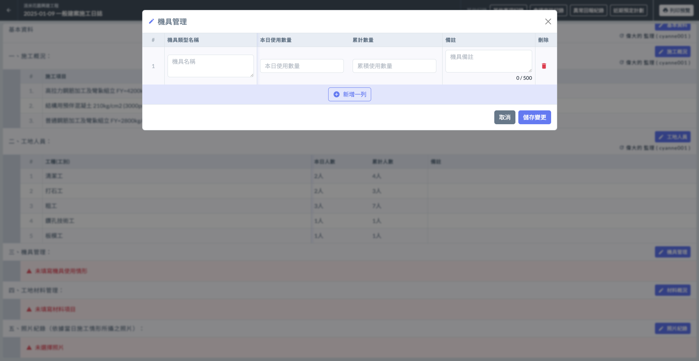
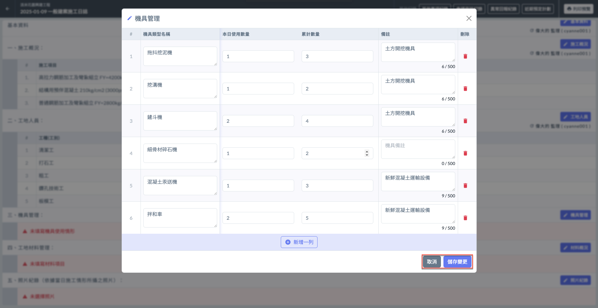
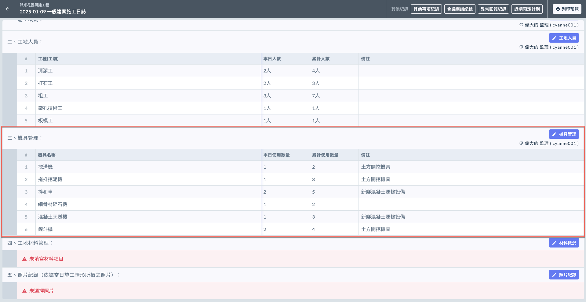
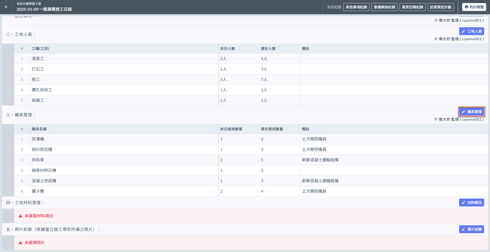
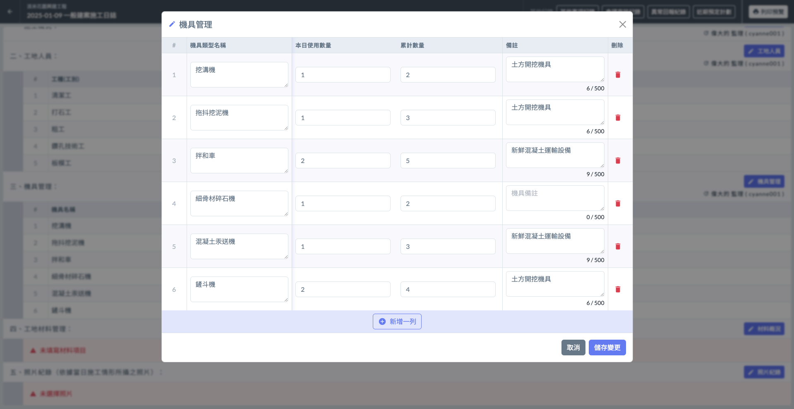
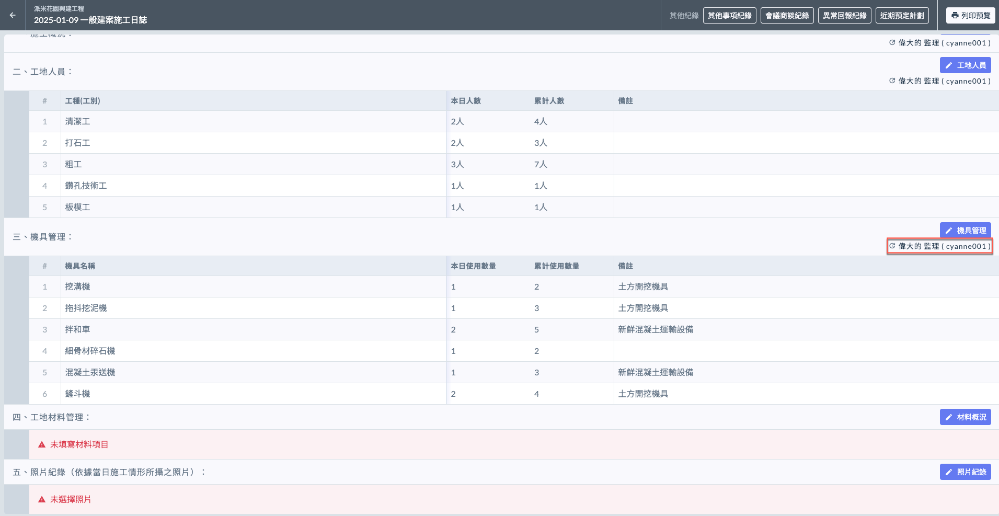

# 日誌 / 機具管理

---
description: Log / Equipment Management
---

# 日誌 / 機具管理

機具管理項目記錄當日使用的設備及其數量。

!!! info
    在填寫日誌的機具管理之前，必須先完成基本資料的填寫。

***

## 機具管理

如下圖紅框圈選處，於機具管理欄位之右側處，點&#x9078;**「**&#xD83D;?️ **機具管理」**，即可開始選擇機具。

### 填寫機具使用概況

點&#x9078;**「＋新增一列」**(左圖)後，即可開始填寫**機具**名稱、**本日使用數量**、**累計使用數量**與**備註**。

!!! warning
    由於精簡版並不會套用公司通用資料，因此所有資料都必須由使用者手動填寫。

 

將資料填寫完畢後，即可按&#x4E0B;**「儲存變更」**&#x4FDD;存資料(左圖)。完成後即如(右圖)顯示。

 

***

### 編輯機具使用概況

欲修改現有資料，點&#x9078;**「**&#xD83D;?️**機具管理」**，可編輯各項目（機具名稱、本日使用數量/累積數量、備註或刪除）。

如需新增機具，點&#x9078;**「＋新增一列」**&#x4E26;重複上述操作即可。

 

#### 查看最後編輯人

如下圖紅框圈選處，系統會顯示最後更動資料的使用者。

