# 💼 會議商談紀錄

---
description: Meeting and Negotiation Record
---

# 💼 會議商談紀錄

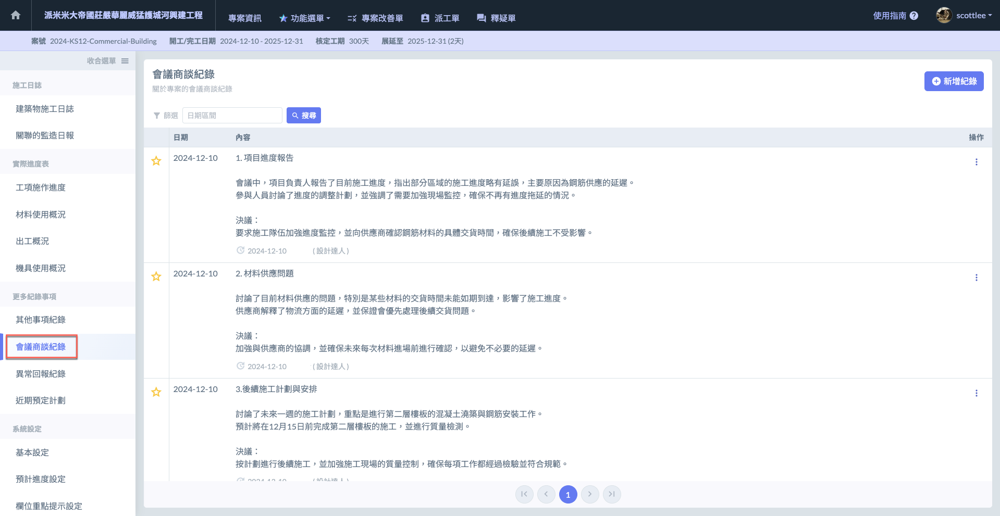

## 📝 01｜新增紀錄

!!! tip
    會議商談紀錄可&#x7531;**「填寫每日施工日誌時」**&#x65B0;增 / 直接&#x65BC;**「會議商談紀錄」**&#x5167;新增。

以下僅說明直接&#x65BC;**「會議商談紀錄」**&#x65B0;增之情況，日誌填寫請參閱 **➙** [日誌 / 會議商談紀錄](../yi-ban-jian-an-shi-gong-ri-zhi/ri-zhi-geng-duo-shi-xiang-ji-lu/ri-zhi-hui-yi-shang-tan-ji-lu)（精簡版）

進入主頁面後，點選右上角&#x4E4B;**「新增紀錄」**(圖一)，即可進入紀錄編輯畫面 (圖二)。

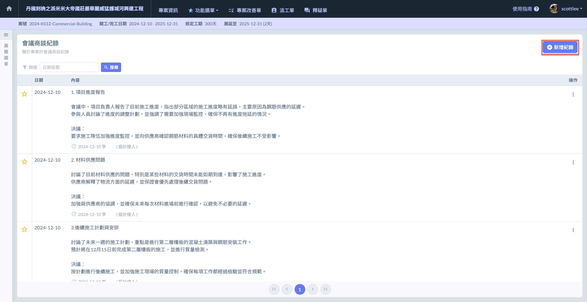 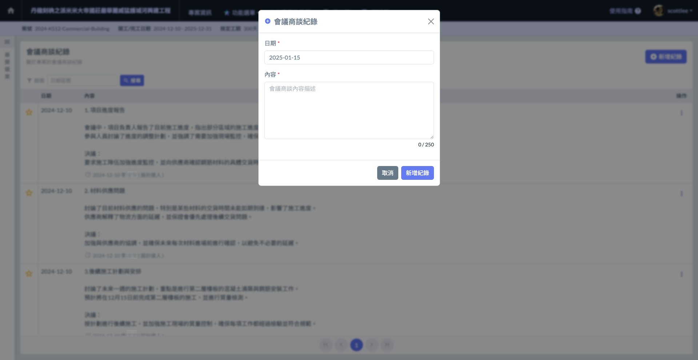

點選(圖三)紅框圈選處，您即可針對該筆會議紀錄選擇紀錄日期(圖四)。

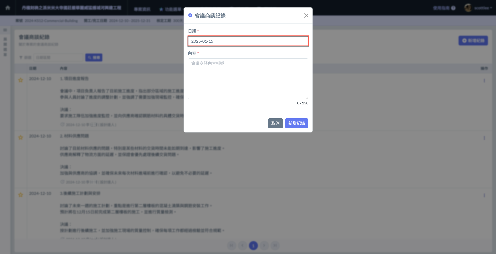 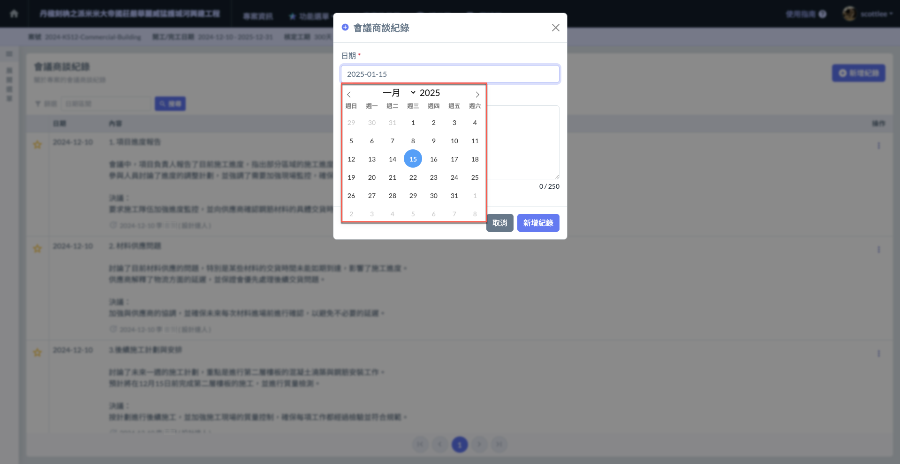

於內容處詳細填寫商談紀錄(圖五)，並於確認完畢後點&#x9078;**「新增紀錄」**(圖六)。

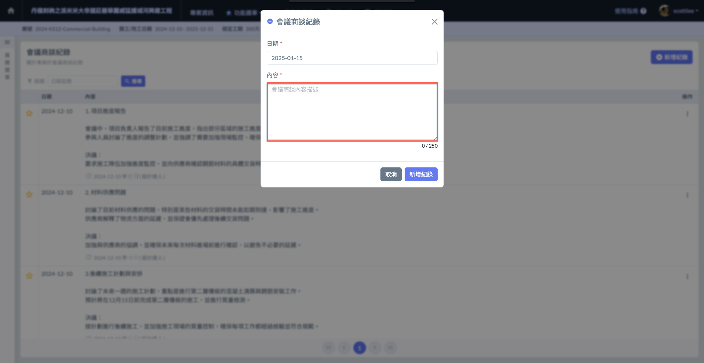 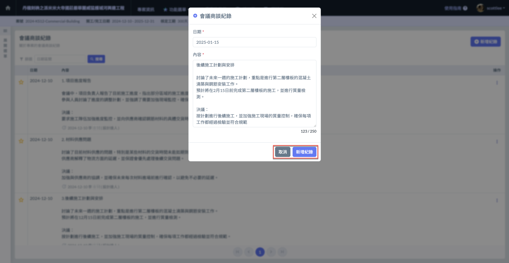

***

## ✏️ 02｜編輯 / 刪除紀錄

### 02 - 1｜編輯紀錄

於欲編輯之紀錄事項之最右側，點選操作欄位&#x4E4B;**「編輯」**(圖一)，即可進入編輯頁面，修改紀錄**日期**與**內容**。

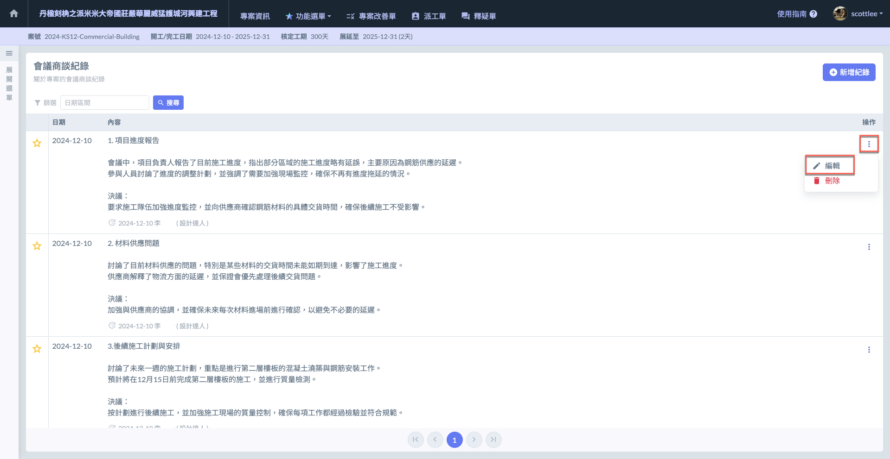 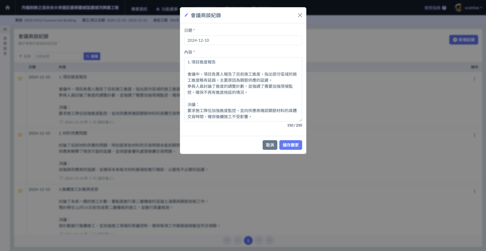

### 02 - 2｜刪除紀錄

於欲刪除之紀錄事項之最右側，點選操作欄位&#x4E4B;**「刪除」**(圖一)，即可刪除該筆紀錄。

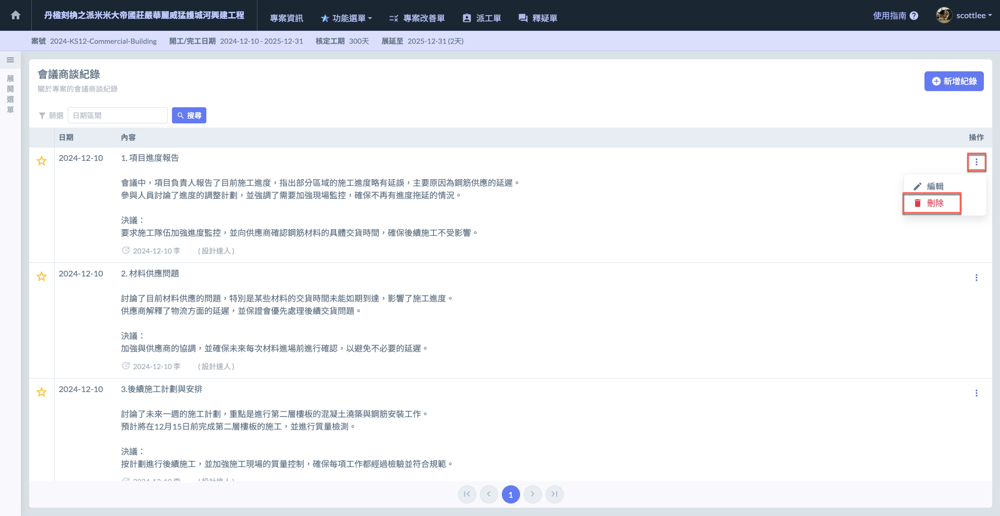 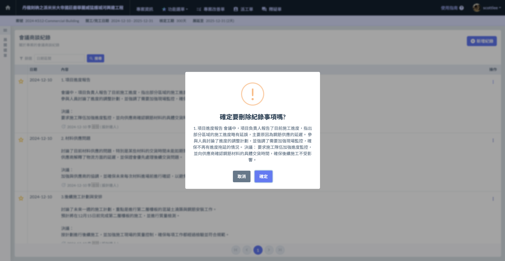

***

## ⭐️ 03｜釘選紀錄

如有重要事項需**保留於列表最上方**，可點選列表左側之**星星**進行釘選。再次點選則可取消釘選。

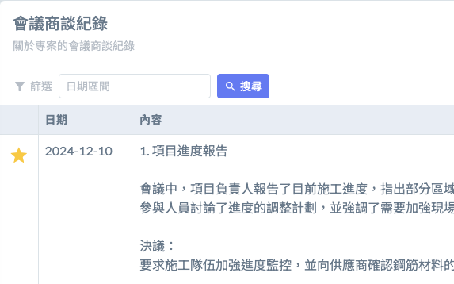 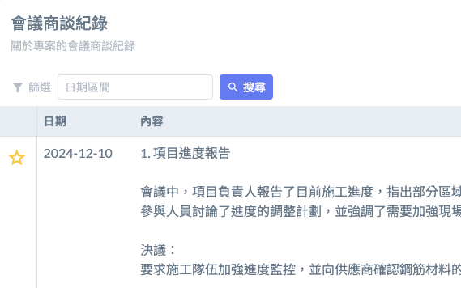

***

## 📅 04｜日期篩選

點選(圖一)紅框圈選處，您即可選擇一日期區間(圖二)。點&#x9078;**「搜尋」**，查看該區間內的所有會議商談紀錄。

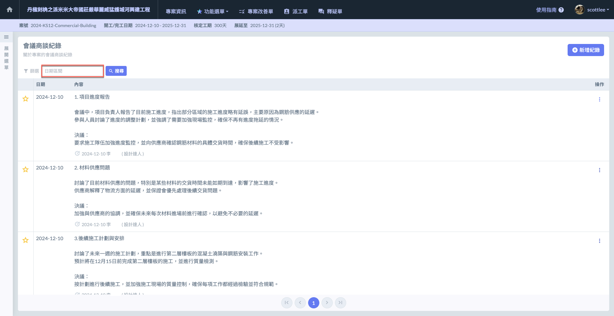 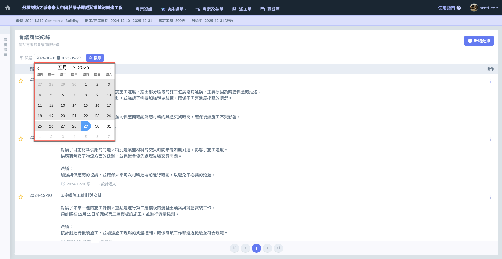

