# 其他操作說明

---
description: Other Operating Instructions
---

# 其他操作說明

### 01｜議題狀態變更

系統提供議題狀態變更功能，您可以根據現場執行進度，手動設定每個會議議題的處理狀態。此機制能協助管理人員在後續追蹤中，確保每一項會議決議都能被確實執行並結案。

進入『議題討論』頁面後，於欲變更狀態之議題右側點選「⋮」，於開啟功能選單後，選取<kbd>**議題狀態變更**</kbd>。

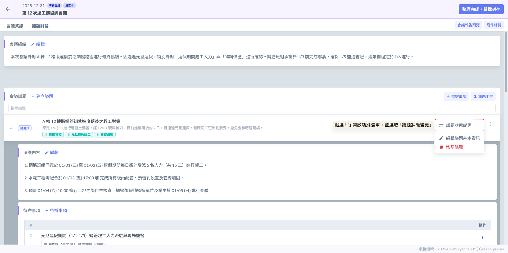

系統提供四種議題狀態供您手動設定，協助精確控管每一項決議的執行進度。透過明確的狀態標記，管理人員能快速區分哪些議題已徹底解決，哪些則需在下次會議中持續追辦。

<table><thead><tr><th width="102.90087890625">議題狀態</th><th>建議使用時機</th></tr></thead><tbody><tr><td><strong>未設定</strong></td><td>(預設狀態) 新增議題時的初始狀態。代表該議題尚未經過正式討論裁示，或僅為資訊告知。</td></tr><tr><td><mark style="color:red;"><strong>再討論</strong></mark></td><td>(懸而未決) 該議題在本次會議中未能達成最終共識，或需等待外部資訊（如：建築師回覆、業主決策、材料送審結果）才能決定，需列入下次會議優先討論事項。</td></tr><tr><td><mark style="color:orange;"><strong>待追辦</strong></mark></td><td>決議已下達抑或是已進入執行階段（如：已發起派工單、要求廠商限期整改）。但任務尚未回報完成。</td></tr><tr><td><mark style="color:green;"><strong>已完結</strong></mark></td><td>(結案存證) 現場已確認整改完成、缺失已消除，或該議題之決議已落實。結案後將不再列入後續追蹤清單，並作為驗收與計價之佐證。</td></tr></tbody></table>

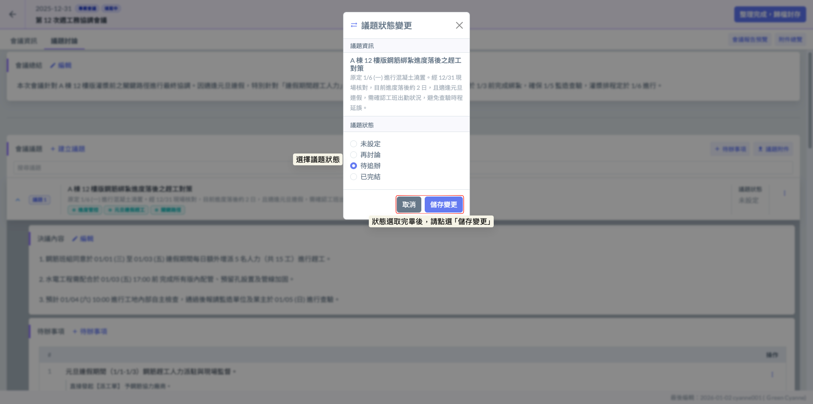

完成畫面如下：

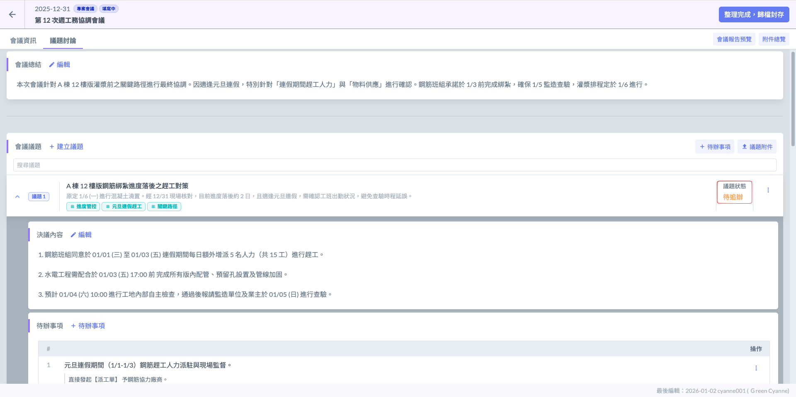

如圖四，議題狀態設置完畢後，您即可於『專案會議紀錄列表』中，直接查閱該場會議的議題進度摘要。系統會顯示該會議的總議題數，若其中包含****再討論****或****待追辦****的項目，也會一併顯示具體數量，幫助您一眼識別出哪些會議仍有未完成的追蹤事項。

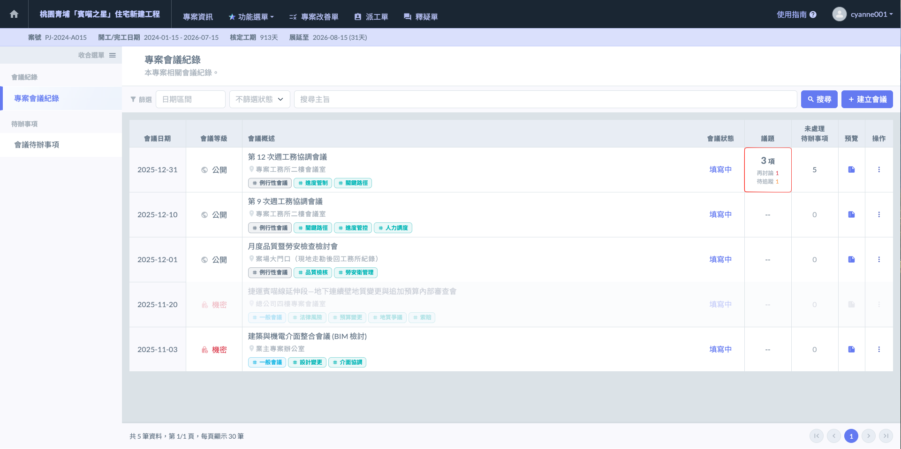

***

### 02｜會議報告預覽

進入會議紀錄詳情後，點選右上方之   按鈕，即可查閱系統自動生成的電子檔報告。您可以根據當前管理需求，選擇將報告『發送』至與會人信箱，或是直接進行『列印』與『下載』，以利紙本存檔或離線閱覽。

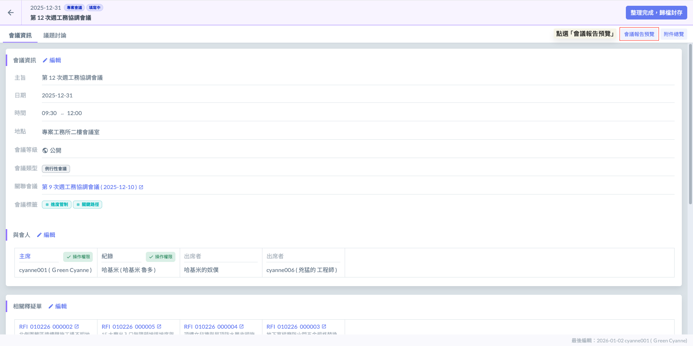

當會議紀錄尚未正式歸檔前，若進行列印或導出 PDF，會議標題將被自動標示為『(草稿)』狀態。此設計旨在提醒閱讀者該內容仍處於編輯或校對階段，不具備正式決策之最終效力。

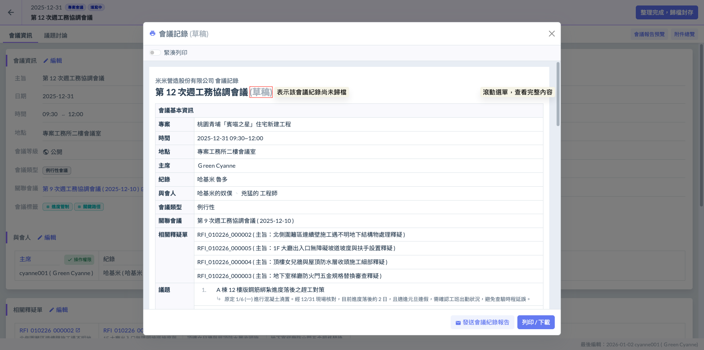

#### 02 - 1｜發送會議紀錄報告

開啟預覽列印視窗後，點選下方的  按鈕，即可開啟收件人選擇視窗。

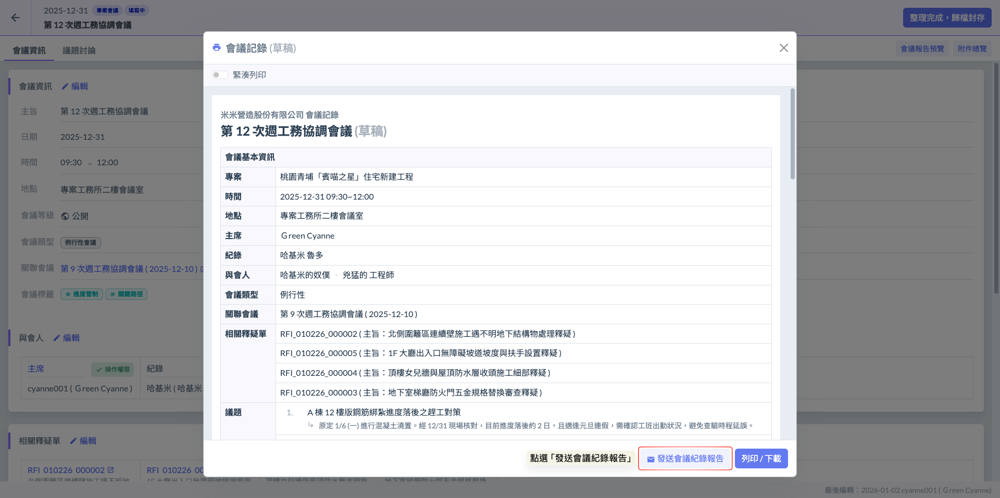

開啟視窗後，系統將列出本次會議的所有**與會人**名單。您可以依據報告內容之機敏性或相關度，手動勾選欲接收電子報告的收件人。

：表示該與會人已被選為會議報告的收件人。

：表示該與會人未被選為會議報告的收件人。

確認名單無誤後，點選  按鈕 ，系統即會自動將本次報告的電子檔傳送至相關人員自行選擇）的個人信箱。

!!! info
    收件信箱將依據**該成員註冊系統所設定的電子郵件**（如 Gmail、Outlook 或公司內部郵件）為準，確保決議事項第一時間精準送達相關人員手中。

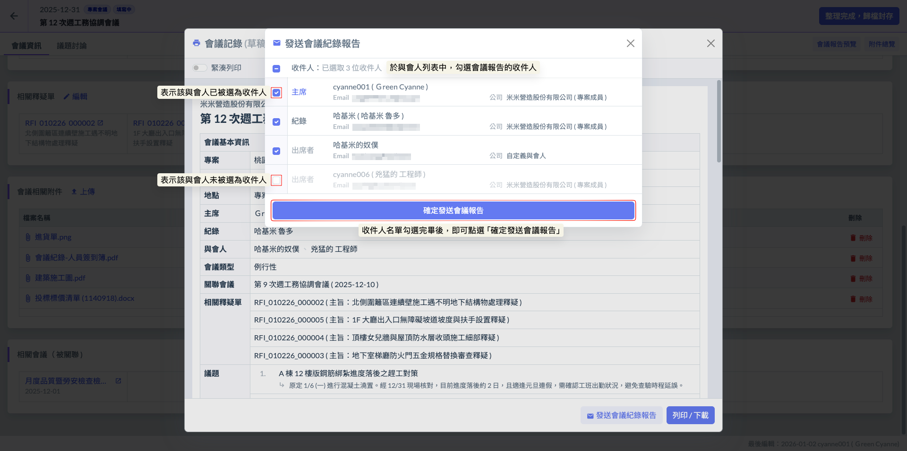

如圖五，收件人即可在自己設定的電子信箱中查看該會議報告。

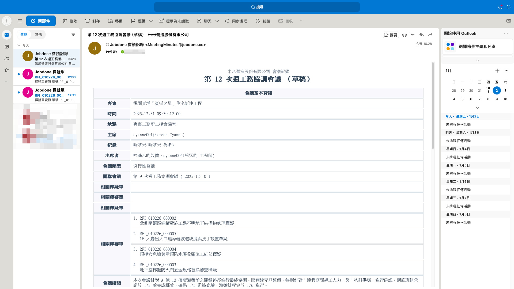

***

#### 02 - 2｜列印 / 下載

如圖六，開啟預覽列印視窗後，點選下方的  按鈕，系統將呼叫瀏覽器的列印介面。您可以跟根據需求，於目的地選單中選擇『另存為 PDF』以取得電子檔，或選擇連接的印表機直接列印紙本報告。

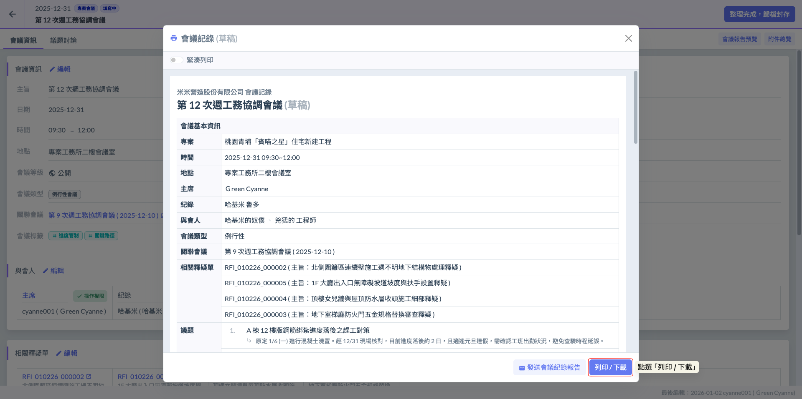

瀏覽器之列印介面如下：

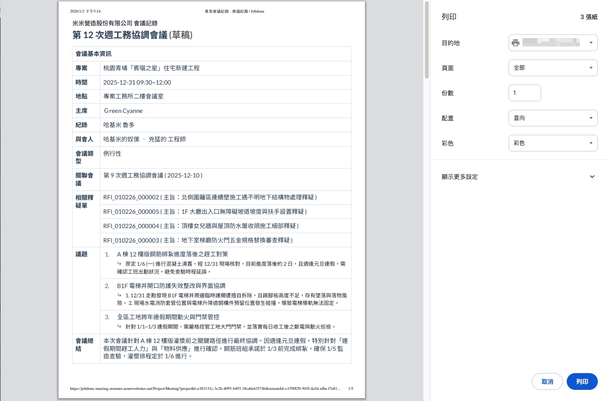

***

#### 補充｜緊湊列印

系統提供靈活的列印排版選項。若啟用『緊湊列印模式』，系統將優化空間配置，使多個議題在列印時接續排列，減少紙張耗用；若維持一般模式，則每個議題間將自動執行分頁處理，確保各項議題之決議與待辦事項皆有獨立且清晰的展示空間。

：預設模式，關閉緊湊列印

：開啟緊湊列印。

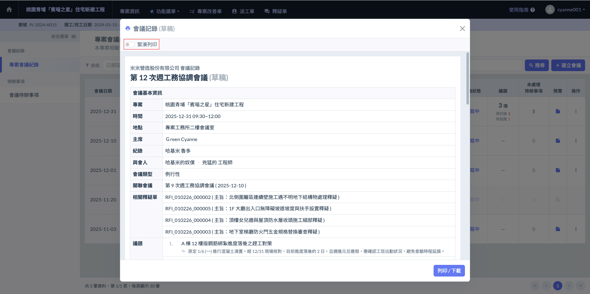

具體範例如下：

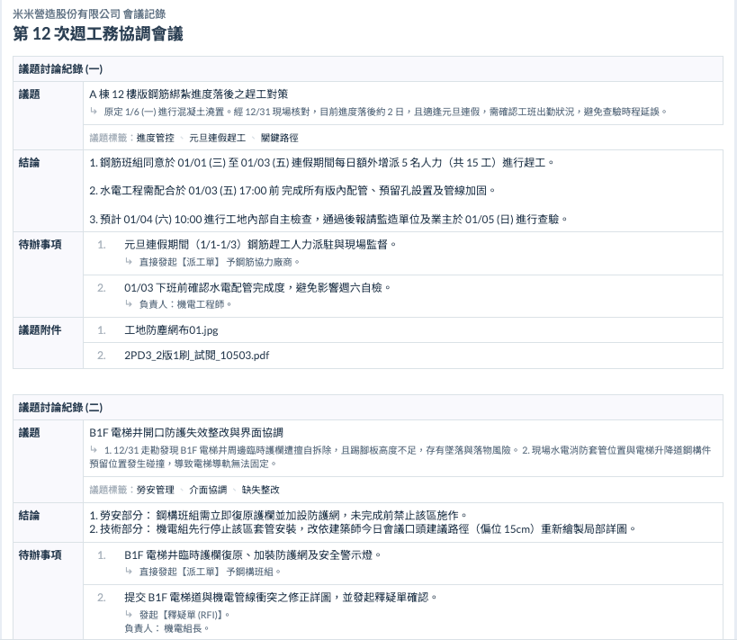 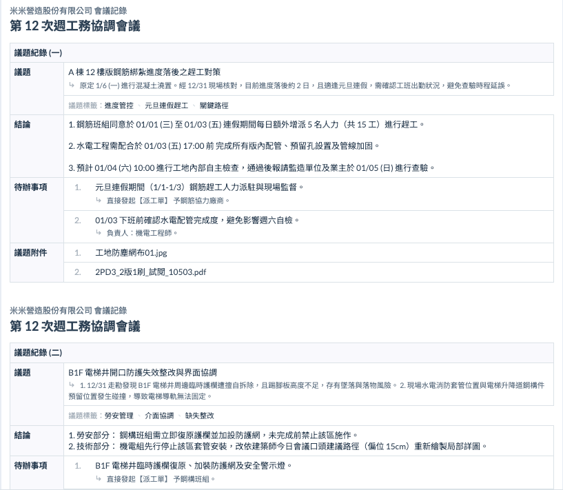

***

### 03｜附件總覽

『附件總覽』功能旨在提供一個全局檢視的視角，讓您可以直接查閱所有掛載於該會議下的檔案。無論是隸屬於整體會議層級的行政附件，還是散落在各議題中的技術、缺失照片，皆會在此集中呈現，方便您進行快速盤點與核對。

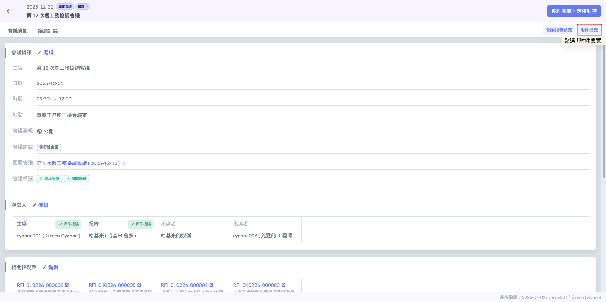

會議附件總覽視窗如下：

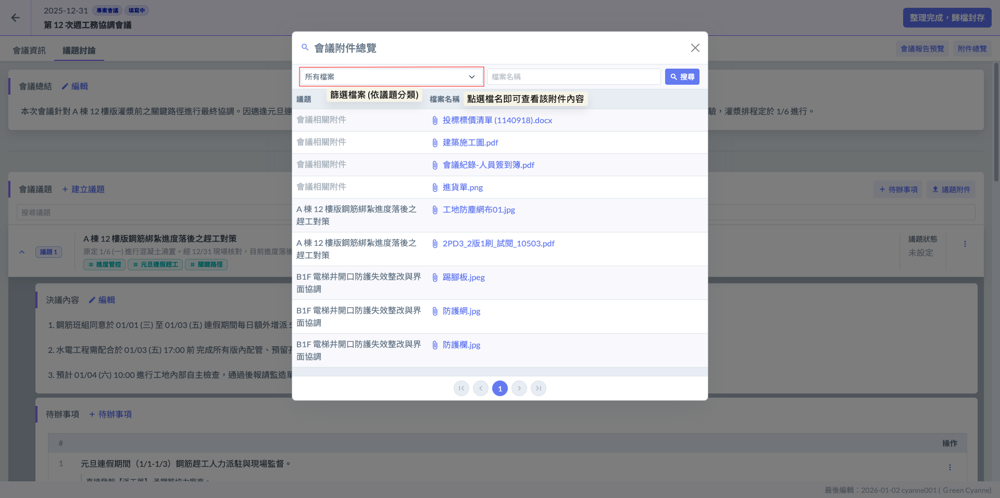

***

### 04｜歸檔封存

妥善確認會議資料無誤後，點擊  按鈕開始歸檔。系統將正式鎖定此份紀錄，移除電子報告標題之 (草稿) 字樣並關閉編輯功能，確保該次會議之討論內容與附件完整封存。

!!! warning
    #### 請務必注意
    
    一旦執行「整理完成，歸檔封存」後，系統將鎖定所有欄位，您將無法再更動、刪除或新增任何紀錄內容（包含議題文字、決議、待辦事項及附件）。請在點擊前進行最後確認，確保所有資訊皆已準確錄入。

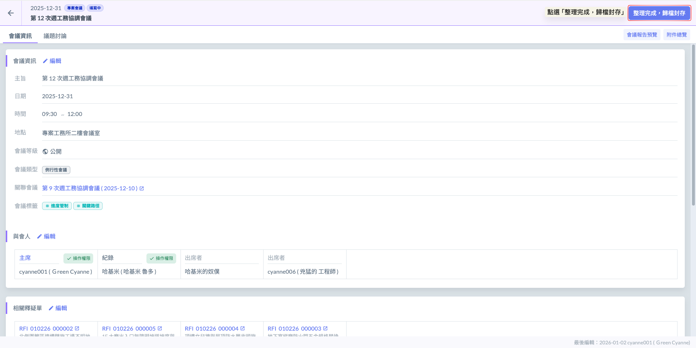

點選歸檔按鈕後，系統會再次跳出確認視窗，請您二次確認是否提交會議紀錄。由於歸檔後內容將無法再行變更，請務必於此視窗中最後核對會議標題、時間與關鍵決議，確認無誤後點擊『確定』，正式完成歸檔程序。

!!! info
    #### 💡 操作建議
    
    **「先預覽，後歸檔」：** 在點選歸檔按鈕前，建議先利用「會議報告預覽」功能，完整檢視一次產出的 PDF 內容。確認排版與文字無誤後，再執行最後的歸檔程序，以確保紀錄的正確性。

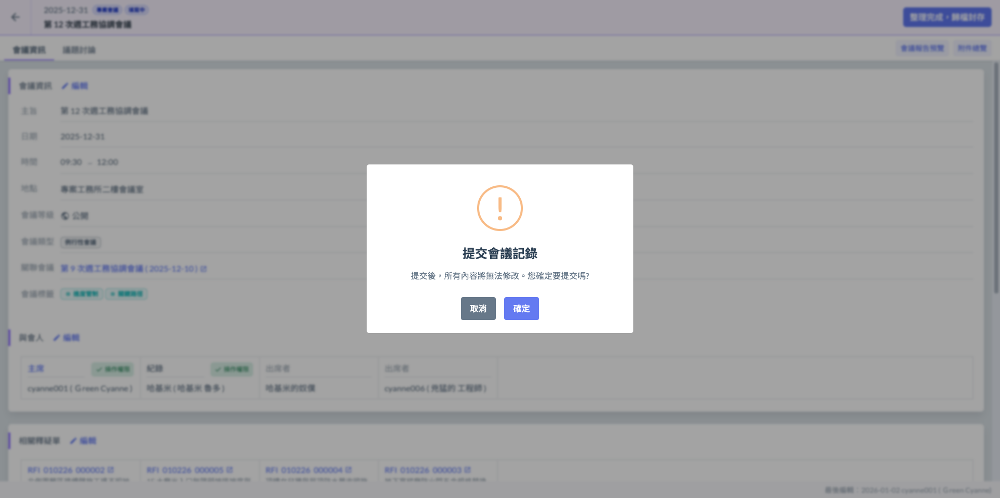

完成畫面如下：

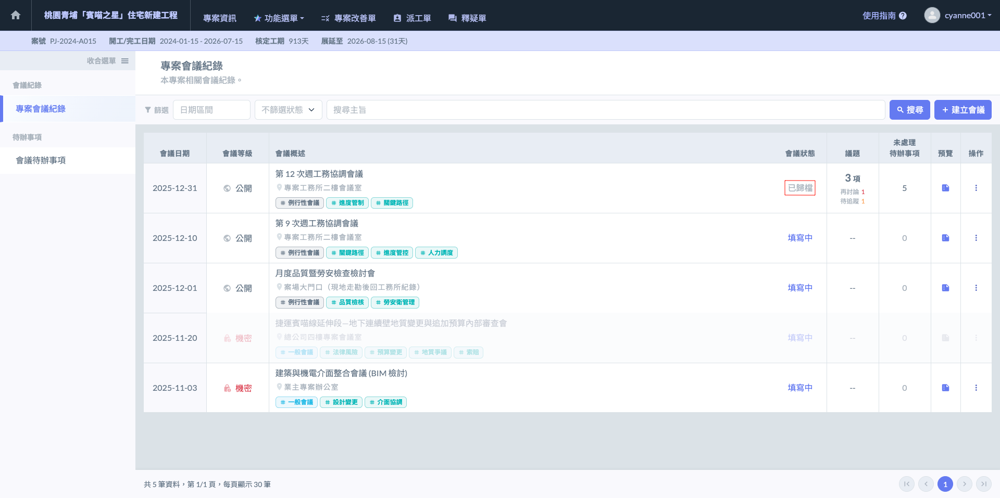
